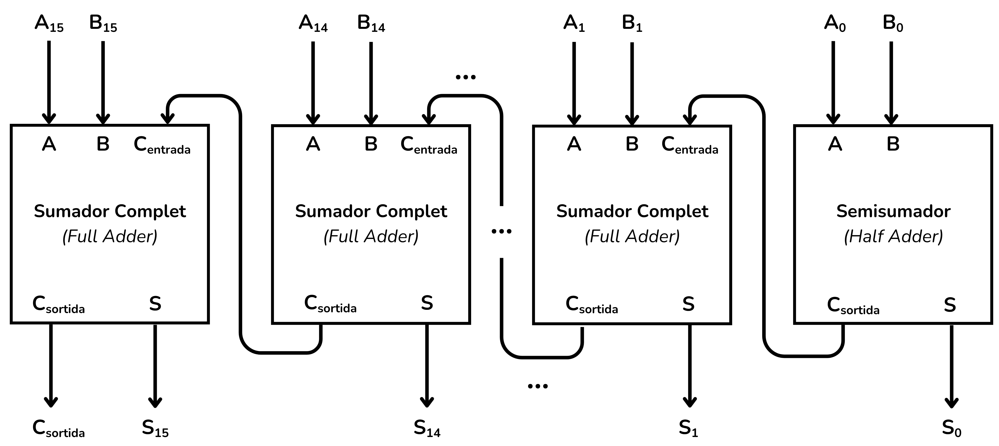
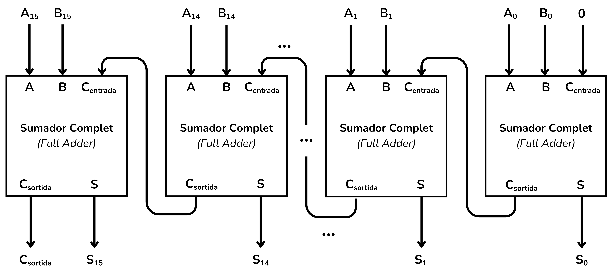
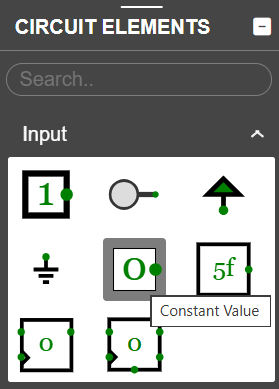
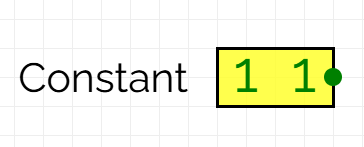
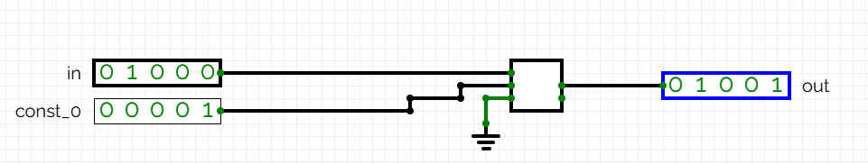
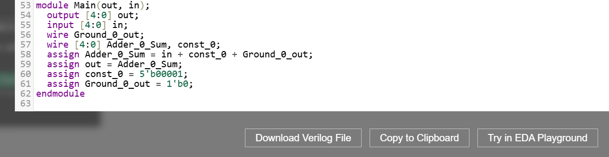

<!-- Posar aquesta imatge al començament de cada lliçó -->

 

# Aritmètica de n bits

L’aritmètica de n bits fa referència a circuits digitals que operen amb un nombre de bits que pot ser molt elevat. La variable $n$ representa doncs un nombre arbitrari de bits.

Es poden implementar, com hem vist, sumadors, restadors, comparadors, incrementadors, etc.
Aquí veurem dos exemples, un sumador i un incrementador.
Els exercicis que el curs proposa prenen tots el valor $n=16$.

## EXEMPLE: Sumador de $n=16$ bits
Per fer un sumador de $n$ bits, cal concatenar $n-1$ sumadors complets (full adders) i un semisumador (half adder).

Si volem implementar un sumador de dos nombres binaris $A$ i $B$ de 16 bits, haurem de concatenar 15 sumadors complets i un semisumador com a la figura:

<i>Sumador de 16 bits</i>

Les entrades seran les variables $A$ i $B$ i les sortides seran la variable suma $S$, més un bit de ròssec (carry) de sortida $C_{out}=0$.

Per tal de simplificar el circuit podriem utilitzar un sumador complet amb una entrada $C_{in}=0$, en lloc d'un semisumador, tal i com hem fet en abans a l’exemple de 4 bits. Per tant podriem implementar un sumador de $n$ bits concatenant $n$ sumadors complets.

En el nostre exemple implementem aquest sumador de 16 bits amb 16 sumadors complets.

<i>Sumador de 16 bits</i>

El circuit final tindrà la mateixa forma que els exemples que ja hem vist, però en lloc de 4 sumadors concatenats, en tindrà 16. 

## EXEMPLE: Incrementador de n bits

En aquest exemple dissenyarem un incrementador on $n=5$. Aquest circuit incrementarà el valor d’una entrada $A$ de 5 bits en una unitat.

Utilitzarem una constant de valor 00001 en lloc d’una variable. La diferència és subtil dins de [CircuitVerse](https://circuitverse.org/simulator).

CircuitVerse té un element d’entrada (input) anomenat *constant value*. Aquest bloc simula una constant de valor fix. 

Al clicar dues vegades al bloc de la constant podem modificar el valor, per exemple el  valor constant $11$ en aquesta figura:

    
    

Per implementar el circuit incrementador sumi el valor 00001 a una variable $A$, utilitzarem simplement un sumador de 5 bits que sumi aquest bloc de constant a la variable A. 

Prenem per exemple A=01000 en aquesta figura.

<!-- Obtindríem el mateix resultat a la variable de sortida si empréssim una altra variable com a entrada. La diferència, però és que -->

CircuitVerse no considera un valor constant com a una variable d’entrada en format Verilog. Això vol dir que aquest valor **const_0** forma, de fet, part del circuit incrementador.

## Exercicis a Jutge.org: [Introduction to Digital Circuit Design](https://jutge.org/courses/JordiCortadella:IntroCircuits)

[n-bit adder](https://jutge.org/problems/X84292_en)

[n-bit incrementer](https://jutge.org/problems/X41839_en)

[n-bit adder/subtractor](https://jutge.org/problems/X89356_en)

[n-bit comparator](https://jutge.org/problems/X37457_en)

<small>*Recorda que per accedir als exercicis i que el **Jutge** valori les teves solucions has d'estar inscrit al [curs](https://jutge.org/courses/JordiCortadella:IntroCircuits)*. Troba totes les instruccions [aqui](../Inici/instruccions.md)</small>

<!-- Aquesta imatge ha d'anar al final de cada lliçó, ja sigui amb aquesta línia o dins la signatura. Deixar comentat si ja està a la signatura-->
 
 

<Autors autors="xcasas fmadrid"/>