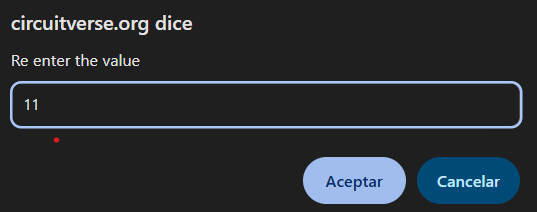

<!-- Posar aquesta imatge al començament de cada lliçó -->

 

# Aritmètica de n bits

L’aritmètica de $n$ bits fa referència a circuits digitals que operen amb un nombre arbitrari de bits. La variable $n$ pot ser un valor elevat, com $n=16$ als exercicis del curs.
Es poden implementar sumadors, restadors, comparadors, incrementadors, etc.
Aquí veurem dos exemples: un **sumador** i un **incrementador**.

---

## EXEMPLE: Sumador de $n = 16$ bits

Per fer un sumador de $n$ bits, cal concatenar **$n-1$ sumadors complets** (*full adders*) i **un semisumador** (*half adder*).
Així, per sumar dos nombres binaris $A$ i $B$ de 16 bits, concatenarem 15 sumadors complets i un semisumador:

<i>Sumador de 16 bits</i>

Les entrades són $A$ i $B$. Les sortides són:

* la variable **suma** $S$ (16 bits), i
* el bit de ròssec (**carry**) de sortida $C_{out}$.

Per simplificar el circuit podem utilitzar sumadors complets a totes les etapes, amb $C_{in} = 0$ al primer sumador. Igual que passava amb els sumadors de 4 bits, un sumador complet pot fer la funció d’un semisumador si $C_{in} = 0$.

<i>Sumador de 16 bits implementat amb sumadors complets</i>

El circuit final tindrà la mateixa estructura que els sumadors de 4 bits, però amb 16 blocs concatenats en lloc de 4.

## EXEMPLE: Incrementador de $n$ bits

Dissenyarem un incrementador de **$n = 5$ bits**. Aquest circuit incrementa el valor d’una entrada binària $A$ en una unitat.

Per fer-ho, sumarem a $A$ el valor binari:

$$00001$$

En aquest cas, en lloc d’una variable utilitzem una **constant**. A [CircuitVerse](https://circuitverse.org/simulator) hi ha un bloc d’entrada anomenat *constant value*, que permet definir un valor fix.

En fer doble clic sobre el bloc, podem especificar el valor de la constant, com en aquests exemples:

    
    

Per implementar l’incrementador, simplement sumarem la constant 00001 a la variable $A$ amb un sumador de 5 bits.
Per exemple, si $A = 01000$:

CircuitVerse no considera el valor constant com una variable d’entrada en format Verilog.
Això significa que el bloc **const_0** forma part del circuit incrementador, i no una entrada externa:

## Exercicis a Jutge.org: [Introduction to Digital Circuit Design](https://jutge.org/courses/JordiCortadella:IntroCircuits)

* [n-bit adder](https://jutge.org/problems/X84292_en)
* [n-bit incrementer](https://jutge.org/problems/X41839_en)
* [n-bit adder/subtractor](https://jutge.org/problems/X89356_en)
* [n-bit comparator](https://jutge.org/problems/X37457_en)

<small>*Recorda que per accedir als exercicis i que el **Jutge** valori les teves solucions has d'estar inscrit al [curs](https://jutge.org/courses/JordiCortadella:IntroCircuits)*. Troba totes les instruccions [aqui](../Inici/instruccions.md)</small>

<!-- Aquesta imatge ha d'anar al final de cada lliçó, ja sigui amb aquesta línia o dins la signatura. Deixar comentat si ja està a la signatura-->
 
 

<Autors autors="xcasas fmadrid"/>