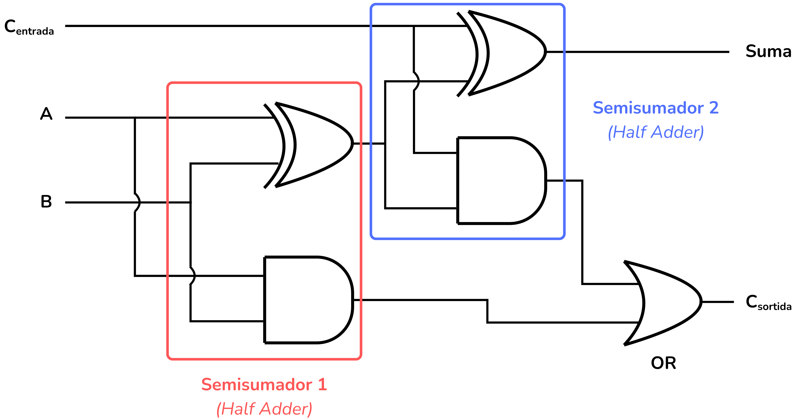
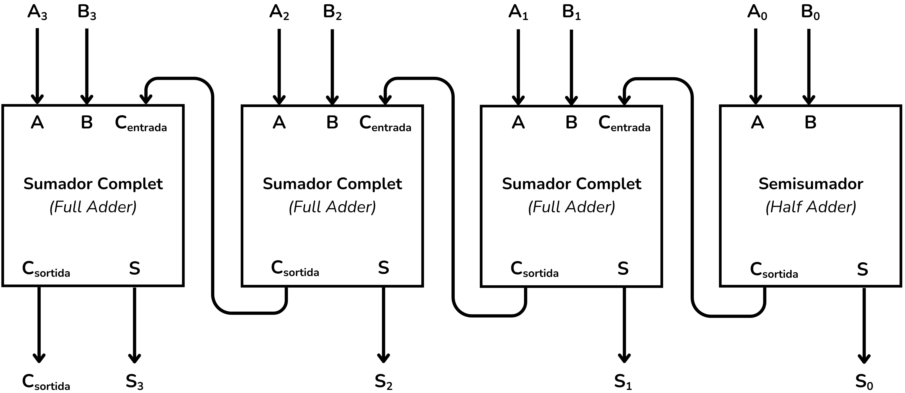

<!-- Posar aquesta imatge al començament de cada lliçó -->

 

# Circuits Bàsics

Comencem pels circuits digitals aritmètics més bàsics, com els semisumadors, els sumadors complets i els comparadors de bits.

## EXEMPLE: Semisumador (*Half Adder*)
El semisumador (*half adder* en anglès) és la base dels sumadors complets (*full adders* en anglès) i de les sumes de n bits.

El semisumador pren dos bits, $A$ i $B$, i en fa la suma. La sortida és un bit amb el resultat de la suma i un bit de ròssec.

La taula de veritat de la funció que volem implementar és la següent:

| $A$ | $B$ | $Suma$ | $Carry$ |
|:---:|:---:|:---:|:---:|
| 0 | 0 | 0 | 0 |
| 0 | 1 | 1 | 0 |
| 1 | 0 | 1 | 0 |
| 1 | 1 | 0 | 1 |

Quan $A=1$ i $B=1$ són 1, la suma es desborda, és a dir, no es pot representar amb un sol bit de sortida. El resultat d’aquest desbordament és el bit de ròssec (*carry* en anglès) que és un dígit d'ordre superior.

Podem utilitzar Mapes de Karnaugh o les regles de l'Àlgebra de Boole per deduir les dues expressions booleanes simplificades que descriuen la lògica del circuit:

$Suma= \bar{A}·B + A·\bar{B}= A \: XOR \: B$

$Carry= A·B$

Així doncs, el circuit que implementa aquest Semisumador (*Half Adder*) el següent:

<i>Circuit semisumador</i>

Aquest circuit és un dels elements que construeixen els sumadors complets i sumadors de n bits.

## EXEMPLE: Sumador complet (*full adder*)

El sumador complet (*Full adder* en anglès) suma 3 bits d'entrada. Els bits $A$ i $B$ més un bit de ròssec d'entrada $C_{entrada}$. Representa una suma de dos bits que té en compte un possible bit de ròssec provinent d'una suma anterior dins d'una cadena de sumes.
La seva sortida és un bit, resultat de la suma, i un bit de ròssec de sortida $C_{sortida}$.

La taula de veritat del circuit és:

| $A$ | $B$ | $C_{in}$ | $Suma$ | $C_{out}$ |
|:---:|:---:|:---:|:---:|:---:|
| 0 | 0 | 0 | 0 | 0 |
| 0 | 1 | 0 | 1 | 0 |
| 1 | 0 | 0 | 1 | 0 |
| 1 | 1 | 0 | 0 | 1 |
| 0 | 0 | 1 | 1 | 0 |
| 0 | 1 | 1 | 0 | 1 |
| 1 | 0 | 1 | 0 | 1 |
| 1 | 1 | 1 | 1 | 1 |

Podem utilitzar Mapes de Karnaugh o les regles de l'Àlgebra de Boole per deduir les dues expressions booleanes simplificades que descriuen la lògica del circuit:

$Suma= A \: XOR \: B \: XOR \: C_{entrada}$

$C_{sortida}= A·B + B·C_{entrada} + A·C_{entrada} = A·B + C_{entrada} · (A \: XOR \: B)$

Així doncs, el circuit que implementa un sumador complet (*Full Adder*) és el següent:

<i>Sumador complet</i>

Aquest circuit es pot interpretar com a dos semisumadors amb una porta OR per al bit de ròssec de sortida:

<i>Sumador complet</i>

## EXEMPLE: Comparador
En aquest exemple veurem un circuit comparador que pren dos bits, $A$ i $B$ i els compara. 

Els circuits comparadors tenen 3 sortides: La primera indica si $A$ és més gran que $B$, la segona segona s'activa si $A$ és igual a $B$ i la tercera indica si $A$ és més petita que $B$.
La taula de veritat, amb aquestes entrades i sortides, és la següent:

| $A$ | $B$ | $Sortida_{A<B}$ | $Sortida_{A=B}$ | $Sortida_{A>B}$ |
|:---:|:---:|:---:|:---:|:---:|
| 0 | 0 | 0 | 1 | 0 |
| 0 | 1 | 1 | 0 | 0 |
| 1 | 0 | 0 | 0 | 1 |
| 1 | 1 | 0 | 1 | 0 |

Les expressions booleanes simplificades que descriuen la lògica del circuit són:

$Sortida_{A<B} =\bar{A}B$

$Sortida_{A=B} = \bar{A}\bar{B} + A B = A \; XNOR \; B$

$Sortida_{A>B} = A \bar{B}$

Així, el circuit comparador és el següent:

<i>Circuit comparador</i>

## EXEMPLE: Sumador de diversos bits

Amb el sumador complet (*Full Adder*) i el semisumador (*Half Adder*) es poden construir circuits més grans, com ara els sumadors de propagació de càrrega (*ripple-carry adders*), que permeten sumar números binaris de diversos bits.

Per exemple el següent sumador de quatre bits:

<i>Sumador de 4 bits</i>

## Exercicis a Jutge.org: [Introduction to Digital Circuit Design](https://jutge.org/courses/JordiCortadella:IntroCircuits)

[Half adder](https://jutge.org/problems/X27385_en)

[Full adder](https://jutge.org/problems/X12983_en)

[1-bit comparator](https://jutge.org/problems/X60848_en)

<small>*Recorda que per accedir als exercicis i que el **Jutge** valori les teves solucions has d'estar inscrit al [curs](https://jutge.org/courses/JordiCortadella:IntroCircuits)*. Troba totes les instruccions [aqui](../Inici/instruccions.md)</small>

<!-- Aquesta imatge ha d'anar al final de cada lliçó, ja sigui amb aquesta línia o dins la signatura. Deixar comentat si ja està a la signatura-->
 
 

<Autors autors="xcasas fmadrid"/>