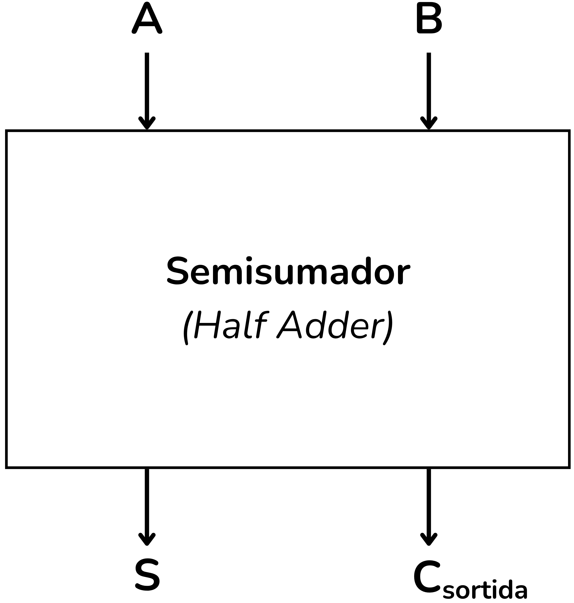
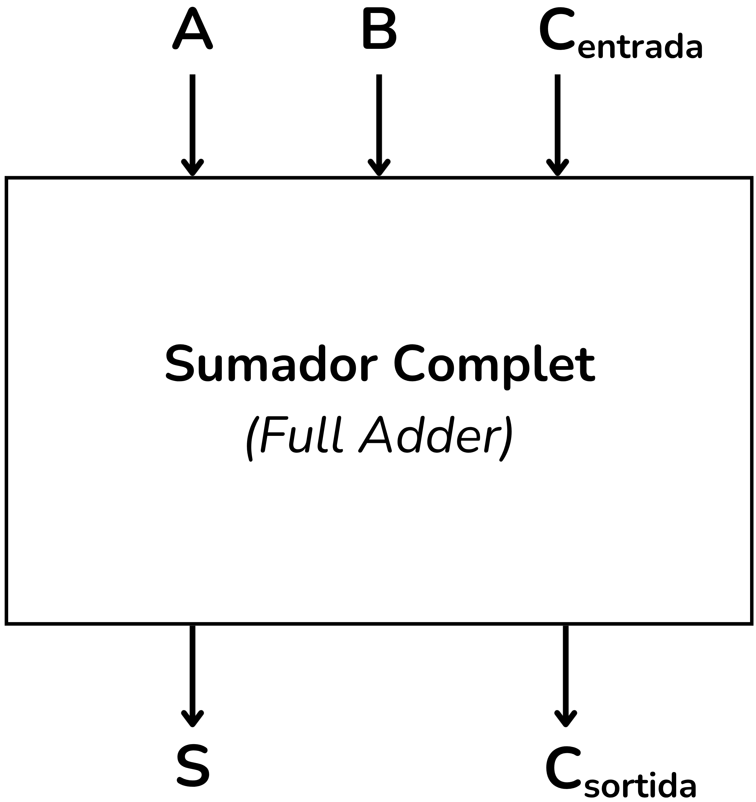
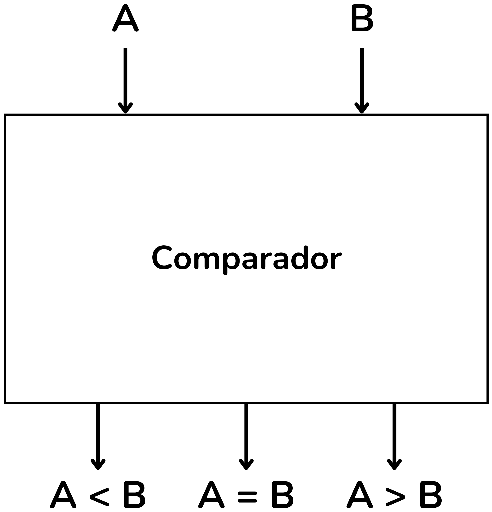
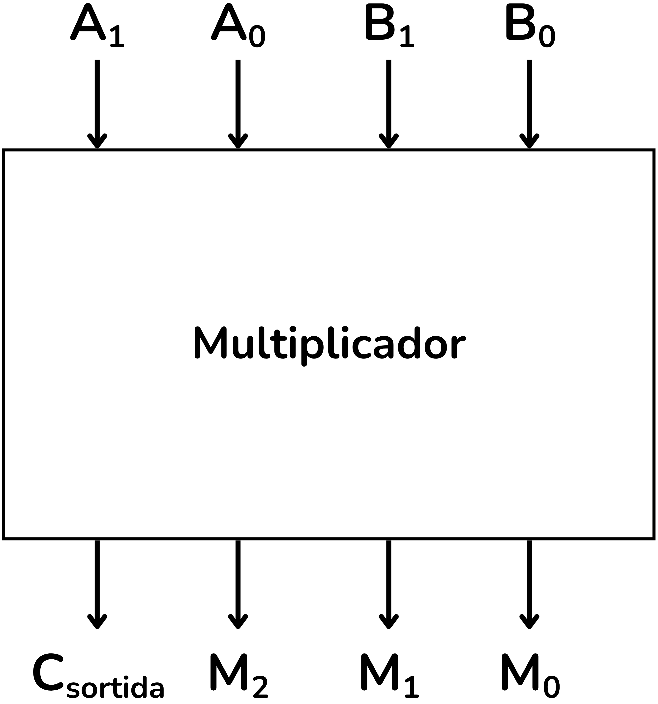
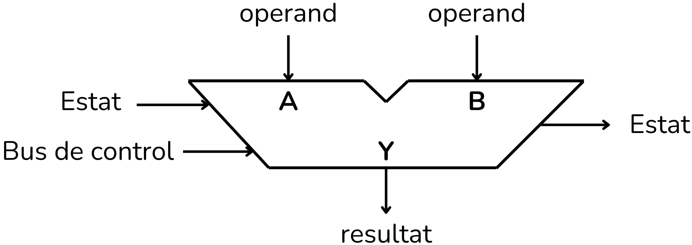

<!-- Posar aquesta imatge al començament de cada lliçó -->

 

# Introducció als circuits aritmètics

Els circuits aritmètics són una subclasse fonamental dels **circuits digitals combinacionals**. La seva funció principal és efectuar operacions matemàtiques amb nombres binaris.

Les operacions bàsiques més habituals que implementen són:

**Semisumador (*Half Adder*)**: Circuit que suma dos bits i produeix una sortida de suma $S$ i un bit de ròssec (*carry*) $C$.

<i>Semisumador (Half Adder)</i>

**Sumador complet (*Full Adder*)**: Suma tres bits (dos d’entrada i el ròssec de l’etapa anterior). És el bloc bàsic per construir sumadors de diversos bits mitjançant la connexió en cascada.

<i>Sumador complet (Full Adder)</i>

**Sumador de n bits**: 
Amb semisumadors i sumadors complets es poden construir sumadors de $n$ bits. Aquest circuit realitza la suma binària de dos nombres $A$ i $B$.

<i>Sumador de 4 bits</i>

**Restador**: 
La resta binària es resol habitualment emprant sumadors i la representació en **complement a dos**.
Així, la resta $A - B$ es transforma en la suma:

$$A + (-B)$$

<i>Restador de 4 bits</i>

**Comparadors**:
Circuits que determinen si un nombre binari és **major**, **menor** o **igual** que un altre.

<i>Comparador</i>

**Multiplicadors i divisors**:
Circuits més complexos que s’implementen mitjançant algorismes basats en sumes repetides i desplaçaments.

<i>Multiplicador</i>

Els circuits aritmètics constitueixen el nucli de les **Unitats Aritmètico-Lògiques (UAL)**, el cor de qualsevol microprocessador.
L’UAL és l’encarregada d’executar tant les operacions aritmètiques com les operacions lògiques necessàries per a l’execució dels programes.

L'Unitat Aritmètica Lògica (**UAL**) s'anomena *Aritmetic Logic Unit (**ALU**)* en anglès.

<i>Unitat Aritmètica Lògica (UAL)</i>

## Contingut de la lliçó

* Al tema [**Circuits bàsics**](./CircBasics.md) es presenten el semisumador, el sumador complet i els comparadors.
* Al tema [**Aritmètica de 4 bits**](./Aritm4bits.md) es treballen incrementadors, sumadors de 4 bits i un exemple de UAL.
* Al tema [**Aritmètica de n bits**](./Aritmnbits.md) es generalitzen incrementadors, sumadors i comparadors per a $n$ bits.
* Finalment, al tema de [**Miscel·lània**](./miscellania.md) es recullen exercicis més avançats com multiplicadors, acumuladors de bits i circuits seqüencials *adders*.

<!-- Aquesta imatge ha d'anar al final de cada lliçó, ja sigui amb aquesta línia o dins la signatura. Deixar comentat si ja està a la signatura-->
  
<Autors autors="xcasas fmadrid"/>
