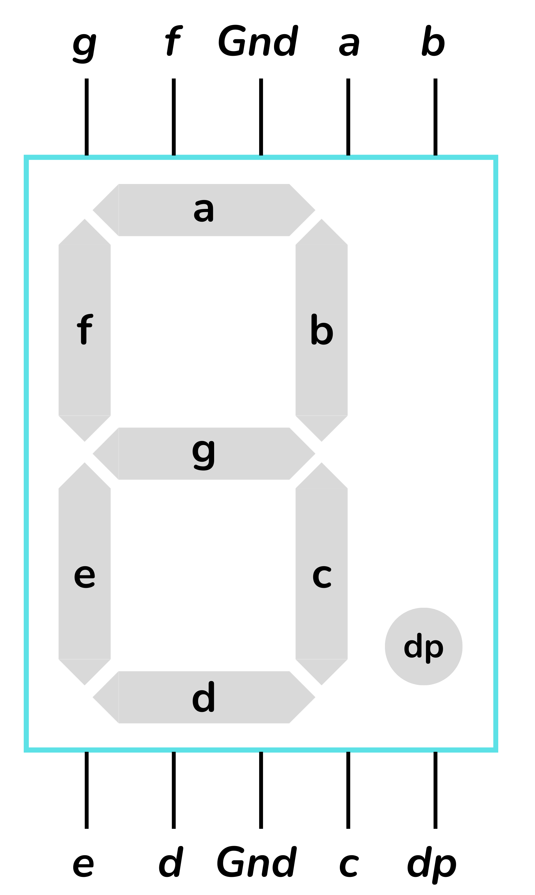

 

# BCD digits

En circuits digitals, un nombre Decimal Codificat a Binari (en anglès *Binary Coded Decimal*, o *BCD*) és una forma de representar nombres decimals utilitzant un codi binari. La idea és codificar cada dígit decimal individualment amb un nombre binari, generalment de 4 bits.

|**Dígit decimal**|**BCD**
|------ |------
|0 | 0000
|1 | 0001
|2 | 0010
|3 | 0011
|4 | 0100
|5 | 0101
|6 | 0110
|7 | 0111
|8 | 1000
|9 | 1001

## EXEMPLE: Disseny d'un Circuit Controlador de Display de 7 segments

Aquest circuit rebrà un dígit BCD de 4 bits que representa un dígit del 0 al 9.

$D[3:0]=[D_3 \; D_2 \; D_1 \; D_0]$

Produirà set senyals de sortida que controlaran els segments d'un display de 7 segments. Cadascun dels set senyals de sortida s'ha d'activar quan el segment corresponent hagi d'estar il·luminat. Estem utilitzant, doncs, un display de 7 segments de càtode comú.

<i>Display de 7 segments</i>

<a href="https://creativecommons.org/licenses/by-sa/3.0" title="Creative Commons Attribution-Share Alike 3.0">CC BY-SA 3.0</a>, <a href="https://commons.wikimedia.org/w/index.php?curid=2550282">Link</a>

La figura següent representa la disposició estàndard dels set segments, que farem servir de referència per dissenyar el nostre circuit.

<i>Disposició dels 7 segments</i>

...