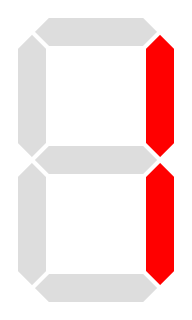
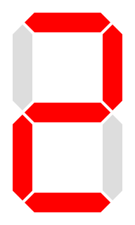
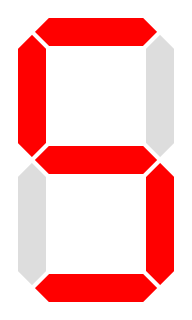
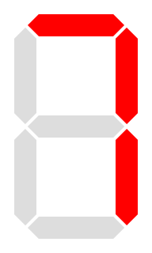

<!-- Posar aquesta imatge al començament de cada lliçó -->

 

# BCD digits

En circuits digitals, els dígits BCD (Binary Coded Decimal), o Decimal Codificat a Binari, són una forma de representar nombres decimals utilitzant un codi binari. La idea és codificar cada dígit decimal individualment amb un nombre binari, generalment de 4 bits.

|**Dígit decimal**|**BCD**
|------ |------
|0 | 0000
|1 | 0001
|2 | 0010
|3 | 0011
|4 | 0100
|5 | 0101
|6 | 0110
|7 | 0111
|8 | 1000
|9 | 1001

## EXEMPLE: Disseny d'un Circuit Controlador de Display de 7 Segments

Aquest circuit rebrà un dígit BCD de 4 bits que representa un dígit del 0 al 9.

$D[3:0]=[D_3 \; D_2 \; D_1 \; D_0]$

Produirà 7 senyals de sortida que controlaran els segments d'un display de 7 segments. Cadascun dels 7 senyals de sortida s'ha d'activar quan el segment corresponent hagi d'estar il·luminat. Estem utilitzant doncs un display de 7 segments de càtode comú.

<i>Display de 7 segments</i>

<a href="https://creativecommons.org/licenses/by-sa/3.0" title="Creative Commons Attribution-Share Alike 3.0">CC BY-SA 3.0</a>, <a href="https://commons.wikimedia.org/w/index.php?curid=2550282">Link</a>

<!--
width:500px;
-->

La següent figura representa el layout estàndard dels 7 segments, que farem servir de referència per desenvolupar el nostre circuit.

<i>Layout dels 7 segments</i>

La següent taula de veritat determina quins deñs segments $a$, $b$, $c$, $d$, $e$, $f$ i $g$ han d'estar encesos ('1') i quins apagats ('0') per a cadascun dels valors d'entrada de $D[3:0]$.

| digit   decimal | BCD   $D_3 D_2 D_1 D_0$ | $a$ | $b$ | $c$ | $d$ | $e$ | $f$ | $g$ | aspecte
|:---:|:---:|---|---|---|---|---|---|---|---
| 0 | 0000 | 1| 1| 1| 1| 1| 1| 0|
| 1 | 0001 | 0| 1| 1| 0| 0| 0| 0|
| 2 | 0010 | 1| 1| 0| 1| 1| 0| 1|
| 3 | 0011 | 1| 1| 1| 1| 0| 0| 1|
| 4 | 0100 | 0| 1| 1| 0| 0| 1| 1|
| 5 | 0101 | 1| 0| 1| 1| 0| 1| 1|
| 6 | 0110 | 1| 0| 1| 1| 1| 1| 1|
| 7 | 0111 | 1| 1| 1| 0| 0| 0| 0|
| 8 | 1000 | 1| 1| 1| 1| 1| 1| 1|
| 9 | 1001 | 1| 1| 1| 1| 0| 1| 1|
|10-15   casos impossibles| 1010-1111| x| x| x| x| x| x| x

Els 4 bits permeten codificar fins al número 15. Els valors del 10 al 15 són casos impossibles, que no corresponen a un dígit. Els valors dels segments es reperesenten com a x.

Cal fer un mapa de karnaugh per a cadascuna de les sortides del circuit per tal d'obtenir l'expressió booleana a partir del digit d'entrada $D[3:0]=[D_3 \; D_2 \; D_1 \; D_0]$. El valor de $x=1$ dona com a resultat equacions més simples.

El procés complet i detallat es pot trobar a diverses fonts:
[enllaç 1](https://informatika.stei.itb.ac.id/~rinaldi.munir/Matdis/2019-2020/Makalah2019/13518127.pdf), 
[enllaç 2](https://www.electricaltechnology.org/2018/05/bcd-to-7-segment-display-decoder.html), 
[enllaç 3](https://steamcommunity.com/sharedfiles/filedetails/?id=2900823549)

Les expressions resultants són les següents:

$segment \; a = D_3 + D_1 + D_2 \bar{D_0} + \bar{D_2} D_0$

$segment \; b = \bar{D_2} + \bar{D_1} \bar{D_0} + D_1 D_0$

$segment \; c = D_2 + \bar{D_1} + D_0$

$segment \; d = D_3 + \bar{D_2} \bar{D_0} + D_1 \bar{D_0} + \bar{D_2} \bar{D_1} + D_2 \bar{D_1} D_0$

$segment \; e = \bar{D_2} \bar{D_0} + D_1 \bar{D_0}$

$segment \; f = D_3 + D_2 \bar{D_1} + \bar{D_1} \bar{D_0} + D_2 \bar{D_0}$

$segment \; g = D_3 + \bar{D_2} D_1 + D_2 \bar{D_1} + D_1 \bar{D_0}$

Amb aquestes funcions booleanes ja simplificades podem implementar el circuit utilitzant portes lògiques (AND, OR, NOT). Les entrades seran els 4 bits corresponents als dígits $D_3$ $D_2$ $D_1$ $D_0$ i les 7 sortides $a$, $b$, $c$, $d$, $e$, $f$, $g$ dels segments.

**Vejem alguns exemples per comprovar que les equacions donen els resultats que ens esperem.**

### Digit 2, D=[0010]

* $segment \; a = 0 + 1 + 0 · \bar{0} + \bar{0}  · 0  = 1$

* $segment \; b = \bar{0} + \bar{1} · \bar{0} + 1·0 = 1$

* $segment \; c = 0 + \bar{1} + 0 = 0$

* $segment \; d = 0 + \bar{0} · \bar{0} + 1 · \bar{0} + \bar{0} · \bar{1} + 0 · \bar{1} + 0 = 1$

* $segment \; e = \bar{0} · \bar{0} + 1 · \bar{0} = 1$

* $segment \; f = 0 + 0 · \bar{1} + \bar{1} · \bar{0} + 0 · \bar{0} = 0$

* $segment \; g = 0 + \bar{0} · 1 + 0 · \bar{1} + 1 · \bar{0} = 1$

### Digit 4, D=[0100]
* $segment \; a = 0 + 0 + 1 · \bar{0} + \bar{1} · 0=1$

* $segment \; b = \bar{1} + \bar{0} · \bar{0} + 0 · 0=1$

* $segment \; c = 1 + \bar{0} + 0=1$

* $segment \; d = 0 + \bar{1} · \bar{0} + 0 · \bar{0} + \bar{1} · \bar{0} + 1 · \bar{0} · 0=0$

* $segment \; e = \bar{1} · \bar{0} + 0 · \bar{0}=0$

* $segment \; f = 0 + 1 · \bar{0} + \bar{0} · \bar{0} + 1 · \bar{0}=1$

* $segment \; g = 0 + \bar{1} · 0 + 1 · \bar{0} + 0 · \bar{0}=1$

### Digit 9, D=[1001]
* $segment \; a = 1 + 0 + 0 · \bar{1} + \bar{0} · 1=1$

* $segment \; b = \bar{0} + \bar{0} · \bar{1} + 0 · 1=1$

* $segment \; c = 0 + \bar{0} + 1=1$

* $segment \; d = 1 + \bar{0} · \bar{1} + 0 · \bar{1} + \bar{0} · \bar{0} + 0 · \bar{0} · 1=1$

* $segment \; e = \bar{0} · \bar{1} + 0 · \bar{1}=0$

* $segment \; f = 1 + 0 · \bar{0} + \bar{0} · \bar{1} + 0 · \bar{1}=1$

* $segment \; g = 1 + \bar{0} · 0 + 0 · \bar{0} + 0 · \bar{1}=1$

## Exercicis de [Introduction to Digital Circuit Design](https://jutge.org/courses/JordiCortadella:IntroCircuits)

[7-segment digit](https://jutge.org/problems/X37276_en)

[Is it a BCD digit ?](https://jutge.org/problems/X31983_en)

[Square of a BCD digit](https://jutge.org/problems/X77297_en)

<!-- Aquesta imatge ha d'anar al final de cada lliçó, ja sigui amb aquesta línia o dins la signatura. Deixar comentat si ja està a la signatura-->
 
 

<Autors autors="xcasas fmadrid jordic"/>