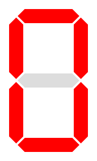
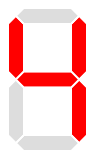
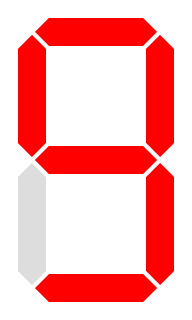

<!-- Posar aquesta imatge al començament de cada lliçó -->

 

# Dígits BCD

En circuits digitals, un nombre **Decimal Codificat en Binari** (*Binary Coded Decimal*, **BCD**) és una manera de representar dígits decimals fent servir **4 bits**. Cada dígit del 0 al 9 es converteix en una combinació binària fixa.

| **Dígit decimal** | **BCD** |
|---|---|
|0 | 0000|
|1 | 0001|
|2 | 0010|
|3 | 0011|
|4 | 0100|
|5 | 0101|
|6 | 0110|
|7 | 0111|
|8 | 1000|
|9 | 1001|

Aquesta codificació és molt utilitzada en displays numèrics i calculadores.

## Exemple: Disseny d’un circuit per a un display de 7 segments

Volem construir un circuit que rebi un dígit BCD i encengui els segments corresponents d’un **display de 7 segments** (de càtode comú) per mostrar-lo.

$$D[3:0] = [D_3\ D_2\ D_1\ D_0]$$

<i>Display de 7 segments</i>

<a href="https://creativecommons.org/licenses/by-sa/3.0" title="Creative Commons Attribution-Share Alike 3.0">CC BY-SA 3.0</a>, <a href="https://commons.wikimedia.org/w/index.php?curid=2550282">Link</a>

La figura següent mostra com s’anomenen els segments:

<i>Disposició dels segments</i>

A la taula següent indiquem quins segments s’han d’encendre per a cada dígit decimal d'entrada $D[3:0]$. Un **1** significa segment encès; un **0**, apagat.

| digit   decimal | BCD   $D_3 D_2 D_1 D_0$ | $a$ | $b$ | $c$ | $d$ | $e$ | $f$ | $g$ | display
|:---:|:---:|---|---|---|---|---|---|---|---
| 0 | 0000 | 1| 1| 1| 1| 1| 1| 0|
| 1 | 0001 | 0| 1| 1| 0| 0| 0| 0|
| 2 | 0010 | 1| 1| 0| 1| 1| 0| 1|
| 3 | 0011 | 1| 1| 1| 1| 0| 0| 1|
| 4 | 0100 | 0| 1| 1| 0| 0| 1| 1|
| 5 | 0101 | 1| 0| 1| 1| 0| 1| 1|
| 6 | 0110 | 1| 0| 1| 1| 1| 1| 1|
| 7 | 0111 | 1| 1| 1| 0| 0| 0| 0|
| 8 | 1000 | 1| 1| 1| 1| 1| 1| 1|
| 9 | 1001 | 1| 1| 1| 1| 0| 1| 1|
|10   don't care| 1010| x| x| x| x| x| x| x
|11   don't care| 1011| x| x| x| x| x| x| x
|12   don't care| 1100| x| x| x| x| x| x| x
|13   don't care| 1101| x| x| x| x| x| x| x
|14   don't care| 1110| x| x| x| x| x| x| x
|15   don't care| 1111| x| x| x| x| x| x| x

## Condicions indiferents (don’t care)

Els 4 bits d’entrada poden codificar valors del 0 al 15. Però un dígit BCD **només fa servir els valors del 0 al 9**. Els casos del 10 al 15 no es mostraran mai i, per tant, els marquem com a **x** (*don’t care*).

A l’hora de buscar agrupacions al mapa de Karnaugh, els podem assignar els valors que més ens convinguin per tal obtenir expressions més simples.

## Expressions booleanes simplificades

Cal fer un mapa de Karnaugh per a cadascuna de les sortides del circuit per tal d'obtenir l'expressió booleana per cada segment.

Pel que fa a les condicions indiferents, el valor de $x=1$ dona com a resultat equacions més simples.

El procés complet i detallat es pot trobar a diverses fonts:
[enllaç 1](https://informatika.stei.itb.ac.id/~rinaldi.munir/Matdis/2019-2020/Makalah2019/13518127.pdf), 
[enllaç 2](https://www.electricaltechnology.org/2018/05/bcd-to-7-segment-display-decoder.html), 
[enllaç 3](https://steamcommunity.com/sharedfiles/filedetails/?id=2900823549)

Obtenim les expressions següents per als segments:

* **Segment a:**
  $$a = D_3 + D_1 + D_2\overline{D_0} + \overline{D_2}D_0$$

* **Segment b:**
  $$b = \overline{D_2} + \overline{D_1}\overline{D_0} + D_1D_0$$

* **Segment c:**
  $$c = D_2 + \overline{D_1} + D_0$$

* **Segment d:**
  $$d = D_3 + \overline{D_2}\overline{D_0} + D_1\overline{D_0} + \overline{D_2}\overline{D_1} + D_2\overline{D_1}D_0$$

* **Segment e:**
  $$e = \overline{D_2}\overline{D_0} + D_1\overline{D_0}$$

* **Segment f:**
  $$f = D_3 + D_2\overline{D_1} + \overline{D_1}\overline{D_0} + D_2\overline{D_0}$$

* **Segment g:**
  $$g = D_3 + \overline{D_2}D_1 + D_2\overline{D_1} + D_1\overline{D_0}$$

Aquestes expressions booleanes permeten implementar el circuit amb portes AND, OR i NOT. Les entrades són els bits $D_3, D_2, D_1, D_0$ i les sortides són els segments $a, b, c, d, e, f, g$.

Aquest tipus de decodificador és molt habitual en electrònica digital bàsica.

## Comprovació amb exemples

Per assegurar-nos que les fórmules funcionen correctament, calculem alguns dígits.

### Exemple: dígit 2 $D = 0010$
Resultats esperats: segments **a, b, d, e, g** encès; **c, f** apagats.

* $segment \; a = 0 + 1 + 0 · \bar{0} + \bar{0}  · 0  = 1$

* $segment \; b = \bar{0} + \bar{1} · \bar{0} + 1·0 = 1$

* $segment \; c = 0 + \bar{1} + 0 = 0$

* $segment \; d = 0 + \bar{0} · \bar{0} + 1 · \bar{0} + \bar{0} · \bar{1} + 0 · \bar{1} + 0 = 1$

* $segment \; e = \bar{0} · \bar{0} + 1 · \bar{0} = 1$

* $segment \; f = 0 + 0 · \bar{1} + \bar{1} · \bar{0} + 0 · \bar{0} = 0$

* $segment \; g = 0 + \bar{0} · 1 + 0 · \bar{1} + 1 · \bar{0} = 1$

### Exemple: dígit 4 $(D = 0100$
Resultats esperats: segments **b, c, f, g** encès.

* $segment \; a = 0 + 0 + 1 · \bar{0} + \bar{1} · 0=1$

* $segment \; b = \bar{1} + \bar{0} · \bar{0} + 0 · 0=1$

* $segment \; c = 1 + \bar{0} + 0=1$

* $segment \; d = 0 + \bar{1} · \bar{0} + 0 · \bar{0} + \bar{1} · \bar{0} + 1 · \bar{0} · 0=0$

* $segment \; e = \bar{1} · \bar{0} + 0 · \bar{0}=0$

* $segment \; f = 0 + 1 · \bar{0} + \bar{0} · \bar{0} + 1 · \bar{0}=1$

* $segment \; g = 0 + \bar{1} · 0 + 1 · \bar{0} + 0 · \bar{0}=1$

### Exemple: dígit 9  $D = 1001$
Resultats esperats: segments **a, b, c, d, f, g** encès.

* $segment \; a = 1 + 0 + 0 · \bar{1} + \bar{0} · 1=1$

* $segment \; b = \bar{0} + \bar{0} · \bar{1} + 0 · 1=1$

* $segment \; c = 0 + \bar{0} + 1=1$

* $segment \; d = 1 + \bar{0} · \bar{1} + 0 · \bar{1} + \bar{0} · \bar{0} + 0 · \bar{0} · 1=1$

* $segment \; e = \bar{0} · \bar{1} + 0 · \bar{1}=0$

* $segment \; f = 1 + 0 · \bar{0} + \bar{0} · \bar{1} + 0 · \bar{1}=1$

* $segment \; g = 1 + \bar{0} · 0 + 0 · \bar{0} + 0 · \bar{1}=1$

## Exercicis a Jutge.org: [Introduction to Digital Circuit Design](https://jutge.org/courses/JordiCortadella:IntroCircuits)

- [7-segment digit](https://jutge.org/problems/X37276_en)
- [Is it a BCD digit?](https://jutge.org/problems/X31983_en)
- [Square of a BCD digit](https://jutge.org/problems/X77297_en)

<small>*Recorda que per accedir als exercicis i que el **Jutge** valori les teves solucions has d'estar inscrit al [curs](https://jutge.org/courses/JordiCortadella:IntroCircuits)*. Troba totes les instruccions [aqui](../Inici/instruccions.md)</small>

<!-- Aquesta imatge ha d'anar al final de cada lliçó, ja sigui amb aquesta línia o dins la signatura. Deixar comentat si ja està a la signatura-->
  

<Autors autors="xcasas fmadrid"/>