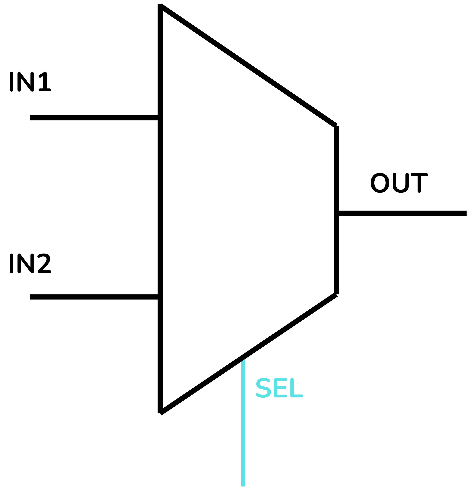
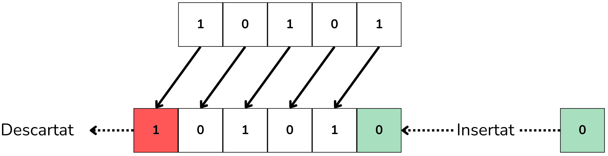

<!-- Posar aquesta imatge al començament de cada lliçó -->

 

# Introducció als Circuits Combinacionals

En un circuit combinacional el valor de la seva sortida depèn únicament dels valors de les seves entrades en aquell moment. Això significa també que la sortida canvia de manera instantània en modificar-se les entrades.
Els circuits combinacionals es construeixen a partir de portes lògiques bàsiques. No tenen retroalimentació interna (la sortida no s’enllaça com a entrada). Tampoc tenen memòria, a diferència dels circuits seqüencials. El seu funcionament es pot descriure completament mitjançant l’àlgebra de Boole o amb taules de veritat.

<i>Circuit combinacional</i>

Els circuits combinacionals bàsics són:
Codificadors, Descodificadors, Multiplexors (MUX), Demultiplexors (DEMUX), Sumadors, Restadors i Comparadors.

En aquesta lliçó trobaràs els següents temes:
[Exercicis simples](./exsimples.md), [Multiplexors](./multiplexors.md), [Sistemes de votació](./svotacio.md), [Busos](./busos.md), [Nombres](./nombres.md) i [BCD digits](./bcddigits.md). Cada tema tracta un tipus de circuit diferent, hi trobaràs exemples i hauràs de resoldre una sèrie d’exercicis emprant portes lògiques bàsiques.

Els temes [Exercicis simples](./exsimples.md) i [Sistemes de votació](./svotacio.md) t’introduiran a l'ús de les taules de veritat i l’àlgebra de Boole amb exemples i exercicis de lògica bàsica. 

<i>Circuit simple</i>

Al tema [Multiplexors](./multiplexors.md) aprendràs a crear dispositius MUX a partir de portes lògiques.

 

<i>Multiplexor</i>

Al tema [Busos](./busos.md) faràs exercicis de corriment de bits (dreta i esquerra) i inversió de nombres binaris de N de bits.

<i>Exemple de desplaçamaent a l'esquerra (Left Shift)</i>

Els exercicis del tema [Nombres](./nombres.md) tracten sobre els circuits digitals encarregats de fer diferents operacions amb números.

Al [tema BCD](./bcddigits.md) (Binary Coded Decimal) faràs exercicis sobre els circuits encarregats codificar els dígits decimals en binari.

Finalment, al tema [Miscel·lània](./miscellania.md) faràs exercicis amb més avançats.

<!-- Aquesta imatge ha d'anar al final de cada lliçó, ja sigui amb aquesta línia o dins la signatura. Deixar comentat si ja està a la signatura-->
 
 

<Autors autors="xcasas fmadrid jordic"/>
