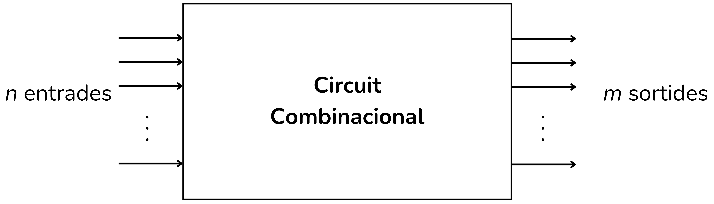

<!-- Posar aquesta imatge al començament de cada lliçó -->

 

# Introducció als circuits combinacionals

En un circuit combinacional, el valor de la sortida depèn únicament dels valors actuals de les entrades. La sortida canvia de manera pràcticament instantània en modificar-se les entrades.

Els circuits combinacionals es construeixen a partir de portes lògiques bàsiques. No tenen retroalimentació interna (la sortida no es reutilitza com a entrada) i tampoc tenen memòria, a diferència dels circuits seqüencials. El seu funcionament es pot descriure completament amb l’àlgebra de Boole o amb taules de veritat.

Els circuits combinacionals bàsics són:
Codificadors, Descodificadors, Multiplexors (MUX), Demultiplexors (DEMUX), Sumadors, Restadors i Comparadors.

En aquesta lliçó trobaràs els temes següents:

[Exercicis simples](./exsimples.md), [Multiplexors](./multiplexors.md), [Sistemes de votació](./svotacio.md), [Busos](./busos.md), [Nombres](./nombres.md) i [BCD digits](./bcddigits.md). Cada tema tracta un tipus de circuit diferent: hi trobaràs exemples i hauràs de resoldre exercicis emprant portes lògiques bàsiques.

Els temes [Exercicis simples](./exsimples.md) i [Sistemes de votació](./svotacio.md) t’introduiran a l'ús de les taules de veritat i l’àlgebra de Boole amb exemples i exercicis de lògica bàsica.

<i>Circuit simple</i>

Al tema [Multiplexors](./multiplexors.md) aprendràs a crear dispositius MUX a partir de portes lògiques.

 

<i>Multiplexor</i>

Al tema [**Busos**](./busos.md) practicaràs operacions de desplaçament de bits (*shift*) i operacions amb conjunts de bits.

<i>Exemple de desplaçament a l'esquerra (Left Shift)</i>

Els exercicis del tema [**Nombres**](./nombres.md) tracten sobre circuits digitals encarregats de fer operacions aritmètiques i lògiques amb nombres binaris.

Al tema [**BCD**](./bcddigits.md) (*Binary Coded Decimal*) farem una introducció a la codificació de nombres per a visualitzadors de 7 segments.

Finalment, al tema [**Miscel·lània**](./miscellania.md) trobaràs un recull d'exercicis que combinen diferents conceptes.

<!-- Aquesta imatge ha d'anar al final de cada lliçó, ja sigui amb aquesta línia o dins la signatura. Deixar comentat si ja està a la signatura-->
 
 

<Autors autors="xcasas fmadrid"/>