<!-- Posar aquesta imatge al començament de cada lliçó -->

 

# Comptadors
Els circuits seqüencials comptadors són circuits digitals capaços de passar per una seqüència ordenada d’estats en resposta a una sèrie d’impulsos de rellotge. Cada estat representa un valor numèric binari, de manera que el circuit compta cap endavant o cap enrere, segons el disseny.

A diferència dels circuits combinacionals, l’estat actual del circuit depèn no només de les entrades, sinó també de l’estat anterior. Aquesta **memòria** s’implementa mitjançant biestables (normalment del tipus T o JK).

Les aplicacions més habituals dels comptadors són la mesura de temps, generació de seqüències, divisors de freqüència i formen part de rellotges digitals, cronòmetres i microprocessadors.

Els comptadors més comuns són els que segueixen una seqüència binària de valors binaris successius, s’anomenen comptadors binaris (binary counter).
Cada impuls de rellotge provoca un canvi d’estat del comptador. Els biestables s’activen de manera seqüencial, produint una successió binària (0000, 0001, 0010, 0011, etc.). En arribar al màxim valor, el comptador pot tornar a l’estat inicial (comptador cíclic o modular), o bé invertir el sentit i comptar cap enrere (comptador bidireccional).

## Comptador Binari (Binary Counter) MOD $2^n$

Un comptador binari MOD $2^n$ és un circuit seqüencial format per $n$ biestables que compta de $0$ a $2^n − 1$ en binari, i després torna a zero.
El terme MOD $2^n$ indica que el mòdul del comptador és $2^n$, és a dir, que **la seqüència té exactament  $2^n$ estats binaris únics abans de repetir-se**.

S’utilitza per comptar, generar seqüències binàries periòdiques i dividir freqüències.

### Comptador d’un sol bit MOD $2^1$
El següent comptador té un sol bit, utilitza un sol biestable. És, per tant, un comptador MOD $2^1$, i pot comptar de 0 a 1.

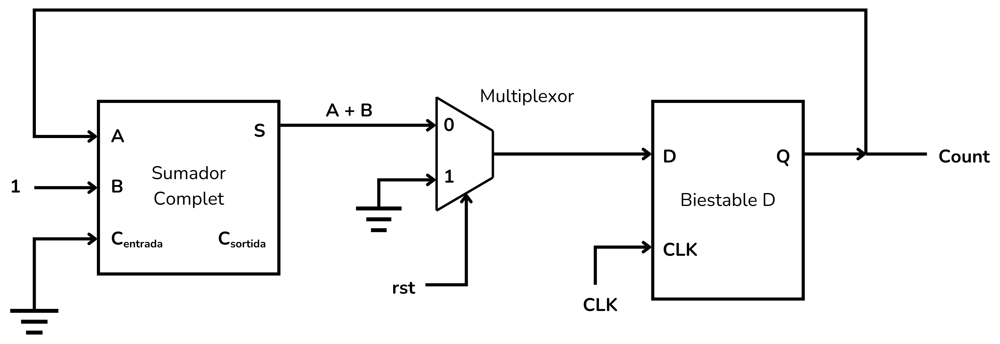

Aquest es compon d’un biestable D, un sumador complet (*full adder*) connectat a la sortida del biestable i un multiplexor. El sumador sumarà un valor constant $1$ a la sortida $Q$ del biestable.  Aquest senyal amb valor $Q+1$ es connectarà a l’entrada $D$ del biestable.

El multiplexor serveix per afegir la possibilitat de reiniciar el comptador. El senyal selector actua doncs com un senyal de reinici (*reset*). Quan aquest senyal s’activa, el multiplexor connecta un valor constant $0$ al biestable, tot reiniciant el comptador. 

Per entendre com funciona aquest comptador, comencem amb el biestable en un estat $Q=0$. La taula, més endavant, recull el resultat d’aquesta anàlisi.

**Estat inicial:**

El biestable es troba en un estat $Q=0$ que passarà al sumador, que hi sumarà el valor $1$.

Aquest senyal, amb valor $A+B=1$, s’aplica a l’entrada del biestable, l’entrada $D$ rep el senyal 1.

$D=1$ però encara no s’ha actualitzat l’estat del biestable amb un senyal de rellotge, en conseqüència, $Q$ no canvia encara de valor.

El comptador és a zero ($Count=0$)

**Primer pols:**

Quan s’aplica un pols de rellotge el valor de $D$ es copia a la sortida $Q$, que passa a tenir el valor $Q=1$.

El sumador hi suma el valor constant 1 i obtenim una sortida $A+B=0$.

El valor del bit de ròssec (carry) de sortida és $C_{sortida}=1$, però no el connectarem enlloc.

Ara l’entrada del biestable és $D=0$, però $Q$ no canvia encara de valor fins que no entri el següent pols de rellotge.

El comptador ha comptat fins a 1 ($Count=1$)

**Segon pols:**
El següent pols de rellotge actualitza còpia el valor $D=0$ a $Q$, i així hem tornat a la situació inicial, on $Count=0$.

|**Pols**|**$D$**|**$Q$**|**$Count$**
|------              |------ |------ |------   
|0  |1|0|0|
|1  |0|1|1|
|2  |1|0|0|
|3  |0|1|1|
|···|···|···|···|

Podem visualitzar el funcionament d’aquest comptador amb el cronograma següent:

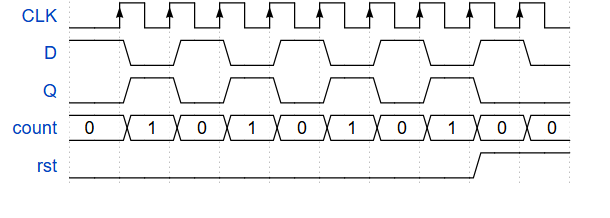

Sigui quin sigui l’estat del comptador, en el moment que activem el senyal de reinici ($rst$), el multiplexor forçarà el comptador a retornar al seu estat inicial.

### Comptador de 3 bits MOD $2^3$

El següent comptador és de 3 bits, utilitza 3 biestables. És doncs un comptador MOD $2^3$, capaç de comptar de $0$ a $7$.

Aquest comptador es compon de 3 biestables D, 3 sumadors complets i, per tal d’afegir la possibilitat de reiniciar el comptador, 3 multiplexors.

Dels biestables n’obtindrem una sortida de 3 bits $Q=[Q_2​ Q_1​ Q_0​]$.
Les sortides $Q_i$ dels biestables es connecten als sumadors complets, que s’estructuren de manera equivalent al [sumador de n bits](../CircAritm/Aritmnbits#exemple-sumador-de--bits). Per aquesta raó el bit de ròssec (*carry*) de cada sumador $C_{sortida}$ es connecta al bit de ròssec d’entrada $C_{entrada}$ del següent.

Aquest conjunt de 3 sumadors complets, és a dir, aquest sumador de 3 bits, afegirà contínuament la constant $B=001$ a $Q$. Per això connectem $B_0=1$, $B_1=0$ i $B_2=0$.

El senyal de reinici (*reset*, o $rst$) crearà un reinici síncron del comptador, retornant-lo a zero.

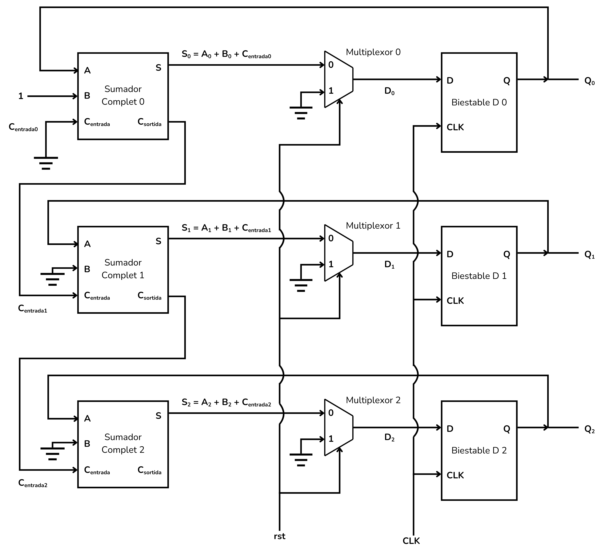

<i>Comptador binari MOD 2^3</i>

Analitzem el funcionament d’aquest comptador, començant amb tots els biestables a zero. La taula, més endavant, recull el resultat d’aquesta anàlisi.

**Estat inicial:**

Els biestables estan en l’estat $Q_0=0$, $Q_1=0$ i $Q_2=0$.

El sumador 0 fa l'operació $0+1+0=1$, per tant, $D_0=1$.

El sumador 1 fa l'operació $0+0+0=0$, per tant, $D_1=0$.

El sumador 2 fa l'operació $0+0+0=0$, per tant, $D_2=0$.

No hi ha cap bit de ròssec ($C_{sortida}$) activat.

**Primer pols:**

El pols de rellotge fa que els bits de $Q$ s’actualitzin amb les entrades $D$, de manera que $Q_0=1$, $Q_1=0$ i $Q_2=0$.

Per tant, $D_0=1$, $D_1=1$ i $D_2=0$, i $C_{sortida 0}=1$

**Segon pols:**

El pols de rellotge fa que els bits de $Q$ s’actualitzin amb les entrades $D$, de manera que $Q_0=0$, $Q_1=1$ i $Q_2=0$

Per tant, $D_0=1$, $D_1=1$ i $D_2=0$, i no hi ha cap bit de ròssec activat.

**Tercer pols:**

El pols de rellotge fa que els bits de $Q$ s’actualitzin amb les entrades $D$, de manera que $Q_0=1$, $Q_1=1$ i $Q_2=0$.

Per tant, $D_0=0$, $D_1=0$ i $D_2=1$.

Dos bits de ròssec de sortida estan activats, $C_{sortida 0}=1$ i $C_{sortida1}=1$ 

Amb els següents polsos de rellotge, els biestables passen per totes les combinacions possibles, representant un nombre binari creixent fins a arribar al punt on tots els biestables són a l’estat 1. És a dir $Q=111$.

**Setè pols:**

Hem arribat al valor màxim del comptador, $Q_0=1$, $Q_1=1$ i $Q_2=1$.
El setè pols de rellotge durà el comptador altra vegada al seu estat inicial.

|**Pols**|**$D_2$**|**$D_1$**|**$D_0$**|**$C_{sortida2}$**|**$C_{sortida1}$**|**$C_{sortida0}$**|**$Q_2$**|**$Q_1$**|**$Q_0$**|**$Count$**
|------ |------ |------ |------ |------ |------ |------ |------ |------ |------ |------   
|0 |0|0|1|0|0|0|0|0|0|000|
|1 |0|1|0|0|0|1|0|0|1|001|
|2 |0|1|1|0|0|0|0|1|0|010|
|3 |1|0|0|0|1|1|0|1|1|011|
|4 |1|0|1|0|0|0|1|0|0|100|
|5 |1|1|0|0|0|1|1|0|1|101|
|6 |1|1|1|0|0|0|1|1|0|110|
|7 |0|0|0|1|1|1|1|1|1|111|
|8 |0|0|1|0|0|0|0|0|0|000|

Podem visualitzar el funcionament d’aquest comptador amb el cronograma següent:

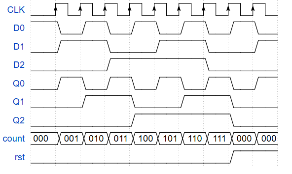

Sigui quin sigui l’estat del comptador, en el moment que activem el senyal de reinici (*rst*), el multiplexor forçarà el comptador a retornar al seu estat inicial.

### Comptador de n bits MOD $2^n$

Per implementar un comptador de n bits cal encadenar n biestables, n sumadors i n multiplexors de la mateixa manera. Amb aquest comptador es pot comptar de 0 fins a $2^n$ .

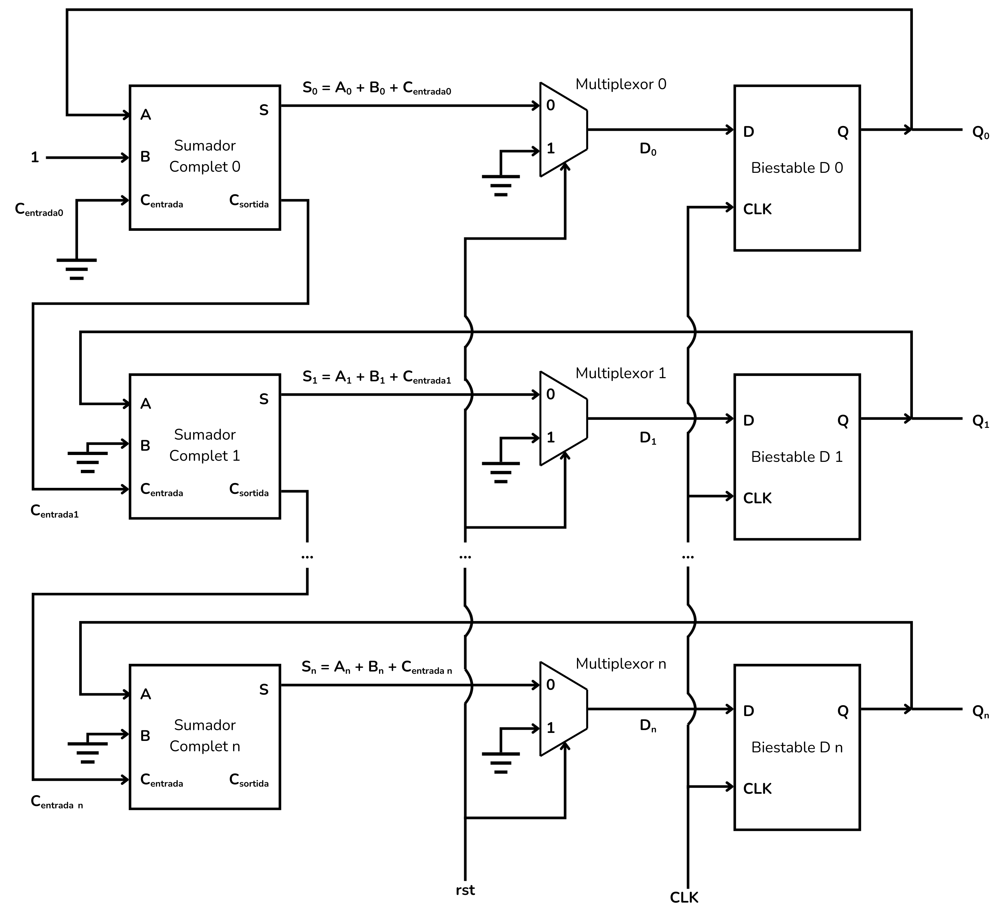

<i>Comptador binari MOD 2^n</i>

## Comptador Binari Asíncron (*Asynchronous Binary Counter* o *Ripple Counter*):
Un comptador binari asíncron (*Asynchronous Binary Counter*), o comptador en cascada (*Ripple Counter*), s’implementa amb una sèrie de biestables, normalment del tipus JK.
El primer biestable representa el bit menys significatiu *LSB*, que és controlat pel rellotge, i cadascun dels següents pel senyal de sortida de l’anterior, de manera que aquests biestables canvien d’estat **en cascada**.

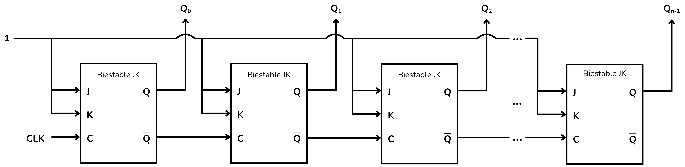

<i>Comptador asíncron</i>

+ Els biestables JK estan connectats de manera que $J=K=1$ i, per tant, l’estat de $Q$ es commuta entre 0 i 1 quan entra un senyal de rellotge.
+ Els biestables capten un senyal de rellotge **només** en el moment que aquest bit passa de 0 a 1. No es considerarà que entra senyal de rellotge mentres aquest es mantingui a 1, a 0 o commuti de 1 a 0.
+ La sortida $Q_0$ correspon al bit menys significatiu *LSB* la sortida $Q_n$ correspon al bit més significatiu *MSB*.
+ El senyal de rellotge extern s’aplica solament a l’entrada del primer biestable.
+ La sortida $\bar{Q}$ de cada biestable es connecta a l’entrada de rellotge del següent biestable.

  + Això significa que quan un biestable commuti Q de 1 a 0, Q’ passarà de 0 a 1, estimulant l’entrada de rellotge del biestable següent. I això produirà una commutació de l’estat al biestable següent.

  + Dit breument: un biestable commutarà d’estat només en el moment que el biestable anterior passa de 1 a 0.

Per entendre com funciona aquest comptador, comencem amb tots els biestables a ‘0’. 

**Primer pols**:

El primer biestable $Q_0$ commuta de 0 a 1, $\bar{Q_0}$ passa de 1 a 0.

El segon biestable no detecta impuls a l’entrada de rellotge, no canvia d’estat i per tant $Q_1$ continua a 0.

El tercer biestable i tots els següents continuen a 0.

**Segon pols**:

El primer biestable $Q_0$ passa de 1 a 0, $\bar{Q_0}$ passa de 0 a 1.

El segon biestable detecta impuls a l’entrada de rellotge,  $Q_1$ passa de 0 a 1 i $\bar{Q_1}$ passa de 1 a 0.

El tercer biestable i tots els següents continuen a 0.

Amb els **següents polsos** de rellotge. Les commutacions es van propagant de manera que els biestables passen per totes les combinacions possibles, representant un nombre binari creixent fins a arribar al punt on tots els biestables són a l’estat 1.
En aquest punt, el següent pols de rellotge commuta el primer biestable de 1 a 0, el segon també, i així tots els biestables passen de 1 a 0 en cadena, tornant al punt de partida.

Aquesta taula mostra la seqüència dels diferents bits del comptador.

|**Pols**|**$Q_3$**|**$Q_2$**|**$Q_1$**|**$Q_0$**|**$Count$**
|------              |------   |------   |------   |------   |------
|0  |0|0|0|0|0000
|1  |0|0|0|1|1000
|2  |0|0|1|0|0100
|3  |0|0|1|1|1100
|4  |0|1|0|0|0010
|···|···|···|···|···|···
|14 |1|1|1|0|0111
|15 |1|1|1|1|1111
|16 |0|0|0|0|0000

La figura següent mostra el cronograma d’aquest comptador.

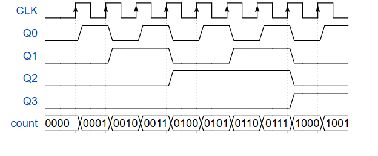

Aquest tipus de comptadors acumulen retards de tots els biestables a l’hora de passar d’un estat al següent, per tant, no és adequat per a freqüències de rellotge altes.

Els comptadors són també **divisors de freqüència**.
Cada bit s’activa a la meitat de la freqüència del bit anterior de manera natural. És doncs un dispositiu que divideix successivament per 2 la freqüència de rellotge.

## Comptador Binari Síncron (*Synchronous Binary Counter*):

Un comptador binari síncron és molt similar als comptadors asíncrons, però en aquest cas tots els biestables reben el mateix senyal de rellotge i canvien d'estat simultàniament.

Utilitza biestables de tipus JK i té la següent estructura:

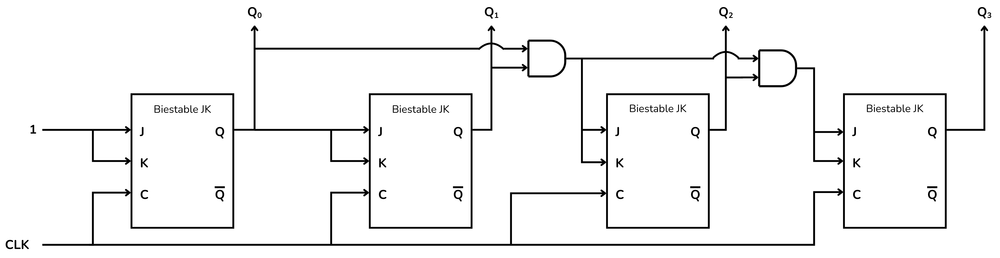

<i>Comptador síncron</i>

Al biestable 0 les entrades $J$ i $K$ estan connectades de manera que $J=K=1$ i, per tant, la seva sortida $Q_0$ commuta entre 0 i 1 sempre que entri un senyal de rellotge $CLK$.

La sortida del biestable 0 ($Q_0$) està connectada directament a les entrades J i K del biestable 1. D’aquesta manera, quan  $Q_0=1$, l’estat del biestable 1 ($Q_1$) commutarà entre 0 i 1 sempre que entri un senyal de rellotge.

Les entrades $J$ i $K$ del biestable 2, i els següents biestables a partir d’aquest, estan controlades amb una porta $AND$, que rep les sortides dels dos biestables anteriors. Si les sortides dels dos biestables anteriors són iguals a 1 simultàniament, la porta $AND$ s’activarà i les entrades del biestable rebran el senyal 1. En aquest cas, el biestable commutarà entre 0 i 1.

A partir del biestable 2, aquesta estructura es va repetint fins a completar el comptador.

Per entendre com funciona aquest comptador, comencem amb tots els biestables a ‘0’.  

**Estat inicial:**

Tots els biestables estan a zero, $count=0000$.

**Primer pols:**

El primer biestable $Q_0$ commuta a $Q_0=1$.
La resta de biestables no commuten perque les seves entrades són 0.
En aquest pols el comptador ha passat a ser $count=0001$.

**Segon pols:**

Com que $Q_0=1$ o $Q_1=0$ el biestable 2 no commutarà.
El biestable 1 commuta a 1 perque la seva entrada és 1.
El biestable 0 commutarà a 0.
En aquest pols el comptador ha passat a ser $count=0010$.

**Tercer pols:**

Com que $Q_0=0$ i $Q_1=1$ el biestable 2 no commutarà.
El biestable 1 no commuta perque la seva entrada és 0.
El biestable 0 commutarà a 1.
En aquest pols el comptador ha passat a ser $count=0011$.

**Quart pols:**

Per primera vegada, la porta AND s’activa al rebre $Q_0=1$ i $Q_1=1$, per tant el biestable 2 commuta a 1.
El biestable 1 commuta a 0 perque la seva entrada és 1.
El biestable 0 commutarà a 0.
En aquest pols el comptador ha passat a ser $count=0100$.

Amb els següents polsos de rellotge, els biestables passen per totes les combinacions possibles, representant un nombre binari creixent fins a arribar al punt on tots els biestables són a l’estat 1.

Tant la taula, com el cronograma amb la seqüència del comptador són idèntiques al comoptador anterior.

|**Pols**|**$Q_3$**|**$Q_2$**|**$Q_1$**|**$Q_0$**|**$Count$**
|------              |------   |------   |------   |------   |------
|0  |0|0|0|0|0000
|1  |0|0|0|1|1000
|2  |0|0|1|0|0100
|3  |0|0|1|1|1100
|4  |0|1|0|0|0010
|···|···|···|···|···|···
|14 |1|1|1|0|0111
|15 |1|1|1|1|1111
|16 |0|0|0|0|0000

## EXEMPLE: Comptador de 4 bits
En aquest exemple veurem com realitzar un comptador de 4 bits.

    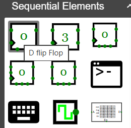
    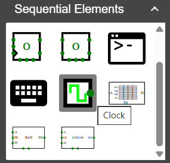

Les connexions del biestable que ens interessen són la **D** i **Q**, que marquen l'entrada i sortida de l'element de memòria, i també **CLK**, que és l’entrada del senyal de rellotge.
L'entrada de rellotge representa sovint amb un triangle a l'interior de l'element. 

    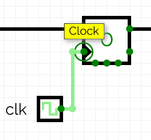
    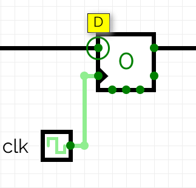
    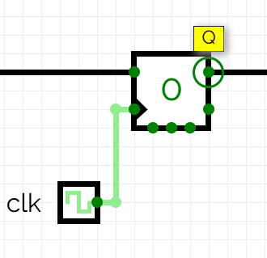

El biestable D també compta amb altres entrades com *enables* i *resets* que permeten reiniciar o eliminar estats d’informació. També té una sortida negada $\bar{Q}$ per si cal operar amb valors de sortida inversos.

Volem un comptador que segueixi una seqüència binària de 4 bits, de valors successius entre el 0000 i el 1111. També volem incloure un senyal de reset que retorni la sortida a 0000. Aquest comportament es pot aconseguir amb un sumador, un multiplexor i un biestable de 4 bits com a la figura.

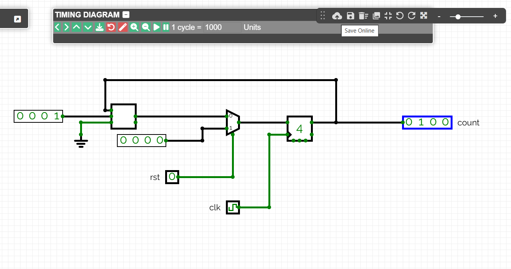

El pols de rellotge farà que el sumador afegeixi una constant 0001 al valor de sortida del biestable. En aquest exemple passant d'un valor 0100 a 0101.

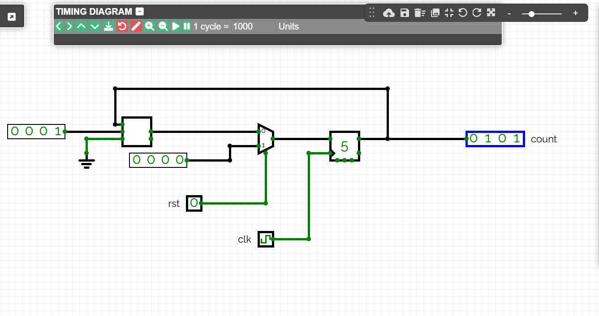

El multiplexor forçarà el reinici. Al entrar un senyal **rst** l'estat del biestable passarà a ser 0000.

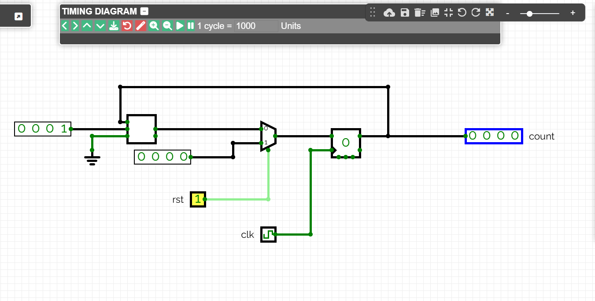

[CircuitVerse](https://circuitverse.org/simulator) inclou una entrada *Asyncronous reset* als biestables. Per fer un reinici asíncron cal eliminar el multiplexor i connectar el senyal $rst$ a l'entrada *Asyncronous reset* del biestable.

## Exercicis a Jutge.org: [Introduction to Digital Circuit Design](https://jutge.org/courses/JordiCortadella:IntroCircuits)

[Toggle](https://jutge.org/problems/X15508_en)

[2-bit counter](https://jutge.org/problems/X81362_en)

[Mod-3 counter](https://jutge.org/problems/X05944_en)

[4-bit counter](https://jutge.org/problems/X35277_en)

[Unconventional cyclic counter](https://jutge.org/problems/X97508_en)

[Up-down counter](https://jutge.org/problems/X53256_en)

[Mod-7 up-down counter](https://jutge.org/problems/X47159_en)

<small>*Recorda que per accedir als exercicis i que el **Jutge** valori les teves solucions has d'estar inscrit al [curs](https://jutge.org/courses/JordiCortadella:IntroCircuits)*. Troba totes les instruccions [aqui](../Inici/instruccions.md)</small>

<!-- Aquesta imatge ha d'anar al final de cada lliçó, ja sigui amb aquesta línia o dins la signatura. Deixar comentat si ja està a la signatura-->
 
 

<Autors autors="xcasas fmadrid"/>