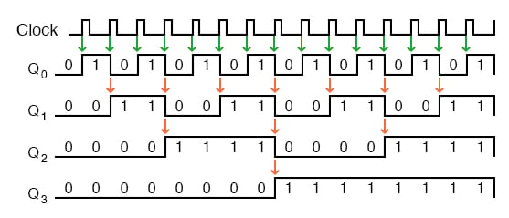

<!-- Posar aquesta imatge al començament de cada lliçó -->

 

# Comptadors
Els **circuits seqüencials comptadors** són circuits digitals capaços de passar per una seqüència ordenada d’estats en resposta a una sèrie d’impulsos de rellotge. Cada estat representa un valor numèric binari, de manera que el circuit compta cap endavant o cap enrere, segons el disseny.

A diferència dels circuits combinacionals, l’estat actual del circuit depèn no només de les entrades, sinó també de l’estat anterior. Aquesta **memòria** s’implementa mitjançant biestables (normalment del tipus T o JK).

Les aplicacions més habituals dels comptadors són la mesura de temps, generació de seqüències, divisors de freqüència i formen part de rellotges digitals, cronòmetres i microprocessadors.

Els comptadors més comuns són els que segueixen una seqüència binària de valors binaris successius, s’anomenen comptadors binaris (binary counter).
Cada impuls de rellotge provoca un canvi d’estat del comptador. Els biestables s’activen de manera seqüencial, produint una successió binària (0000, 0001, 0010, 0011, …). En arribar al màxim valor, el comptador pot tornar a l’estat inicial (comptador cíclic o modular), o bé invertir el sentit i comptar cap enrere (comptador bidireccional).

## Comptador Binari (Binary Counter) MOD $2^n$

Un comptador binari MOD $2^n$ és un circuit seqüencial format per $n$ biestables que compta de $0$ a $2^n − 1$ en binari, i després torna a zero.
El terme MOD $2^n$ indica que el mòdul del comptador és $2^n$, és a dir, que **la seqüència té exactament  $2^n$ estats binaris únics abans de repetir-se**.

S’utilitza per comptar, generar seqüències binàries periòdiques i dividir freqüències. Es tracta d’un divisor de freqüència perquè que cada bit té una freqüència dividida per 2 respecte a l’anterior.

### Comptador d’un sol bit MOD $2^1$
El següent comptador té un sol bit, un sol biestable, MOD $2^1$, i pot comptar de 0 a 1.

<i>Comptador binari MOD $2^1$</i>

### Comptador de 3 bits MOD $2^3$

<i>Comptador binari MOD $2^3$</i>

## Comptador Binari Asíncron (*Asynchronous Binary Counter* o *Ripple Counter*):
Un comptador binari asíncron (*Asynchronous Binary Counter*), o comptador en cascada (*Ripple Counter*), s’implementa amb una sèrie de $n$ biestables, normalment del tipus JK.
El primer biestable representa el bit menys significatiu *LSB* és controlat pel rellotge, i cadascun dels següents pel senyal de sortida de l’anterior, de manera que aquests biestables canvien d’estat **en cadena**.

Conceptes clau:
+ Els biestables JK estan connectats de manera que $J=K=1$ i, per tant, l’estat de $Q$ es commuta entre 0 i 1 quan entra un senyal de rellotge.
+ Els biestables capten un senyal de rellotge **només** en el moment que aquest bit passa de 0 a 1. No es considerarà que entra senyal de rellotge mentres aquest es mantingui a 1, a 0 o commuti de 1 a 0.
+ La sortida $Q_0$ correspon al bit menys significatiu *LSB* la sortida $Q_n$ correspon al bit més significatiu *MSB*.
+ El senyal de rellotge extern s’aplica solament a l’entrada del primer biestable.
+ La sortida $\bar{Q}$ de cada biestable es connecta a l’entrada de rellotge del següent biestable.

  + Això significa que quan un biestable commuti Q de 1 a 0, Q’ passarà de 0 a 1, estimulant l’entrada de rellotge del biestable següent. I això produirà una commutació de l’estat al biestable següent.

  + Dit breument: un biestable commutarà d’estat només en el moment que el biestable anterior passa de 1 a 0.

Per entendre com funciona aquest comptador, comencem amb tots els biestables a ‘0’. 

Al primer pols de rellotge:
El primer biestable $Q_0$ commuta de 0 a 1, $\bar{Q_0}$ passa de 1 a 0.
El segon biestable no detecta impuls a l’entrada de rellotge, no canvia d’estat i per tant $Q_1$ continua a 0.
El tercer biestable i tots els següents continuen a 0.

Al segon pols de rellotge: 
El primer biestable $Q_0$ passa de 1 a 0, $\bar{Q_0}$ passa de 0 a 1.
El segon biestable detecta impuls a l’entrada de rellotge,  $Q_1$ passa de 0 a 1 i $\bar{Q_1}$ passa de 1 a 0.
El tercer biestable i tots els següents continuen a 0.

Amb els següents polsos de rellotge. Les commutacions es van propagant de manera que els biestables passen per totes les combinacions possibles, representant un nombre binari creixent fins a arribar al punt on tots els biestables són a l’estat 1.
En aquest punt, el següent pols de rellotge commuta el primer biestable de 1 a 0, el segon també, i així tots els biestables passen de 1 a 0 en cadena, tornant al punt de partida.

Aquesta taula mostra la seqüència dels diferents bits del comptador.

|**Pols de rellotge**|**$Q_3$**|**$Q_2$**|**$Q_1$**|**$Q_0$**
|------                |------   |------   |------   |------
|0  |0|0|0|0|
|1  |0|0|0|1|
|2  |0|0|1|0|
|3  |0|0|1|1|
|4  |0|1|0|0|
|···|···|···|···|···|
|14 |1|1|1|0|
|15 |1|1|1|1|
|16 |0|0|0|0|

La figura següent mostra la mateixa seqüència dels diferents senyals. Cada bit s’activa a la meitat de la freqüència del bit anterior, per això, aquest comptador és també un divisor de freqüència natural.

<i>Seqüència</i>

Aquest tipus de comptadors acumulen retards de tots els biestables a l’hora de passar d’un estat al següent, per tant, no és adequat per a freqüències altes.

## Comptador Binari Síncron (*Synchronous Binary Counter*):

## EXEMPLE: Comptador de 4 bits
En aquest exemple veurem com realitzar un comptador de 4 bits. Cal tenir en compte que n’hi han diferents tipus de comptadors:

    
    

Les entrades del biestable que ens interessa són la D i Q, que marquen l'entrada i sortida de l'element de memòria, i l'entrada *clk*, que és l’entrada on es connecta el senyal de rellotge. L'entrada de rellotge representa sovint amb un triangle a l'interior de l'element. 

    
    
    

El biestable D també compta amb altres entrades com *enables* i *resets* que permeten reiniciar o eliminar estats d’informació. També té una sortida $Q$ negada $\bar{Q}$ per si cal operar amb valors de sortida inversos.

Volem un comptador que segueixi una seqüència binària de 4 bits, de valors successius entre el 0000 i el 1111. També volem incloure un senyal de reset que retorni de la sortida a 0000. Aquest comportament es pot aconseguir amb un sumador, un multiplexor i un biestable de 4 bits com a la figura.

El pols de rellotge farà que el sumador afegeixi una constant 0001 al valor de sortida del biestable. En aquest exemple passant d'un valor 0100 a 0101.

El multiplexor forçarà el reset. Al entrar un senyal de reset $rst$ l'estat del biestable passarà a ser 0000.

CircuitVerse inclou una entrada *Asyncronous reset* als biestables. Per a fer un reset asíncron cal eliminar el multiplexor i connectar el senyal $rst$ a l'entrada *Asyncronous reset* del biestable.

<!-- Aquesta imatge ha d'anar al final de cada lliçó, ja sigui amb aquesta línia o dins la signatura. Deixar comentat si ja està a la signatura-->
 
 

<Autors autors="xcasas fmadrid"/>