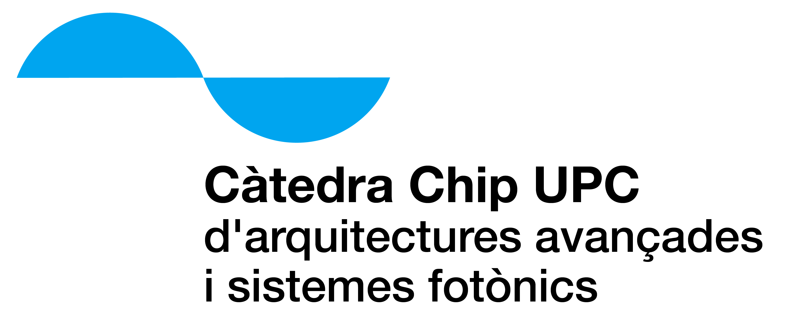

<!-- Posar aquesta imatge al començament de cada lliçó -->

 

# Comptadors
Els comptadors són un tipus molt important de circuit seqüencial que serveixen per comptar polsos o esdeveniments. El seu propòsit principal és comptar polsos de rellotge i emmagatzemar el nombre resultant en format binari.

Un comptador passa per una seqüència predefinida d’estats cada cop que rep un pols de rellotge. Cada estat representa un nombre binari.
Quan arriba al valor màxim, torna a començar (comptador cíclic).

## EXEMPLE: Comptador de 4 bits
En aquest exemple veurem com realitzar un comptador de 4 bits. Cal tenir en compte que n’hi han diferents tipus de comptadors:

<i>En contrucció</i>

<!-- Aquesta imatge ha d'anar al final de cada lliçó, ja sigui amb aquesta línia o dins la signatura. Deixar comentat si ja està a la signatura-->
 
 

<Autors autors="xcasas fmadrid"/>