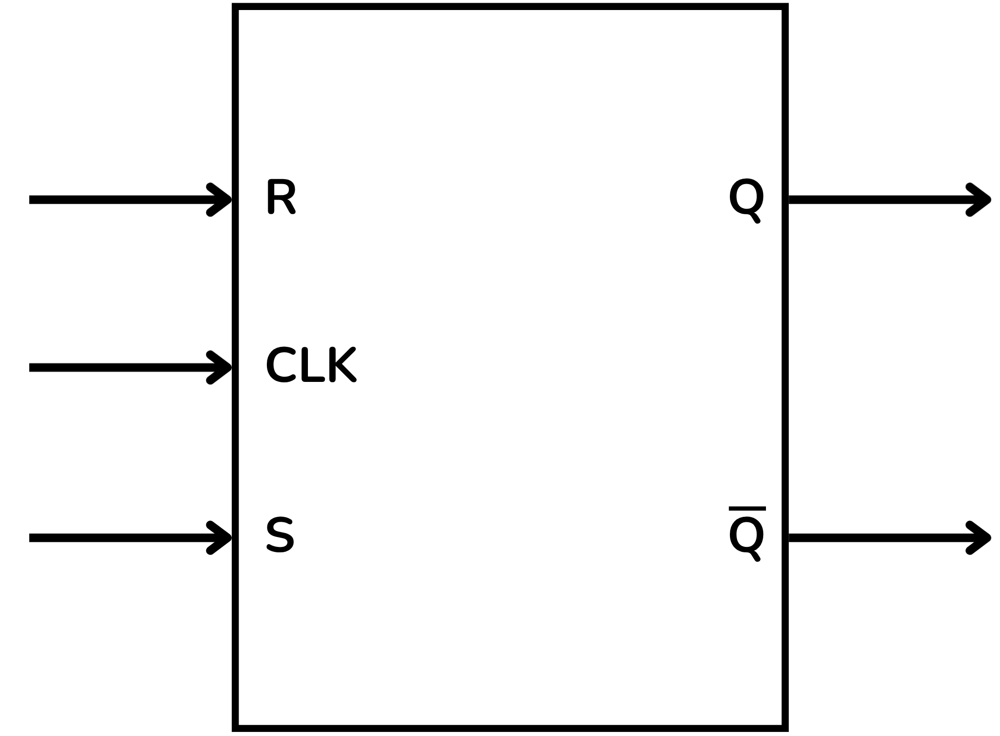
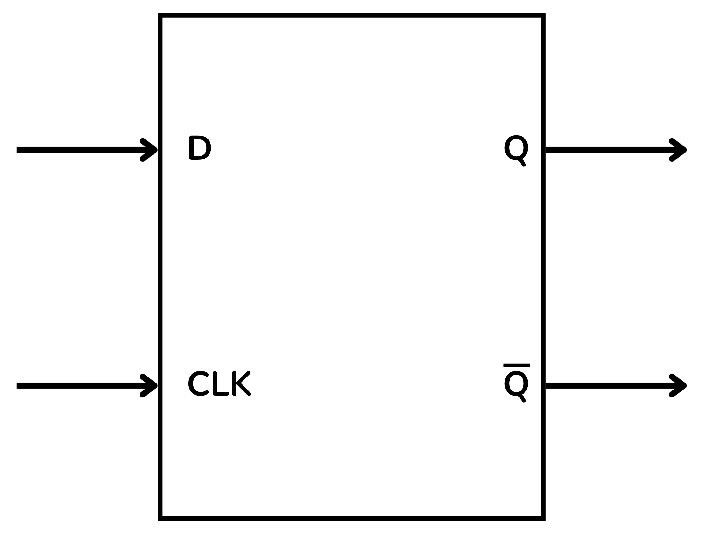
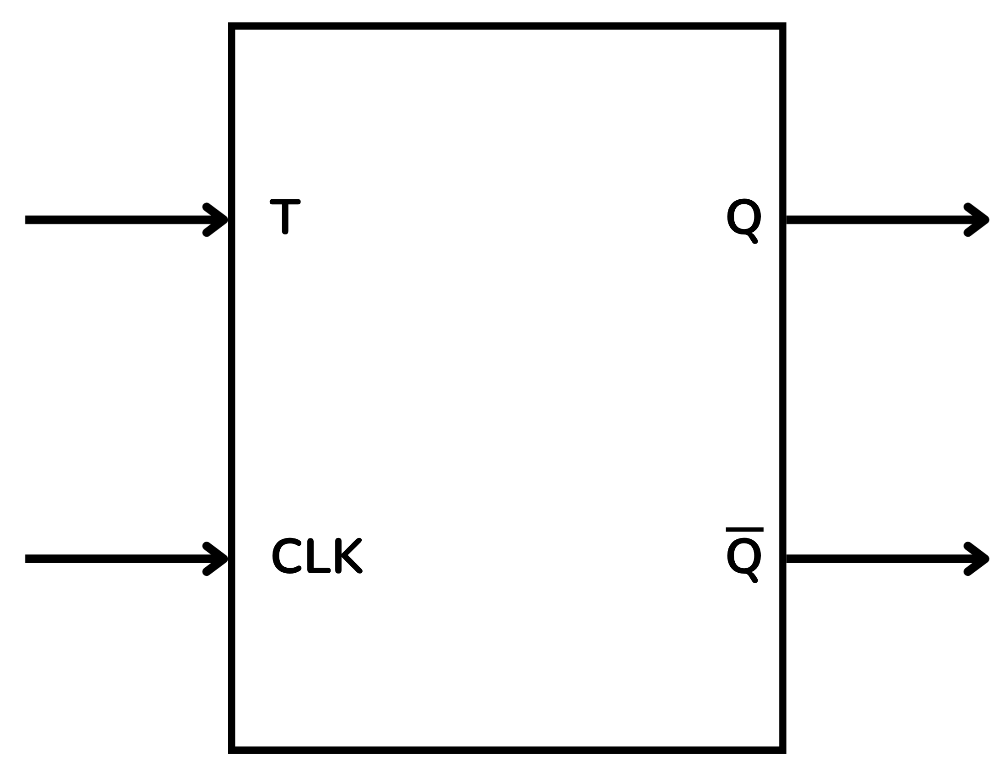
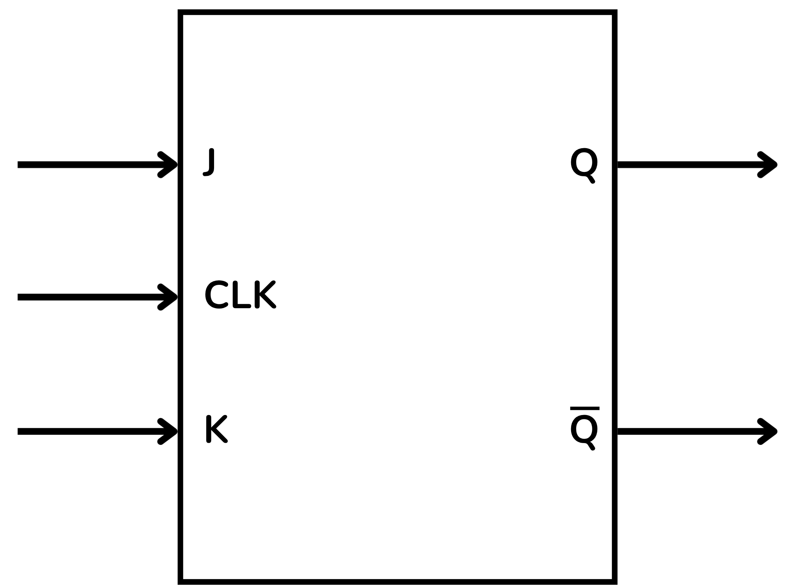

<!-- Posar aquesta imatge al començament de cada lliçó -->

 

# Introducció als circuits seqüencials

Els circuits seqüencials són circuits digitals en què el valor de la sortida no depèn únicament de les entrades actuals, sinó també de l’estat anterior del circuit; és a dir, disposen de **memòria**.

A diferència dels circuits combinacionals, que només calculen resultats instantanis a partir de les entrades, els circuits seqüencials guarden informació sobre el passat mitjançant elements de memòria.
Són fonamentals en la construcció de memòries, comptadors, registres, unitats de control i processadors.

## Sincronització i rellotge

Molts circuits seqüencials funcionen sincronitzats amb un senyal de rellotge (*clock*) que marca el ritme amb què es produeixen els canvis d’estat.

**Sistemes Seqüencials Síncrons**: Els canvis d’estat i de sortida només es produeixen en instants ben definits, marcats per un senyal periòdic de rellotge.
El rellotge sincronitza el funcionament del circuit, fent que les variables internes només canviïn amb un pols o flanc (ascendent o descendent).

**Sistemes Seqüencials Asíncrons**: Actuen de manera contínua: els canvis en les entrades provoquen canvis immediats en les variables internes, sense esperar cap rellotge.
Són més difícils de dissenyar, ja que poden aparèixer problemes de sincronització.

## Funció

Segons la seva funció, els circuits seqüencials es poden classificar en:

* **Comptadors**: avancen per una seqüència d’estats segons els polsos del rellotge; s’utilitzen per comptar esdeveniments o generar patrons binaris.
* **Registres**: emmagatzemen i desplacen dades binàries; serveixen per guardar valors temporals o transmetre informació.
* **Màquines d’estat**: models que descriuen el comportament seqüencial d’un sistema, definint transicions d’estat segons entrades i rellotge.
* **Memòries**: dispositius dissenyats per emmagatzemar grans quantitats d’informació binària.

## Memòria i estat

La capacitat de retenir un valor anterior s’aconsegueix amb un **element de memòria**.

* **Estat**: conjunt d’informació que el circuit necessita per determinar el comportament futur.
* **Realimentació** (*feedback*): les sortides es reintrodueixen com a entrades internes, fet que permet conservar informació.

# El biestable (*Flip-Flop*)

El component fonamental per crear memòria en circuits seqüencials és el **biestable** (*flip-flop* en anglès), capaç d’emmagatzemar un sol bit.
La seva sortida depèn del seu estat anterior i de les entrades actuals.

A diferència d’una porta lògica, la sortida d’un biestable no depèn només de les entrades actuals, sinó també de l’estat anterior. Aquesta capacitat de recordar és la base de tots els dispositius de memòria i control dels sistemes digitals.

Hi ha diversos tipus de biestables. A continuació, repassem els més importants.

## El biestable RS (*Reset–Set*)

També anomenat **SR** (*Set–Reset*). Té dues entrades:

* $S$ (*Set*): força la sortida $Q$ a 1.
* $R$ (*Reset*): força la sortida $Q$ a 0.

També disposa d’una entrada de rellotge $CLK$, habitual en biestables síncrons.
La sortida principal és $Q$ i la complementària és $\bar{Q}$.

> No s’han d’activar $S$ i $R$ simultàniament (condició prohibida).

<i>Esquema funcional del biestable RS</i>

Aquest biestable és la base de memòries, comptadors, registres i màquines d’estat.

## El biestable D (*Data*)

Té una sola entrada $D$ (*Data*) i una entrada de rellotge $CLK$.
A cada pols del rellotge, el valor de $D$ es copia a la sortida.

Sortides:

* $Q$ (estat actual)
* $\bar{Q}$ (estat invers)

<i>Esquema funcional del biestable D</i>

És el més utilitzat per crear registres i memòries síncrones.

## El biestable T (*Toggle*)

El biestable **T** commuta l’estat de la sortida cada cop que rep un pols de rellotge, sempre que l’entrada $T$ estigui activada.

<i>Esquema funcional del biestable T</i>

## El biestable JK

Considerat una versió millorada del biestable SR, resol el problema de l’estat prohibit i pot funcionar en diversos modes segons les entrades.

Entrades:

* $J$
* $K$
* $CLK$

Sortides:

* $Q$
* $\bar{Q}$

Quan el rellotge activa el biestable:

Quan el rellotge ($CLK$) activa el biestable:
+ Si $J=1$ i $K=0$, a la sortida $Q$ se li assigna 1.
+ Si $J=0$ i $K=1$, $Q$ es reinicialitza a 0.
+ Si $J=K=0$, no canvia, manté l’estat anterior.
+ Si $J=K=1$, commuta ($toggle$) l’estat de $Q$.

<i>Esquema funcional del biestable JK</i>

<!-- Aquesta imatge ha d'anar al final de cada lliçó, ja sigui amb aquesta línia o dins la signatura. Deixar comentat si ja està a la signatura-->
  
<Autors autors="xcasas fmadrid"/>