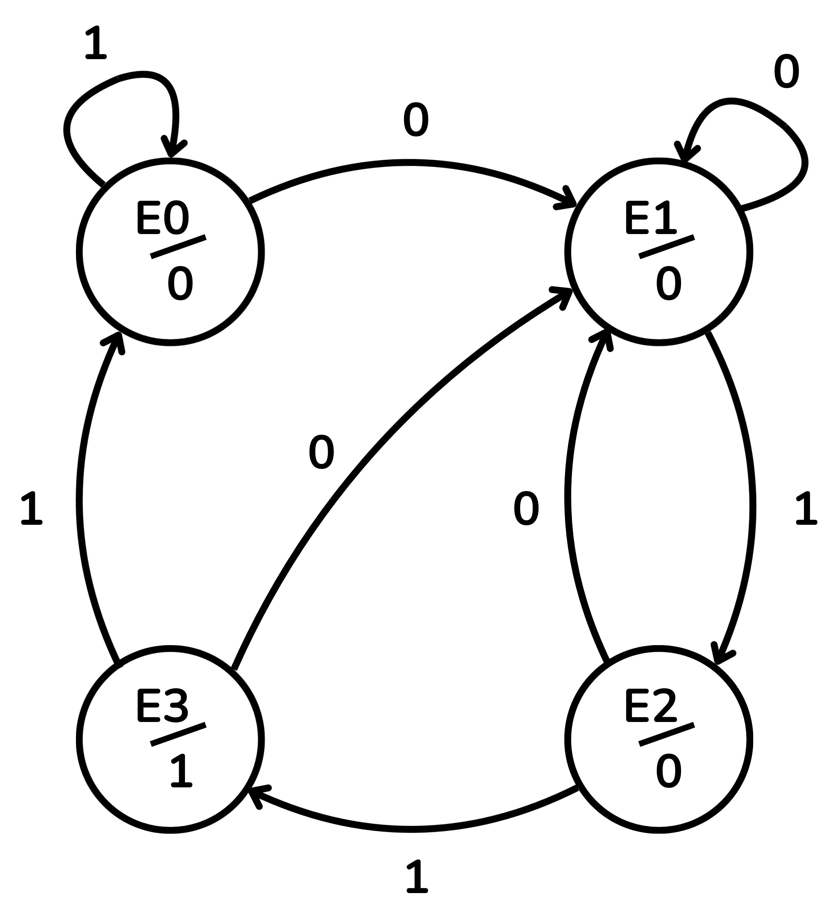
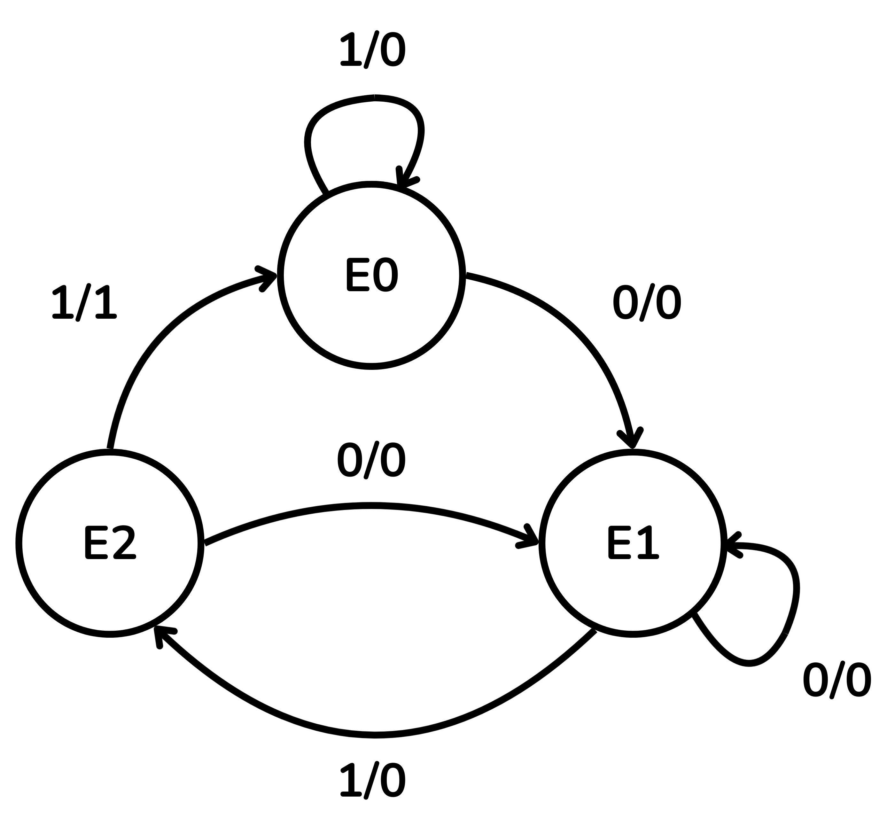
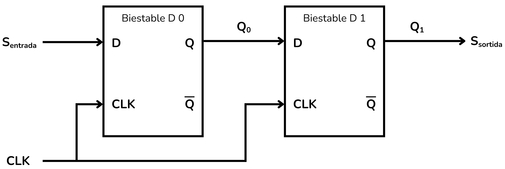
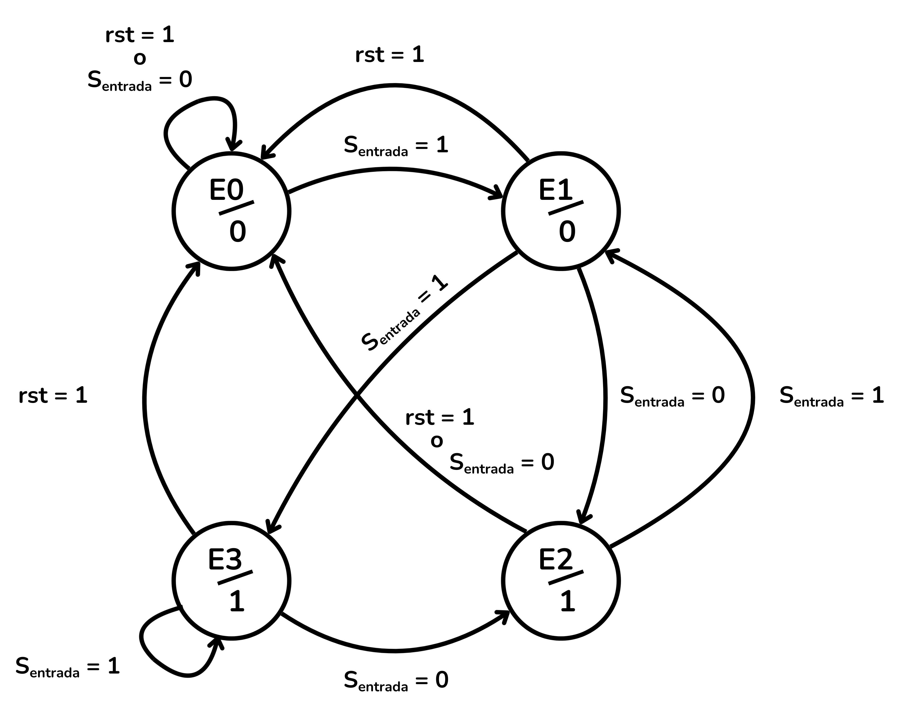
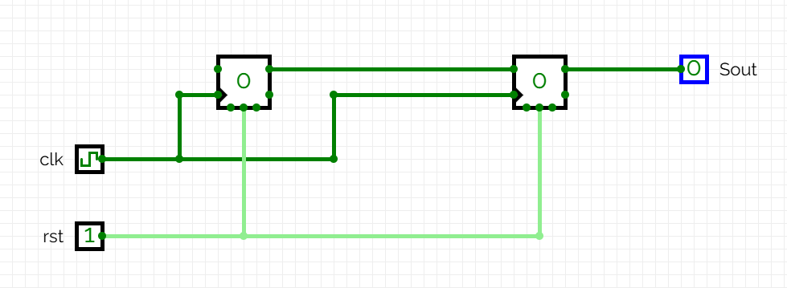
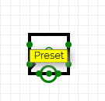
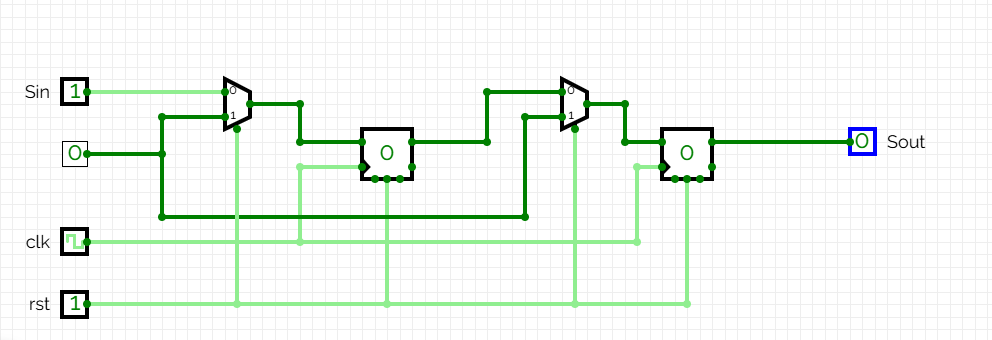
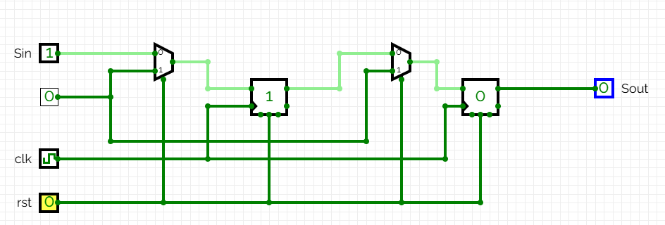
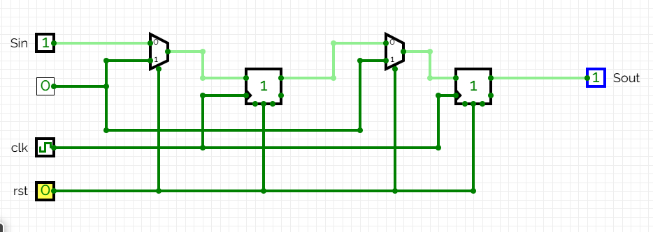

<!-- Posar aquesta imatge al començament de cada lliçó -->

 

# Màquines d'estats
Una màquina d’estats (en anglès *Finite State Machine* o *FSM*) és un model matemàtic que descriu un sistema que té un nombre finit d’estats i que canvia d’un estat a un altre en funció de l'estat actual, unes entrades i d'unes regles determinades. Un circuit seqüencial, amb la seva capacitat per guardar memòria, i que la seva sortida no només depèn de les entrades actuals, pot implementar una màquina d’estats.

Un circuit digital que implementa una màquina d’estats té les següents característiques:

+ El circuit té un conjunt finit d’estats possibles, que s’emmagatzemen en biestables.
+ Té un conjunt de senyals d’entrada. 
+ Les transicions d’un estat a l’altre s’implementen amb lògica combinacional (portes lògiques). Aquestes depenen de l'estat actual i dels senyals d'entrada.
+ El senyal de rellotge coordina l’actualització de l’estat del circuit.

Existeixen dos models principals de màquina d’estats, el **model de Moore** i el **model de Mealy**.

## Màquina de Moore
En una màquina de Moore **la sortida depèn únicament de l'estat actual**.

El comportament de les màquines d'estats es pot visualitzar amb un **diagrama d’estats**, que representa els estats de la màquina, les seves entrades i les seves sortides.

El diagrama d’estats d'una màquina de Moore representa:

+ Estats identificats amb cercles i amb noms com E0, E1, E2, E3…
+ Fletxes que indiquen el pas d’un estat a un altre.
+ Les entrades del circuit s’indiquen damunt les fletxes de canvi d’estat.
+ Les sortides s’indiquen també dins el cercle sota el nom de l’estat (Estat/Sortida).

<i>Diagrama d'estats d'una màquina de Moore</i>

La taula següent ens ajudarà a navegar per aquest exemple de diagrama d’estats. La primera columna representa l’estat actual de la màquina i la seva sortida corresponent. Quan el senyal de rellotge provoca un canvi d’estat, l’estat següent dependrà de l’entrada. Si $Entrada=0$ la màquina canviarà a l’estat de la segona  columna, si $Entrada=1$ canviarem a l’estat de la tercera columna.

<table>
  <thead>
    <tr>
      <th rowspan="2">Estat actual/Sortida</th>
      <th colspan="2">Estat Següent</th>
    </tr>
    <tr>
      <th>Entrada=0</th>
      <th>Entrada=1</th>
    </tr>
  </thead>
  <tbody>
    <tr>
      <td>E0 / 0</td>
      <td>E1</td>
      <td>E0</td>
    </tr>
    <tr>
      <td>E1 / 0</td>
      <td>E1</td>
      <td>E2</td>
    </tr>
    <tr>
      <td>E2 / 0</td>
      <td>E1</td>
      <td>E3</td>
    </tr>
    <tr>
      <td>E3 / 1</td>
      <td>E1</td>
      <td>E0</td>
    </tr>
  </tbody>
</table>

## Màquina de Mealy:

La màquina de Mealy és el model on la sortida depèn tant de l'estat actual com de les entrades actuals. Quan la màquina és en cert estat, la sortida pot canviar si l'entrada canvia, sense esperar al següent canvi d’estat. Això pot generar impulsos transitoris entre canvis d’estat. Una màquina de Mealy generalment requereix menys estats que una màquina de Moore per fer la mateixa tasca. El circuit digital que l'implementa requereix doncs menys biestables i menys lògica combinacional.

El diagrama d’estats d'una màquina de Mealy és com el següent:

+ Estats identificats amb cercles i amb noms com E0, E1, E2, E3…
+ Els canvis d’estat s’indiquen amb fletxes.
+ Les entrades i les sortides es representen junts al costat de les fletxes (entrada/sortida).

<i>Diagrama d'estats d'una màquina de Mealy</i>

La taula a continuació ens ajudarà a entendre el diagrama d’estats.
La primera columna representa l’estat actual de la màquina, la seva sortida també dependrà de l’entrada en aquell moment i es representa a les columnes segona i tercera. Només quan el senyal de rellotge ho indica, hi haurà un canvi, que ens durà a l’estat indicat a les columnes quarta i cinquena.

<table>
  <thead>
    <tr>
      <th rowspan="2">Estat actual</th>
      <th colspan="2">Sortida</th>
      <th colspan="2">Estat Següent</th>
    </tr>
    <tr>
      <th>Entrada=0</th>
      <th>Entrada=1</th>
      <th>Entrada=0</th>
      <th>Entrada=1</th>
    </tr>
  </thead>
  <tbody>
    <tr>
      <td>E0</td>
      <td>0</td>
      <td>0</td>
      <td>E1</td>
      <td>E0</td>
    </tr>
    <tr>
      <td>E1</td>
      <td>0</td>
      <td>0</td>
      <td>E1</td>
      <td>E2</td>
    </tr>
    <tr>
      <td>E2</td>
      <td>0</td>
      <td>1</td>
      <td>E1</td>
      <td>E0</td>
    </tr>

  </tbody>
</table>

Les màquines d'estats són fonamentals per dissenyar components lògics que necessiten seguir una seqüència o un protocol. S'utilitzen en:

+ Controladors de protocols de comunicació (SPI, I2C, UART).
+ Seqüenciadors de passos d'operacions complexes (com en una unitat de control de CPU).
+ Detectors de seqüències de bits o patrons.
+ Semàfors digitals o sistemes de control de trànsit.

## EXEMPLE: retardador (*delay line*) de 2 cicles.

En aquest exemple veurem un circuit capaç de llegir una seqüència binària concreta i replicar-la amb un retard de dos cicles, és a dir, dos senyals de rellotge. A l’inici de la seqüència, durant els dos cicles d’espera inicials, volem que la sortida sigui 0.

Prenem per exempla la següent seqüència inicial de nombres:

$S_{entrada}: 1,1,0,0,1,1,1,1,0,0,0,1,0,1 …$

Per tant, amb un retard de 2 cicles, la nostra seqüència de sortida serà la següent:

$S_{sortida}: 0,0,1,1,0,0,1,1,1,1,0,0,0,1,0,1 …$

Per causar un retard de dos cicles ens cal utilitzar dos biestables de tipus D connectats en sèrie com a la figura.

A cada pols de rellotge passarà el següent:
+ El valor que tenia el biestable 1 és llegit com a sortida $S_{sortida}$.
+ El valor que tenia el biestable 0 ($Q_0$) passa al biestable 1 ($Q_1$).
+ L’entrada $S_{entrada}$ es copia al Biestable 0.

D’aquesta manera, un senyal entrant per $S_{entrada}$ passarà per l'estructura i sortirà dos cicles més tard com a $S_{sortida}$.

Al fer servir dos biestables D la màquina té $2^2$ combinacions diferents, és a dir, 4 estats possibles que anomenarem $E0$,$E1$,$E2$ i $E3$:

|**Estat**|**[$Q_1$, $Q_0$]**| |
|------   |------            |------   |
|E0       |00    | Estat inicial (Buit)
|E1       |01    | L’últim bit que ha entrat a $Q_0$ és 1 el bit més antic $Q_1$ és 0
|E2       |10    | L’últim bit que ha entrat a $Q_0$ és 0 el bit més antic $Q_1$ és 1
|E3       |11    | Els dos darrers bits que han entrat són 1

La taula a continuació especifica els canvis d’estat possibles segons l’entrada $S_{entrada}$.

<table>
  <thead>
    <tr>
      <th rowspan="2">Estat actual</th>
      <th colspan="2">Estat Següent</th>
    </tr>
    <tr>
      <th>Sentrada=0</th>
      <th>Sentrada=1</th>
    </tr>
  </thead>
  <tbody>
    <tr>
      <td>00 (E0)</td>
      <td>00 (E0)</td>
      <td>01 (E1)</td>
    </tr>
    <tr>
      <td>01 (E1)</td>
      <td>10 (E2)</td>
      <td>11 (E3)</td>
    </tr>
    <tr>
      <td>10 (E2)</td>
      <td>00 (E0)</td>
      <td>01 (E1)</td>
    </tr>
    <tr>
      <td>11 (E3)</td>
      <td>10 (E2)</td>
      <td>11 (E3)</td>
    </tr>
  </tbody>
</table>

A aquest circuit li afegirem més endavant un senyal de reinici $rst$ (*reset*) que retorni tot el circuit a zero. Si $rst=1$ els dos biestables seran reiniciats a 0, situant-nos a l’estat inicial $E0$. Si $rst=0$, el passatge de bits queda inalterat.

El diagrama d’estats queda així definit.

<i>Diagrama d'estats del delay line de 2 cicles, incloent un senyal de reinici rst</i>

Veient que la sortida $S_{sortida}$ depèn únicament de l’estat on ens trobem, podem afirmar que aquest circuit **és una màquina de Moore**.

Una vegada fet el diagrama d’estats, passem a muntar el circuit a [CircuitVerse](https://circuitverse.org/simulator). Muntem els dos biestables D en sèrie compartint el mateix senyal de rellotge i el mateix senyal de reinici (*rst*).

En els exercicis de Jutge els senyals de reinici són sempre síncrons, per tant, així ho farem en aquest exemple, connectant els dos biestables al mateix *reset* síncron. 

Cal connectar doncs el senyal *rst* a l’entrada *Preset* del biestable D i no a l'entrada *Asynchronous reset* (reinici asíncron). 

    
    

Per tal d’inicialitzar els valors dels biestables a 0 cal afegir multiplexors on el senyal selector sigui el senyal de reinici *rst*:

El primer multiplexor tindrà com a entrades el senyal d’entrada $S_{entrada}$ i una constant 0. La seva sortida estarà connectada a l’entrada $D$ del primer biestable.

El segon multiplexor tindrà com a entrades la sortida $Q$ del primer biestable i la mateixa constant 0. La seva sortida estarà connectada a l’entrada $D$ del segon biestable.

Comprovarem el seu funcionament amb una seqüència inicial d'exemple:

$S_{entrada}$: 1, 1, 1, ··· 

Després d'un reinici *rst=1*, tots els biestables es troben a $0$. Ens trobem doncs en l’estat inicial $E0$. El valor inicial de $S_{sortida}$ és $0$.

A partir d'ara fixem $rst=0$ per permetre al circuit evolucionar.

En el **primer flanc de rellotge** el valor de $S_{entrada}=1$ es carrega al primer biestable. L’estat 0 del primer biestable passa al segon biestable i $S_{sortida}$ continua tenint un valor de 0. Hem passat doncs a l'estat $E1$.

En el **segon flanc de rellotge**, el valor de $S_{entrada}=1$ es carrega al primer biestable, el valor del primer biestable 1 es carrega al segon biestable i per tant $S_{sortida}=1$. Ens trobem a l'estat $E2$.

En aquest punt del procés, el primer valor de $S_{entrada}$ s'ha traslladat des de l'entrada fins a la sortida passant pels dos biestables. Els dos valors següents estan carregats als biestables i els senyals de rellotge successius els aniràn traslladant cap a la sortida.
Aquest circuit implementa doncs una cua entre $S_{entrada}$ i $S_{sortida}$ que el senyal d'entrada triga dos cicles en travessar.

En aquests dos primers senyals de rellotge, les seqüències d'entrada i de sortida han implementat efectivament un retard de dos cicles:

$S_{entrada}$: 1, 1, 1, ··· 

$S_{sortida}$: 0, 0, 1, ··· 

## Exercicis a Jutge.org: [Introduction to Digital Circuit Design](https://jutge.org/courses/JordiCortadella:IntroCircuits)

[Last two equal](https://jutge.org/problems/X71700_en)

[Delayed sequence](https://jutge.org/problems/X32741_en)

[Even number of 0's and 1's](https://jutge.org/problems/X02999_en)

[Circuit from state diagram](https://jutge.org/problems/X76378_en)

[Sequence 110](https://jutge.org/problems/X02122_en)

[Recognizing sequences](https://jutge.org/problems/X49909_en)

[Is it divisible by 3?](https://jutge.org/problems/X80381_en)

[Simple state machine](https://jutge.org/problems/X78930_en)

[Traffic-light controller](https://jutge.org/problems/X88681_en)

[Vending machine](https://jutge.org/problems/X77254_en)

<small>*Recorda que per accedir als exercicis i que el **Jutge** valori les teves solucions has d'estar inscrit al [curs](https://jutge.org/courses/JordiCortadella:IntroCircuits)*. Troba totes les instruccions [aqui](../Inici/instruccions.md)</small>

<!-- Aquesta imatge ha d'anar al final de cada lliçó, ja sigui amb aquesta línia o dins la signatura. Deixar comentat si ja està a la signatura-->
 
 

<Autors autors="xcasas fmadrid"/>