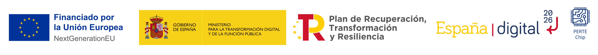

<!-- Posar aquesta imatge al començament de cada lliçó -->

 

# Miscel·lània

La secció [Miscellaneous](https://jutge.org/courses/JordiCortadella:IntroCircuits/lists/JordiCortadella:Sequential) del curs [Introduction to Digital Circuit Design](https://jutge.org/courses/JordiCortadella:IntroCircuits/lists/JordiCortadella:Sequential) inclou diferents exercicis relacionats amb els temes tractats fins ara. Poden ser més complicats que els que hem vist fins ara. T'hi animes?. 

## Exercicis a Jutge.org: [Introduction to Digital Circuit Design](https://jutge.org/courses/JordiCortadella:IntroCircuits)

- [Fibonacci](https://jutge.org/problems/X95484_en)
- [Greatest Common Divisor](https://jutge.org/problems/X64579_en)
- [FIFO](https://jutge.org/problems/X67970_en)

<small>*Recorda que per accedir als exercicis i perquè el **Jutge** valori les teves solucions has d'estar inscrit al [curs](https://jutge.org/courses/JordiCortadella:IntroCircuits). Trobaràs totes les instruccions [aquí](../Inici/instruccions.md).* </small>

<!-- Aquesta imatge ha d'anar al final de cada lliçó, ja sigui amb aquesta línia o dins la signatura. Deixar comentat si ja està a la signatura-->
  
<Autors autors="xcasas fmadrid"/>