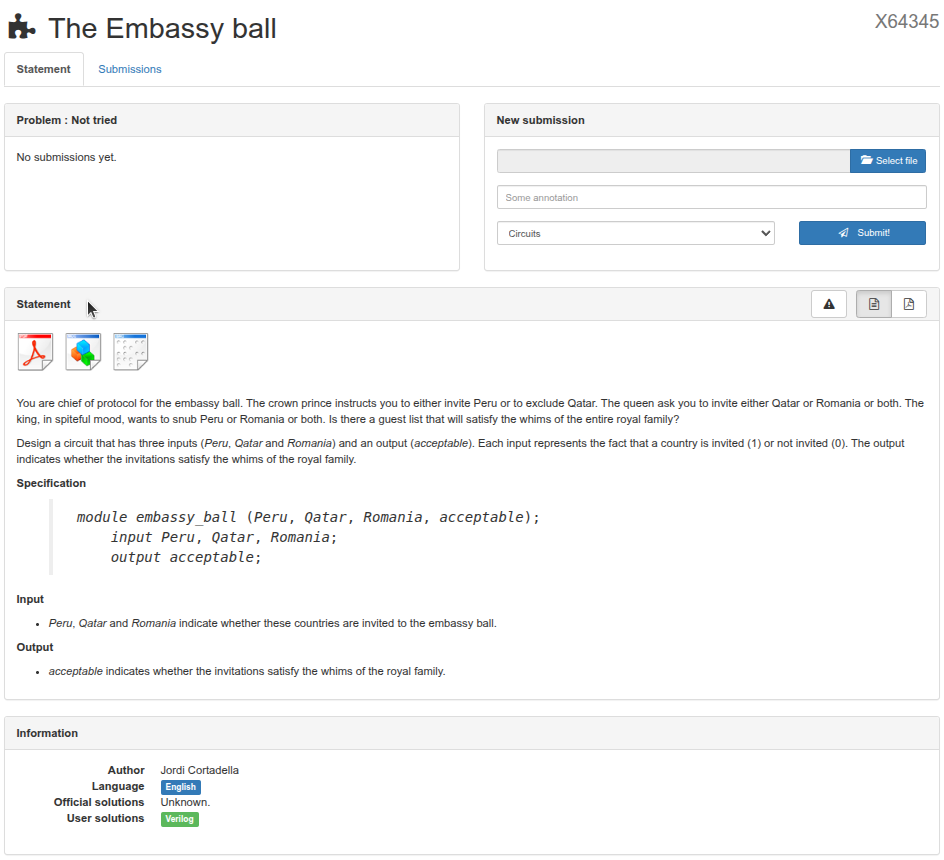

<!-- Posar aquesta imatge al començament de cada lliçó -->

 

# Instruccions

## **Com seguir les lliçons**
Al menú lateral d'aqui a l'esquerra trobaràs totes les lliçons que conformen aquest recurs educatiu.
Ja pots començar per la la primera lliçó, l'introducció als circuits digitals, a l'àlgebra de Boole i als mapes de Karnaugh.

La resta de lliçons estan dedicades als diferents tipus de circuits digitals, contenen la teoria i un o dos exemples. A més, al final de cada lliçó et proposem fer alguns exercicis del curs [Introduction to Digital Circuit Design](https://jutge.org/courses/JordiCortadella:IntroCircuits), dins de [jutge.org](https://jutge.org).

Troba tot seguit les instruccions per solucionar els problemes i sotmetre'ls al veredicte del nostre Jutge. Revisa-les quan les necessitis.

## Inscripció a Jutge.org i al curs

Per poder accedir als exercicis proposats t'hauràs de registrar **gratuïtament** a la plataforma [jutge.org](https://jutge.org).

Recorda que jutge.org és una plataforma docent de la UPC. El registre d'usuari és per fer el seguiment del teu progrés en els exercicis. No tenim cap interès comercial ni recopilem dades personals.

Un cop tinguis accés als recursos de jutge.org, et pots incriure al curs [Introduction to Digital Circuit Design](https://jutge.org/courses/JordiCortadella:IntroCircuits) des de la secció [Courses](https://jutge.org/courses) i clicant el botó "Enroll this course". 

 

Dins d'aquest curs trobaràs els enunciats dels exercicis. També podràs enviar les teves solucions al **Jutge**, que valorarà la seva validesa i emetrà un veredicte.

## Com presentar la teva solució a un exercici

Pots accedir a cadascun dels exercicis des del menú superior del portal, ja sigui directament al [curs](https://jutge.org/courses/JordiCortadella:IntroCircuits) o des de l'apartat [Problems](https://jutge.org/problems).

 

Els exercicis estan ordenats per temes i cadascun té un codi identificatiu únic.

També pots accedir als exercicis directament des de les lliçons a partir dels enllaços que hi trobaràs. Aquesta és una alternativa més ràpida, però recorda que primer has d'haver obert la sessió a **jutge.org**.

La  pàgina de l'exercici és com la següent:

Hi trobaràs l'**enunciat** (*Statement*) que descriu l’exercici, aquest enunciat es pot descarregar en PDF o ZIP.
També s'hi inclou una **especificació** (*Specification*) que descriu les entrades i sortides que ha de tenir el circuit.
El menú *New Submission* és per presentar la teva solució a l'exercici.

Una vegada entès l’exercici hauràs de solucionar-lo utilitzant els coneixements que has après a la lliçó.

Per **crear una solució** farem servir [CircuitVerse](https://circuitverse.org/simulator), una plataforma gratuïta i de codi obert dissenyada per crear i simular circuits lògics digitals en línia.
Amb aquesta eina **dibuixarem el nostre circuit i l'exportarem** per presentar-lo a Jutge.

A CircuitVerse pots arrossegar portes lògiques al teu circuit, connectar-les i provar la taula de veritat. 

**Exporta el circuit** des de CircuitVerse en format Verilog. Ves al menú d'eines i tria l'opció "Exportar Verilog" per descarregar un fitxer de codi Verilog ".v".

*Verilog* és un llenguatge de descripció de hardware (*HDL - Hardware Description Language*, per les sigles en anglès) que s'utilitza per descriure circuits electrònics digitals com microprocessadors o components lògics.

**Presenta el teu exercici al Jutge**. Puja el fitxer que acabes de generar dins l'àrea ***New submission*** de l'exercici.

Clicant el botó *Submit*, el Jutge analitzarà el teu arxiu.

Acabat el procés, podràs veure el **veredicte i la correcció de Jutge**. Tant si ha anat be com malament.

Si el veredicte és desfavorable, la secció *hint* mostra pistes del que pot haver anat malament.

Si la teva solució és correcta també se't mostrarà el circuit solució a la secció *Circuit modules*.
La secció *Program* mostra el codi Verilog del circuit que has presentat.

**Pots tornar-ho a provar** tantes vegades com calgui. A la finestra de *Submission* s'anotaran el nombre total d'arxius i correccions. Podràs visualitzar-los clicant al número de submission (S001,S002…)

El nostre Jutge té diferents veredictes en funció de del circuit presentat codi enviat. Els més habituals són els següents:

A Jutge.org pots trobar la [llista completa de veredictes](http://jutge.org/documentation/verdicts/all) amb una descripció del seu significat.

<!-- Aquesta imatge ha d'anar al final de cada lliçó, ja sigui amb aquesta línia o dins la signatura. Deixar comentat si ja està a la signatura-->
 
 

<Autors autors="xcasas fmadrid"/>
