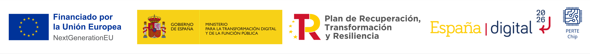

<!-- Posar aquesta imatge al començament de cada lliçó -->

 

## Benvinguts/des a les lliçons de circuits digitals de [jutge.org](https://jutge.org)

Aquest recurs educatiu s’adreça a tot l’alumnat preuniversitari interessat a aprendre les bases del disseny de circuits digitals.

El contingut s’estructura com a suport teòric del curs [*Introduction to Digital Circuit Design*](https://jutge.org/courses/JordiCortadella:IntroCircuits), que proposa una sèrie d’exercicis.
L’accés a les lliçons és lliure, però per fer els exercicis t’hauràs de registrar **gratuïtament** a la plataforma [jutge.org](https://jutge.org).

[jutge.org](https://jutge.org) és una plataforma docent desenvolupada per la Universitat Politècnica de Catalunya (UPC). El registre d’usuari té com a única finalitat el seguiment del progrés en els exercicis didàctics, i no respon a cap interès comercial ni a la recopilació de dades personals.

[jutge.org](https://jutge.org) ofereix altres [lliçons](https://lliçons.jutge.org/) que introdueixen coneixements bàsics de programació en diversos llenguatges, a més d'**aquest** curs sobre circuits digitals.

<!-- Aquesta imatge ha d'anar al final de cada lliçó, ja sigui amb aquesta línia o dins la signatura. Deixar comentat si ja està a la signatura-->
  

<Autors autors="xcasas fmadrid"/>