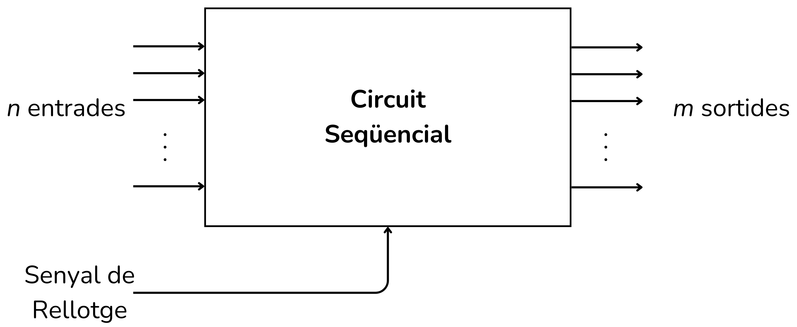

<!-- Posar aquesta imatge al començament de cada lliçó -->

 

# Introducció als circuits digitals

En aquestes lliçons aprendràs què són els circuits digitals i els seus diferents tipus. Hi trobaràs exemples per a entendre els circuits combinacionals, els circuits seqüencials i els circuits aritmètics.

Els **circuits digitals** processen informació representada en format binari, que utilitza només dos estats electrics: voltatge baix i voltatge alt, representant els 0 i els 1 de la informació binària. Els components fonamentals dels circuits digitals són les portes lògiques. Aquestes són la base dels microprocessadors, memòries, controladors i qualsevol circuit digital complex.

Les **portes lògiques** són petits circuits que efectuen operacions lògiques bàsiques sobre un o més senyals binaris d'entrada, produint un únic senyal binari de sortida. Per utilitzar les portes lògiques i crear circuis digitals cal conèixer els conceptes d'àlgebra de Boole i les taules de veritat. En molts exemples i exercicis de circuits digitals utilitzarem les taules de veritat o una expressió booleana per descriure el comportament lògic d’un circuit. 

|**Porta lògica**|**Símbol**                           |**Expressió Lògica**       |**Descripció**
|------ |------                                        |:---:                      |------
|Buffer |   |$A$                        |Retorna el mateix bit
|NOT    |      |$\bar{A}$                  |Inverteix el bit
|AND    |      |$A·B$                      |1 si les dues entrades són 1
|OR     |       |$A+B$                      |1 si almenys una entrada és 1
|NAND   |     |$\overline{A·B}$           |AND invertit (combinació d'AND i NOT)
|NOR    |      |$\overline{A+B}$           |OR invertit (combinació d'OR i NOT)
|XOR    |      |$A·\bar{B}+\bar{A}·B$      |1 si les entrades són diferents
|XNOR   |     |$(A·B)+(\bar{A}·\bar{B})$  |1 si les entrades són iguals

<!-- Imatges de ( https://en.wikipedia.org/wiki/Logic_gate) resum, notes o total.*/-->

Una **expressió lògica** és una expressió que defineix una sortida booleana a partir d’un conjunt de variables d’entrada binàries (0 o 1). Per descriure aquesta relació s’utilitzen operacions lògiques com AND, OR i NOT.

Una **taula de veritat** mostra totes les possibles combinacions d’entrades d’un circuit lògic o funció booleana i el resultat corresponent a la sortida per cadascuna d’aquestes combinacions.

Un [**circuit combinacional**](../CircCombin/intro) és un tipus de circuit digital en el qual el valor de la seva sortida en un instant depèn únicament dels valors actuals de les seves entrades. Construïts únicament amb portes lògiques simples, no tenen retroalimentació ni memòria. El seu comportament es pot descriure amb taules de veritat i funcions booleanes.

<i>Circuit combinacional</i>

Els [circuits aritmètics](../CircAritm/intro.md) són una important subclasse dels circuits digitals combinacionals. La seva funció és efectuar operacions matemàtiques bàsiques amb nombres binaris.

<i>Aquest exemple és un circuit aritmètic sumador</i>

Els [circuits seqüencials](../CircSeq/intro.md) són un tipus de circuit digital que, a diferència dels circuits combinacionals o aritmètics, estan retroalimentats i tenen memòria. És a dir, la seva sortida no només depèn dels valors actuals de les entrades sinó també del seu estat previ o historial d’entrades. Molts d’ells utilitzen un rellotge (senyal de pols) pels canvis de memòria.

<i>Circuit seqüencial</i>

La lliçó [Tiny Micro](../TinyMicro/intro.md) és un recull d’exercicis avançats sobre l'operació d'un petit ordinador. Hi ha exercicis de disseny d’una Unitat Aritmètica Lògica **UAL** (Aritmetic Logic Unit **ALU**), de programació de la unitat de control, creació d’un datapath i el disseny d’un program counter.

<!-- Aquesta imatge ha d'anar al final de cada lliçó, ja sigui amb aquesta línia o dins la signatura. Deixar comentat si ja està a la signatura-->
 
 

<Autors autors="xcasas fmadrid jordic"/>
