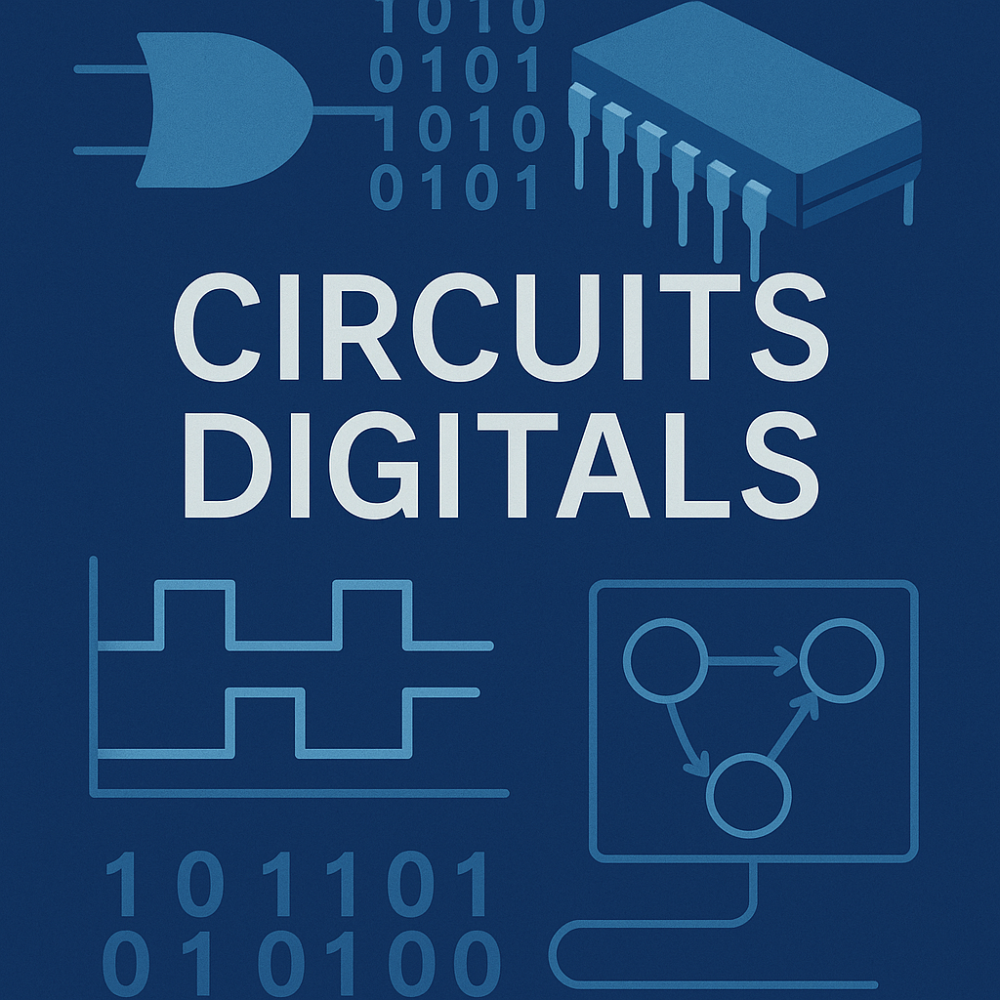
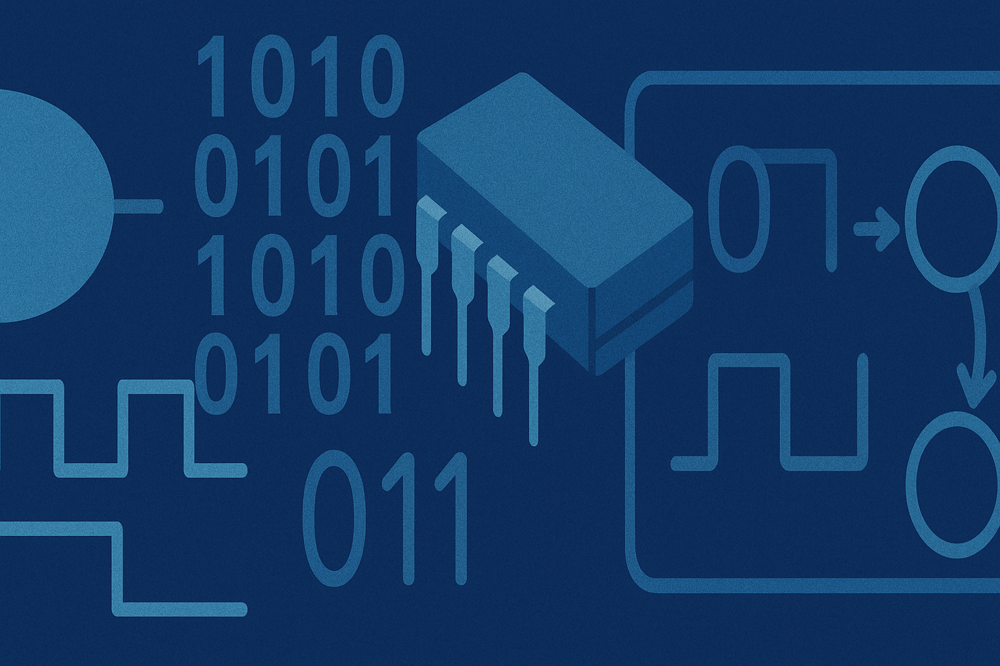

<!-- Posar aquesta imatge al començament de cada lliçó -->

<!--

  
-->

# Introducció als circuits digitals

En contrucció.

Ara mateix m'estan redactant amb molta cura i esforç a Càtedra Chip UPC.

En breu seré una bona lliçó de circuits digitals.

Equacions:

Com escriure equacions en Latex $\phi = \frac{1 + \sqrt{5}}{2}$

$$S
E = mc^2
$$

<!-- Aquesta imatge ha d'anar al final de cada lliçó, ja sigui amb aquesta línia o dins la signatura. Deixar comentat si ja està a la signatura

 -->

##
<Autors autors="jpetit"/>
