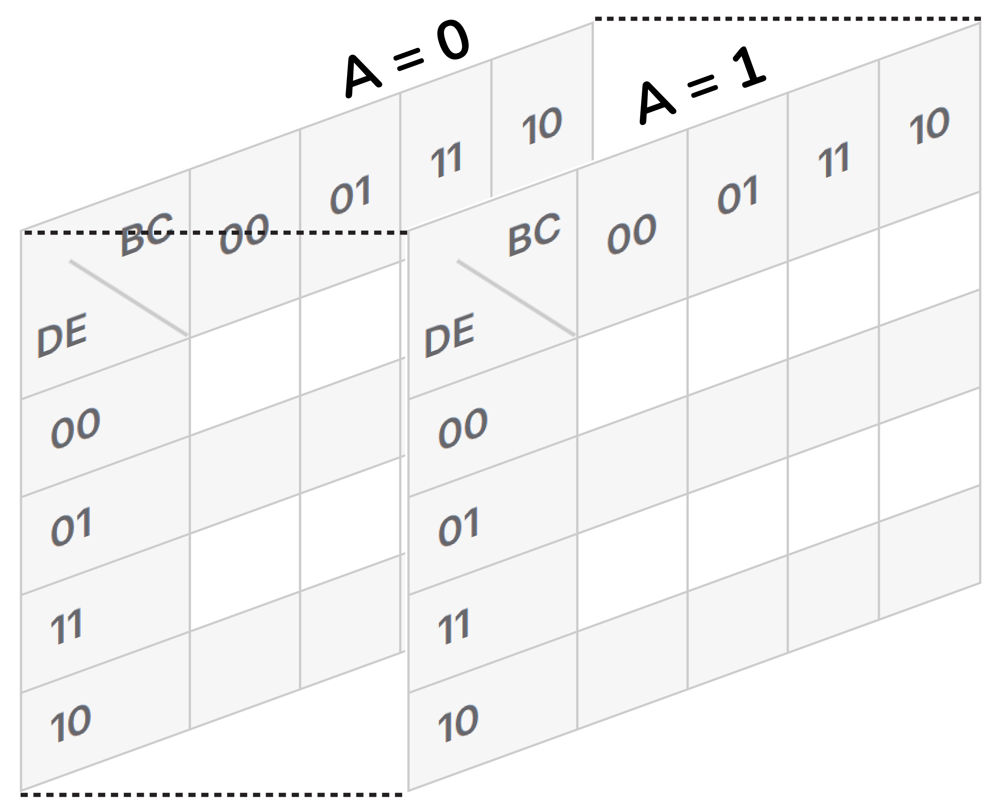

<!-- Posar aquesta imatge al començament de cada lliçó -->

 

# Introducció als Mapes de Karnaugh

Un mapa de Karnaugh (també conegut com a K-map o diagrama de Veitch) és una eina gràfica utilitzada en electrònica digital per simplificar funcions lògiques booleanes de manera visual i sistemàtica. 

L'objectiu principal és trobar l'expressió booleana més simple possible per a una funció lògica determinada. Una funció lògica més simple es tradueix directament en un circuit digital més senzill.

Es tracta d’un mètode alternatiu a la simplificació amb les lleis de l'àlgebra de Boole, és vàlid per a qualsevol nombre de variables. Resulta més pràctic i intuitiu per a poques variables, típicament de 2 a 4. Pot resultar pràctic per a funcions de fins a 6 variables, més enllà d'aquest nombre ja deixa de ser pràctic. 

Un mapa de Karnaugh és una graella que organitza totes les possibles combinacions de les variables d’entrada d’una funció booleana. Cada cel·la representa una combinació de les variables d'entrada de la funció, és a dir, una fila de la taula de la veritat.

Aquest mapa s’ha d’ordenar de manera que entre dues cel·les adjacents verticalment o horitzontalment, canviï el valor d'una única variable. Això facilita identificar patrons i fer agrupacions per reduïr l’expressió lògica.

## Exemple

Vegem la següent taula de veritat d'un circuit digital hipotètic. Aquesta representa les variables d’entrada $A$, $B$ i $C$ i la sortida $S$.

<i>Taula de veritat</i>
<!--
|**$A$**|**$B$**|**$C$**|**$S$**
|------    |------    |------   |------
|0|0|0|1|
|0|0|1|0|
|0|1|0|1|
|0|1|1|1|
|1|0|0|1|
|1|0|1|1|
|1|1|0|1|
|1|1|1|1|
-->

<table style="border-collapse: collapse; text-align: center;">
  <thead>
    <tr>
      <th style="border: 1px solid #ccc; padding: 5px 10px;">A</th>
      <th style="border: 1px solid #ccc; padding: 5px 10px;">B</th>
      <th style="border: 1px solid #ccc; padding: 5px 10px;">C</th>
      <th style="border: 1px solid #ccc; padding: 5px 10px;">S</th>
    </tr>
  </thead>
  <tbody>
    <tr>
      <td style="border: 1px solid #ccc; padding: 5px 10px;">0</td>
      <td style="border: 1px solid #ccc; padding: 5px 10px;">0</td>
      <td style="border: 1px solid #ccc; padding: 5px 10px;">0</td>
      <td style="border: 1px solid #ccc; padding: 5px 10px;">1</td>
    </tr>
    <tr>
      <td style="border: 1px solid #ccc; padding: 5px 10px;">0</td>
      <td style="border: 1px solid #ccc; padding: 5px 10px;">0</td>
      <td style="border: 1px solid #ccc; padding: 5px 10px;">1</td>
      <td style="border: 1px solid #ccc; padding: 5px 10px;">0</td>
    </tr>
    <tr>
      <td style="border: 1px solid #ccc; padding: 5px 10px;">0</td>
      <td style="border: 1px solid #ccc; padding: 5px 10px;">1</td>
      <td style="border: 1px solid #ccc; padding: 5px 10px;">0</td>
      <td style="border: 1px solid #ccc; padding: 5px 10px;">1</td>
    </tr>
    <tr>
      <td style="border: 1px solid #ccc; padding: 5px 10px;">0</td>
      <td style="border: 1px solid #ccc; padding: 5px 10px;">1</td>
      <td style="border: 1px solid #ccc; padding: 5px 10px;">1</td>
      <td style="border: 1px solid #ccc; padding: 5px 10px;">1</td>
    </tr>
    <tr>
      <td style="border: 1px solid #ccc; padding: 5px 10px;">1</td>
      <td style="border: 1px solid #ccc; padding: 5px 10px;">0</td>
      <td style="border: 1px solid #ccc; padding: 5px 10px;">0</td>
      <td style="border: 1px solid #ccc; padding: 5px 10px;">1</td>
    </tr>
    <tr>
      <td style="border: 1px solid #ccc; padding: 5px 10px;">1</td>
      <td style="border: 1px solid #ccc; padding: 5px 10px;">0</td>
      <td style="border: 1px solid #ccc; padding: 5px 10px;">1</td>
      <td style="border: 1px solid #ccc; padding: 5px 10px;">1</td>
    </tr>
    <tr>
      <td style="border: 1px solid #ccc; padding: 5px 10px;">1</td>
      <td style="border: 1px solid #ccc; padding: 5px 10px;">1</td>
      <td style="border: 1px solid #ccc; padding: 5px 10px;">0</td>
      <td style="border: 1px solid #ccc; padding: 5px 10px;">1</td>
    </tr>
    <tr>
      <td style="border: 1px solid #ccc; padding: 5px 10px;">1</td>
      <td style="border: 1px solid #ccc; padding: 5px 10px;">1</td>
      <td style="border: 1px solid #ccc; padding: 5px 10px;">1</td>
      <td style="border: 1px solid #ccc; padding: 5px 10px;">1</td>
    </tr>
  </tbody>
</table>

El mapa de Karnaugh resultant, agrupant les variables B i C, és el següent:

<!-- 
<i>Mapa de Karnaugh</i>

|           |**$BC=00$**|**$BC=01$**|**$BC=11$**|**$BC=10$**
|------     |------     |------     |------     |------
|**$A=0$**  |1|0|1|1|
|**$A=1$**  |1|1|1|1|
 -->
<table style="border-collapse: collapse; text-align: center;">
  <thead>
    <tr>
      <th style="border: 1px solid #ccc; position: relative; width: 60px; height: 60px;">
        
    

        
  

      </th>
      <th style="border: 1px solid #ccc; padding: 5px 10px;">BC=00</th>
      <th style="border: 1px solid #ccc; padding: 5px 10px;">BC=01</th>
      <th style="border: 1px solid #ccc; padding: 5px 10px;">BC=11</th>
      <th style="border: 1px solid #ccc; padding: 5px 10px;">BC=10</th>
    </tr>
  </thead>
  <tbody>
    <tr>
      <th style="border: 1px solid #ccc; padding: 5px 10px;">A=0</th>
      <td style="border: 1px solid #ccc; padding: 5px 10px;">1</td>
      <td style="border: 1px solid #ccc; padding: 5px 10px;">0</td>
      <td style="border: 1px solid #ccc; padding: 5px 10px;">1</td>
      <td style="border: 1px solid #ccc; padding: 5px 10px;">1</td>
    </tr>
    <tr>
      <th style="border: 1px solid #ccc; padding: 5px 10px;">A=1</th>
      <td style="border: 1px solid #ccc; padding: 5px 10px;">1</td>
      <td style="border: 1px solid #ccc; padding: 5px 10px;">1</td>
      <td style="border: 1px solid #ccc; padding: 5px 10px;">1</td>
      <td style="border: 1px solid #ccc; padding: 5px 10px;">1</td>
    </tr>
  </tbody>
</table>

Els valors de cada cel·la són els valors que pren la sortida $S$ en funció de $A$, $B$ i $C$.

## Regles per al Mapa de Karnaugh

### **Codi Gray:**
Les files i columnes del mapa no s'ordenen de manera convencional (00, 01, 10, 11), sinó que segueixen el codi Gray (00, 01, 11, 10). 
És a dir, entre dues cel·les adjacents (verticalment o horitzontalment) només canvia el valor d'una única variable.

### **Omplir la taula:**
Cal omplir la taula amb els resultats de la variable de sortida corresponents a la combinació de valors d'entrada de cada cel.la.

### **Agrupar els '1' ajacents:**
L'objectiu és fer els grups tan extensos com sigui possible.
* S'agrupen els '1' adjacents en forma de fila, quadrat o rectangle.
* La mida dels grups ha de ser una potència de dos. És a dir 1, 2, 4, 8, etc...
* S'han d'anar fent grups fins que tots els '1' de la taula formin part d'almenys un d'ells.
* Les vores del mapa es consideren adjacents amb la vora oposada, com si el mapa s'extengués repetint-se més enllà de les vores.

### **Obtenció de l'expressió lògica simplificada:**
Cada grup de '1's es tradueix en un terme de la funció booleana simplificada. Per fer-ho, s'observen quines variables no canvien de valor dins del grup, aquestes formaràn part del terme de l'expressió. Les variables que canvien de valor dins del grup no apareixeran a l'expressió.

## Estructures per a mapes de Karnaugh de 2 a 5 variables

A continuació es mostren les estructures dels mapes de Karnaugh per diferents nombres de variables d'entrada. Les taules més comuns solen ser les de 2 a 4 variables d'entrada, però es poden utilitzar per a funcions de fins a 5 o 6 variables.

### Mapa de Karnaugh de 2 variables d'entrada

<!-- Taula de 2 variables -->
<table style="border-collapse: collapse; text-align: center;">
  <thead>
    <tr>
      <th style="border: 1px solid #ccc; position: relative; width: 60px; height: 60px;">
        
   A 

        
 B 

        

      </th>
      <th style="border: 1px solid #ccc; padding: 5px 10px;">0</th>
      <th style="border: 1px solid #ccc; padding: 5px 10px;">1</th>
    </tr>
  </thead>
  <tbody>
    <tr>
      <th style="border: 1px solid #ccc; padding: 5px 10px;">0</th>
      <td style="border: 1px solid #ccc; padding: 5px 10px;"> </td>
      <td style="border: 1px solid #ccc; padding: 5px 10px;"> </td>
    </tr>
    <tr>
      <th style="border: 1px solid #ccc; padding: 5px 10px;">1</th>
      <td style="border: 1px solid #ccc; padding: 5px 10px;"> </td>
      <td style="border: 1px solid #ccc; padding: 5px 10px;"> </td>
    </tr>
  </tbody>
</table>

### Mapa de Karnaugh de 3 variables d'entrada

En aquest cas, les variables es poden agrupar de diferents maneres; $A\backslash BC$ (exemple anterior), $B\backslash AC$  o $C\backslash AB$ (aquest exemple). En qualsevol cas, el mapa de valors és el mateix (Codi Gray).

<!-- Taula de 3 variables -->
<table style="border-collapse: collapse; text-align: center;">
  <thead>
    <tr>
      <th style="border: 1px solid #ccc; position: relative; width: 60px; height: 60px;">
        
   AB 

        
 C 

        

      </th>
      <th style="border: 1px solid #ccc; padding: 5px 10px;">00</th>
      <th style="border: 1px solid #ccc; padding: 5px 10px;">01</th>
      <th style="border: 1px solid #ccc; padding: 5px 10px;">11</th>
      <th style="border: 1px solid #ccc; padding: 5px 10px;">10</th>
    </tr>
  </thead>
  <tbody>
    <tr>
      <th style="border: 1px solid #ccc; padding: 5px 10px;">0</th>
      <td style="border: 1px solid #ccc; padding: 5px 10px;"> </td>
      <td style="border: 1px solid #ccc; padding: 5px 10px;"> </td>
      <td style="border: 1px solid #ccc; padding: 5px 10px;"> </td>
      <td style="border: 1px solid #ccc; padding: 5px 10px;"> </td>
    </tr>
    <tr>
      <th style="border: 1px solid #ccc; padding: 5px 10px;">1</th>
      <td style="border: 1px solid #ccc; padding: 5px 10px;"> </td>
      <td style="border: 1px solid #ccc; padding: 5px 10px;"> </td>
      <td style="border: 1px solid #ccc; padding: 5px 10px;"> </td>
      <td style="border: 1px solid #ccc; padding: 5px 10px;"> </td>
    </tr>
  </tbody>
</table>

### Mapa de Karnaugh de 4 variables d'entrada

El mapa de valors és invariable, l'agrupament de les variables $A$, $B$, $C$ i $D$ es pot fer com convingui en cada cas.

<!-- Taula de 4 variables -->
<table style="border-collapse: collapse; text-align: center;">
  <thead>
    <tr>
      <th style="border: 1px solid #ccc; position: relative; width: 60px; height: 60px;">
        
   AB 

        
 CD 

        

      </th>
      <th style="border: 1px solid #ccc; padding: 5px 10px;">00</th>
      <th style="border: 1px solid #ccc; padding: 5px 10px;">01</th>
      <th style="border: 1px solid #ccc; padding: 5px 10px;">11</th>
      <th style="border: 1px solid #ccc; padding: 5px 10px;">10</th>
    </tr>
  </thead>
  <tbody>
    <tr>
      <th style="border: 1px solid #ccc; padding: 5px 10px;">00</th>
      <td style="border: 1px solid #ccc; padding: 5px 10px;"> </td>
      <td style="border: 1px solid #ccc; padding: 5px 10px;"> </td>
      <td style="border: 1px solid #ccc; padding: 5px 10px;"> </td>
      <td style="border: 1px solid #ccc; padding: 5px 10px;"> </td>
    </tr>
    <tr>
      <th style="border: 1px solid #ccc; padding: 5px 10px;">01</th>
      <td style="border: 1px solid #ccc; padding: 5px 10px;"> </td>
      <td style="border: 1px solid #ccc; padding: 5px 10px;"> </td>
      <td style="border: 1px solid #ccc; padding: 5px 10px;"> </td>
      <td style="border: 1px solid #ccc; padding: 5px 10px;"> </td>
    </tr>
    <tr>
      <th style="border: 1px solid #ccc; padding: 5px 10px;">11</th>
      <td style="border: 1px solid #ccc; padding: 5px 10px;"> </td>
      <td style="border: 1px solid #ccc; padding: 5px 10px;"> </td>
      <td style="border: 1px solid #ccc; padding: 5px 10px;"> </td>
      <td style="border: 1px solid #ccc; padding: 5px 10px;"> </td>
    </tr>
    <tr>
      <th style="border: 1px solid #ccc; padding: 5px 10px;">10</th>
      <td style="border: 1px solid #ccc; padding: 5px 10px;"> </td>
      <td style="border: 1px solid #ccc; padding: 5px 10px;"> </td>
      <td style="border: 1px solid #ccc; padding: 5px 10px;"> </td>
      <td style="border: 1px solid #ccc; padding: 5px 10px;"> </td>
    </tr>
  </tbody>
</table>

### Mapa de Karnaugh de 5 variables d'entrada

Fent servir el codi Gray (És a dir, entre dues cel·les adjacents (verticalment o horitzontalment) només canvia el valor d'una única variable), el mapa de Karnaugh de 5 variables s'estructura de la manera següent:

<!-- Taula de 5 variables -->
<table style="border-collapse: collapse; text-align: center;">
  <thead>
    <tr>
      <th style="border: 1px solid #ccc; position: relative; width: 60px; height: 60px;">
        
   ABC 

        
 DE 

        

      </th>
      <th style="border: 1px solid #ccc; padding: 5px 10px;">000</th>
      <th style="border: 1px solid #ccc; padding: 5px 10px;">001</th>
      <th style="border: 1px solid #ccc; padding: 5px 10px;">011</th>
      <th style="border: 1px solid #ccc; padding: 5px 10px;">010</th>
      <th style="border: 1px solid #ccc; padding: 5px 10px; border-left: 4px double  #444;">110</th>
      <th style="border: 1px solid #ccc; padding: 5px 10px;">111</th>
      <th style="border: 1px solid #ccc; padding: 5px 10px;">101</th>
      <th style="border: 1px solid #ccc; padding: 5px 10px;">100</th>
    </tr>
  </thead>
  <tbody>
    <tr>
      <th style="border: 1px solid #ccc; padding: 5px 10px;">00</th>
      <td style="border: 1px solid #ccc; padding: 5px 10px;"> </td>
      <td style="border: 1px solid #ccc; padding: 5px 10px;"> </td>
      <td style="border: 1px solid #ccc; padding: 5px 10px;"> </td>
      <td style="border: 1px solid #ccc; padding: 5px 10px;"> </td>
      <td style="border: 1px solid #ccc; padding: 5px 10px; border-left: 4px double  #444;"> </td>
      <td style="border: 1px solid #ccc; padding: 5px 10px;"> </td>
      <td style="border: 1px solid #ccc; padding: 5px 10px;"> </td>
      <td style="border: 1px solid #ccc; padding: 5px 10px;"> </td>
    </tr>
    <tr>
      <th style="border: 1px solid #ccc; padding: 5px 10px;">01</th>
      <td style="border: 1px solid #ccc; padding: 5px 10px;"> </td>
      <td style="border: 1px solid #ccc; padding: 5px 10px;"> </td>
      <td style="border: 1px solid #ccc; padding: 5px 10px;"> </td>
      <td style="border: 1px solid #ccc; padding: 5px 10px;"> </td>
      <td style="border: 1px solid #ccc; padding: 5px 10px; border-left: 4px double  #444;"> </td>
      <td style="border: 1px solid #ccc; padding: 5px 10px;"> </td>
      <td style="border: 1px solid #ccc; padding: 5px 10px;"> </td>
      <td style="border: 1px solid #ccc; padding: 5px 10px;"> </td>
    </tr>
    <tr>
      <th style="border: 1px solid #ccc; padding: 5px 10px;">11</th>
      <td style="border: 1px solid #ccc; padding: 5px 10px;"> </td>
      <td style="border: 1px solid #ccc; padding: 5px 10px;"> </td>
      <td style="border: 1px solid #ccc; padding: 5px 10px;"> </td>
      <td style="border: 1px solid #ccc; padding: 5px 10px;"> </td>
      <td style="border: 1px solid #ccc; padding: 5px 10px; border-left: 4px double  #444;"> </td>
      <td style="border: 1px solid #ccc; padding: 5px 10px;"> </td>
      <td style="border: 1px solid #ccc; padding: 5px 10px;"> </td>
      <td style="border: 1px solid #ccc; padding: 5px 10px;"> </td>
    </tr>
    <tr>
      <th style="border: 1px solid #ccc; padding: 5px 10px;">10</th>
      <td style="border: 1px solid #ccc; padding: 5px 10px;"> </td>
      <td style="border: 1px solid #ccc; padding: 5px 10px;"> </td>
      <td style="border: 1px solid #ccc; padding: 5px 10px;"> </td>
      <td style="border: 1px solid #ccc; padding: 5px 10px;"> </td>
      <td style="border: 1px solid #ccc; padding: 5px 10px; border-left: 4px double  #444;"> </td>
      <td style="border: 1px solid #ccc; padding: 5px 10px;"> </td>
      <td style="border: 1px solid #ccc; padding: 5px 10px;"> </td>
      <td style="border: 1px solid #ccc; padding: 5px 10px;"> </td>
    </tr>
  </tbody>
</table>

Aquest mapa és utilitzable, però obvia que les columnes següents també es poden considerar adjacents.
+ 000 amb 010
+ 110 amb 100
+ 001 amb 101
+ 011 amb 111

Per aquesta raó, s’acostuma a representar amb una línia al centre que separa dos mapes 4×4 independents i que crea adjacències “creuades” entre els dos mapes, com si hi hagués un mirall vertical al centre.
Aquest mapa es pot anomenar mapa de reflexió (*reflection map*).

Una altra manera molt efectiva d'estructurar un mapa de Karnaugh de 5 variables és fer-ne dos de 4 variables: un d'ells representa $𝐴=0$ i l'altre $𝐴=1$, i considerant-los superposats en una tercera dimensió.

<table style="width: 100%; margin: 0 auto; border-collapse: collapse; text-align: center; background-color: transparent;">

  <tbody>
    <tr>
      <td>
        A=0
        <!-- Taula de 4 variables -->
        <table style="border-collapse: collapse; text-align: center;">
        <thead>
            <tr>
            <th style="border: 1px solid #ccc; position: relative; width: 60px; height: 60px;">
                
   BC 

                
 DE 

                

            </th>
            <th style="border: 1px solid #ccc; padding: 5px 10px;">00</th>
            <th style="border: 1px solid #ccc; padding: 5px 10px;">01</th>
            <th style="border: 1px solid #ccc; padding: 5px 10px;">11</th>
            <th style="border: 1px solid #ccc; padding: 5px 10px;">10</th>
            </tr>
        </thead>
        <tbody>
            <tr>
            <th style="border: 1px solid #ccc; padding: 5px 10px;">00</th>
            <td style="border: 1px solid #ccc; padding: 5px 10px;"> </td>
            <td style="border: 1px solid #ccc; padding: 5px 10px;"> </td>
            <td style="border: 1px solid #ccc; padding: 5px 10px;"> </td>
            <td style="border: 1px solid #ccc; padding: 5px 10px;"> </td>
            </tr>
            <tr>
            <th style="border: 1px solid #ccc; padding: 5px 10px;">01</th>
            <td style="border: 1px solid #ccc; padding: 5px 10px;"> </td>
            <td style="border: 1px solid #ccc; padding: 5px 10px;"> </td>
            <td style="border: 1px solid #ccc; padding: 5px 10px;"> </td>
            <td style="border: 1px solid #ccc; padding: 5px 10px;"> </td>
            </tr>
            <tr>
            <th style="border: 1px solid #ccc; padding: 5px 10px;">11</th>
            <td style="border: 1px solid #ccc; padding: 5px 10px;"> </td>
            <td style="border: 1px solid #ccc; padding: 5px 10px;"> </td>
            <td style="border: 1px solid #ccc; padding: 5px 10px;"> </td>
            <td style="border: 1px solid #ccc; padding: 5px 10px;"> </td>
            </tr>
            <tr>
            <th style="border: 1px solid #ccc; padding: 5px 10px;">10</th>
            <td style="border: 1px solid #ccc; padding: 5px 10px;"> </td>
            <td style="border: 1px solid #ccc; padding: 5px 10px;"> </td>
            <td style="border: 1px solid #ccc; padding: 5px 10px;"> </td>
            <td style="border: 1px solid #ccc; padding: 5px 10px;"> </td>
            </tr>
        </tbody>
        </table>
      </td>
      <td>
        A=1
        <!-- Taula de 4 variables -->
        <table style="border-collapse: collapse; text-align: center;">
        <thead>
            <tr>
            <th style="border: 1px solid #ccc; position: relative; width: 60px; height: 60px;">
                
   BC 

                
 DE 

                

            </th>
            <th style="border: 1px solid #ccc; padding: 5px 10px;">00</th>
            <th style="border: 1px solid #ccc; padding: 5px 10px;">01</th>
            <th style="border: 1px solid #ccc; padding: 5px 10px;">11</th>
            <th style="border: 1px solid #ccc; padding: 5px 10px;">10</th>
            </tr>
        </thead>
        <tbody>
            <tr>
            <th style="border: 1px solid #ccc; padding: 5px 10px;">00</th>
            <td style="border: 1px solid #ccc; padding: 5px 10px;"> </td>
            <td style="border: 1px solid #ccc; padding: 5px 10px;"> </td>
            <td style="border: 1px solid #ccc; padding: 5px 10px;"> </td>
            <td style="border: 1px solid #ccc; padding: 5px 10px;"> </td>
            </tr>
            <tr>
            <th style="border: 1px solid #ccc; padding: 5px 10px;">01</th>
            <td style="border: 1px solid #ccc; padding: 5px 10px;"> </td>
            <td style="border: 1px solid #ccc; padding: 5px 10px;"> </td>
            <td style="border: 1px solid #ccc; padding: 5px 10px;"> </td>
            <td style="border: 1px solid #ccc; padding: 5px 10px;"> </td>
            </tr>
            <tr>
            <th style="border: 1px solid #ccc; padding: 5px 10px;">11</th>
            <td style="border: 1px solid #ccc; padding: 5px 10px;"> </td>
            <td style="border: 1px solid #ccc; padding: 5px 10px;"> </td>
            <td style="border: 1px solid #ccc; padding: 5px 10px;"> </td>
            <td style="border: 1px solid #ccc; padding: 5px 10px;"> </td>
            </tr>
            <tr>
            <th style="border: 1px solid #ccc; padding: 5px 10px;">10</th>
            <td style="border: 1px solid #ccc; padding: 5px 10px;"> </td>
            <td style="border: 1px solid #ccc; padding: 5px 10px;"> </td>
            <td style="border: 1px solid #ccc; padding: 5px 10px;"> </td>
            <td style="border: 1px solid #ccc; padding: 5px 10px;"> </td>
            </tr>
        </tbody>
        </table>
    </td>
    </tr>
  </tbody>
</table>

I visualitzar-los de la manera següent. 

<i>Mapa de Karnaugh 5 variables</i>

<!--
### Mapa de Karnaugh de 6 variables d'entrada
Mapa de valors per a 6 variables.
<table style="border-collapse: collapse; text-align: center;">
  <thead>
    <tr>
      <th style="border: 1px solid #ccc; position: relative; width: 60px; height: 60px;">
        
   ABC 

        
 DEF 

        

      </th>
      <th style="border: 1px solid #ccc; padding: 5px 10px;">000</th>
      <th style="border: 1px solid #ccc; padding: 5px 10px;">001</th>
      <th style="border: 1px solid #ccc; padding: 5px 10px;">011</th>
      <th style="border: 1px solid #ccc; padding: 5px 10px;">010</th>
      <th style="border: 1px solid #ccc; padding: 5px 10px;">110</th>
      <th style="border: 1px solid #ccc; padding: 5px 10px;">111</th>
      <th style="border: 1px solid #ccc; padding: 5px 10px;">101</th>
      <th style="border: 1px solid #ccc; padding: 5px 10px;">100</th>
    </tr>
  </thead>
  <tbody>
    <tr>
      <th style="border: 1px solid #ccc; padding: 5px 10px;">000</th>
      <td style="border: 1px solid #ccc; padding: 5px 10px;"> </td>
      <td style="border: 1px solid #ccc; padding: 5px 10px;"> </td>
      <td style="border: 1px solid #ccc; padding: 5px 10px;"> </td>
      <td style="border: 1px solid #ccc; padding: 5px 10px;"> </td>
      <td style="border: 1px solid #ccc; padding: 5px 10px;"> </td>
      <td style="border: 1px solid #ccc; padding: 5px 10px;"> </td>
      <td style="border: 1px solid #ccc; padding: 5px 10px;"> </td>
      <td style="border: 1px solid #ccc; padding: 5px 10px;"> </td>
    </tr>
    <tr>
      <th style="border: 1px solid #ccc; padding: 5px 10px;">001</th>
      <td style="border: 1px solid #ccc; padding: 5px 10px;"> </td>
      <td style="border: 1px solid #ccc; padding: 5px 10px;"> </td>
      <td style="border: 1px solid #ccc; padding: 5px 10px;"> </td>
      <td style="border: 1px solid #ccc; padding: 5px 10px;"> </td>
      <td style="border: 1px solid #ccc; padding: 5px 10px;"> </td>
      <td style="border: 1px solid #ccc; padding: 5px 10px;"> </td>
      <td style="border: 1px solid #ccc; padding: 5px 10px;"> </td>
      <td style="border: 1px solid #ccc; padding: 5px 10px;"> </td>
    </tr>
    <tr>
      <th style="border: 1px solid #ccc; padding: 5px 10px;">011</th>
      <td style="border: 1px solid #ccc; padding: 5px 10px;"> </td>
      <td style="border: 1px solid #ccc; padding: 5px 10px;"> </td>
      <td style="border: 1px solid #ccc; padding: 5px 10px;"> </td>
      <td style="border: 1px solid #ccc; padding: 5px 10px;"> </td>
      <td style="border: 1px solid #ccc; padding: 5px 10px;"> </td>
      <td style="border: 1px solid #ccc; padding: 5px 10px;"> </td>
      <td style="border: 1px solid #ccc; padding: 5px 10px;"> </td>
      <td style="border: 1px solid #ccc; padding: 5px 10px;"> </td>
    </tr>
    <tr>
      <th style="border: 1px solid #ccc; padding: 5px 10px;">010</th>
      <td style="border: 1px solid #ccc; padding: 5px 10px;"> </td>
      <td style="border: 1px solid #ccc; padding: 5px 10px;"> </td>
      <td style="border: 1px solid #ccc; padding: 5px 10px;"> </td>
      <td style="border: 1px solid #ccc; padding: 5px 10px;"> </td>
      <td style="border: 1px solid #ccc; padding: 5px 10px;"> </td>
      <td style="border: 1px solid #ccc; padding: 5px 10px;"> </td>
      <td style="border: 1px solid #ccc; padding: 5px 10px;"> </td>
      <td style="border: 1px solid #ccc; padding: 5px 10px;"> </td>
    </tr>    <tr>
      <th style="border: 1px solid #ccc; padding: 5px 10px;">110</th>
      <td style="border: 1px solid #ccc; padding: 5px 10px;"> </td>
      <td style="border: 1px solid #ccc; padding: 5px 10px;"> </td>
      <td style="border: 1px solid #ccc; padding: 5px 10px;"> </td>
      <td style="border: 1px solid #ccc; padding: 5px 10px;"> </td>
      <td style="border: 1px solid #ccc; padding: 5px 10px;"> </td>
      <td style="border: 1px solid #ccc; padding: 5px 10px;"> </td>
      <td style="border: 1px solid #ccc; padding: 5px 10px;"> </td>
      <td style="border: 1px solid #ccc; padding: 5px 10px;"> </td>
    </tr>
    <tr>
      <th style="border: 1px solid #ccc; padding: 5px 10px;">111</th>
      <td style="border: 1px solid #ccc; padding: 5px 10px;"> </td>
      <td style="border: 1px solid #ccc; padding: 5px 10px;"> </td>
      <td style="border: 1px solid #ccc; padding: 5px 10px;"> </td>
      <td style="border: 1px solid #ccc; padding: 5px 10px;"> </td>
      <td style="border: 1px solid #ccc; padding: 5px 10px;"> </td>
      <td style="border: 1px solid #ccc; padding: 5px 10px;"> </td>
      <td style="border: 1px solid #ccc; padding: 5px 10px;"> </td>
      <td style="border: 1px solid #ccc; padding: 5px 10px;"> </td>
    </tr>
    <tr>
      <th style="border: 1px solid #ccc; padding: 5px 10px;">101</th>
      <td style="border: 1px solid #ccc; padding: 5px 10px;"> </td>
      <td style="border: 1px solid #ccc; padding: 5px 10px;"> </td>
      <td style="border: 1px solid #ccc; padding: 5px 10px;"> </td>
      <td style="border: 1px solid #ccc; padding: 5px 10px;"> </td>
      <td style="border: 1px solid #ccc; padding: 5px 10px;"> </td>
      <td style="border: 1px solid #ccc; padding: 5px 10px;"> </td>
      <td style="border: 1px solid #ccc; padding: 5px 10px;"> </td>
      <td style="border: 1px solid #ccc; padding: 5px 10px;"> </td>
    </tr>
    <tr>
      <th style="border: 1px solid #ccc; padding: 5px 10px;">100</th>
      <td style="border: 1px solid #ccc; padding: 5px 10px;"> </td>
      <td style="border: 1px solid #ccc; padding: 5px 10px;"> </td>
      <td style="border: 1px solid #ccc; padding: 5px 10px;"> </td>
      <td style="border: 1px solid #ccc; padding: 5px 10px;"> </td>
      <td style="border: 1px solid #ccc; padding: 5px 10px;"> </td>
      <td style="border: 1px solid #ccc; padding: 5px 10px;"> </td>
      <td style="border: 1px solid #ccc; padding: 5px 10px;"> </td>
      <td style="border: 1px solid #ccc; padding: 5px 10px;"> </td>
    </tr>
  </tbody>
</table>
-->

## Exemple
Busquem en el nostre exemple les agrupacions més extenses possibles de '1'. Hem de continuar amb el procés fins que tots els '1' hagin estat considerats.

<table style="border-collapse: collapse; text-align: center;">
  <thead>
    <tr>
      <th style="border: 1px solid #ccc; position: relative; width: 60px; height: 60px;">
        
    

        
  

        

      </th>
      <th style="border: 1px solid #ccc; padding: 5px 10px;">BC=00</th>
      <th style="border: 1px solid #ccc; padding: 5px 10px;">BC=01</th>
      <th style="border: 1px solid #ccc; padding: 5px 10px;">BC=11</th>
      <th style="border: 1px solid #ccc; padding: 5px 10px;">BC=10</th>
    </tr>
  </thead>
  <tbody>
    <tr>
      <th style="border: 1px solid #ccc; padding: 5px 10px;">A=0</th>
      <td style="border: 1px solid #ccc; padding: 5px 10px;">1</td>
      <td style="border: 1px solid #ccc; padding: 5px 10px;">0</td>
      <td style="border: 1px solid #ccc; padding: 5px 10px;">1</td>
      <td style="border: 1px solid #ccc; padding: 5px 10px;">1</td>
    </tr>
    <tr style="background-color: lightblue;">
      <th style="border: 1px solid #ccc; padding: 5px 10px;">A=1</th>
      <td style="border: 1px solid #ccc; padding: 5px 10px;">1</td>
      <td style="border: 1px solid #ccc; padding: 5px 10px;">1</td>
      <td style="border: 1px solid #ccc; padding: 5px 10px;">1</td>
      <td style="border: 1px solid #ccc; padding: 5px 10px;">1</td>
    </tr>
  </tbody>
</table>

En blau tenim quatre '1' adjacents en forma de fila. La variable en comú en tots ells és $A=1$, les variables $B$ i $C$ canvien de valor. Així doncs, el primer terme de l'expressió de $S$ serà $A$.

$S=A+···$

<table style="border-collapse: collapse; text-align: center;">
  <thead>
    <tr>
      <th style="border: 1px solid #ccc; position: relative; width: 60px; height: 60px;">
        
    

        
  

        

      </th>
      <th style="border: 1px solid #ccc; padding: 5px 10px;">BC=00</th>
      <th style="border: 1px solid #ccc; padding: 5px 10px;">BC=01</th>
      <th style="border: 1px solid #ccc; padding: 5px 10px;">BC=11</th>
      <th style="border: 1px solid #ccc; padding: 5px 10px;">BC=10</th>
    </tr>
  </thead>
  <tbody>
    <tr>
      <th style="border: 1px solid #ccc; padding: 5px 10px;">A=0</th>
      <td style="border: 1px solid #ccc; padding: 5px 10px;">1</td>
      <td style="border: 1px solid #ccc; padding: 5px 10px;">0</td>
      <td style="border: 1px solid #ccc; padding: 5px 10px; background-color: yellow;">1</td>
      <td style="border: 1px solid #ccc; padding: 5px 10px; background-color: yellow;" >1</td>
    </tr>
    <tr>
      <th style="border: 1px solid #ccc; padding: 5px 10px;">A=1</th>
      <td style="border: 1px solid #ccc; padding: 5px 10px;">1</td>
      <td style="border: 1px solid #ccc; padding: 5px 10px;">1</td>
      <td style="border: 1px solid #ccc; padding: 5px 10px; background-color: yellow;">1</td>
      <td style="border: 1px solid #ccc; padding: 5px 10px; background-color: yellow;">1</td>
    </tr>
  </tbody>
</table>

En groc tenim un grup de quatre '1' adjacents en forma de quadrat. La variable en comú és $B=1$. Per tant el segon terme de l'expressió de $S$ és $B$.

$S=A+B+···$

<table style="border-collapse: collapse; text-align: center;">
  <thead>
    <tr>
      <th style="border: 1px solid #ccc; position: relative; width: 60px; height: 60px;">
        
    

        
  

        

      </th>
      <th style="border: 1px solid #ccc; padding: 5px 10px;">BC=00</th>
      <th style="border: 1px solid #ccc; padding: 5px 10px;">BC=01</th>
      <th style="border: 1px solid #ccc; padding: 5px 10px;">BC=11</th>
      <th style="border: 1px solid #ccc; padding: 5px 10px;">BC=10</th>
    </tr>
  </thead>
  <tbody>
    <tr>
      <th style="border: 1px solid #ccc; padding: 5px 10px;">A=0</th>
      <td style="border: 1px solid #ccc; padding: 5px 10px; background-color: red;">1</td>
      <td style="border: 1px solid #ccc; padding: 5px 10px;">0</td>
      <td style="border: 1px solid #ccc; padding: 5px 10px;">1</td>
      <td style="border: 1px solid #ccc; padding: 5px 10px; background-color: red;">1</td>
    </tr>
    <tr>
      <th style="border: 1px solid #ccc; padding: 5px 10px;">A=1</th>
      <td style="border: 1px solid #ccc; padding: 5px 10px; background-color: red;">1</td>
      <td style="border: 1px solid #ccc; padding: 5px 10px;">1</td>
      <td style="border: 1px solid #ccc; padding: 5px 10px;">1</td>
      <td style="border: 1px solid #ccc; padding: 5px 10px; background-color: red;">1</td>
    </tr>
  </tbody>
</table>

Encara ens queden '1's per agrupar, així que en vermell tenim un altre grup de quatre '1' adjacents en forma de quadrat. Aquest agrupament s'extén a través d'una vora de la taula. La variable que manté el seu valor és $C=0$, de manera que cal afegir el terme $C$ negat, $\bar{C}$

$S=A+B+\bar{C}$

Aquesta és doncs l'expressió booleana simplificada que engendra la taula de veritat exemple.
A partir d'aquesta es dedueix el circuit digital, tres entrades a una porta **OR**, una d'elles negada.

<i>Circuit resultat de l'exemple</i>

## Altres exemples
Els següents exemples ens ajudaràn a entendre totes les regles.

### Exemple

<!-- Taula de 3 variables -->
<table style="border-collapse: collapse; text-align: center;">
  <thead>
    <tr>
      <th style="border: 1px solid #ccc; position: relative; width: 60px; height: 60px;">
        
   AB 

        
 C 

        

      </th>
      <th style="border: 1px solid #ccc; padding: 5px 10px;">00</th>
      <th style="border: 1px solid #ccc; padding: 5px 10px;">01</th>
      <th style="border: 1px solid #ccc; padding: 5px 10px;">11</th>
      <th style="border: 1px solid #ccc; padding: 5px 10px;">10</th>
    </tr>
  </thead>
  <tbody>
    <tr>
      <th style="border: 1px solid #ccc; padding: 5px 10px;">0</th>
      <td style="border: 1px solid #ccc; padding: 5px 10px;background-color: red;">1</td>
      <td style="border: 1px solid #ccc; padding: 5px 10px;background-color: red;">1</td>
      <td style="border: 1px solid #ccc; padding: 5px 10px;">0</td>
      <td style="border: 1px solid #ccc; padding: 5px 10px;">0</td>
    </tr>
    <tr>
      <th style="border: 1px solid #ccc; padding: 5px 10px;">1</th>
      <td style="border: 1px solid #ccc; padding: 5px 10px;">0</td>
      <td style="border: 1px solid #ccc; padding: 5px 10px;">0</td>
      <td style="border: 1px solid #ccc; padding: 5px 10px;background-color: lightblue;">1</td>
      <td style="border: 1px solid #ccc; padding: 5px 10px;background-color: lightblue;">1</td>
    </tr>
  </tbody>
</table>

El grup vermell engendra el terme $\bar{A}\bar{C}$ perque les variables constants són $A=0$ i $C=0$. Tant $A$ com $C$ han d'aparèixer negades perque tenen el valor $0$. En el grup blau $A=1$ i $C=1$, per tant el seu terme a l'expressió booleana és $AC$.

L'expressió simplificada final és el següent.

$S=\bar{A}\bar{C} + AC$

El fet que no hi aparegui la variable $B$ significa que aquesta no té cap efecte en el resultat $S$.

### Exemple

<!-- Taula de 3 variables -->
<table style="border-collapse: collapse; text-align: center;">
  <thead>
    <tr>
      <th style="border: 1px solid #ccc; position: relative; width: 60px; height: 60px;">
        
   AB 

        
 C 

        

      </th>
      <th style="border: 1px solid #ccc; padding: 5px 10px;">00</th>
      <th style="border: 1px solid #ccc; padding: 5px 10px;">01</th>
      <th style="border: 1px solid #ccc; padding: 5px 10px;">11</th>
      <th style="border: 1px solid #ccc; padding: 5px 10px;">10</th>
    </tr>
  </thead>
  <tbody>
    <tr>
      <th style="border: 1px solid #ccc; padding: 5px 10px;">0</th>
      <td style="border: 1px solid #ccc; padding: 5px 10px;background-color: lightblue;">1</td>
      <td style="border: 1px solid #ccc; padding: 5px 10px;">0</td>
      <td style="border: 1px solid #ccc; padding: 5px 10px;">0</td>
      <td style="border: 1px solid #ccc; padding: 5px 10px;background-color: lightblue;">1</td>
    </tr>
    <tr>
      <th style="border: 1px solid #ccc; padding: 5px 10px;">1</th>
      <td style="border: 1px solid #ccc; padding: 5px 10px;">0</td>
      <td style="border: 1px solid #ccc; padding: 5px 10px;">0</td>
      <td style="border: 1px solid #ccc; padding: 5px 10px;">0</td>
      <td style="border: 1px solid #ccc; padding: 5px 10px;">0</td>
    </tr>
  </tbody>
</table>

Amb un sol grup en tenim prou en aquest exemple. Les variables constants són $B=0$ i $C=0$. L'expressió simplificada final té un sol terme.

$S=\bar{B}\bar{C}$

### Exemple

<!-- Taula de 3 variables -->
<table style="border-collapse: collapse; text-align: center;">
  <thead>
    <tr>
      <th style="border: 1px solid #ccc; position: relative; width: 60px; height: 60px;">
        
   AB 

        
 C 

        

      </th>
      <th style="border: 1px solid #ccc; padding: 5px 10px;">00</th>
      <th style="border: 1px solid #ccc; padding: 5px 10px;">01</th>
      <th style="border: 1px solid #ccc; padding: 5px 10px;">11</th>
      <th style="border: 1px solid #ccc; padding: 5px 10px;">10</th>
    </tr>
  </thead>
  <tbody>
    <tr>
      <th style="border: 1px solid #ccc; padding: 5px 10px;">0</th>
      <td style="border: 1px solid #ccc; padding: 5px 10px;">0</td>
      <td style="border: 1px solid #ccc; padding: 5px 10px;">0</td>
      <td style="border: 1px solid #ccc; padding: 5px 10px;">0</td>
      <td style="border: 1px solid #ccc; padding: 5px 10px;">0</td>
    </tr>
    <tr style="background-color: lightblue;">
      <th style="border: 1px solid #ccc; padding: 5px 10px;">1</th>
      <td style="border: 1px solid #ccc; padding: 5px 10px;">1</td>
      <td style="border: 1px solid #ccc; padding: 5px 10px;">1</td>
      <td style="border: 1px solid #ccc; padding: 5px 10px;">1</td>
      <td style="border: 1px solid #ccc; padding: 5px 10px;">1</td>
    </tr>
  </tbody>
</table>

Altre cop, amb un sol grup en tenim prou. L'única variable que no canvia és $C=1$, d'aquesta manera $S$ només dependrà de $C$.

$S=C$

### Exemple

<!-- Taula de 4 variables -->
<table style="border-collapse: collapse; text-align: center;">
  <thead>
    <tr>
      <th style="border: 1px solid #ccc; position: relative; width: 60px; height: 60px;">
        
   AB 

        
 CD 

        

      </th>
      <th style="border: 1px solid #ccc; padding: 5px 10px;">00</th>
      <th style="border: 1px solid #ccc; padding: 5px 10px;">01</th>
      <th style="border: 1px solid #ccc; padding: 5px 10px;">11</th>
      <th style="border: 1px solid #ccc; padding: 5px 10px;">10</th>
    </tr>
  </thead>
  <tbody>
    <tr>
      <th style="border: 1px solid #ccc; padding: 5px 10px;">00</th>
      <td style="border: 1px solid #ccc; padding: 5px 10px;background-color: red;">1</td>
      <td style="border: 1px solid #ccc; padding: 5px 10px;">0</td>
      <td style="border: 1px solid #ccc; padding: 5px 10px;">0</td>
      <td style="border: 1px solid #ccc; padding: 5px 10px;background-color: red;">1</td>
    </tr>
    <tr>
      <th style="border: 1px solid #ccc; padding: 5px 10px;">01</th>
      <td style="border: 1px solid #ccc; padding: 5px 10px;">0</td>
      <td style="border: 1px solid #ccc; padding: 5px 10px;background-color: lightblue;">1</td>
      <td style="border: 1px solid #ccc; padding: 5px 10px;background-color: lightblue;">1</td>
      <td style="border: 1px solid #ccc; padding: 5px 10px;">0</td>
    </tr>
    <tr>
      <th style="border: 1px solid #ccc; padding: 5px 10px;">11</th>
      <td style="border: 1px solid #ccc; padding: 5px 10px;">0</td>
      <td style="border: 1px solid #ccc; padding: 5px 10px;background-color: lightblue;">1</td>
      <td style="border: 1px solid #ccc; padding: 5px 10px;background-color: lightblue;">1</td>
      <td style="border: 1px solid #ccc; padding: 5px 10px;">0</td>
    </tr>
    <tr>
      <th style="border: 1px solid #ccc; padding: 5px 10px;">10</th>
      <td style="border: 1px solid #ccc; padding: 5px 10px;background-color: red;">1</td>
      <td style="border: 1px solid #ccc; padding: 5px 10px;">0</td>
      <td style="border: 1px solid #ccc; padding: 5px 10px;">0</td>
      <td style="border: 1px solid #ccc; padding: 5px 10px;background-color: red;">1</td>
    </tr>
  </tbody>
</table>

En aquest exemple, el grup vermell agrupa $B=0$ i $D=0$, el grup blau agrupa $B=1$ i $D=1$.

$S=\bar{B}\bar{D}+BD$

### Exemple

<!-- Taula de 3 variables -->
<table style="border-collapse: collapse; text-align: center;">
  <thead>
    <tr>
      <th style="border: 1px solid #ccc; position: relative; width: 60px; height: 60px;">
        
   AB 

        
 C 

        

      </th>
      <th style="border: 1px solid #ccc; padding: 5px 10px;">00</th>
      <th style="border: 1px solid #ccc; padding: 5px 10px;">01</th>
      <th style="border: 1px solid #ccc; padding: 5px 10px;">11</th>
      <th style="border: 1px solid #ccc; padding: 5px 10px;">10</th>
    </tr>
  </thead>
  <tbody>
    <tr>
      <th style="border: 1px solid #ccc; padding: 5px 10px;">0</th>
      <td style="border: 1px solid #ccc; padding: 5px 10px;">0</td>
      <td style="border: 1px solid #ccc; padding: 5px 10px;background-color: lightgreen;">1</td>
      <td style="border: 1px solid #ccc; padding: 5px 10px;color: red; font-weight: bold;-webkit-text-stroke: 1px red;background-color: lightgreen;">1</td>
      <td style="border: 1px solid #ccc; padding: 5px 10px;color: red; font-weight: bold;-webkit-text-stroke: 1px red;">1</td>
    </tr>
    <tr>
      <th style="border: 1px solid #ccc; padding: 5px 10px;">1</th>
      <td style="border: 1px solid #ccc; padding: 5px 10px;background-color: lightblue;">1</td>
      <td style="border: 1px solid #ccc; padding: 5px 10px;">0</td>
      <td style="border: 1px solid #ccc; padding: 5px 10px;color: red; font-weight: bold;-webkit-text-stroke: 1px red;">1</td>
      <td style="border: 1px solid #ccc; padding: 5px 10px;color: red; font-weight: bold;background-color: lightblue;-webkit-text-stroke: 1px red;">1</td>
    </tr>
  </tbody>
</table>

Aquest exemple es pot solucionar amb tres grups. El vermell és $A$, el verd és $B\bar{C}$ i el blau $\bar{B}C$.

$S=A+B\bar{C}+\bar{B}C$

<!-- Aquesta imatge ha d'anar al final de cada lliçó, ja sigui amb aquesta línia o dins la signatura. Deixar comentat si ja està a la signatura-->
 
 

<Autors autors="xcasas fmadrid"/>
