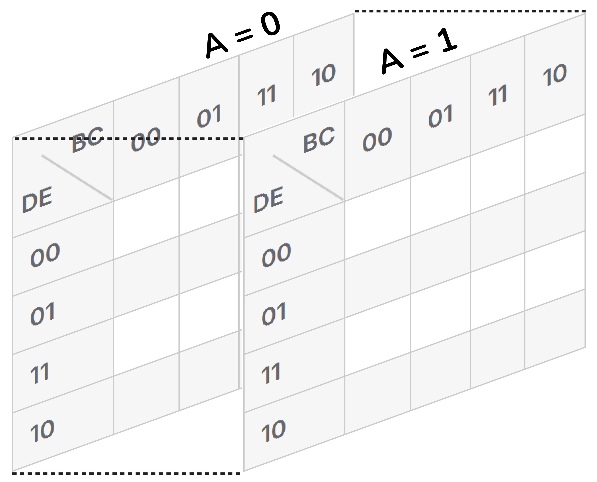

<!-- Posar aquesta imatge al començament de cada lliçó -->

 

# Introduction to Karnaugh maps

A Karnaugh map (also known as a K-map or Veitch diagram) is a graphical tool used in digital electronics to simplify Boolean logic functions visually and systematically.

The main objective is to find the simplest possible Boolean expression for a given logic function. A simpler Boolean expression translates directly into a simpler digital circuit.

It is a method alternative to the simplification with the laws of Boolean algebra and is valid for any number of variables. However, it is more practical and intuitive for a small number of variables, typically 2 to 4. Beyond 6 variables, Karnaugh maps become impractical.

A Karnaugh map is a grid that organises all possible input combinations of a Boolean function. Each cell represents a combination of the input variables of the function, i.e. a row in the truth table.

The map must be arranged so that between two adjacent cells vertically or horizontally only one variable changes value. This makes it easier to identify patterns and groupings to reduce the logic expression.

## Example:

Let’s look at the following truth table for a hypothetical digital circuit. This represents the input variables A, B and C and the output S.

<i>Truth table</i>
<!--
|**$A$**|**$B$**|**$C$**|**$S$**
|------    |------    |------   |------
|0|0|0|1|
|0|0|1|0|
|0|1|0|1|
|0|1|1|1|
|1|0|0|1|
|1|0|1|1|
|1|1|0|1|
|1|1|1|1|
-->

<table style="border-collapse: collapse; text-align: center;">
  <thead>
    <tr>
      <th style="border: 1px solid #ccc; padding: 5px 10px;">A</th>
      <th style="border: 1px solid #ccc; padding: 5px 10px;">B</th>
      <th style="border: 1px solid #ccc; padding: 5px 10px;">C</th>
      <th style="border: 1px solid #ccc; padding: 5px 10px;">S</th>
    </tr>
  </thead>
  <tbody>
    <tr>
      <td style="border: 1px solid #ccc; padding: 5px 10px;">0</td>
      <td style="border: 1px solid #ccc; padding: 5px 10px;">0</td>
      <td style="border: 1px solid #ccc; padding: 5px 10px;">0</td>
      <td style="border: 1px solid #ccc; padding: 5px 10px;">1</td>
    </tr>
    <tr>
      <td style="border: 1px solid #ccc; padding: 5px 10px;">0</td>
      <td style="border: 1px solid #ccc; padding: 5px 10px;">0</td>
      <td style="border: 1px solid #ccc; padding: 5px 10px;">1</td>
      <td style="border: 1px solid #ccc; padding: 5px 10px;">0</td>
    </tr>
    <tr>
      <td style="border: 1px solid #ccc; padding: 5px 10px;">0</td>
      <td style="border: 1px solid #ccc; padding: 5px 10px;">1</td>
      <td style="border: 1px solid #ccc; padding: 5px 10px;">0</td>
      <td style="border: 1px solid #ccc; padding: 5px 10px;">1</td>
    </tr>
    <tr>
      <td style="border: 1px solid #ccc; padding: 5px 10px;">0</td>
      <td style="border: 1px solid #ccc; padding: 5px 10px;">1</td>
      <td style="border: 1px solid #ccc; padding: 5px 10px;">1</td>
      <td style="border: 1px solid #ccc; padding: 5px 10px;">1</td>
    </tr>
    <tr>
      <td style="border: 1px solid #ccc; padding: 5px 10px;">1</td>
      <td style="border: 1px solid #ccc; padding: 5px 10px;">0</td>
      <td style="border: 1px solid #ccc; padding: 5px 10px;">0</td>
      <td style="border: 1px solid #ccc; padding: 5px 10px;">1</td>
    </tr>
    <tr>
      <td style="border: 1px solid #ccc; padding: 5px 10px;">1</td>
      <td style="border: 1px solid #ccc; padding: 5px 10px;">0</td>
      <td style="border: 1px solid #ccc; padding: 5px 10px;">1</td>
      <td style="border: 1px solid #ccc; padding: 5px 10px;">1</td>
    </tr>
    <tr>
      <td style="border: 1px solid #ccc; padding: 5px 10px;">1</td>
      <td style="border: 1px solid #ccc; padding: 5px 10px;">1</td>
      <td style="border: 1px solid #ccc; padding: 5px 10px;">0</td>
      <td style="border: 1px solid #ccc; padding: 5px 10px;">1</td>
    </tr>
    <tr>
      <td style="border: 1px solid #ccc; padding: 5px 10px;">1</td>
      <td style="border: 1px solid #ccc; padding: 5px 10px;">1</td>
      <td style="border: 1px solid #ccc; padding: 5px 10px;">1</td>
      <td style="border: 1px solid #ccc; padding: 5px 10px;">1</td>
    </tr>
  </tbody>
</table>

The Karnaugh map for A, B, and C, grouping the variables B and C, is shown below:

<!-- 
<i>Karnaugh map</i>

|           |**$BC=00$**|**$BC=01$**|**$BC=11$**|**$BC=10$**
|------     |------     |------     |------     |------
|**$A=0$**  |1|0|1|1|
|**$A=1$**  |1|1|1|1|
 -->
<table style="border-collapse: collapse; text-align: center;">
  <thead>
    <tr>
      <th style="border: 1px solid #ccc; position: relative; width: 60px; height: 60px;">
        
    

        
  

      </th>
      <th style="border: 1px solid #ccc; padding: 5px 10px;">BC=00</th>
      <th style="border: 1px solid #ccc; padding: 5px 10px;">BC=01</th>
      <th style="border: 1px solid #ccc; padding: 5px 10px;">BC=11</th>
      <th style="border: 1px solid #ccc; padding: 5px 10px;">BC=10</th>
    </tr>
  </thead>
  <tbody>
    <tr>
      <th style="border: 1px solid #ccc; padding: 5px 10px;">A=0</th>
      <td style="border: 1px solid #ccc; padding: 5px 10px;">1</td>
      <td style="border: 1px solid #ccc; padding: 5px 10px;">0</td>
      <td style="border: 1px solid #ccc; padding: 5px 10px;">1</td>
      <td style="border: 1px solid #ccc; padding: 5px 10px;">1</td>
    </tr>
    <tr>
      <th style="border: 1px solid #ccc; padding: 5px 10px;">A=1</th>
      <td style="border: 1px solid #ccc; padding: 5px 10px;">1</td>
      <td style="border: 1px solid #ccc; padding: 5px 10px;">1</td>
      <td style="border: 1px solid #ccc; padding: 5px 10px;">1</td>
      <td style="border: 1px solid #ccc; padding: 5px 10px;">1</td>
    </tr>
  </tbody>
</table>

The values in each cell are the values of output S for the corresponding values of A, B, and C in a row of the truth table.

## Rules for Karnaugh maps

### **Gray code:**
The rows and columns of the map are not ordered conventionally (00, 01, 10, 11) but follow Gray code (00, 01, 11, 10). In other words, between two adjacent cells (vertical or horizontal) only one variable changes value.

### **Filling the table:**
Fill the table with the values of the output corresponding to the input value combinations for each cell.

### **Grouping the 1s that are adjacent:**
The aim is to form as large groups as possible.
* Group adjacent 1s in rows, squares or rectangles.
* The size of the groups must be a power of two, i.e. 1, 2, 4, 8, etc.
* Keep forming groups until every 1 in the table is part of at least one group.
* The edges of the map are considered adjacent with the opposite edge, as if the map repeats beyond the edges.

### **Obtaining the simplified Boolean expression:**
Each group of 1s translates into a term of the simplified Boolean function. To do this, observe which variables do not change value within the group; these will form part of the term. The variables that change within the group do not appear in the expression.

## Structures for Karnaugh maps from 2 to 5 variables

The following show the structures of Karnaugh maps for different numbers of input variables. The most common tables are for 2 to 4 input variables, but they can be used for functions of up to 5 or 6 variables.

### Karnaugh map for 2 input variables

<!-- Table for 2 variables -->
<table style="border-collapse: collapse; text-align: center;">
  <thead>
    <tr>
      <th style="border: 1px solid #ccc; position: relative; width: 60px; height: 60px;">
        
   A 

        
 B 

        

      </th>
      <th style="border: 1px solid #ccc; padding: 5px 10px;">0</th>
      <th style="border: 1px solid #ccc; padding: 5px 10px;">1</th>
    </tr>
  </thead>
  <tbody>
    <tr>
      <th style="border: 1px solid #ccc; padding: 5px 10px;">0</th>
      <td style="border: 1px solid #ccc; padding: 5px 10px;"> </td>
      <td style="border: 1px solid #ccc; padding: 5px 10px;"> </td>
    </tr>
    <tr>
      <th style="border: 1px solid #ccc; padding: 5px 10px;">1</th>
      <td style="border: 1px solid #ccc; padding: 5px 10px;"> </td>
      <td style="border: 1px solid #ccc; padding: 5px 10px;"> </td>
    </tr>
  </tbody>
</table>

### Karnaugh map for 3 input variables

In this case, the variables can be arranged in different ways; A\BC (as shown above), B\AC or C\AB (this example). In any case, the value map is the same (Gray code).

<!-- Table for 3 variables -->
<table style="border-collapse: collapse; text-align: center;">
  <thead>
    <tr>
      <th style="border: 1px solid #ccc; position: relative; width: 60px; height: 60px;">
        
 AB 

        
 C 

        

      </th>
      <th style="border: 1px solid #ccc; padding: 5px 10px;">00</th>
      <th style="border: 1px solid #ccc; padding: 5px 10px;">01</th>
      <th style="border: 1px solid #ccc; padding: 5px 10px;">11</th>
      <th style="border: 1px solid #ccc; padding: 5px 10px;">10</th>
    </tr>
  </thead>
  <tbody>
    <tr>
      <th style="border: 1px solid #ccc; padding: 5px 10px;">0</th>
      <td style="border: 1px solid #ccc; padding: 5px 10px;"> </td>
      <td style="border: 1px solid #ccc; padding: 5px 10px;"> </td>
      <td style="border: 1px solid #ccc; padding: 5px 10px;"> </td>
      <td style="border: 1px solid #ccc; padding: 5px 10px;"> </td>
    </tr>
    <tr>
      <th style="border: 1px solid #ccc; padding: 5px 10px;">1</th>
      <td style="border: 1px solid #ccc; padding: 5px 10px;"> </td>
      <td style="border: 1px solid #ccc; padding: 5px 10px;"> </td>
      <td style="border: 1px solid #ccc; padding: 5px 10px;"> </td>
      <td style="border: 1px solid #ccc; padding: 5px 10px;"> </td>
    </tr>
  </tbody>
</table>

### Karnaugh map for 4 input variables

The value map is fixed; the grouping of the variables A, B, C and D can be done as desired in each case.

<!-- Table for 4 variables -->
<table style="border-collapse: collapse; text-align: center;">
  <thead>
    <tr>
      <th style="border: 1px solid #ccc; position: relative; width: 60px; height: 60px;">
        
   AB 

        
 CD 

        

      </th>
      <th style="border: 1px solid #ccc; padding: 5px 10px;">00</th>
      <th style="border: 1px solid #ccc; padding: 5px 10px;">01</th>
      <th style="border: 1px solid #ccc; padding: 5px 10px;">11</th>
      <th style="border: 1px solid #ccc; padding: 5px 10px;">10</th>
    </tr>
  </thead>
  <tbody>
    <tr>
      <th style="border: 1px solid #ccc; padding: 5px 10px;">00</th>
      <td style="border: 1px solid #ccc; padding: 5px 10px;"> </td>
      <td style="border: 1px solid #ccc; padding: 5px 10px;"> </td>
      <td style="border: 1px solid #ccc; padding: 5px 10px;"> </td>
      <td style="border: 1px solid #ccc; padding: 5px 10px;"> </td>
    </tr>
    <tr>
      <th style="border: 1px solid #ccc; padding: 5px 10px;">01</th>
      <td style="border: 1px solid #ccc; padding: 5px 10px;"> </td>
      <td style="border: 1px solid #ccc; padding: 5px 10px;"> </td>
      <td style="border: 1px solid #ccc; padding: 5px 10px;"> </td>
      <td style="border: 1px solid #ccc; padding: 5px 10px;"> </td>
    </tr>
    <tr>
      <th style="border: 1px solid #ccc; padding: 5px 10px;">11</th>
      <td style="border: 1px solid #ccc; padding: 5px 10px;"> </td>
      <td style="border: 1px solid #ccc; padding: 5px 10px;"> </td>
      <td style="border: 1px solid #ccc; padding: 5px 10px;"> </td>
      <td style="border: 1px solid #ccc; padding: 5px 10px;"> </td>
    </tr>
    <tr>
      <th style="border: 1px solid #ccc; padding: 5px 10px;">10</th>
      <td style="border: 1px solid #ccc; padding: 5px 10px;"> </td>
      <td style="border: 1px solid #ccc; padding: 5px 10px;"> </td>
      <td style="border: 1px solid #ccc; padding: 5px 10px;"> </td>
      <td style="border: 1px solid #ccc; padding: 5px 10px;"> </td>
    </tr>
  </tbody>
</table>

### Karnaugh map for 5 input variables

Using Gray code, the Karnaugh map for 5 variables is structured as follows:

<!-- Table for 5 variables -->
<table style="border-collapse: collapse; text-align: center;">
  <thead>
    <tr>
      <th style="border: 1px solid #ccc; position: relative; width: 60px; height: 60px;">
        
   ABC 

        
 DE 

        

      </th>
      <th style="border: 1px solid #ccc; padding: 5px 10px;">000</th>
      <th style="border: 1px solid #ccc; padding: 5px 10px;">001</th>
      <th style="border: 1px solid #ccc; padding: 5px 10px;">011</th>
      <th style="border: 1px solid #ccc; padding: 5px 10px;">010</th>
      <th style="border: 1px solid #ccc; padding: 5px 10px; border-left: 4px double #444;">110</th>
      <th style="border: 1px solid #ccc; padding: 5px 10px;">111</th>
      <th style="border: 1px solid #ccc; padding: 5px 10px;">101</th>
      <th style="border: 1px solid #ccc; padding: 5px 10px;">100</th>
    </tr>
  </thead>
  <tbody>
    <tr>
      <th style="border: 1px solid #ccc; padding: 5px 10px;">00</th>
      <td style="border: 1px solid #ccc; padding: 5px 10px;"> </td>
      <td style="border: 1px solid #ccc; padding: 5px 10px;"> </td>
      <td style="border: 1px solid #ccc; padding: 5px 10px;"> </td>
      <td style="border: 1px solid #ccc; padding: 5px 10px;"> </td>
      <td style="border: 1px solid #ccc; padding: 5px 10px; border-left: 4px double #444;"> </td>
      <td style="border: 1px solid #ccc; padding: 5px 10px;"> </td>
      <td style="border: 1px solid #ccc; padding: 5px 10px;"> </td>
      <td style="border: 1px solid #ccc; padding: 5px 10px;"> </td>
    </tr>
    <tr>
      <th style="border: 1px solid #ccc; padding: 5px 10px;">01</th>
      <td style="border: 1px solid #ccc; padding: 5px 10px;"> </td>
      <td style="border: 1px solid #ccc; padding: 5px 10px;"> </td>
      <td style="border: 1px solid #ccc; padding: 5px 10px;"> </td>
      <td style="border: 1px solid #ccc; padding: 5px 10px;"> </td>
      <td style="border: 1px solid #ccc; padding: 5px 10px; border-left: 4px double #444;"> </td>
      <td style="border: 1px solid #ccc; padding: 5px 10px;"> </td>
      <td style="border: 1px solid #ccc; padding: 5px 10px;"> </td>
      <td style="border: 1px solid #ccc; padding: 5px 10px;"> </td>
    </tr>
    <tr>
      <th style="border: 1px solid #ccc; padding: 5px 10px;">11</th>
      <td style="border: 1px solid #ccc; padding: 5px 10px;"> </td>
      <td style="border: 1px solid #ccc; padding: 5px 10px;"> </td>
      <td style="border: 1px solid #ccc; padding: 5px 10px;"> </td>
      <td style="border: 1px solid #ccc; padding: 5px 10px;"> </td>
      <td style="border: 1px solid #ccc; padding: 5px 10px; border-left: 4px double #444;"> </td>
      <td style="border: 1px solid #ccc; padding: 5px 10px;"> </td>
      <td style="border: 1px solid #ccc; padding: 5px 10px;"> </td>
      <td style="border: 1px solid #ccc; padding: 5px 10px;"> </td>
    </tr>
    <tr>
      <th style="border: 1px solid #ccc; padding: 5px 10px;">10</th>
      <td style="border: 1px solid #ccc; padding: 5px 10px;"> </td>
      <td style="border: 1px solid #ccc; padding: 5px 10px;"> </td>
      <td style="border: 1px solid #ccc; padding: 5px 10px;"> </td>
      <td style="border: 1px solid #ccc; padding: 5px 10px;"> </td>
      <td style="border: 1px solid #ccc; padding: 5px 10px; border-left: 4px double #444;"> </td>
      <td style="border: 1px solid #ccc; padding: 5px 10px;"> </td>
      <td style="border: 1px solid #ccc; padding: 5px 10px;"> </td>
      <td style="border: 1px solid #ccc; padding: 5px 10px;"> </td>
    </tr>
  </tbody>
</table>

This map is usable, but it ignores that the following columns can also be adjacent:
+ 000 with 010
+ 110 with 100
+ 001 with 101
+ 011 with 111

For this reason, it is common to represent with a line in the centre that separates two independent 4×4 maps and creates cross-adjacencies between the maps, as if there were a vertical mirror at the centre. This map can be called a reflection map.

Another very effective way to structure a Karnaugh map for 5 variables is to create two 4-variable maps: one representing A=0 and the other A=1, considered superimposed in a third dimension.

<table style="width: 100%; margin: 0 auto; border-collapse: collapse; text-align: center; background-color: transparent;">

  <tbody>
    <tr>
      <td>
        A=0
        <!-- 4-variable table -->
        <table style="border-collapse: collapse; text-align: center;">
        <thead>
            <tr>
            <th style="border: 1px solid #ccc; position: relative; width: 60px; height: 60px;">
                
   BC 

                
 DE 

                

            </th>
            <th style="border: 1px solid #ccc; padding: 5px 10px;">00</th>
            <th style="border: 1px solid #ccc; padding: 5px 10px;">01</th>
            <th style="border: 1px solid #ccc; padding: 5px 10px;">11</th>
            <th style="border: 1px solid #ccc; padding: 5px 10px;">10</th>
            </tr>
        </thead>
        <tbody>
            <tr>
            <th style="border: 1px solid #ccc; padding: 5px 10px;">00</th>
            <td style="border: 1px solid #ccc; padding: 5px 10px;"> </td>
            <td style="border: 1px solid #ccc; padding: 5px 10px;"> </td>
            <td style="border: 1px solid #ccc; padding: 5px 10px;"> </td>
            <td style="border: 1px solid #ccc; padding: 5px 10px;"> </td>
            </tr>
            <tr>
            <th style="border: 1px solid #ccc; padding: 5px 10px;">01</th>
            <td style="border: 1px solid #ccc; padding: 5px 10px;"> </td>
            <td style="border: 1px solid #ccc; padding: 5px 10px;"> </td>
            <td style="border: 1px solid #ccc; padding: 5px 10px;"> </td>
            <td style="border: 1px solid #ccc; padding: 5px 10px;"> </td>
            </tr>
            <tr>
            <th style="border: 1px solid #ccc; padding: 5px 10px;">11</th>
            <td style="border: 1px solid #ccc; padding: 5px 10px;"> </td>
            <td style="border: 1px solid #ccc; padding: 5px 10px;"> </td>
            <td style="border: 1px solid #ccc; padding: 5px 10px;"> </td>
            <td style="border: 1px solid #ccc; padding: 5px 10px;"> </td>
            </tr>
            <tr>
            <th style="border: 1px solid #ccc; padding: 5px 10px;">10</th>
            <td style="border: 1px solid #ccc; padding: 5px 10px;"> </td>
            <td style="border: 1px solid #ccc; padding: 5px 10px;"> </td>
            <td style="border: 1px solid #ccc; padding: 5px 10px;"> </td>
            <td style="border: 1px solid #ccc; padding: 5px 10px;"> </td>
            </tr>
        </tbody>
        </table>
      </td>
      <td>
        A=1
        <!-- 4-variable table -->
        <table style="border-collapse: collapse; text-align: center;">
        <thead>
            <tr>
            <th style="border: 1px solid #ccc; position: relative; width: 60px; height: 60px;">
                
   BC 

                
 DE 

                

            </th>
            <th style="border: 1px solid #ccc; padding: 5px 10px;">00</th>
            <th style="border: 1px solid #ccc; padding: 5px 10px;">01</th>
            <th style="border: 1px solid #ccc; padding: 5px 10px;">11</th>
            <th style="border: 1px solid #ccc; padding: 5px 10px;">10</th>
            </tr>
        </thead>
        <tbody>
            <tr>
            <th style="border: 1px solid #ccc; padding: 5px 10px;">00</th>
            <td style="border: 1px solid #ccc; padding: 5px 10px;"> </td>
            <td style="border: 1px solid #ccc; padding: 5px 10px;"> </td>
            <td style="border: 1px solid #ccc; padding: 5px 10px;"> </td>
            <td style="border: 1px solid #ccc; padding: 5px 10px;"> </td>
            </tr>
            <tr>
            <th style="border: 1px solid #ccc; padding: 5px 10px;">01</th>
            <td style="border: 1px solid #ccc; padding: 5px 10px;"> </td>
            <td style="border: 1px solid #ccc; padding: 5px 10px;"> </td>
            <td style="border: 1px solid #ccc; padding: 5px 10px;"> </td>
            <td style="border: 1px solid #ccc; padding: 5px 10px;"> </td>
            </tr>
            <tr>
            <th style="border: 1px solid #ccc; padding: 5px 10px;">11</th>
            <td style="border: 1px solid #ccc; padding: 5px 10px;"> </td>
            <td style="border: 1px solid #ccc; padding: 5px 10px;"> </td>
            <td style="border: 1px solid #ccc; padding: 5px 10px;"> </td>
            <td style="border: 1px solid #ccc; padding: 5px 10px;"> </td>
            </tr>
            <tr>
            <th style="border: 1px solid #ccc; padding: 5px 10px;">10</th>
            <td style="border: 1px solid #ccc; padding: 5px 10px;"> </td>
            <td style="border: 1px solid #ccc; padding: 5px 10px;"> </td>
            <td style="border: 1px solid #ccc; padding: 5px 10px;"> </td>
            <td style="border: 1px solid #ccc; padding: 5px 10px;"> </td>
            </tr>
        </tbody>
        </table>
    </td>
    </tr>
  </tbody>
</table>

I visualise them as follows.

<i>Karnaugh map for 5 variables</i>

## Example: 
We look for the largest possible groups of 1s in our example. We must continue the process until all the 1s have been considered.

<table style="border-collapse: collapse; text-align: center;">
  <thead>
    <tr>
      <th style="border: 1px solid #ccc; position: relative; width: 60px; height: 60px;">
        
    

        
  

        

      </th>
      <th style="border: 1px solid #ccc; padding: 5px 10px;">BC=00</th>
      <th style="border: 1px solid #ccc; padding: 5px 10px;">BC=01</th>
      <th style="border: 1px solid #ccc; padding: 5px 10px;">BC=11</th>
      <th style="border: 1px solid #ccc; padding: 5px 10px;">BC=10</th>
    </tr>
  </thead>
  <tbody>
    <tr>
      <th style="border: 1px solid #ccc; padding: 5px 10px;">A=0</th>
      <td style="border: 1px solid #ccc; padding: 5px 10px;">1</td>
      <td style="border: 1px solid #ccc; padding: 5px 10px;">0</td>
      <td style="border: 1px solid #ccc; padding: 5px 10px;">1</td>
      <td style="border: 1px solid #ccc; padding: 5px 10px;">1</td>
    </tr>
    <tr style="background-color: lightblue;">
      <th style="border: 1px solid #ccc; padding: 5px 10px;">A=1</th>
      <td style="border: 1px solid #ccc; padding: 5px 10px;">1</td>
      <td style="border: 1px solid #ccc; padding: 5px 10px;">1</td>
      <td style="border: 1px solid #ccc; padding: 5px 10px;">1</td>
      <td style="border: 1px solid #ccc; padding: 5px 10px;">1</td>
    </tr>
  </tbody>
</table>

In the blue row there are four adjacent 1s in a row. The common variable in all of them is A=1, while B and C vary. Hence, the first term of the expression for S will be A.

$S=A+···$

<table style="border-collapse: collapse; text-align: center;">
  <thead>
    <tr>
      <th style="border: 1px solid #ccc; position: relative; width: 60px; height: 60px;">
        
    

        
  

        

      </th>
      <th style="border: 1px solid #ccc; padding: 5px 10px;">BC=00</th>
      <th style="border: 1px solid #ccc; padding: 5px 10px;">BC=01</th>
      <th style="border: 1px solid #ccc; padding: 5px 10px;">BC=11</th>
      <th style="border: 1px solid #ccc; padding: 5px 10px;">BC=10</th>
    </tr>
  </thead>
  <tbody>
    <tr>
      <th style="border: 1px solid #ccc; padding: 5px 10px;">A=0</th>
      <td style="border: 1px solid #ccc; padding: 5px 10px; background-color: red;">1</td>
      <td style="border: 1px solid #ccc; padding: 5px 10px;">0</td>
      <td style="border: 1px solid #ccc; padding: 5px 10px;">1</td>
      <td style="border: 1px solid #ccc; padding: 5px 10px; background-color: red;">1</td>
    </tr>
    <tr>
      <th style="border: 1px solid #ccc; padding: 5px 10px;">A=1</th>
      <td style="border: 1px solid #ccc; padding: 5px 10px; background-color: red;">1</td>
      <td style="border: 1px solid #ccc; padding: 5px 10px;">1</td>
      <td style="border: 1px solid #ccc; padding: 5px 10px;">1</td>
      <td style="border: 1px solid #ccc; padding: 5px 10px; background-color: red;">1</td>
    </tr>
  </tbody>
</table>

In orange we have another group of four adjacent 1s in a square. This grouping extends across a table edge. The variable that remains constant is C=0, so we add the negative term, Ĉ.

$S=A+B+\bar{C}$

This is therefore the simplified Boolean expression that yields the example truth table.
From this, the digital circuit is deduced: three inputs to an OR gate, one of them inverted.

<i>Resulting circuit of the example</i>

## Other examples
The following examples help us understand all the rules better.

## Example: 

<!-- Table for 3 variables -->
<table style="border-collapse: collapse; text-align: center;">
  <thead>
    <tr>
      <th style="border: 1px solid #ccc; position: relative; width: 60px; height: 60px;">
        
   AB 

        
 C 

        

      </th>
      <th style="border: 1px solid #ccc; padding: 5px 10px;">00</th>
      <th style="border: 1px solid #ccc; padding: 5px 10px;">01</th>
      <th style="border: 1px solid #ccc; padding: 5px 10px;">11</th>
      <th style="border: 1px solid #ccc; padding: 5px 10px;">10</th>
    </tr>
  </thead>
  <tbody>
    <tr>
      <th style="border: 1px solid #ccc; padding: 5px 10px;">0</th>
      <td style="border: 1px solid #ccc; padding: 5px 10px;background-color: red;">1</td>
      <td style="border: 1px solid #ccc; padding: 5px 10px;background-color: red;">1</td>
      <td style="border: 1px solid #ccc; padding: 5px 10px;">0</td>
      <td style="border: 1px solid #ccc; padding: 5px 10px;">0</td>
    </tr>
    <tr>
      <th style="border: 1px solid #ccc; padding: 5px 10px;">1</th>
      <td style="border: 1px solid #ccc; padding: 5px 10px;">0</td>
      <td style="border: 1px solid #ccc; padding: 5px 10px;">0</td>
      <td style="border: 1px solid #ccc; padding: 5px 10px;background-color: lightblue;">1</td>
      <td style="border: 1px solid #ccc; padding: 5px 10px;background-color: lightblue;">1</td>
    </tr>
  </tbody>
</table>

The red group yields the term ĈA because the constant variables are A=0 and C=0. Both A and C must appear inverted since they have the value 0.

In the blue group A=1 and C=1, so its term in the Boolean expression is AC.

The final simplified expression is:

S = ĀC̄ + AC

The fact that the variable B does not appear means it has no effect on the result S.

## Example: 

<!-- Table for 3 variables -->
<table style="border-collapse: collapse; text-align: center;">
  <thead>
    <tr>
      <th style="border: 1px solid #ccc; position: relative; width: 60px; height: 60px;">
        
   AB 

        
 C 

        

      </th>
      <th style="border: 1px solid #ccc; padding: 5px 10px;">00</th>
      <th style="border: 1px solid #ccc; padding: 5px 10px;">01</th>
      <th style="border: 1px solid #ccc; padding: 5px 10px;">11</th>
      <th style="border: 1px solid #ccc; padding: 5px 10px;">10</th>
    </tr>
  </thead>
  <tbody>
    <tr>
      <th style="border: 1px solid #ccc; padding: 5px 10px;">0</th>
      <td style="border: 1px solid #ccc; padding: 5px 10px;">0</td>
      <td style="border: 1px solid #ccc; padding: 5px 10px;background-color: lightgreen;">1</td>
      <td style="border: 1px solid #ccc; padding: 5px 10px;color: red; font-weight: bold;-webkit-text-stroke: 1px red;background-color: lightgreen;">1</td>
      <td style="border: 1px solid #ccc; padding: 5px 10px;color: red; font-weight: bold;-webkit-text-stroke: 1px red;background-color: lightgreen;">1</td>
    </tr>
    <tr>
      <th style="border: 1px solid #ccc; padding: 5px 10px;">1</th>
      <td style="border: 1px solid #ccc; padding: 5px 10px;background-color: lightblue;">1</td>
      <td style="border: 1px solid #ccc; padding: 5px 10px;">0</td>
      <td style="border: 1px solid #ccc; padding: 5px 10px;color: red; font-weight: bold;-webkit-text-stroke: 1px red;">1</td>
      <td style="border: 1px solid #ccc; padding: 5px 10px;color: red; font-weight: bold;background-color: lightblue;-webkit-text-stroke: 1px red;">1</td>
    </tr>
  </tbody>
</table>

This example can be solved with three groups. The red group is A, the green group is BĈ and the blue group is ßBĈ.

S = A + BĈ + Ĉ

<!-- This image should go at the end of each lesson, either with this line or within the signature. Leave commented if it is already in the signature-->
  
<Autors autors="xcasas fmadrid"/>
