<!-- Posar aquesta imatge al començament de cada lliçó -->

 

# 4-bit Arithmetic

We will now discuss some arithmetic circuits that perform operations with 4 bits. We will see examples of 4-bit adders and subtractors and a very simple ALU (Arithmetic Logic Unit).

## Example: 4-bit number addition

In this example we will see how we can add two 4-bit binary numbers.
Binary adders (*ripple-carry adders*) can be built from full adders (*full adders*) and a half adder (*half adder*). Since we are dealing with a 4-bit addition, we will need to cascade 3 full adders and a half adder, or else 4 full adders if we configure the first full adder as a half adder.

[CircuitVerse](https://circuitverse.org/simulator) has an object named *adder* that implements an adder.

 

  
  
  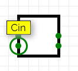
  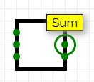
  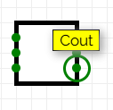

The inputs **A** and **B** are the operands being added and **Cin** is the input carry bit. The outputs are **Sum** with the result and **Cout** with the output carry. If you hover the mouse over the inputs and outputs of the object you can see its name.

The circuit that performs the addition cascades 3 full adders and a half adder:

<i>4-bit Adder</i>

If convenient, we can implement the same circuit with 4 full adders. The function of the half adder can be performed by a full adder if we feed a constant $0$ to its input $C_{entrada}$.

<i>4-bit Adder (alternative)</i>

Implement it in CircuitVerse:

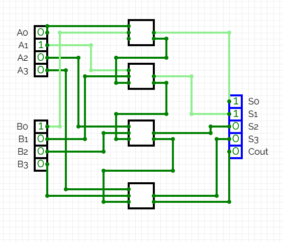

<i>4-bit Adder in CircuitVerse</i>

In this example the input values are:

* Input **A** = 0010
* Input **B** = 0001

And the outputs:

* Output **S = A + B**
* Output **Cout** = Carry-out

At Jutge.org, the 4-bit and n-bit algebra exercises use the bus notation $A[3:0]$ (defined in [Busos](../CircCombin/busos#notacio)) and 4- or $n$-bit inputs/outputs. To allow Jutge to validate the circuit correctly, you must use the *BitWidth* property of the inputs, outputs and *adders*. This parameter can be seen in the *Properties* menu:

  
  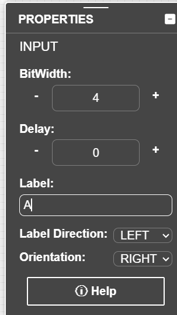

Once the *BitWidth* is set to 4 we can perform the addition with a single *adder* and simplify the circuit:

In CircuitVerse, the 4-bit inputs and outputs have black wires, while **Cin** and **Cout**, being only 1 bit, are green.

## Example: 4-bit subtraction

To subtract two binary numbers we use the formula:

$$S = A - B = A + (\bar{B} + 1)$$

In this example we will perform a 4-bit subtraction. Consider:

* Input **A** = 1100 (12 in decimal)
* Input **B** = 0101 (5 in decimal)
* Output **S = A - B** (4 bits)
* Output **Cout** = Carry-out

First negate $B$:

$$B = 0101  \Rightarrow  \bar{B} = 1010$$

Then perform the addition:

$$S = A + \bar{B} + 1 = 1100 + 1010 + 1 = 1100 + 1011 = 0111$$

The following table specifies this operation bit by bit (it is not a truth table):

|   bit   | $A_i$ | $\bar{B_i}$ | $C_i$ | $S_i$ | $C_{sortida}$ |
| :-----: | :---: | :---------: | :---: | :---: | :-----------: |
| 0 (LSB) |   0   |      0      |   1   |   1   |       0       |
|    1    |   0   |      1      |   0   |   1   |       0       |
|    2    |   1   |      0      |   0   |   1   |       0       |
| 3 (MSB) |   1   |      1      |   0   |   0   |       1       |

The circuit that performs the subtraction cascades 4 adders, with $\bar{B}$ and $C_{entrada} = 1$:

<i>4-bit Subtractor</i>

In CircuitVerse it is represented like this:

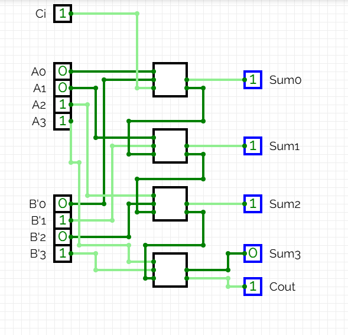

<i>4-bit Subtractor</i>

With *BitWidth = 4* we can simplify the circuit:

## Example: Selecting operations

Beyond performing arithmetic operations, arithmetic circuits can also implement operation selection. ALUs (Arithmetic Logic Units) allow choosing between operations based on a variable. This example explores this capability.

We want to implement a circuit that selects between a sum and a subtraction based on the input variable $op$.

* If $op = 0$, a sum is performed.
* If $op = 1$, a subtraction is performed.

To perform the 4-bit addition $A + B$ we will use a 4-bit *Adder*. The input carry (**Cin**) must be 0, so we will connect a ground.

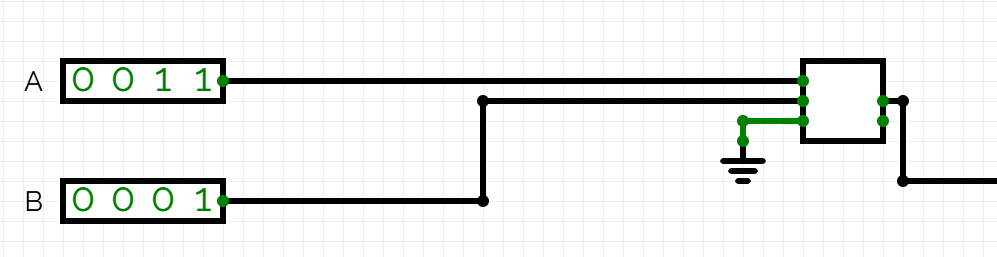

To perform the subtraction we will use:

$$S = A - B = A + \bar{B} + 1$$

To negate $B$ we will use a 4-bit NOT gate. The input carry (**Cin**) must be 1, so we will use a power source.

Adding the circuit piece that performs the subtraction we obtain:

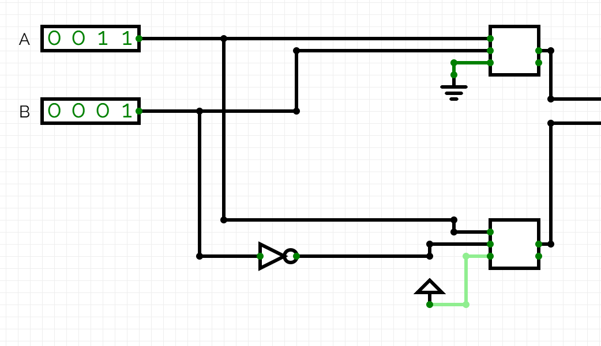

Both *Power* and *Ground* can be found in the CircuitVerse inputs menu. Both act as constants. *Power* always has the value 1 and *Ground* always has the value 0.

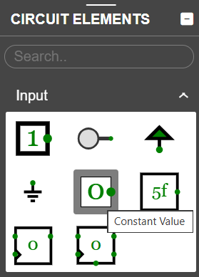

Now we need to add the part of the circuit capable of choosing between one operation and the other based on the input variable $op$. We will use a multiplexer, as shown in the [Multiplexors](../CircCombin/multiplexors.md) section of the combinational circuits. Multiplexers pass one signal or another depending on a select input, and that is what we require here.

The complete circuit, after adding this final element, is the following:

<i>Selected sum</i>

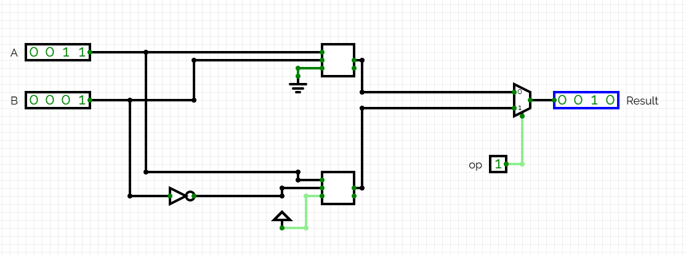

<i>Selected subtraction</i>

We can use a multiplexer with more than two inputs to handle more possible operations.  
In the CircuitVerse properties menu you can modify the number of inputs with the *control signal size* property.

ALUs (*ALU*) typically select between 4 operations (4-input multiplexers) with a 2-bit selector $op$.

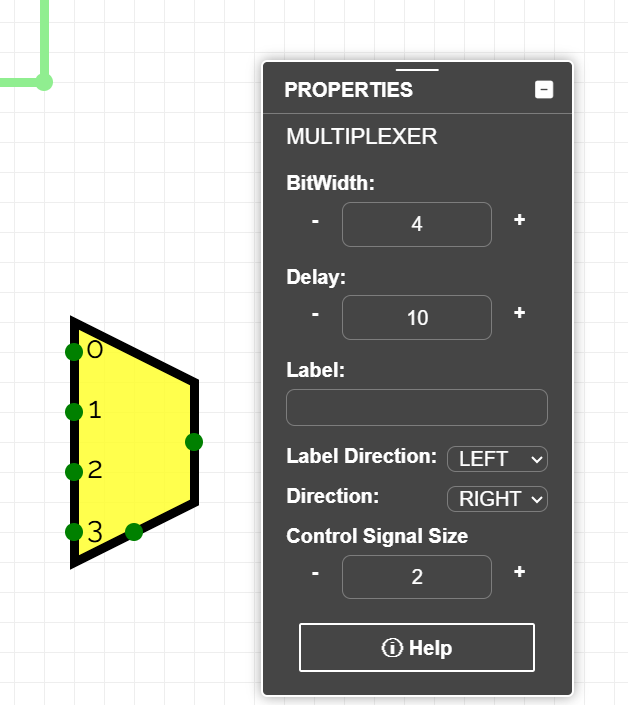

## Exercises on Jutge.org: Introduction to Digital Circuit Design

- [4-bit adder](https://jutge.org/problems/X64833_en)  
- [4-bit incrementer](https://jutge.org/problems/X58456_en)  
- [4-bit adder/subtractor](https://jutge.org/problems/X42916_en)  
- [4-bit comparator](https://jutge.org/problems/X61860_en)  
- [4-bit ALU](https://jutge.org/problems/X35448_en)

<small>Remember that to access the exercises and for Jutge to evaluate your solutions you must be enrolled in the [course](https://jutge.org/courses/JordiCortadella:IntroCircuits). You will find all instructions [here](../Inici/instruccions.md).</small>

<!-- This image should go at the end of each lesson, either with this line or within the signature. Leave commented if it is already in the signature-->
  
<Autors autors="xcasas fmadrid"/>
