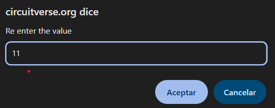

<!-- Posar aquesta imatge al començament de cada lliçó -->

 

# n-bit arithmetic

n-bit arithmetic refers to digital circuits that operate on an arbitrary number of bits. The variable $n$ may be a large value, such as $n=16$ in the course exercises. Adders, subtractors, comparators, incrementers, etc., can be implemented. Here we will look at two examples: an **adder** and an **incrementer**.

## Example: A 16-bit adder

To build an n-bit adder, you need to concatenate **$n-1$ full adders** and **a half adder**.

Thus, to add two binary numbers $A$ and $B$ of 16 bits, we will concatenate 15 full adders and a half adder:

<i>16-bit adder</i>

The inputs are $A$ and $B$. The outputs are:

* the **sum** output $S$ (16 bits), and
* the carry-out bit $C_{out}$.

To simplify the circuit we can use full adders at all stages, with $C_{in} = 0$ at the first adder. As with the 4-bit adders, a full adder can perform the function of a half adder if $C_{in} = 0$.

<i>n-bit adder implemented using only full adders</i>

The final circuit will have the same structure as the 4-bit adders, but with 16 blocks concatenated instead of 4.

## Example: n-bit incrementer

We will design a 5-bit incrementer. This circuit increments the value of a binary input $A$ by one.

To do this, we will add the binary value:

$$00001$$

In this case, instead of a variable we use a **constant**. At CircuitVerse there is an input block called 'constant value', which allows defining a fixed value.

By double-clicking the block, we can specify the value of the constant, as in these examples:

    
    

To implement the incrementer, we simply add the constant 00001 to the variable $A$ using a 5-bit adder.
For example, if $A = 01000$:

CircuitVerse does not consider the constant value as an input variable in Verilog format.
This means that the block **const_0** is part of the incrementer circuit, and not an external input:

## Exercises on Jutge.org: Introduction to Digital Circuit Design

- [n-bit adder](https://jutge.org/problems/X84292_en)
- [n-bit incrementer](https://jutge.org/problems/X41839_en)
- [n-bit adder/subtractor](https://jutge.org/problems/X89356_en)
- [n-bit comparator](https://jutge.org/problems/X37457_en)

<small>Remember that to access the exercises and for the Judge to evaluate your solutions you must be enrolled in the [course](https://jutge.org/courses/JordiCortadella:IntroCircuits). You will find all the instructions [here](../Inici/instruccions.md).</small>

<!-- This image should go at the end of each lesson, either with this line or within the signature. Leave commented if it is already in the signature-->
  
<Autors autors="xcasas fmadrid"/>
