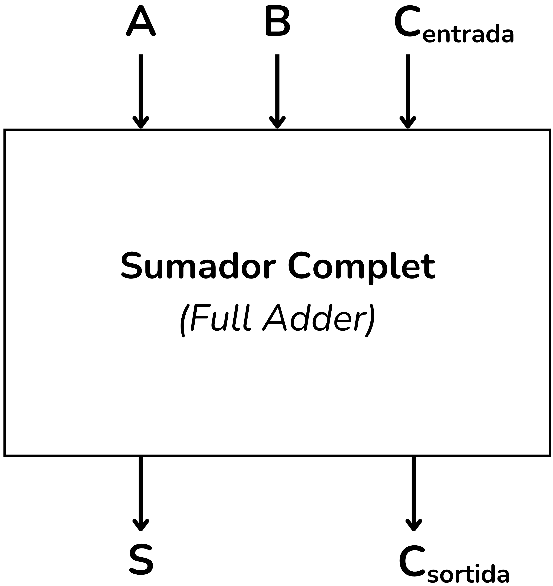
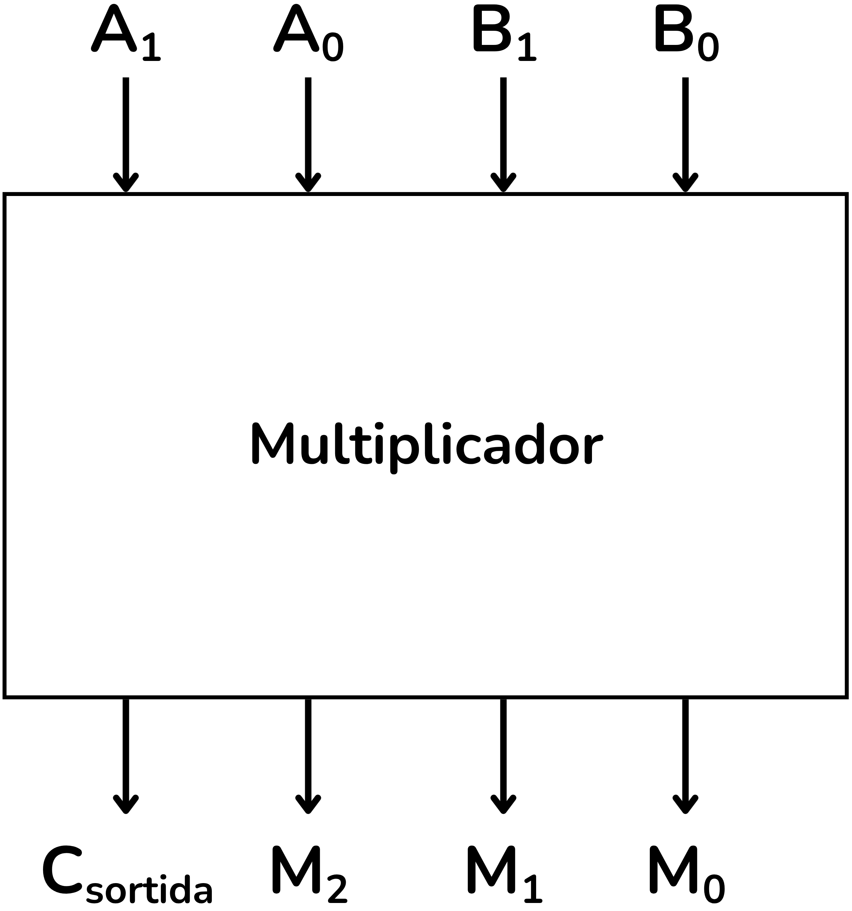

<!-- Posar aquesta imatge al començament de cada lliçó -->

 

# Introduction to Arithmetic Circuits

Arithmetic circuits are a fundamental subclass of **combinational digital circuits**. Their main function is to perform mathematical operations on binary numbers.

The most common basic operations implemented are:

**Half Adder**: Circuit that adds two bits and produces a sum output $S$ and a carry bit $C$.

<i>Half Adder</i>

**Full Adder**: Adds three bits (two inputs and the carry from the previous stage). It is the basic block for constructing multi-bit adders by cascading.

<i>Full Adder</i>

**N-bit Adder**: 
With half adders and full adders you can build adders of $n$ bits. This circuit performs the binary addition of two numbers $A$ and $B$.

<i>4-bit Adder</i>

**Subtractor**: 
Binary subtraction is usually implemented using adders and the representation in **two's complement**.
Thus, the subtraction $A - B$ is transformed into the sum:

$$A + (-B)$$

<i>4-bit Subtractor</i>

**Comparators**:
Circuits that determine whether a binary number is **greater**, **less** or **equal** to another.

<i>Comparator</i>

**Multipliers and Dividers**:
More complex circuits that are implemented using algorithms based on repeated additions and shifts.

<i>Multiplier</i>

Arithmetic circuits form the core of the **Arithmetic-Logic Units (ALU)**, the heart of any microprocessor.
The ALU is responsible for executing both the arithmetic operations and the logical operations required for program execution.

The Arithmetic Logic Unit (**ALU**) is known in English as the ALU.

<i>Arithmetic Logic Unit (ALU)</i>

## Contents of the Lesson

* In the topic [**Basic Circuits**](./CircBasics.md) the half adder, the full adder and the comparators are presented.
* In the topic [**4-bit Arithmetic**](./Aritm4bits.md) incrementers, 4-bit adders and an ALU example are covered.
* In the topic [**n-bit Arithmetic**](./Aritmnbits.md) incrementers, adders and comparators are generalised for $n$ bits.
* Finally, in the [Miscellany](./miscellania.md) topic more advanced exercises are gathered, such as multipliers, bit accumulators and sequential circuits and adders.

<!-- This image should go at the end of each lesson, either with this line or within the signature. Leave commented if it is already in the signature-->
  
<Autors autors="xcasas fmadrid"/>
