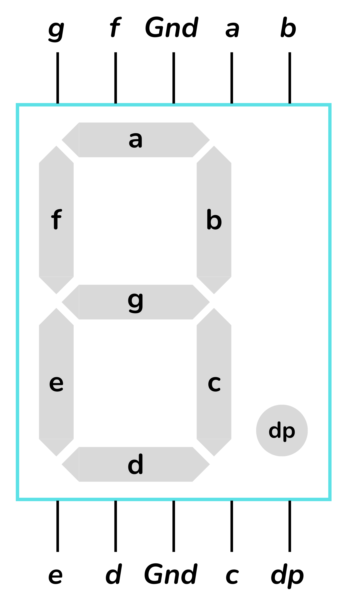
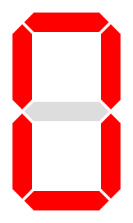
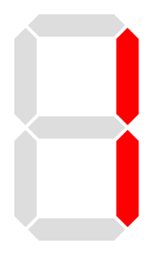
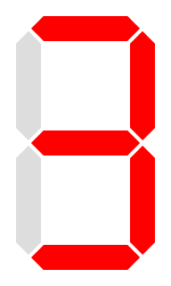
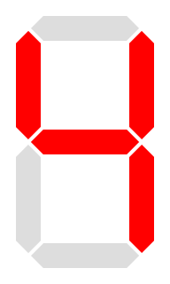
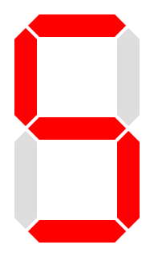

<!-- Posar aquesta imatge al començament de cada lliçó -->

 

# BCD Digits

In digital circuits, a number known as **Binary-Coded Decimal** (BCD) is a way to represent decimal digits using **4 bits**. Each digit from 0 to 9 is converted into a fixed binary pattern.

| **Decimal digit** | **BCD** |
|---|---|
|0 | 0000|
|1 | 0001|
|2 | 0010|
|3 | 0011|
|4 | 0100|
|5 | 0101|
|6 | 0110|
|7 | 0111|
|8 | 1000|
|9 | 1001|

This encoding is widely used in numeric displays and calculators.

## Example: Design of a circuit for a 7-segment display

We want to build a circuit that receives a BCD digit and lights the corresponding segments of a seven-segment display (common-cathode) to show it.

$$D[3:0] = [D_3\ D_2\ D_1\ D_0]$$

<i>7-segment display</i>

<a href="https://creativecommons.org/licenses/by-sa/3.0" title="Creative Commons Attribution-Share Alike 3.0">CC BY-SA 3.0</a>, <a href="https://commons.wikimedia.org/w/index.php?curid=2550282">Link</a>

The following figure shows how the segments are named:

<i>Arrangement of the segments</i>

In the table below we indicate which segments should light up for each input decimal digit D[3:0]. A 1 means the segment is on; a 0, off.

| digit   decimal | BCD   $D_3 D_2 D_1 D_0$ | $a$ | $b$ | $c$ | $d$ | $e$ | $f$ | $g$ | display
|:---:|:---:|---|---|---|---|---|---|---|---
| 0 | 0000 | 1| 1| 1| 1| 1| 1| 0|
| 1 | 0001 | 0| 1| 1| 0| 0| 0| 0|
| 2 | 0010 | 1| 1| 0| 1| 1| 0| 1|
| 3 | 0011 | 1| 1| 1| 1| 0| 0| 1|
| 4 | 0100 | 0| 1| 1| 0| 0| 1| 1|
| 5 | 0101 | 1| 0| 1| 1| 0| 1| 1|
| 6 | 0110 | 1| 0| 1| 1| 1| 1| 1|
| 7 | 0111 | 1| 1| 1| 0| 0| 0| 0|
| 8 | 1000 | 1| 1| 1| 1| 1| 1| 1|
| 9 | 1001 | 1| 1| 1| 1| 0| 1| 1|
|10   don't care| 1010| x| x| x| x| x| x| x
|11   don't care| 1011| x| x| x| x| x| x| x
|12   don't care| 1100| x| x| x| x| x| x| x
|13   don't care| 1101| x| x| x| x| x| x| x
|14   don't care| 1110| x| x| x| x| x| x| x
|15   don't care| 1111| x| x| x| x| x| x| x

## Don't-care Conditions

The 4 input bits can encode values from 0 to 15. However, a BCD digit only uses the values 0 to 9. The cases 10 to 15 are never shown and, therefore, are marked as x (Don't care).

When searching for groupings on the Karnaugh map, we can assign them the values that are most convenient to us in order to obtain simpler expressions.

## Simplified Boolean expressions

A Karnaugh map must be created for each of the circuit outputs to obtain the Boolean expression for each segment.

Regarding the don't-care conditions, the value x=1 yields simpler equations.

The complete and detailed process can be found in several sources:
[Link 1](https://informatika.stei.itb.ac.id/~rinaldi.munir/Matdis/2019-2020/Makalah2019/13518127.pdf), 
[Link 2](https://www.electricaltechnology.org/2018/05/bcd-to-7-segment-display-decoder.html), 
[Link 3](https://steamcommunity.com/sharedfiles/filedetails/?id=2900823549)

We obtain the following expressions for the segments:

* **Segment a:**
  $$a = D_3 + D_1 + D_2\overline{D_0} + \overline{D_2}D_0$$

* **Segment b:**
  $$b = \overline{D_2} + \overline{D_1}\overline{D_0} + D_1D_0$$

* **Segment c:**
  $$c = D_2 + \overline{D_1} + D_0$$

* **Segment d:**
  $$d = D_3 + \overline{D_2}\overline{D_0} + D_1\overline{D_0} + \overline{D_2}\overline{D_1} + D_2\overline{D_1}D_0$$

* **Segment e:**
  $$e = \overline{D_2}\overline{D_0} + D_1\overline{D_0}$$

* **Segment f:**
  $$f = D_3 + D_2\overline{D_1} + \overline{D_1}\overline{D_0} + D_2\overline{D_0}$$

* **Segment g:**
  $$g = D_3 + \overline{D_2}D_1 + D_2\overline{D_1} + D_1\overline{D_0}$$

These Boolean expressions allow implementing the circuit with AND, OR and NOT gates. The inputs are the bits $D_3, D_2, D_1, D_0$ and the outputs are the segments $a, b, c, d, e, f, g$.

This type of decoder is very common in basic digital electronics.

## Verification with examples

To ensure the formulas function correctly, we compute a few digits.

### Example: digit 2 $D = 0010$
Expected results: segments **a, b, d, e, g** ON; **c, f** OFF.

* $segment \; a = 0 + 1 + 0 \cdot \bar{0} + \bar{0} \cdot 0  = 1$

* $segment \; b = \bar{0} + \bar{1} \cdot \bar{0} + 1 \cdot 0 = 1$

* $segment \; c = 0 + \bar{1} + 0 = 0$

* $segment \; d = 0 + \bar{0} \cdot \bar{0} + 1 \cdot \bar{0} + \bar{0} \cdot \bar{1} + 0 \cdot \bar{1} + 0 = 1$

* $segment \; e = \bar{0} \cdot \bar{0} + 1 \cdot \bar{0} = 1$

* $segment \; f = 0 + 0 \cdot \bar{1} + \bar{1} \cdot \bar{0} + 0 \cdot \bar{0} = 0$

* $segment \; g = 0 + \bar{0} \cdot 1 + 0 \cdot \bar{1} + 1 \cdot \bar{0} = 1$

### Example: digit 4 $(D = 0100$
Expected results: segments **b, c, f, g** ON.

* $segment \; a = 0 + 0 + 1 \cdot \bar{0} + \bar{1} \cdot 0=1$

* $segment \; b = \bar{1} + \bar{0} \cdot \bar{0} + 0 \cdot 0=1$

* $segment \; c = 1 + \bar{0} + 0=1$

* $segment \; d = 0 + \bar{1} \cdot \bar{0} + 0 \cdot \bar{0} + \bar{1} \cdot \bar{0} + 1 \bar{0} \cdot 0=0$

* $segment \; e = \bar{1} \cdot \bar{0} + 0 \cdot \bar{0}=0$

* $segment \; f = 0 + 1 \cdot \bar{0} + \bar{0} \cdot \bar{0} + 1 \cdot \bar{0}=1$

* $segment \; g = 0 + \bar{1} \cdot 0 + 1 \cdot \bar{0} + 0 \cdot \bar{0}=1$

### Example: digit 9  $D = 1001$
Expected results: segments **a, b, c, d, f, g** ON.

* $segment \; a = 1 + 0 + 0 \cdot \bar{1} + \bar{0} \cdot 1=1$

* $segment \; b = \bar{0} + \bar{0} \cdot \bar{1} + 0 \cdot 1=1$

* $segment \; c = 0 + \bar{0} + 1=1$

* $segment \; d = 1 + \bar{0} \cdot \bar{1} + 0 \cdot \bar{1} + \bar{0} \cdot \bar{0} + 0 \cdot \bar{0} \cdot 1=1$

* $segment \; e = \bar{0} \cdot \bar{1} + 0 \cdot \bar{1}=0$

* $segment \; f = 1 + 0 \cdot \bar{0} + \bar{0} \cdot \bar{1} + 0 \cdot \bar{1}=1$

* $segment \; g = 1 + \bar{0} \cdot 0 + 0 \cdot \bar{0} + 0 \cdot \bar{1}=1$

## Exercises at Jutge.org: Introduction to Digital Circuit Design

- [7-segment digit](https://jutge.org/problems/X37276_en)
- [Is it a BCD digit?](https://jutge.org/problems/X31983_en)
- [Square of a BCD digit](https://jutge.org/problems/X77297_en)

<small>*Remember that to access the exercises and for the Judge to evaluate your solutions you must be enrolled in the [course](https://jutge.org/courses/JordiCortadella:IntroCircuits). You will find all instructions [here](../Inici/instruccions.md).*</small>

<!-- This image should go at the end of each lesson, either with this line or within the signature. Leave commented if it is already in the signature-->
  
<Autors autors="xcasas fmadrid"/>
