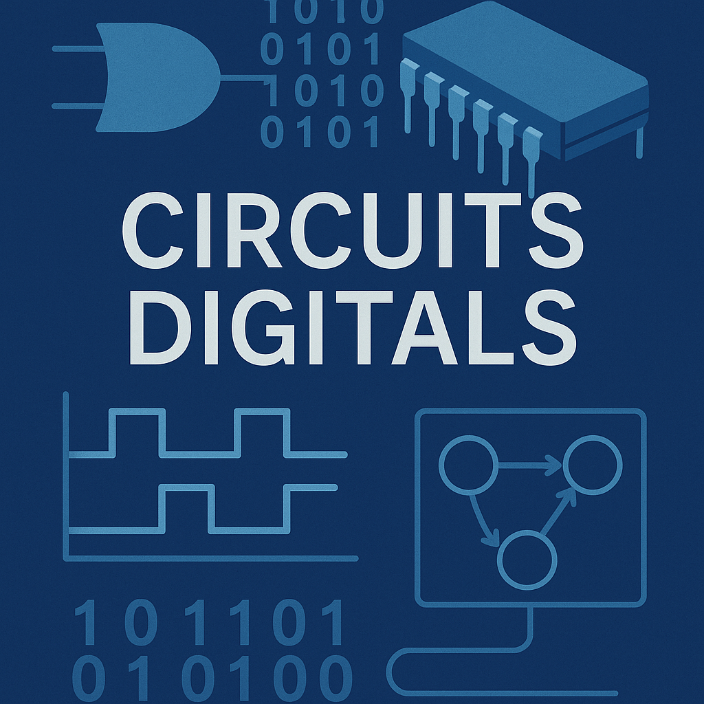
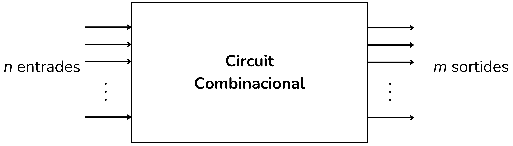
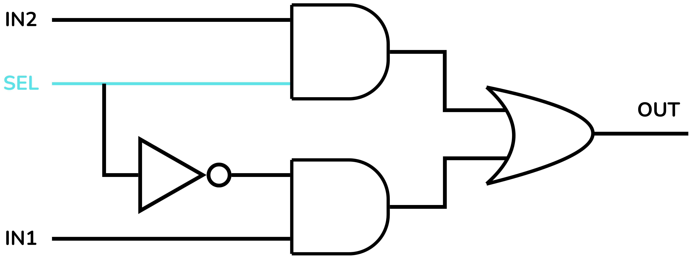
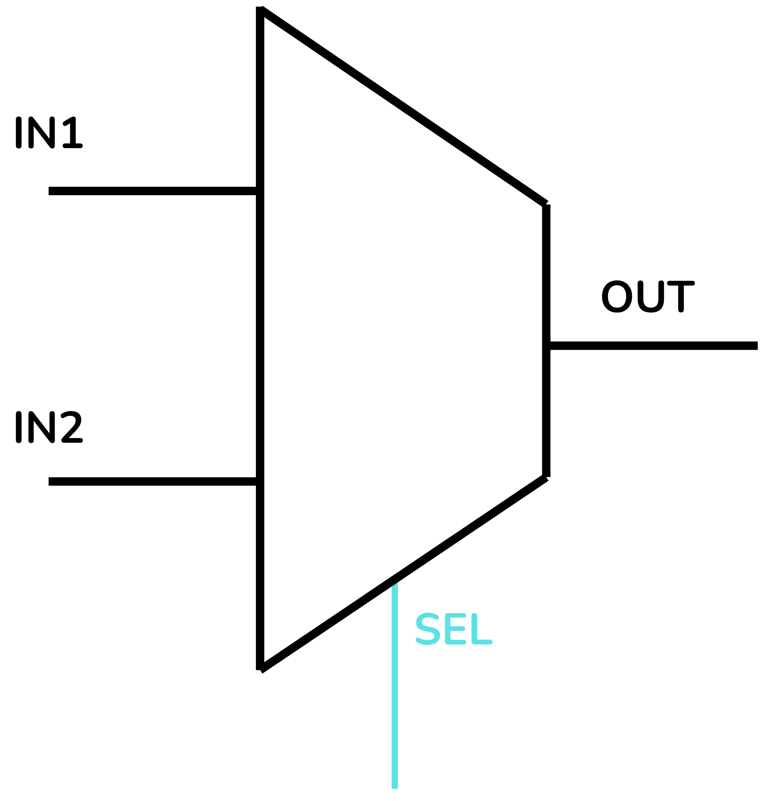
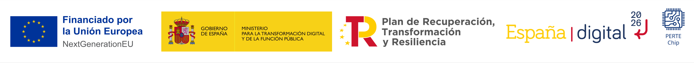

<!-- Posar aquesta imatge al començament de cada lliçó -->

 

# Introduction to combinational circuits

In a combinational circuit, the output value depends solely on the current values of the inputs. The output changes almost instantaneously when the inputs change.

Combinational circuits are built from basic logic gates. They have no internal feedback (the output is not reused as an input) and they also have no memory, unlike sequential circuits. Their operation can be described completely with Boolean algebra or with truth tables.

The basic combinational circuits are: Encoders, Decoders, Multiplexers (MUX), Demultiplexers (DEMUX), Adders, Subtractors and Comparators.

In this lesson you will find the following topics:

[Simple exercises](./exsimples.md), [Multiplexers](./multiplexors.md), [Voting systems](./svotacio.md), [Shifts](./busos.md), [Numbers](./nombres.md) and [BCD digits](./bcddigits.md). Each topic covers a different type of circuit: you will find examples and you will have to solve exercises using basic logic gates.

The topics [Simple exercises](./exsimples.md) and [Voting systems](./svotacio.md) will introduce you to the use of truth tables and Boolean algebra with examples and basic logic exercises.

<i>Simple circuit</i>

In the topic [Multiplexers](./multiplexors.md) you will learn to create MUX devices from logic gates.

 

<i>Multiplexer</i>

In the topic [Shifts](./busos.md) you will practice bit-shift operations and operations on bit sets.

<i>Example of a left shift (Left Shift)</i>

The exercises in the topic [Numbers](./nombres.md) deal with digital circuits responsible for performing arithmetic and logical operations on binary numbers.

In the topic [BCD](./bcddigits.md) (Binary Coded Decimal) we will introduce the encoding of numbers for 7-segment displays.

Finally, in the topic [Miscellany](./miscellania.md) you will find a collection of exercises that combine different concepts.

<!-- This image should go at the end of each lesson, either with this line or within the signature. Leave commented if it is already in the signature-->
  
<Autors autors="xcasas fmadrid"/>
