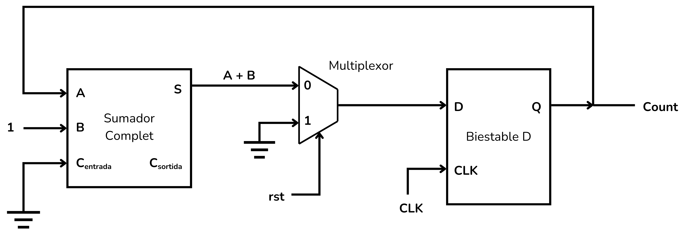
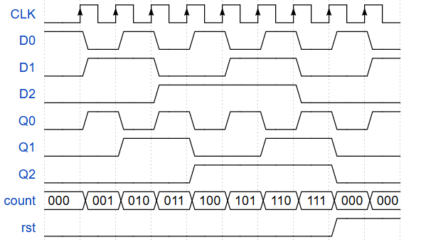
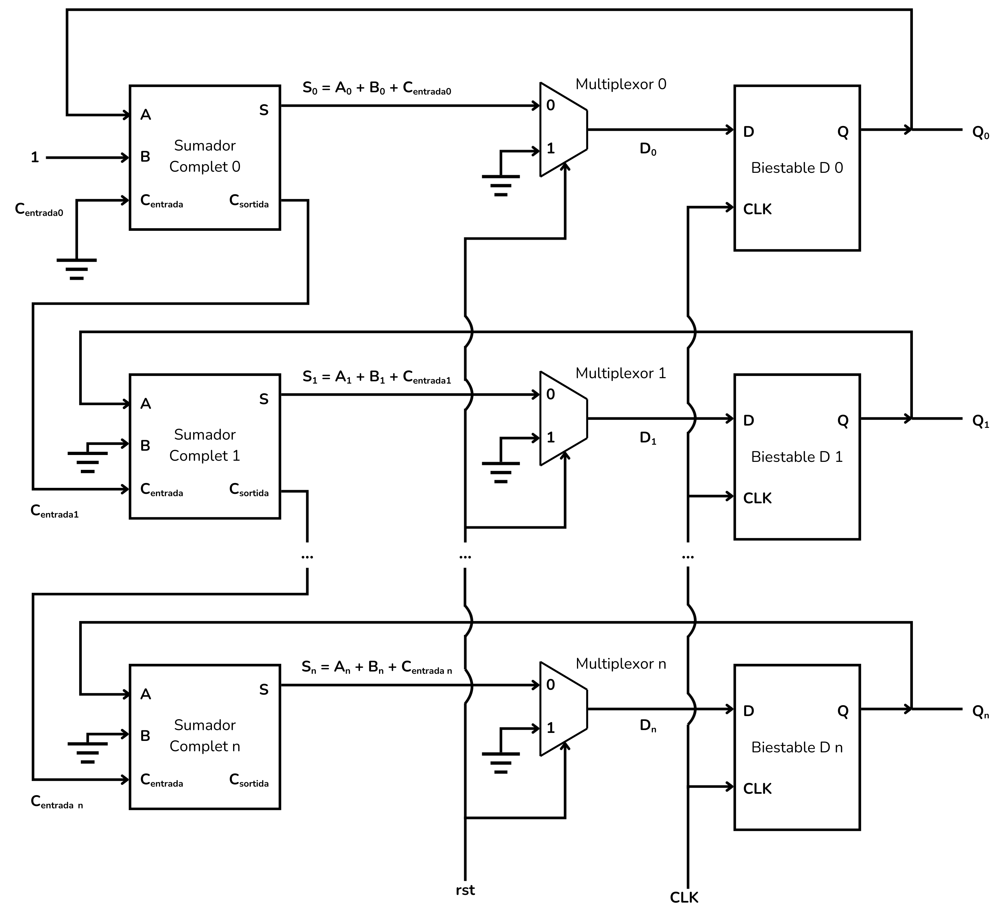
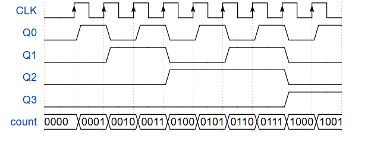
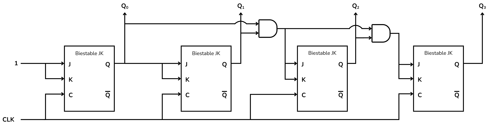
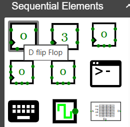
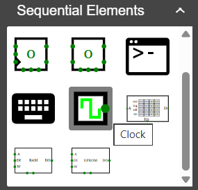
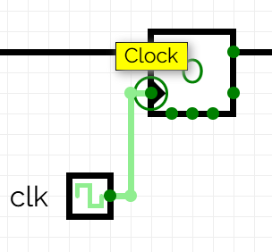
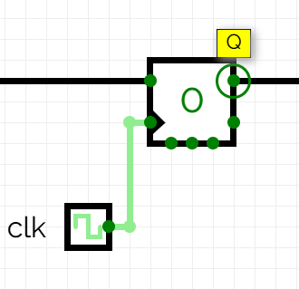
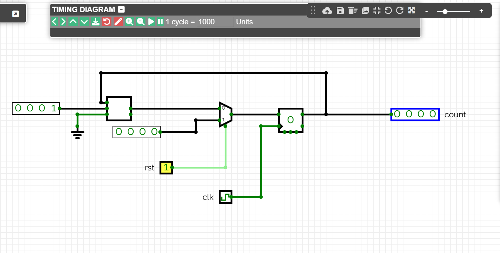

<!-- Posar aquesta imatge al començament de cada lliçó -->

 

# Counters

Sequential circuits called counters are digital circuits capable of traversing an ordered sequence of states in response to clock pulses. Each state represents a binary value, and the circuit can count forward or backward depending on the design.

Unlike combinational circuits, the current state of a counter depends on both the inputs and the previous state. This memory is implemented with bistable elements, typically of type T, D or JK.

Counters are used in time measurement, sequence generation, frequency division, and in internal clock and processor blocks.

The most common counters follow a binary sequence: 0000, 0001, 0010, 0011, ..., and when they reach the maximum value they can either wrap to zero (cyclic counter) or count backwards (bidirectional).

## MOD $2^n$ Binary Counter

A MOD $2^n$ counter is a sequential circuit with $n$ bistable elements that counts from $0$ to $2^n - 1$ and then returns to zero. It has exactly **$2^n$ distinct states**.

It is used for counting, generating sequences and dividing frequencies.

## 1-bit counter MOD $2^1$

The following counter has a single bit, using a single bistable. It is therefore a MOD $2^1$ counter, and it can count from 0 to 1.

This counter uses a D bistable, a full adder and a multiplexer. The adder always adds 1 to the value of $Q$, so the signal $Q+1$ reaches the D input of the bistable.

The multiplexer provides the ability to reset the counter. The select signal therefore acts as a reset signal (reset rst). When this signal is activated, the multiplexer connects a constant 0 to the bistable, resetting the counter.

### Operation

To understand how this counter works, we start with the bistable in a state $Q=0$. The table, later, records the result of this analysis.

Initial state:

The bistable is in a state $Q=0$ which will be passed to the adder, which will add the value 1 to it.

This signal, with value $A+B=1$, returns to the input of the bistable; the D input receives the signal 1.

$D=1$ but the state of the bistable has not yet updated with a clock signal, so $Q$ has not yet changed.

The counter is at zero ($Count=0$)

First pulse:

When a clock pulse is applied, the value at $D$ is copied to the output $Q$, which becomes $Q=1$.

The adder adds the constant value 1 and returns to the bistable the signal $A+B=0$.

The carry output is active, $C_{out}=1$, but we will not connect it anywhere.

Now the input of the bistable is $D=0$, but $Q$ will not change again until the next clock pulse.

The counter has counted up to 1 ($Count=1$)

Second pulse:

The next clock pulse copies the value $D=0$ to $Q$, returning us to the initial state, where $Count=0$.

|**Pulse**|**$D$**|**$Q$**|**$Count$** 
| :--: | :-: | :-: | :---: |
|   0  |  1  |  0  |   0   |
|   1  |  0  |  1  |   1   |
|   2  |  1  |  0  |   0   |
|   3  |  0  |  1  |   1   |

We can visualise the operation of this counter with the following timeline:

Regardless of the counter’s state, when the reset signal ($rst$) is activated, the multiplexer will force the counter back to its initial state.

## 3-bit MOD $2^3$ Counter

The following counter is 3 bits, using 3 bistables. It is therefore a MOD $2^3$ counter, capable of counting from 0 to 7.

This counter is composed of 3 D bistables, 3 full adders and, to enable a reset, 3 multiplexers.

From the bistables we obtain a 3-bit output $Q=[Q_2​ Q_1​ Q_0​]$.
The outputs $Q_i$ of the bistables are connected to the full adders, which are structured in a way equivalent to the [n-bit adder](../CircAritm/Aritmnbits#exemple-sumador-de--bits). For this reason the carry output of each adder, $C_{out}$, is connected to the carry input $C_{in}$ of the next.

This set of 3 full adders, i.e. this 3-bit adder, will continually add the constant $B=001$ to $Q$. Hence we connect $B_0=1$, $B_1=0$ and $B_2=0$.

The reset signal (reset, or $rst$) will create a synchronous reset of the counter, returning it to zero.

<i>MOD 2^3 Binary Counter</i>

### Operation

We analyse the operation of this counter, starting with all the bistables at zero. The table, later, records the result of this analysis.

Initial state:

The bistables are in the state $Q_0=0$, $Q_1=0$ and $Q_2=0$.

Adder 0 performs $0+1+0=1$, hence $D_0=1$.

Adder 1 performs $0+0+0=0$, hence $D_1=0$.

Adder 2 performs $0+0+0=0$, hence $D_2=0$.

There is no carry bit ($C_{out}$) active.

First pulse:

The clock pulse causes the $Q$ bits to update with the $D$ inputs, so $Q_0=1$, $Q_1=0$ and $Q_2=0$.

Therefore, $D_0=1$, $D_1=1$ and $D_2=0$, and $C_{out\,0}=1$

Second pulse:

The clock pulse updates the $Q$ bits with the $D$ inputs, so $Q_0=0$, $Q_1=1$ and $Q_2=0$

Therefore, $D_0=1$, $D_1=1$ and $D_2=0$, and no carry bit is active.

Third pulse:

The clock pulse updates the $Q$ bits with the $D$ inputs, so $Q_0=1$, $Q_1=1$ and $Q_2=0$.

Therefore, $D_0=0$, $D_1=0$ and $D_2=1$.

Two carry-out bits are active, $C_{out\,0}=1$ and $C_{out\,1}=1$ 

With the following clock pulses, the bistables go through all possible combinations, representing a growing binary number until all bistables reach state 1, i.e. $Q=111$.

Seventh pulse:

We have reached the counter’s maximum value, $Q_0=1$, $Q_1=1$ and $Q_2=1$.
The seventh clock pulse will drive the counter back to its initial state.

|**Pulse**|**$D_2$**|**$D_1$**|**$D_0$**|**$C_{out\,2}$**|**$C_{out\,1}$**|**$C_{out\,0}$**|**$Q_2$**|**$Q_1$**|**$Q_0$**|**Count$**
| :--: | :---: | :---: | :---: | :---: | :---: | :---: | :---: | :---: | :---: | :---: |
|0 |0|0|1|0|0|0|0|0|0|000|
|1 |0|1|0|0|0|1|0|0|1|001|
|2 |0|1|1|0|0|0|0|1|0|010|
|3 |1|0|0|0|1|1|0|1|1|011|
|4 |1|0|1|0|0|0|1|0|0|100|
|5 |1|1|0|0|0|1|1|0|1|101|
|6 |1|1|1|0|0|0|1|1|0|110|
|7 |0|0|0|1|1|1|1|1|1|111|
|8 |0|0|1|0|0|0|0|0|0|000|

The following figure shows the timeline for this counter.

Regardless of the counter’s state, when the reset signal is activated, the multiplexer will force the counter back to its initial state.

### n-bit MOD $2^n$ Counter

To implement an n-bit counter you need to cascade n bistables, n adders and n multiplexers in the same way. With this counter you can count from 0 up to $2^n$ .

<i>MOD 2^n Binary Counter</i>

## Asynchronous Binary Counter (Asynchronous Binary Counter or Ripple Counter)

An asynchronous binary counter, or ripple counter, is implemented with a series of bistables, usually of type JK.
The first bistable represents the least significant bit (LSB), which is clocked, and each subsequent one is driven by the output of the previous, so these bistables change state in a cascaded fashion.

<i>Asynchronous Counter</i>

- The JK bistables are connected such that J=K=1; therefore, the Q output toggles between 0 and 1 as the clock signal arrives.
- The bistables capture a clock signal only at the moment that this bit transitions from 0 to 1. It will not be considered to capture a clock signal while it remains at 1, at 0 or when it changes from 1 to 0.
- The output Q0 corresponds to the least significant bit (LSB); the output Qn corresponds to the most significant bit (MSB).
- The external clock signal is applied only to the input of the first bistable.
- The complementary output Q̄ of each bistable is connected to the clock input of the next bistable.

  - This means that when a bistable toggles Q from 1 to 0, Q̄ will go from 0 to 1, driving the clock input of the next bistable. This will cause that bistable to toggle.

  - In short: a bistable will toggle its state only when the previous bistable transitions from 1 to 0.

To understand how this counter works, we start with all bistables at '0'. 

**First pulse**:

The first bistable Q0 toggles from 0 to 1, Q̄0 goes from 1 to 0.

The second bistable does not detect a clock pulse, does not change state, and therefore Q1 remains at 0.

The third bistable and all following remain at 0.

**Second pulse**:

The first bistable Q0 goes from 1 to 0, Q̄0 goes from 0 to 1.

The second bistable detects a clock pulse, so Q1 goes from 0 to 1 and Q̄1 goes from 1 to 0.

The third bistable and all following remain at 0.

With the following clock pulses, the bistables propagate the toggles, going through all possible combinations, representing a growing binary number up to the point where all bistables are at state 1.
At that point, the next clock pulse toggles the first bistable from 1 to 0, the second as well, and so on; all bistables go from 1 to 0 in a cascade, returning to the starting point.

This table shows the sequence of the individual bits of the counter.

|**Pulse**|**$Q_3$**|**$Q_2$**|**$Q_1$**|**$Q_0$**|**$Count$**
|------              |------   |------   |------   |------   |------
|0  |0|0|0|0|0000
|1  |0|0|0|1|1000
|2  |0|0|1|0|0100
|3  |0|0|1|1|1100
|4  |0|1|0|0|0010
|···|···|···|···|···|···
|14 |1|1|1|0|0111
|15 |1|1|1|1|1111
|16 |0|0|0|0|0000

The following figure shows the timeline for this counter.

This type of counter accumulates propagation delays from all bistables when moving from one state to the next, and therefore is not suitable for high clock frequencies.

Counters are also frequency dividers. Each bit toggles at half the frequency of the previous bit, naturally making it a device that divides the clock frequency successively by 2.

## Synchronous Binary Counter

A synchronous binary counter is very similar to asynchronous counters, but in this case all the bistables receive the same clock signal and change state simultaneously.

It uses JK-type bistables and has the following structure:

<i>Synchronous Counter</i>

Bistable 0 has its J and K inputs connected so that J=K=1 and, therefore, its output $Q_0$ toggles between 0 and 1 whenever a clock signal $CLK$ is applied.

The output of bistable 0 ($Q_0$) is connected directly to the J and K inputs of bistable 1. In this way, when $Q_0=1$, the state of the bistable 1 ($Q_1$) will toggle between 0 and 1 whenever a clock signal arrives.

The J and K inputs of bistable 2, and the subsequent bistables, are controlled with an AND gate that receives the outputs of the two previous bistables. If the outputs of the two previous bistables are both 1 simultaneously, the AND gate activates and the inputs of the bistable receive the signal 1. In that case, the bistable will toggle between 0 and 1.

From bistable 2 onward, this structure is repeated until the counter is complete.

To understand how this counter works, we start with all the bistables at zero.

Initial state:

All bistables are at zero, $count=0000$.

First pulse:

The first bistable $Q_0$ toggles to $Q_0=1$.
The rest of the bistables do not toggle because their inputs are 0.
On this pulse the counter becomes $count=0001$.

Second pulse:

Since $Q_0=1$ or $Q_1=0$ the bistable 2 will not toggle.
Bistable 1 toggles to 1 because its input is 1.
Bistable 0 toggles to 0.
On this pulse the counter becomes $count=0010$.

Third pulse:

Since $Q_0=0$ and $Q_1=1$ the bistable 2 will not toggle.
Bistable 1 does not toggle because its input is 0.
Bistable 0 toggles to 1.
On this pulse the counter becomes $count=0011$.

Fourth pulse:

For the first time, the AND gate is activated upon receiving $Q_0=1$ and $Q_1=1$, so bistable 2 toggles to 1.
Bistable 1 toggles to 0 because its input is 1.
Bistable 0 toggles to 0.
On this pulse the counter becomes $count=0100$.

With the following clock pulses, the bistables move through all possible combinations, representing a growing binary number until all the bistables are in state 1.

Both the table and the timeline of the counter sequence are identical to the previous counter.

|**Pulse**|**$Q_3$**|**$Q_2$**|**$Q_1$**|**$Q_0$**|**$Count$** 
| :--: | :---: | :---: | :---: | :---: | :---: |
|0  |0|0|0|0|0000
|1  |0|0|0|1|1000
|2  |0|0|1|0|0100
|3  |0|0|1|1|1100
|4  |0|1|0|0|0010
|···|···|···|···|···|···
|14 |1|1|1|0|0111
|15 |1|1|1|1|1111
|16 |0|0|0|0|0000

## Example: 4-bit Counter
In this example we will see how to build a 4-bit counter.

    
    

The connections of the bistable that interest us are the D and Q, which mark the input and output of the memory element, and also CLK, which is the clock input.
The clock input is often represented with a triangle inside the element. 

    
    
    

The D bistable also has other inputs such as enables and resets that allow resetting or clearing information states. It also has a negated output $\bar{Q}$ for when one needs inverted outputs.

We want a counter that follows a 4-bit binary sequence, with successive values from 0000 to 1111. We also want to include a reset signal that returns the output to 0000. This behaviour can be achieved with an adder, a multiplexer and a 4-bit bistable as in the figure.

The clock pulse will cause the adder to add a constant 0001 to the counter output value of the bistable. In this example moving from 0100 to 0101.

The multiplexer will force the reset. When a **rst** signal enters, the state of the bistable will become 0000.

[CircuitVerse](https://circuitverse.org/simulator) includes an input *Asyncronous reset* at the bistables. To perform an asynchronous reset, remove the multiplexer and connect the signal $rst$ to the input *Asyncronous reset* of the bistable.

## Exercises on Jutge.org: [Introduction to Digital Circuit Design](https://jutge.org/courses/JordiCortadella:IntroCircuits)

- [Toggle](https://jutge.org/problems/X15508_en)
- [2-bit counter](https://jutge.org/problems/X81362_en)
- [Mod-3 counter](https://jutge.org/problems/X05944_en)
- [4-bit counter](https://jutge.org/problems/X35277_en)
- [Unconventional cyclic counter](https://jutge.org/problems/X97508_en)
- [Up-down counter](https://jutge.org/problems/X53256_en)
- [Mod-7 up-down counter](https://jutge.org/problems/X47159_en)

<small>Remember that to access the exercises and for Jutge to grade your solutions you must be enrolled in the course. You will find all instructions <a href="../Inici/instruccions.md">here</a>.</small>

<!-- This image should go at the end of each lesson, either with this line or within the signature. Leave commented if it is already in the signature-->
  
<Autors autors="xcasas fmadrid"/>
