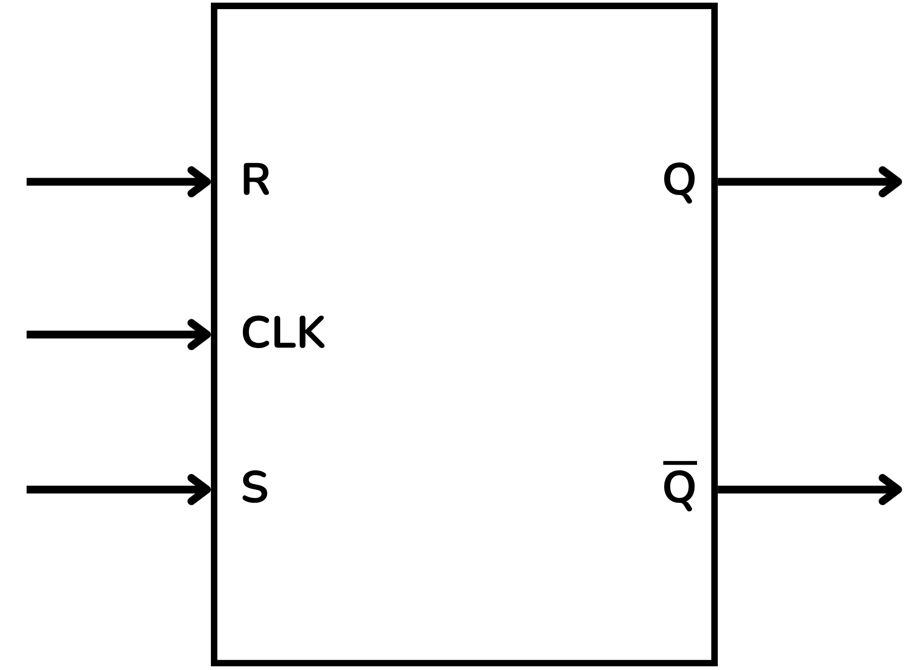
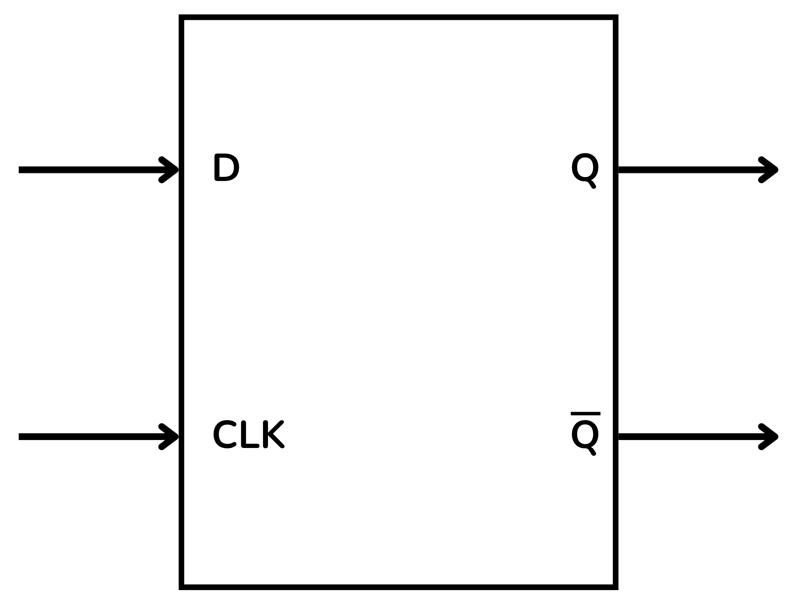
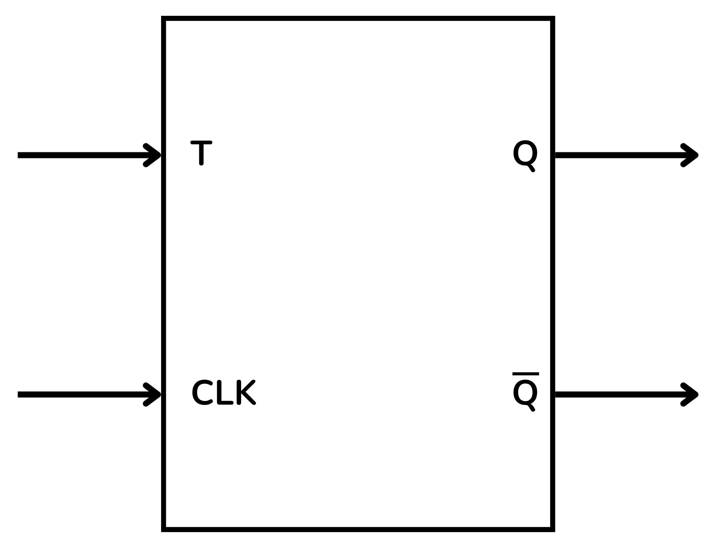
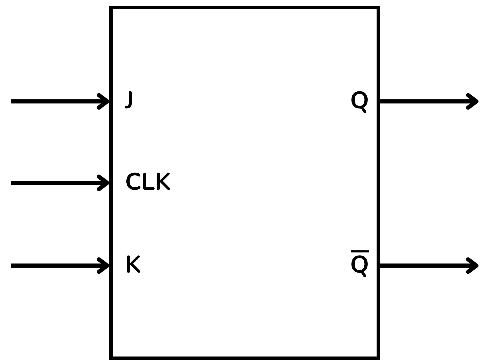

<!-- Posar aquesta imatge al començament de cada lliçó -->

 

# Introduction to Sequential Circuits

Sequential circuits are digital circuits in which the value of the output does not depend solely on the current inputs, but also on the circuit’s previous state; in other words, they have memory.

Unlike combinational circuits, which only compute instantaneous results from the inputs, sequential circuits store information about the past using memory elements.
They are fundamental in the construction of memories, counters, registers, control units and processors.

## Synchronisation and clock

Many sequential circuits operate synchronously with a clock signal that marks the pace at which state changes occur.

**Synchronous Sequential Systems**: State and output changes occur only at well-defined instants, marked by a periodic clock signal.
The clock synchronises the operation of the circuit, causing internal variables to change only on a rising or falling edge.

**Asynchronous Sequential Systems**: Operate continuously: changes in the inputs cause immediate changes in the internal variables, without waiting for a clock.
They are more difficult to design, as synchronization issues can arise.

## Function

According to their function, sequential circuits can be classified as:

* **Counters**: advance through a sequence of states according to the clock pulses; used to count events or generate binary patterns.
* **Registers**: store and shift binary data; used to hold temporary values or transmit information.
* **State machines**: models that describe the sequential behaviour of a system, defining state transitions based on inputs and the clock.
* **Memories**: devices designed to store large amounts of binary information.

## Memory and state

The ability to retain a previous value is achieved with a **memory element**.

* **State**: a set of information that the circuit needs to determine future behaviour.
* **Feedback**: the outputs are reintroduced as internal inputs, which allows information to be retained.

# The Flip-Flop

The fundamental component for creating memory in sequential circuits is the **flip-flop** (flip-flop in English), capable of storing a single bit.
Its output depends on its previous state and the current inputs.

Unlike a logic gate, the output of a flip-flop does not depend solely on the current inputs, but also on the previous state. This memory capability is the basis of all memory and control devices in digital systems.

There are several types of flip-flops. Below, we review the most important ones.

## The RS Flip-Flop (*Reset–Set*)

Also known as **SR** (*Set–Reset*). It has two inputs:

* $S$ (*Set*): forces the output $Q$ to 1.
* $R$ (*Reset*): forces the output $Q$ to 0.

It also has a clock input $CLK$, common in synchronous flip-flops.
The main output is $Q$ and the complement is $\bar{Q}$.

> S and R must not be activated simultaneously (forbidden condition).

<i>Functional diagram of the RS flip-flop</i>

This flip-flop is the basis of memories, counters, registers and state machines.

## The D Flip-Flop (*Data*)

It has a single input $D$ (*Data*) and a clock input $CLK$.
At each clock pulse, the value of $D$ is copied to the output.

Outputs:

* $Q$ (current state)
* $\bar{Q}$ (inverse state)

<i>Functional diagram of the D flip-flop</i>

It is the most widely used for creating synchronous registers and memories.

## The T Flip-Flop (*Toggle*)

The flip-flop **T** toggles the output state on each clock pulse, provided the input $T$ is active.

<i>Functional diagram of the T flip-flop</i>

## The JK Flip-Flop

Considered an improved version of the SR flip-flop, it resolves the forbidden-state problem and can operate in several modes depending on the inputs.

Inputs:

* $J$
* $K$
* $CLK$

Outputs:

* $Q$
* $\bar{Q}$

When the clock activates the flip-flop:

When the clock ($CLK$) activates the flip-flop:
+ If $J=1$ and $K=0$, the output $Q$ is set to 1.
+ If $J=0$ and $K=1$, $Q$ is reset to 0.
+ If $J=K=0$, no change; it retains the previous state.
+ If $J=K=1$, it toggles the state of $Q$.

<i>Functional diagram of the JK flip-flop</i>

<!-- This image should go at the end of each lesson, either with this line or within the signature. Leave commented if it is already in the signature-->
  
<Autors autors="xcasas fmadrid"/>
