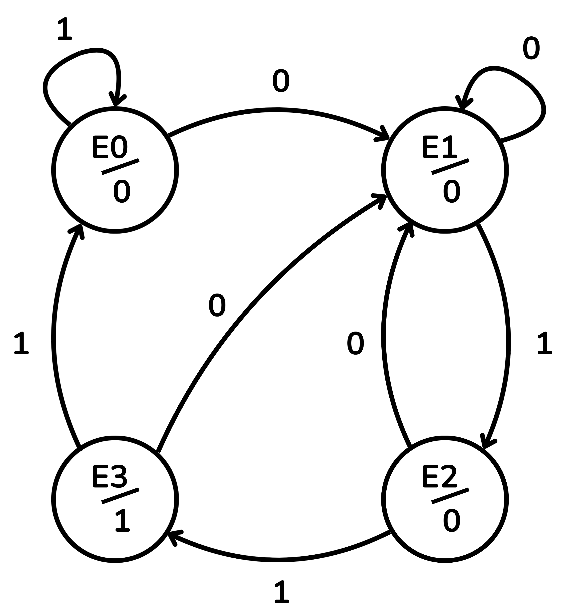
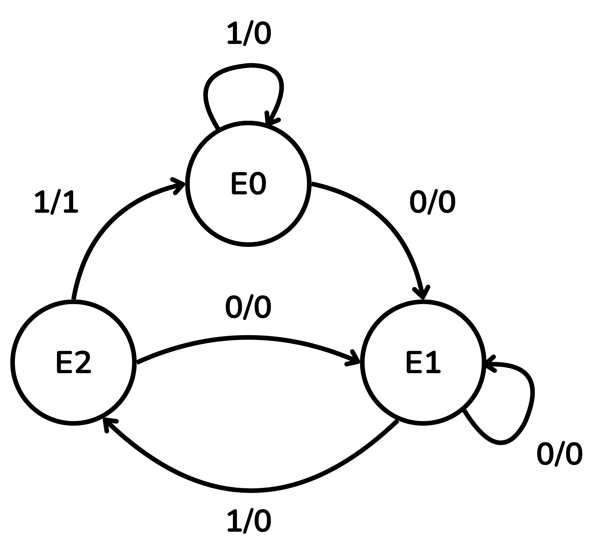
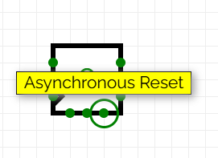

<!-- Posar aquesta imatge al començament de cada lliçó -->

 

# State Machines

A finite state machine (FSM) is a mathematical model that describes a system with a finite number of states that transitions from one state to another based on the current state, the inputs, and a set of predetermined rules. A digital circuit that implements an FSM has memory, and its output does not depend solely on the current inputs.

A digital circuit that implements a state machine has the following characteristics:

* It has a finite set of possible states, stored in bistables.
* It has a set of input signals.
* The transitions between states are implemented with combinational logic and depend on the current state and the inputs.
* The clock signal coordinates the updating of the state.

There are two main models: Moore machine and Mealy machine.

## Moore machine

In a Moore machine the output depends solely on the current state.

The behaviour of state machines can be visualised with a **state diagram**, which represents the machine's states, its inputs and its outputs.

In the state diagram of a Moore machine:

* The states are indicated by circles: E0, E1, E2…
* The arrows indicate transitions.
* The inputs appear on the arrows.
* The output is indicated inside the circle (State/Output).

<i>State diagram of a Moore machine</i>

The following table will help us navigate this example of the state diagram. The first column represents the current state of the machine and its corresponding output. When the clock signal triggers a state change, the next state will depend on the input. If $Entrada=0$ the machine will transition to the state in the second column, if $Entrada=1$ we will transition to the state in the third column.

<table>
  <thead>
    <tr>
      <th rowspan="2">Current state/output</th>
      <th colspan="2">Next state</th>
    </tr>
    <tr>
      <th>Input=0</th>
      <th>Input=1</th>
    </tr>
  </thead>
  <tbody>
    <tr>
      <td>E0 / 0</td>
      <td>E1</td>
      <td>E0</td>
    </tr>
    <tr>
      <td>E1 / 0</td>
      <td>E1</td>
      <td>E2</td>
    </tr>
    <tr>
      <td>E2 / 0</td>
      <td>E1</td>
      <td>E3</td>
    </tr>
    <tr>
      <td>E3 / 1</td>
      <td>E1</td>
      <td>E0</td>
    </tr>
  </tbody>
</table>

## Mealy machine

In a Mealy machine, the output depends on the current state and the current inputs. When the machine is in a given state, the output can change if the input changes, without waiting for the next state change. This can generate transient pulses between state changes.

Advantages:

* It often requires fewer states than a Moore machine.
* Fewer bistables and less combinational logic.

In the state diagram:

* The states are circles.
* The arrows indicate transitions.
* The arrow labels show *input/output*.

<i>State diagram of a Mealy machine</i>

The table below will help us understand the state diagram.
The first column represents the current state of the machine, its output will also depend on the input at that moment and is shown in the second and third columns. Only when the clock signal indicates will there be a change, which will take us to the state indicated in the fourth and fifth columns.

<table>
  <thead>
    <tr>
      <th rowspan="2">Current state</th>
      <th colspan="2">Output</th>
      <th colspan="2">Next state</th>
    </tr>
    <tr>
      <th>Input=0</th>
      <th>Input=1</th>
      <th>Input=0</th>
      <th>Input=1</th>
    </tr>
  </thead>
  <tbody>
    <tr>
      <td>E0</td>
      <td>0</td>
      <td>0</td>
      <td>E1</td>
      <td>E0</td>
    </tr>
    <tr>
      <td>E1</td>
      <td>0</td>
      <td>0</td>
      <td>E1</td>
      <td>E2</td>
    </tr>
    <tr>
      <td>E2</td>
      <td>0</td>
      <td>1</td>
      <td>E1</td>
      <td>E0</td>
    </tr>

  </tbody>
</table>

State machines are fundamental for designing logical components that need to follow a sequence or a protocol. They are used in:

* digital protocol controllers (SPI, I2C, UART),
* sequencers of complex operations (control units),
* pattern or sequence detectors,
* digital semaphores or control systems.

# Example: Two-cycle delay line

This circuit reads a binary sequence and replicates it with a delay of two cycles. During the first two cycles, the output value is 0.

Take as an example the following initial sequence of numbers:

$S_{entrada}: 1,1,0,0,1,1,1,1,0,0,0,1,0,1,…$

Output sequence (delayed by 2 cycles):

$S_{sortida}: 0,0,1,1,0,0,1,1,1,1,0,0,0,1,0,1,…$

To realise the delay we use two D-type bistables in series:

On each clock edge the following happens:
+ The value held in bistable 1 is read as the output $S_{sortida}$.
+ The value held in bistable 0 ($Q_0$) is moved to bistable 1 ($Q_1$).
+ The input $S_{entrada}$ is copied to bistable 0.

This structure delays any input by two cycles.

Using two D-type bistables, the machine has $2^2$ possible combinations, i.e. 4 states which we will denote $E0$, $E1$, $E2$ and $E3$:

|Current State|[$Q_1$, $Q_0$]|
|------|------|
|E0 |00 | Initial state (empty) |
|E1 |01 | The last bit that entered $Q_0$ is 1; the oldest bit $Q_1$ is 0 |
|E2 |10 | The last bit that entered $Q_0$ is 0; the oldest bit $Q_1$ is 1 |
|E3 |11 | The last two bits entered are 1 |

The table below specifies the possible next states depending on the input $S_{entrada}$.

<table>
  <thead>
    <tr>
      <th rowspan="2">Current state</th>
      <th colspan="2">Next state</th>
    </tr>
    <tr>
      <th>Sentrada=0</th>
      <th>Sentrada=1</th>
    </tr>
  </thead>
  <tbody>
    <tr>
      <td>00 (E0)</td>
      <td>00 (E0)</td>
      <td>01 (E1)</td>
    </tr>
    <tr>
      <td>01 (E1)</td>
      <td>10 (E2)</td>
      <td>11 (E3)</td>
    </tr>
    <tr>
      <td>10 (E2)</td>
      <td>00 (E0)</td>
      <td>01 (E1)</td>
    </tr>
    <tr>
      <td>11 (E3)</td>
      <td>10 (E2)</td>
      <td>11 (E3)</td>
    </tr>
  </tbody>
</table>

To this circuit we will add a reset signal $rst$ (reset) that returns all bistables to 0. If $rst=1$, the two bistables reset and we return to the initial state E0. If $rst=0$, the circuit continues operating normally.

The complete state diagram is:

<i>State diagram of the 2-cycle delay, with reset signal rst</i>

Since the output $S_{sortida}$ depends solely on the current state, this circuit is a Moore machine.

Once the state diagram is complete, we move on to building the circuit in [CircuitVerse](https://circuitverse.org/simulator). We connect the two D bistables in series sharing the same clock signal and the same reset signal (*rst*).

In the Judge’s exercises the reset signals are always synchronous, so we will do the same in this example, connecting the two bistables to the same synchronous reset.

Thus the *rst* signal should be connected to the Preset input of the D bistable and not to the Asynchronous reset input.

    
    

To initialise the values, two multiplexers are added. The *rst* signal is the selector:

* The first multiplexer has as inputs the input signal $S_{entrada}$ and a constant 0. Its output is connected to the $D$ input of the first bistable.
* The second multiplexer has as inputs the output $Q$ of the first bistable and the same constant 0. Its output is connected to the $D$ input of the second bistable.

We will verify its operation with an initial example sequence:

$S_{entrada} : 1, 1, 1, …$

With *rst = 1*, the bistables are at 0 (state E0) and $S_{sortida}=0$.

With *rst=0*, let the circuit evolve.

On the first clock edge the value of $S_{entrada}=1$ is loaded into the first bistable. The 0-state of the first bistable moves to the second bistable and $S_{sortida}$ remains 0. We have thus moved to state $E1$.

On the second clock edge, the value of $S_{entrada}=1$ is loaded into the first bistable, the value from the first bistable 1 is loaded into the second bistable and therefore $S_{sortida}=1$. We are at state $E2$.

At this point in the process, the first value of $S_{entrada}$ has been transferred from input to output passing through the two bistables. The next two values are loaded into the bistables and subsequent clock signals will transfer them toward the output.
Thus this circuit implements a queue between $S_{entrada}$ and $S_{sortida}$ with the input signal taking two cycles to traverse.

In these first two clock signals, the input and output sequences effectively implement a two-cycle delay:

$S_{entrada}$ : 1, 1, 1, …

$S_{sortida}$ : 0, 0, 1, …

## Exercises on Jutge.org: Introduction to Digital Circuit Design

- [Last two equal](https://jutge.org/problems/X71700_en)
- [Delayed sequence](https://jutge.org/problems/X32741_en)
- [Even number of 0's and 1's](https://jutge.org/problems/X02999_en)
- [Circuit from state diagram](https://jutge.org/problems/X76378_en)
- [Sequence 110](https://jutge.org/problems/X02122_en)
- [Recognizing sequences](https://jutge.org/problems/X49909_en)
- [Is it divisible by 3?](https://jutge.org/problems/X80381_en)
- [Simple state machine](https://jutge.org/problems/X78930_en)
- [Traffic-light controller](https://jutge.org/problems/X88681_en)
- [Vending machine](https://jutge.org/problems/X77254_en)

<small>Remember that to access the exercises and for Jutge to evaluate your solutions you must be enrolled in the [course](https://jutge.org/courses/JordiCortadella:IntroCircuits). You will find all instructions [here](../Inici/instruccions.md).</small>

<!-- This image should go at the end of each lesson, either with this line or within the signature. Leave commented if it is already in the signature-->
  
<Autors autors="xcasas fmadrid"/>
