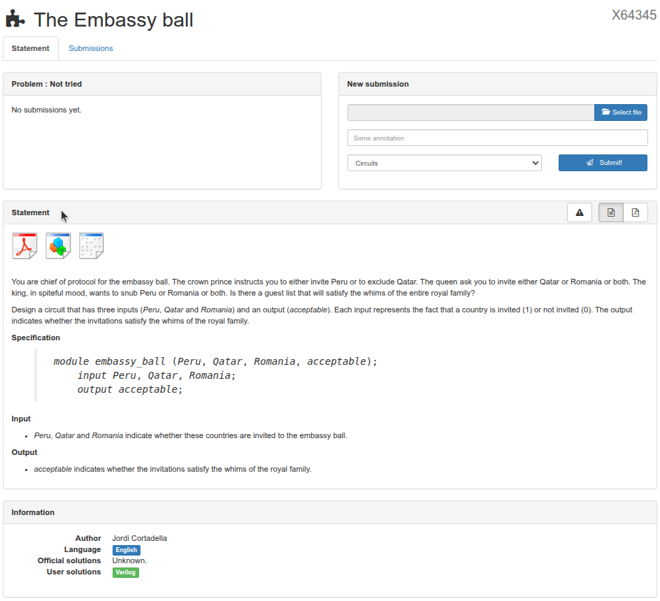
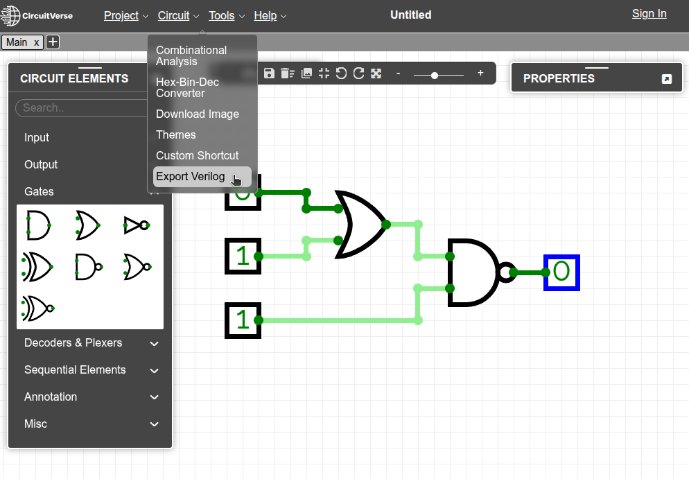
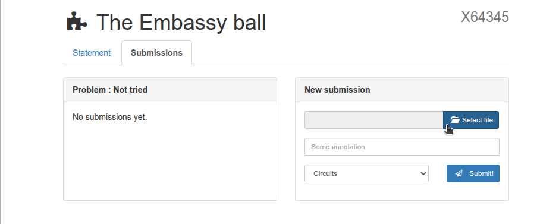
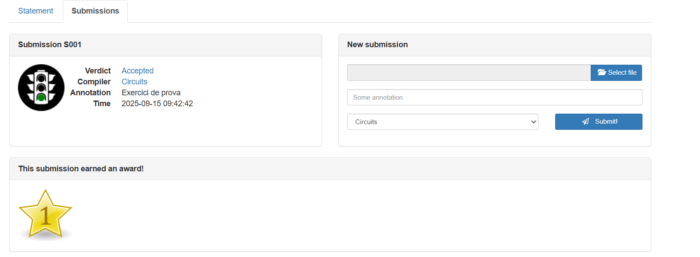
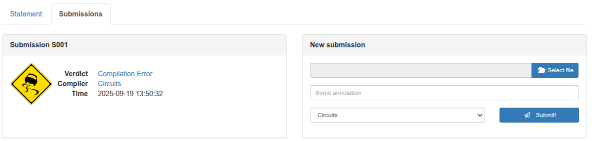
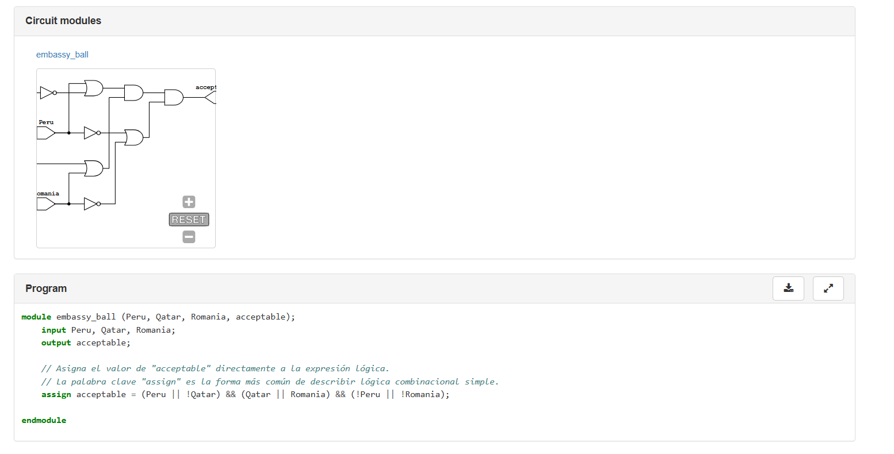

<!-- Posar aquesta imatge al començament de cada lliçó -->

 

# Instructions

## How to follow the lessons
In the left-hand menu you will find the lessons that make up this educational resource.
You can start with the first lesson: the introduction to digital circuits, Boolean algebra and Karnaugh maps.

The remaining lessons are devoted to the different types of digital circuits and contain the theory and one or two examples. In addition, at the end of each lesson we propose completing some exercises from the course [Introduction to Digital Circuit Design](https://jutge.org/courses/JordiCortadella:IntroCircuits), on [Jutge.org](https://jutge.org).
In this section you can find the instructions for solving the problems and submitting them for verdict by our Judge. Review them when you need to.

<video controls controlsList="nodownload noplaybackrate"   disablepictureinpicture
style="width: 90%; display: block; margin: 0 auto;">
  <source src="../../Inici/vid_tuto.mp4" type="video/mp4">
</video>

## Registration on Jutge.org and the course

To access the proposed exercises you will need to register on the Jutge.org platform. This registration is free.

Remember that Jutge.org is a UPC educational platform. The user registration is used to track your progress in the exercises. UPC has no commercial interest and does not collect personal data.

Once you have access to Jutge.org resources, you can enrol in the course [Introduction to Digital Circuit Design](https://jutge.org/courses/JordiCortadella:IntroCircuits) from the [Courses](https://jutge.org/courses) section, by clicking the "Enroll this course" button.

 

Within this course you will find the exercise statements. You will also be able to submit your solutions to Jutge, which will evaluate their validity and issue a verdict.

## Exercises menu and how to submit your solution to an exercise

You can access each exercise from the portal’s top menu, either directly from the course or from the [Problems](https://jutge.org/problems) section.

 

The exercises are organised by topics and each has a unique identifying code.

You can also access the exercises directly from the lessons via the links you will find there. This is a quicker alternative, but remember that you must first be logged in to Jutge.org.

The exercise page looks like this:

There you will find the exercise's Statement that describes the exercise, which can be downloaded as a PDF or ZIP.
It also includes a Specification that describes the inputs and outputs the circuit must have.
The New Submission menu is used to present your solution to the exercise.

After selecting the exercise, you will need to solve it using the knowledge you have learned.

To design a solution circuit we will use CircuitVerse, a free and open-source platform designed to create and simulate digital logic circuits online.
With this tool we will draw our circuit and export it to present it to Jutge.

In CircuitVerse you can drag logic gates onto your circuit, connect them and test the truth table.

CircuitVerse gives you the option to save and download your circuit. In the Project/Save Offline menu you can save and download your circuit in the ".cv" format. In the Export as file section you can load a previously saved circuit.

To submit the solution to Jutge, export the circuit from CircuitVerse in Verilog format. Go to the Tools menu and choose the Export Verilog option to download a Verilog file with a ".v" extension.

Verilog is a hardware description language (HDL - Hardware Description Language) that can be used to describe digital electronic circuits such as microprocessors or logic components.

Submit your exercise to Jutge. Upload the file you just generated inside the exercise’s New submission area.

By clicking the Submit button, Jutge will analyse your file.

Once the process is complete, you will be able to see the verdict and Jutge's feedback, whether it went well or poorly.

If the verdict is unfavourable, the hint section shows clues about what may have gone wrong.

If the verdict is favourable, the solution circuit will be shown in the Circuit modules section.
The Program section shows the Verilog code of the circuit you submitted.

You can try it again as many times as needed. In the Submission window, the total number of files and corrections will be noted. You can view them by clicking on the submission number (S001, S002...).

Jutge has different verdicts depending on the circuit you submit. The most common ones are shown below:

You can find the [full list of verdicts](http://jutge.org/documentation/verdicts/all) with a description of their meaning.

<!-- This image should go at the end of each lesson, either with this line or within the signature. Leave commented if it is already in the signature-->
  
<Autors autors="xcasas fmadrid"/>
