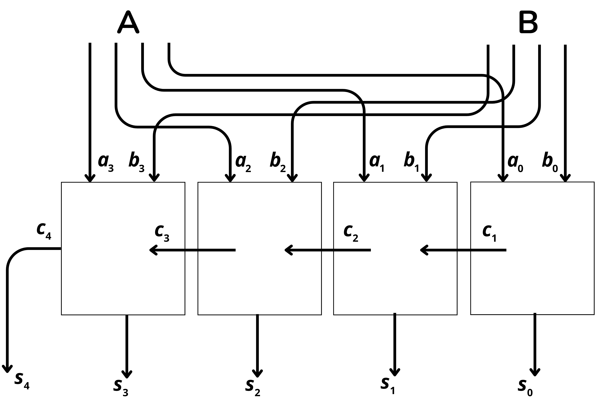
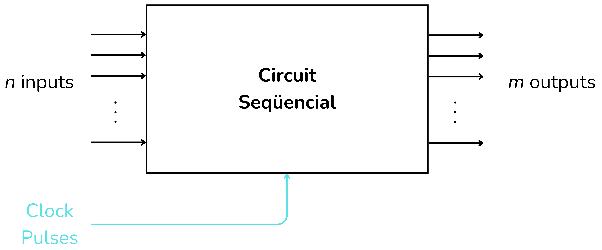

<!-- Posar aquesta imatge al començament de cada lliçó -->

 

# Introduction to digital circuits

In these lessons you will learn what digital circuits are and their different types. You will find examples and exercises to understand combinational circuits, sequential circuits, and arithmetic circuits.

The **digital circuits** process information represented in binary format, which uses only two electrical states: low voltage and high voltage, which represent binary values 0 and 1. The fundamental components of digital circuits are logic gates. These are the basis of microprocessors, memories, controllers, and any other complex digital circuit.

The **logic gates** are small circuits that perform basic logical operations on one or more binary input signals and produce a single binary output signal. To use logic gates and create digital circuits, you need to understand Boolean algebra concepts and truth tables. In many examples and exercises in digital circuits we will use truth tables or a Boolean expression to describe the logical behaviour of a circuit.

|**Logic gate**|**Symbol** |**Logical Expression** |**Description**|
|------          |------     |:---:                |------        |
|Buffer |   |$A$                        |Returns the same bit|
|NOT    |      |$\bar{A}$                  |Inverts the bit|
|AND    |      |$A·B$                      |1 if both inputs are 1|
|OR     |       |$A+B$                      |1 if at least one input is 1|
|NAND   |     |$\overline{A·B}$           |AND inverted (AND followed by NOT)|
|NOR    |      |$\overline{A+B}$           |OR inverted (OR followed by NOT)|
|XOR    |      |$A·\bar{B}+\bar{A}·B$      |1 if the inputs are different|
|XNOR   |     |$(A·B)+(\bar{A}·\bar{B})$  |1 if the inputs are equal|

 

The basic logic gates are AND, OR, and NOT. A **truth table** shows all possible input combinations for a logic circuit or Boolean function, and the corresponding output for each of those combinations.

A [**combinational circuit**](../CircCombin/intro.md) is a type of digital circuit in which the value of its output at any moment depends solely on the current values of its inputs. Built only with simple logic gates, they have no feedback or memory. Their behaviour can be described with truth tables and Boolean functions.

<i>Combinational circuit</i>

The [**arithmetic circuits**](../CircAritm/intro.md) are an important subclass of digital circuits that are combinational. Their function is to perform basic mathematical operations on binary numbers.

<i>This example is an arithmetic circuit: an adder</i>

The [**sequential circuits**](../CircSeq/intro.md) are a type of digital circuit that, unlike combinational or arithmetic circuits, incorporate feedback and have memory. Consequently, their output depends not only on the current inputs but also on their previous state or input history. Many of them use a clock to coordinate state changes.

<i>Sequential circuit</i>

The lesson [**Tiny Micro**](../TinyMicro/intro.md) is a collection of advanced exercises on the operation of a small computer.

<!-- This image should go at the end of each lesson, either with this line or within the signature. Leave commented if it is already in the signature-->
  
<Autors autors="xcasas fmadrid"/>
