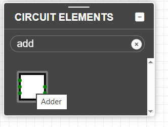
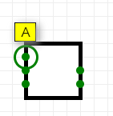
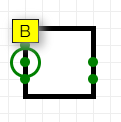
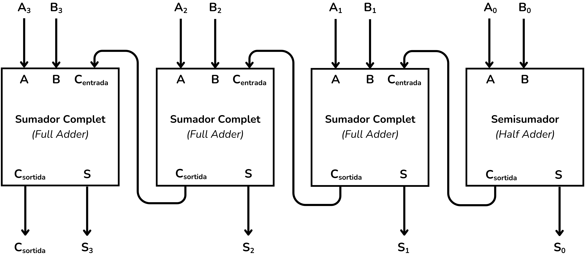
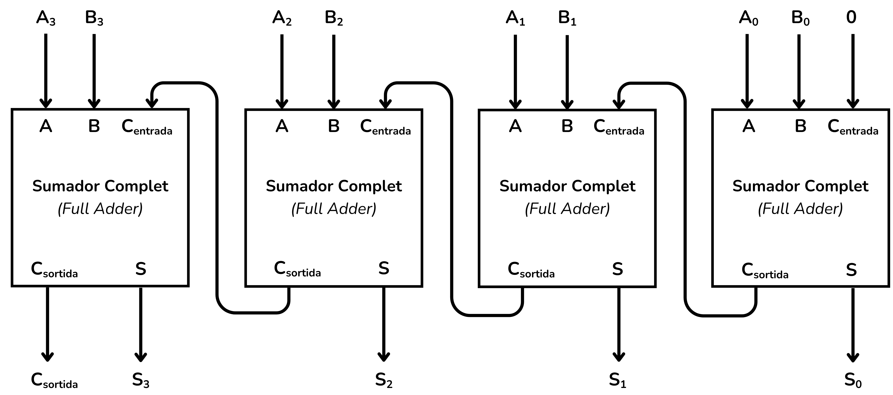
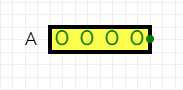
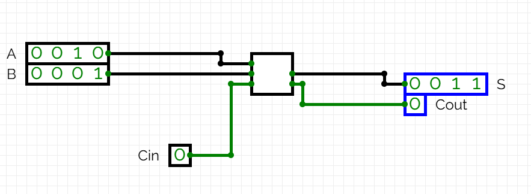
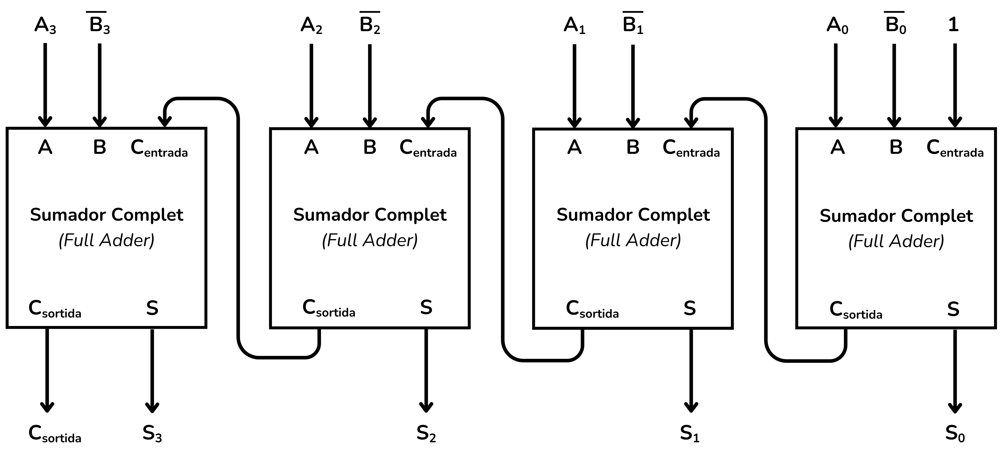
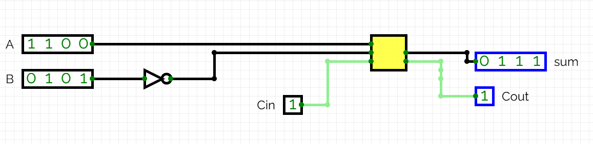
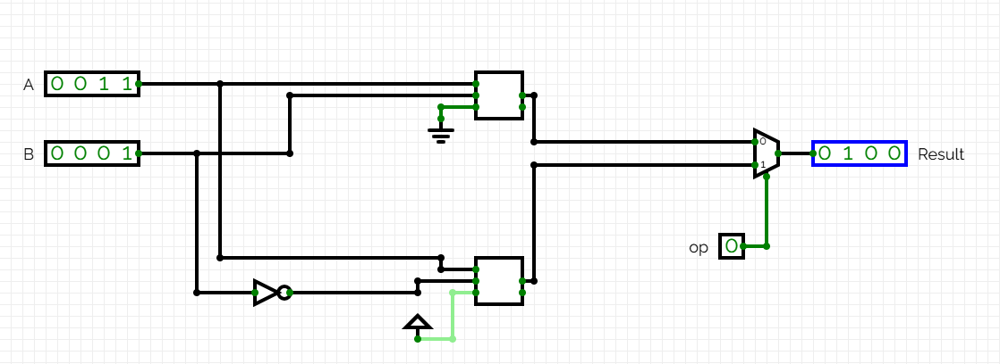

<!-- Colocar esta imagen al inicio de cada lección -->

 

# Aritmética de 4 bits

A continuación trataremos algunos circuitos aritméticos que realizan operaciones con 4 bits. Veremos ejemplos de sumadores y restadores de 4 bits y una ULA (ALU) muy simple.

## Ejemplo: Suma de números de 4 bits

En este ejemplo veremos cómo podemos sumar dos números binarios de 4 bits.
Los sumadores binarios (*ripple-carry adders*) se pueden construir con sumadores completos (*full adders*) y un semisumador (*half adder*). Tratándose de una suma de 4 bits, tendremos que encadenar 3 sumadores completos y un semisumador, o bien 4 sumadores completos si configuramos el primer sumador completo como semisumador.

[CircuitVerse](https://circuitverse.org/simulator) tiene un objeto llamado *adder* que implementa una suma.

 

  
  
  
  
  

Las entradas **A** y **B** son las variables que se suman y **Cin** es el bit de acarreo de entrada. Las salidas son **Sum** con el resultado y **Cout** con el acarreo de salida. Si pasamos el cursor por las entradas y salidas del objeto podemos ver su nombre.

El circuito que efectúa la suma concatena 3 sumadores completos y un semisumador:

<i>Sumador de 4 bits</i>

Si conviene, podemos implementar el mismo circuito con 4 sumadores completos. La función del semisumador la puede realizar un sumador completo si introducimos una constante $0$ en su entrada $C_{entrada}$.

<i>Sumador de 4 bits (alternativo)</i>

Implementémoslo en CircuitVerse:

<i>Sumador de 4 bits en CircuitVerse</i>

En este ejemplo los valores de entrada son:

* Entrada **A** = 0010
* Entrada **B** = 0001

Y las salidas:

* Salida **S = A + B**
* Salida **Cout** = acarreo de salida

En Jutge.org, los ejercicios de álgebra de 4 bits y álgebra de $n$ bits utilizan la nomenclatura de buses $A[3:0]$ (definida en Busos) y entradas/salidas de 4 o $n$ bits.
Para que Jutge pueda validar correctamente el circuito, es necesario utilizar la propiedad *BitWidth* de las entradas, salidas y *adders*. Este parámetro se puede ver en el menú *Properties*:

  
  

Una vez cambiado el *BitWidth* a 4 podemos hacer la suma con un único *adder* y simplificar el circuito:

En CircuitVerse, las entradas y salidas de 4 bits tienen cable de color negro, mientras que **Cin** y **Cout**, de solo 1 bit, son de color verde.

## Ejemplo: Resta de números de 4 bits

Para restar dos números binarios emplearemos la fórmula:

$$S = A - B = A + (\bar{B} + 1)$$

En este ejemplo realizaremos una resta de 4 bits. Consideremos:

* Entrada **A** = 1100 (12 en decimal)
* Entrada **B** = 0101 (5 en decimal)
* Salida **S = A - B** (4 bits)
* Salida **Cout** = acarreo de salida

Primero negamos $B$:

$$B = 0101  \Rightarrow  \bar{B} = 1010$$

Después hacemos la suma:

$$S = A + \bar{B} + 1 = 1100 + 1010 + 1 = 1100 + 1011 = 0111$$

La siguiente tabla especifica esta operación bit a bit (no es una tabla de verdad):

|   bit   | $A_i$ | $\bar{B_i}$ | $C_i$ | $S_i$ | $C_{salida}$ |
| :-----: | :---: | :---------: | :---: | :---: | :-----------: |
| 0 (LSB) |   0   |      0      |   1   |   1   |       0       |
|    1    |   0   |      1      |   0   |   1   |       0       |
|    2    |   1   |      0      |   0   |   1   |       0       |
| 3 (MSB) |   1   |      1      |   0   |   0   |       1       |

El circuito que realiza la resta concatena 4 sumadores, con $\bar{B}$ y $C_{entrada} = 1$:

<i>Restador de 4 bits</i>

A CircuitVerse se representa así:

<i>Restador de 4 bits</i>

Con *BitWidth = 4* simplificamos el circuito:

## Ejemplo: Elegir operaciones

Además de realizar operaciones aritméticas, los circuitos aritméticos también pueden implementar la selección de una operación. Las ULA (ALU) permiten elegir entre operaciones en función de una variable. Este ejemplo explora esta funcionalidad.

Queremos implementar un circuito que elija entre una suma y una resta en función de la variable de entrada $op$.

* Si $op = 0$, se realiza una suma.
* Si $op = 1$, se realiza una resta.

Para realizar la suma de 4 bits $A + B$ usaremos un *Adder* de *BitWidth = 4*. El acarreo de entrada (**Cin**) debe ser 0, así que conectaremos a tierra.

Para hacer la resta emplearemos:

$$S = A - B = A + \bar{B} + 1$$

Para negar $B$ utilizaremos una puerta NOT de 4 bits. El *acarreo* de entrada (**Cin**) debe ser 1, así que utilizaremos una fuente de alimentación (Power).

Afegint la peça del circuit que fa la resta obtenim:

Tant *Power* com *Ground* es poden localitzar al menú d’inputs de CircuitVerse. Totes dues funcionen com a una constant. *Power* sempre té el valor 1 i *Ground* sempre té valor 0.

Ara cal afegir la part del circuit capaç de triar entre una operació i l’altra a partir de la variable d'entrada $op$. Utilitzarem un multiplexor, com el que es mostra a l'apartat de [Multiplexors](../CircCombin/multiplexors.md) dels circuits combinacionals. Els multiplexors deixen passar un senyal o l'altre en funció d'una variable selectora i això és el que ens cal en aquest cas.

El circuit complet, afegint aquest darrer element, és el següent:

<i>Suma seleccionada</i>

<i>Resta seleccionada</i>

Podemos usar un multiplexor con más de dos entradas para gestionar más operaciones posibles.  
Dentro del menú de propiedades del multiplexor en CircuitVerse se puede modificar el número de entradas con la propiedad *control signal size*.

Las UAL (ALU) normalmente eligen entre 4 operaciones (multiplexores de 4 entradas) con un selector $op$ de 2 bits.

## Ejercicios en Jutge.org:[Introduction to Digital Circuit Design](https://jutge.org/courses/JordiCortadella:IntroCircuits)

- [4-bit adder](https://jutge.org/problems/X64833_en)  
- [4-bit incrementer](https://jutge.org/problems/X58456_en)  
- [4-bit adder/subtractor](https://jutge.org/problems/X42916_en)  
- [4-bit comparator](https://jutge.org/problems/X61860_en)  
- [4-bit ALU](https://jutge.org/problems/X35448_en)

<small>Recuerda que para acceder a los ejercicios y para que el Jutge valore tus soluciones debes estar inscrito en el [curso](https://jutge.org/courses/JordiCortadella:IntroCircuits). Encontrarás todas las instrucciones [aquí](../Inici/instruccions.md).</small>

<!-- Esta imagen debe ir al final de cada lección, ya sea con esta línea o dentro de la firma. Dejar comentado si ya está a la firma-->
  
<Autors autors="xcasas fmadrid"/>