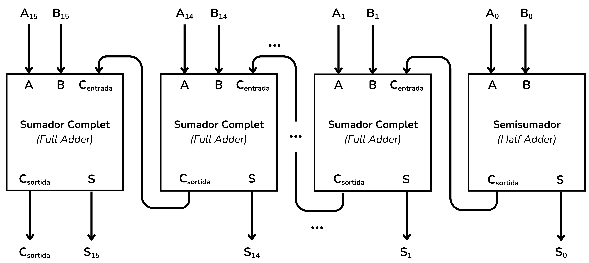
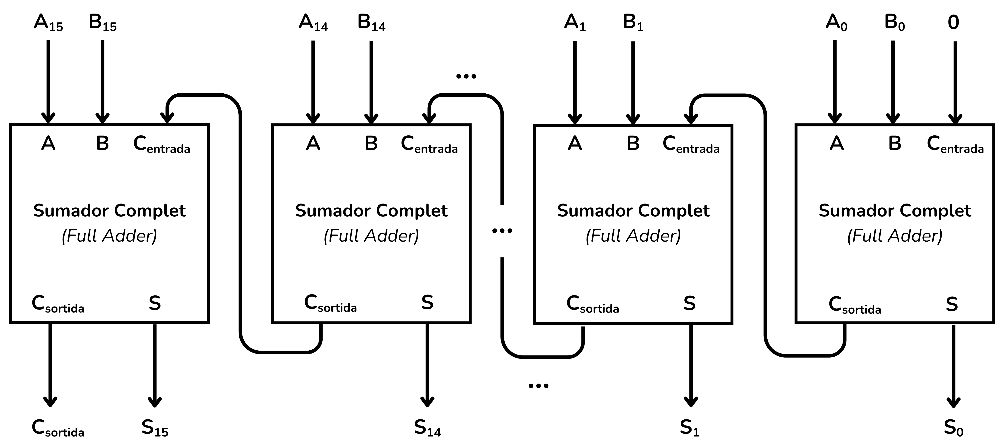
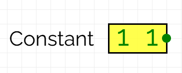
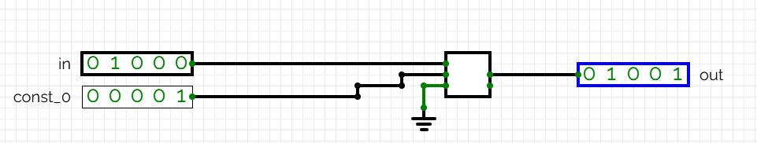
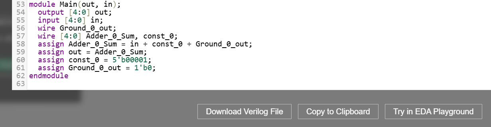

<!-- Colocar esta imagen al inicio de cada lección -->

 

# Aritmética de n bits

La aritmética de $n$ bits se refiere a circuitos digitales que operan con un número arbitrario de bits. La variable $n$ puede ser un valor grande, como $n=16$ en los ejercicios del curso.
Se pueden implementar sumadores, restadores, comparadores, incrementadores, etc.
Aquí veremos dos ejemplos: un **sumador** y un **incrementador**.

## Ejemplo: Sumador de $n = 16$ bits

Para hacer un sumador de $n$ bits, hay que concatenar **$n-1$ sumadores completos** y **un medio sumador**.
Así, para sumar dos números binarios $A$ y $B$ de 16 bits, concatenaremos 15 sumadores completos y un medio sumador:

<i>Sumador de 16 bits</i>

Las entradas son $A$ y $B$. Las salidas son:

- la suma, S (16 bits), y
- el bit de acarreo de salida $C_{out}$.

Para simplificar el circuito podemos utilizar sumadores completos en todas les etapas, con $C_{in} = 0$ en el primer sumador. Al igual que ocurría con los sumadores de 4 bits, un sumador completo puede realizar la función de un medio sumador si $C_{in} = 0$.

<i>Sumador de 16 bits implementado con sumadores completos</i>

El circuito final tendrá la misma estructura que los sumadores de 4 bits, pero con 16 bloques concatenados en lugar de 4.

## Ejemplo: Incrementador de $n$ bits

Diseñaremos un incrementador de **$n = 5$ bits**. Este circuito incrementa el valor de una entrada binaria $A$ en una unidad.

Para hacer-ho, sumaremos a $A$ el valor binario:

$$00001$$

En este caso, en lugar de una variable utilizaremos una **constante**.

En [CircuitVerse](https://circuitverse.org/simulator) hay un bloque de entrada llamado *valor constante*, que permite definir un valor fijo.

Al hacer doble clic sobre el bloque, podemos especificar el valor de la constante, como en estos ejemplos:

    
    

Para implementar el incrementador, simplemente sumaremos la constante 00001 a la variable $A$ con un sumador de 5 bits.
Por ejemplo, si $A = 01000$:

CircuitVerse no considera el valor constante como una variable de entrada en formato Verilog.
Esto significa que el bloque **const_0** forma parte del circuito incrementador, y no una entrada externa:

## Ejercicios en Jutge.org:[Introduction to Digital Circuit Design](https://jutge.org/courses/JordiCortadella:IntroCircuits)

- [Sumador de n bits](https://jutge.org/problems/X84292_en)
- [Incrementador de n bits](https://jutge.org/problems/X41839_en)
- [Sumador/restador de n bits](https://jutge.org/problems/X89356_en)
- [Comparador de n bits](https://jutge.org/problems/X37457_en)

<small>Recordad que para acceder a los ejercicios y para que el Jutge valore vuestras soluciones debéis estar inscritos en el curso. Encontrarás todas las instrucciones [aquí](../Inici/instruccions.md).</small>

<!-- Esta imagen debe ir al final de cada lección, ya sea con esta línea o dentro de la firma. Dejar comentado si ya está a la firma-->
  
<Autors autors="xcasas fmadrid"/>