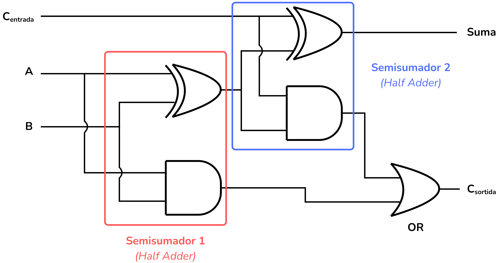

<!-- Colocar esta imagen al inicio de cada lección -->

 

# Circuitos básicos

Comenzamos por los circuitos digitales aritméticos más básicos, como los semisumadores, los sumadores completos y los comparadores de bits.

## Ejemplo: Semisumador (*Half Adder*)

El semisumador (*half adder* en inglés) es la base de los sumadores completos (*full adders* en inglés) y de las sumas de $n$ bits.

Diseñaremos un circuito que toma dos bits, $A$ y $B$, y calcula:

* la **Suma** ($Suma$), y
* el **acarreo** ($Acarreo$).

La tabla de verdad de la función que queremos implementar es la siguiente:

| $A$ | $B$ | $Suma$ | $Acarreo$ |
| :-: | :-: | :----: | :-----: |
|  0  |  0  |    0   |    0    |
|  0  |  1  |    1   |    0    |
|  1  |  0  |    1   |    0    |
|  1  |  1  |    0   |    1    |

Cuando $A = B = 1$, la suma desborda, es decir, no se puede representar con un solo bit de salida. El resultado de este desbordamiento es el bit de acarreo (carry en inglés) que es un dígito de orden superior.

Podemos utilizar Mapas de Karnaugh o las reglas del Álgebra de Boole para deducir las dos expresiones booleanas simplificadas que describen la lógica del circuito:

$$Suma= \bar{A} \cdot B + A \cdot \bar{B}= A \oplus B$$
$$Acarreo= A \cdot B$$

Así pues, el circuito que implementa este Semisumador (Half Adder) es el siguiente:

<i>Circuito semisumador</i>

Este circuito es uno de los elementos que construyen los sumadores completos y sumadores de $n$ bits.

## Ejemplo: Sumador completo (*Full Adder*)

Diseñaremos un sumador completo (*full adder* en inglés) que suma 3 bits de entrada: los bits $A$ y $B$ más un bit de acarreo de entrada $C_{in}$. Representa una suma de dos bits que tiene en cuenta un posible bit de acarreo proveniente de una suma anterior dentro de una cadena de sumas.

Su salida es un bit resultado de la suma, y un bit de acarreo de salida $C_{out}$.

La tabla de verdad del circuito es:

| $A$ | $B$ | $C_{in}$ | $Suma$ | $C_{out}$ |
|:---:|:---:|:---:|:---:|:---:|
| 0 | 0 | 0 | 0 | 0 |
| 0 | 1 | 0 | 1 | 0 |
| 1 | 0 | 0 | 1 | 0 |
| 1 | 1 | 0 | 0 | 1 |
| 0 | 0 | 1 | 1 | 0 |
| 0 | 1 | 1 | 0 | 1 |
| 1 | 0 | 1 | 0 | 1 |
| 1 | 1 | 1 | 1 | 1 |

Podemos utilizar Mapas de Karnaugh o las reglas del Álgebra de Boole para deducir las dos expresiones booleanas simplificadas que describen la lógica del circuito:

$$Suma= A \oplus B \oplus C_{in}$$
$$C_{out}= A \cdot B + B \cdot C_{in} + A \cdot C_{in} = A \cdot B + C_{in} \cdot (A \oplus B)$$

Así pues, el circuito que implementa un sumador completo (*Full Adder*) es el siguiente:

<i>Sumador completo</i>

Este circuito se puede interpretar como **dos semisumadores** con una puerta OR para el bit de acarreo de salida:

<i>Sumador completo</i>

## Ejemplo: Comparador

Diseñaremos un circuito comparador que toma dos bits, $A$ y $B$, y los compara.

Los circuitos comparadores tienen 3 salidas: la primera indica si $A$ es mayor que $B$, la segunda se activa si $A$ es igual a $B$ y la tercera indica si $A$ es menor que $B$.

La tabla de verdad es:

| $A$ | $B$ | $Salida_{A<B}$ | $Salida_{A=B}$ | $Salida_{A>B}$ |
| :-: | :-: | :-------------: | :-------------: | :-------------: |
|  0  |  0  |        0        |        1        |        0        |
|  0  |  1  |        1        |        0        |        0        |
|  1  |  0  |        0        |        0        |        1        |
|  1  |  1  |        0        |        1        |        0        |

Expresiones simplificadas:

$$Salida_{A<B} =\bar{A}B$$
$$Salida_{A=B} = \bar{A}\bar{B} + A B = A \; XNOR \; B$$
$$Salida_{A>B} = A \bar{B}$$

Así, el circuito comparador es el siguiente:

<i>Circuito comparador</i>

## Ejemplo: Sumador de diversos bits

Con el sumador completo (*full adder*) y el semisumador (*half adder*) se pueden construir circuitos más grandes, como los sumadores de propagación de acarreo (*ripple-carry adders*), que permiten sumar números binarios de varios bits.

Por ejemplo, el siguiente sumador de cuatro bits:

<i>Sumador de 4 bits</i>

## Ejercicios en Jutge.org:[Introduction to Digital Circuit Design](https://jutge.org/courses/JordiCortadella:IntroCircuits)

- [Semisumador] (https://jutge.org/problems/X27385_en)
- [Sumador completo] (https://jutge.org/problems/X12983_en)
- [Comparador de 1 bit] (https://jutge.org/problems/X60848_en)

<small>*Recuerda que para acceder a los ejercicios y para que el Jutge valore tus soluciones debes estar inscrito en el [curso](https://jutge.org/courses/JordiCortadella:IntroCircuits). Encontrarás todas las instrucciones [aquí](../Inici/instruccions.md).*</small>

<!-- Esta imagen debe ir al final de cada lección, ya sea con esta línea o dentro de la firma. Dejar comentado si ya está a la firma-->
  
<Autors autors="xcasas fmadrid"/>
