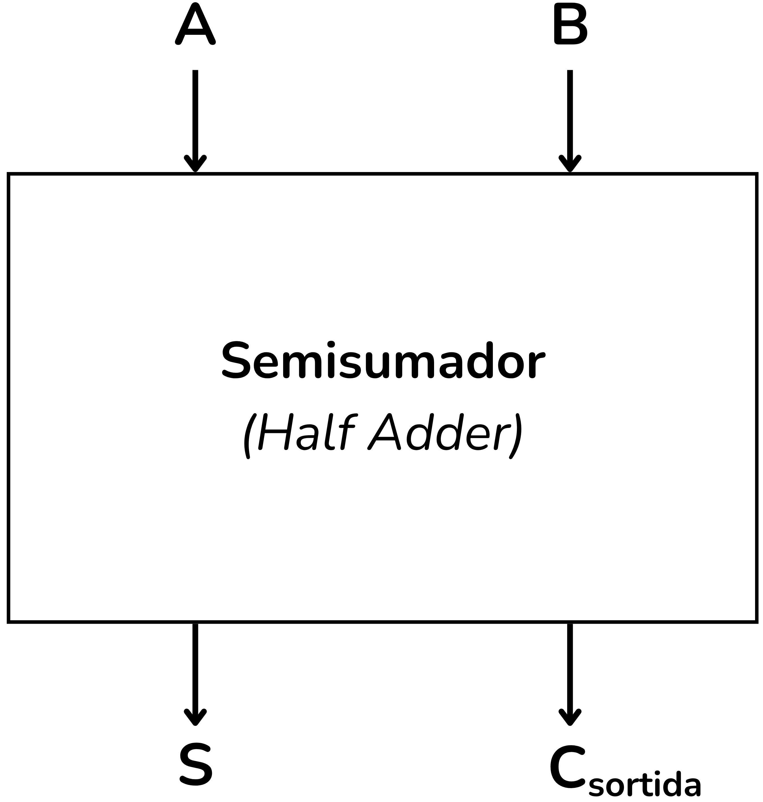
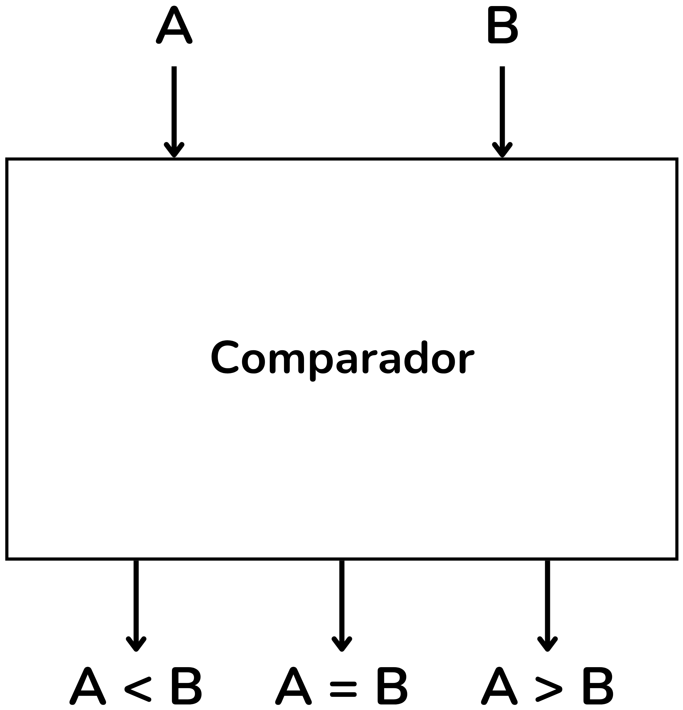

<!-- Colocar esta imagen al inicio de cada lección -->

 

# Introducción a los circuitos aritméticos

Los circuitos aritméticos son una subclase fundamental de los **circuitos digitales combinacionales**. Las operaciones básicas más habituales que implementan son:

**Semisumador (*Medio sumador*)**: Circuito que suma dos bits y produce una salida de suma $S$ y un bit de acarreo $C$.

<i>Semisumador (Medio sumador)</i>

**Sumador completo (*Sumador completo*)**: Suma tres bits (dos de entrada y el acarreo de la etapa anterior). Es el bloque básico para construir sumadores de varios bits mediante la conexión en cascada.

<i>Sumador completo (Sumador completo)</i>

**Sumador de n bits**: Con semisumadores y sumadores completos se pueden construir sumadores de $n$ bits. Este circuito realiza la suma binaria de dos números $A$ y $B$.

<i>Sumador de 4 bits</i>

**Restador**: La resta binaria se resuelve habitualmente empleando sumadores y la representación en **complemento a dos**.
Así, la resta $A - B$ se transforma en la suma:

$$A + (-B)$$

<i>Restador de 4 bits</i>

**Comparadores**:
Circuitos que determinen si un número binario es **mayor**, **menor** o **igual** que otro.

<i>Comparador</i>

**Multiplicadores y divisores**:
Circuitos más complejos que se implementan mediante algoritmos basados en sumas repetidas y desplazamientos.

<i>Multiplicador</i>

Los circuitos aritméticos constituyen el núcleo de las **Unidades Aritmético-Lógicas (UAL)**, el corazón de cualquier microprocesador.
La UAL es la encargada de ejecutar tanto las operaciones aritméticas como las operaciones lógicas necesarias para la ejecución de los programas.

La Unidad Aritmético-Lógica (**UAL**) se denomina ALU en inglés.

<i>Unidad Aritmético-Lógica (UAL)</i>

## Contenido de la lección

* En el tema [**Circuitos básicos**](./CircBasics.md) se presentan el semisumador, el sumador completo y los comparadores.
* En el tema [**Aritmética de 4 bits**](./Aritm4bits.md) se trabajan incrementadores, sumadores de 4 bits y un ejemplo de UAL.
* En el tema [**Aritmética de n bits**](./Aritmnbits.md) se generalizan incrementadores, sumadores y comparadores para $n$ bits.
* Finalmente, en el tema de [**Miscelánea**](./miscellania.md) se recogen ejercicios más avanzados como multiplicadores, acumuladores de bits y circuitos secuenciales *sumadores*.

<!-- Esta imagen debe ir al final de cada lección, ya sea con esta línea o dentro de la firma. Dejar comentado si ya está a la firma-->
  
<Autors autors="xcasas fmadrid"/>