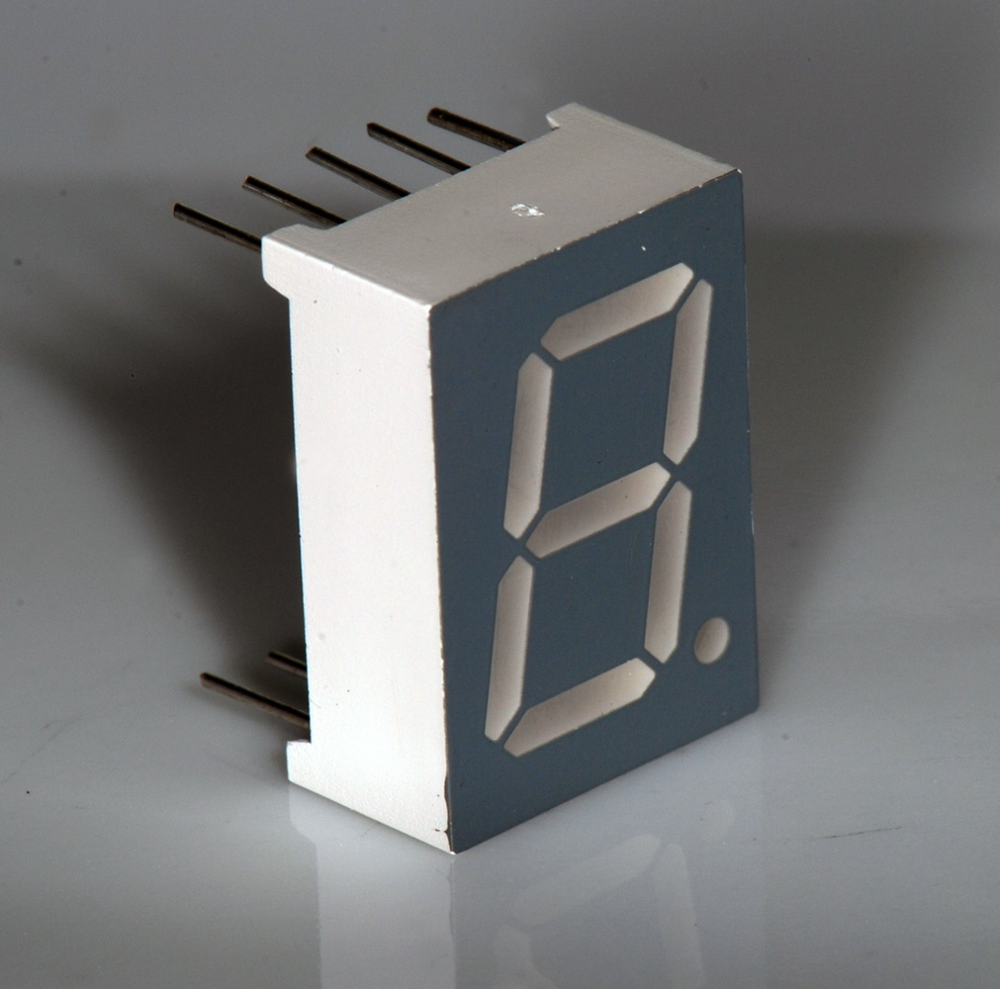
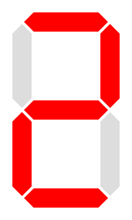
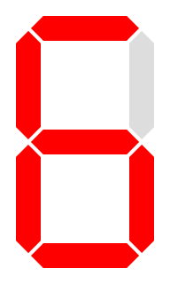
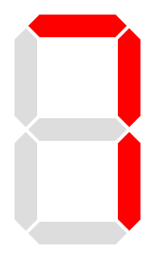
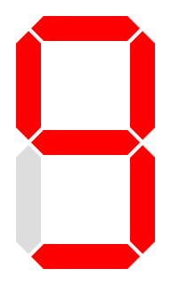

<!-- Colocar esta imagen al inicio de cada lección -->

 

# Dígitos BCD

En circuitos digitales, un número Decimal Codificado en Binario (**BCD**) es una forma de representar dígitos decimales utilizando 4 bits. Cada dígito del 0 al 9 se convierte en una secuencia binaria fija.

| **Dígito decimal** | **BCD** |
|---|---|
|0 | 0000|
|1 | 0001|
|2 | 0010|
|3 | 0011|
|4 | 0100|
|5 | 0101|
|6 | 0110|
|7 | 0111|
|8 | 1000|
|9 | 1001|

Esta codificación es muy utilizada en displays numéricos y calculadoras.

## Ejemplo: Diseño de un circuito para un display de 7 segmentos

Queremos construir un circuito que reciba un dígito BCD y encienda los segmentos correspondientes de un display de 7 segmentos (cátodo común) para mostrarlo.

$$D[3:0] = [D_3\ D_2\ D_1\ D_0]$$

<i>Display de 7 segmentos</i>

<a href="https://creativecommons.org/licenses/by-sa/3.0" title="Creative Commons Attribution-Share Alike 3.0">CC BY-SA 3.0</a>, <a href="https://commons.wikimedia.org/w/index.php?curid=2550282">Link</a>

La figura siguiente muestra cómo se llaman los segmentos:

<i>Disposición de los segmentos</i>

En la tabla siguiente indicamos qué segmentos deben encenderse para cada dígito decimal de entrada $D[3:0]$. Un **1** significa segmento encendido; un **0**, apagado.

| dígito   decimal | BCD   $D_3 D_2 D_1 D_0$ | $a$ | $b$ | $c$ | $d$ | $e$ | $f$ | $g$ | display
|:---:|:---:|---|---|---|---|---|---|---|---
| 0 | 0000 | 1| 1| 1| 1| 1| 1| 0|
| 1 | 0001 | 0| 1| 1| 0| 0| 0| 0|
| 2 | 0010 | 1| 1| 0| 1| 1| 0| 1|
| 3 | 0011 | 1| 1| 1| 1| 0| 0| 1|
| 4 | 0100 | 0| 1| 1| 0| 0| 1| 1|
| 5 | 0101 | 1| 0| 1| 1| 0| 1| 1|
| 6 | 0110 | 1| 0| 1| 1| 1| 1| 1|
| 7 | 0111 | 1| 1| 1| 0| 0| 0| 0|
| 8 | 1000 | 1| 1| 1| 1| 1| 1| 1|
| 9 | 1001 | 1| 1| 1| 1| 0| 1| 1|
|10   don't care| 1010| x| x| x| x| x| x| x
|11   don't care| 1011| x| x| x| x| x| x| x
|12   don't care| 1100| x| x| x| x| x| x| x
|13   don't care| 1101| x| x| x| x| x| x| x
|14   don't care| 1110| x| x| x| x| x| x| x
|15   don't care| 1111| x| x| x| x| x| x| x

## Condiciones indiferentes (don't care)

Los 4 bits de entrada pueden codificar valores del 0 al 15. Pero un dígito BCD sólo usa los valores de 0 a 9. Los casos del 10 al 15 no se mostrará nunca y, por tanto, se marcan como x (don’t care).

A la hora de buscar agrupaciones en el mapa de Karnaugh, les podemos asignar los valores que más nos convengan para obtener expresiones más simples.

## Expresiones booleanas simplificadas

Es necesario hacer un mapa de Karnaugh para cada una de las salidas del circuito para obtener la expresión booleana de cada segmento.

Con respecto a las condiciones indiferentes, el valor de $x=1$ da como resultado ecuaciones más simples.

El proceso completo y detallado se puede encontrar en diversas fuentes:
[enlace 1](https://informatika.stei.itb.ac.id/~rinaldi.munir/Matdis/2019-2020/Makalah2019/13518127.pdf), 
[enlace 2](https://www.electricaltechnology.org/2018/05/bcd-to-7-segment-display-decoder.html), 
[enlace 3](https://steamcommunity.com/sharedfiles/filedetails/?id=2900823549)

Obtenemos las siguientes expresiones para los segmentos:

* **Segmento a:**
  $$a = D_3 + D_1 + D_2\overline{D_0} + \overline{D_2}D_0$$

* **Segmento b:**
  $$b = \overline{D_2} + \overline{D_1}\overline{D_0} + D_1D_0$$

* **Segmento c:**
  $$c = D_2 + \overline{D_1} + D_0$$

* **Segmento d:**
  $$d = D_3 + \overline{D_2}\overline{D_0} + D_1\overline{D_0} + \overline{D_2}\overline{D_1} + D_2\overline{D_1}D_0$$

* **Segmento e:**
  $$e = \overline{D_2}\overline{D_0} + D_1\overline{D_0}$$

* **Segmento f:**
  $$f = D_3 + D_2\overline{D_1} + \overline{D_1}\overline{D_0} + D_2\overline{D_0}$$

* **Segmento g:**
  $$g = D_3 + \overline{D_2}D_1 + D_2\overline{D_1} + D_1\overline{D_0}$$

Aquestes expressions booleanes permeten implementar el circuit amb portes AND, OR i NOT. Les entrades són els bits $D_3, D_2, D_1, D_0$ i les sortides són els segments $a, b, c, d, e, f, g$.

Aquestes característiques són molt habituals en electrònica digital bàsica.

## Verificación con ejemplos

Para asegurarnos de que las fórmulas funcionan correctamente, calculamos algunos dígitos.

### Ejemplo: dígito 2 $D = 0010$
Resultados esperados: los segmentos **a, b, d, e, g** encendidos; **c, f** apagados.

* segmento a = 0 + 1 + 0 · \bar{0} + \bar{0}  · 0  = 1

* segmento b = \bar{0} + \bar{1} · \bar{0} + 1·0 = 1

* segmento c = 0 + \bar{1} + 0 = 0

* segmento d = 0 + \bar{0} · \bar{0} + 1 · \bar{0} + \bar{0} · \bar{1} + 0 · \bar{1} + 0 = 1

* segmento e = \bar{0} · \bar{0} + 1 · \bar{0} = 1

* segmento f = 0 + 0 · \bar{1} + \bar{1} · \bar{0} + 0 · \bar{0} = 0

* segmento g = 0 + \bar{0} · 1 + 0 · \bar{1} + 1 · \bar{0} = 1

### Ejemplo: dígito 4 $(D = 0100$
Resultados esperados: segmentos **b, c, f, g** encendidos.

* segmento a = 0 + 0 + 1 · \bar{0} + \bar{1} · 0 = 1

* segmento b = \bar{1} + \bar{0} · \bar{0} + 0 · 0 = 1

* segmento c = 1 + \bar{0} + 0 = 1

* segmento d = 0 + \bar{1} · \bar{0} + 0 · \bar{0} + \bar{1} · \bar{0} + 1 · \bar{0} · 0 = 0

* segmento e = \bar{1} · \bar{0} + 0 · \bar{0} = 0

* segmento f = 0 + 1 · \bar{0} + \bar{0} · \bar{0} + 1 · \bar{0} = 1

* segmento g = 0 + \bar{1} · 0 + 1 · \bar{0} + 0 · \bar{0} = 1

### Ejemplo: dígito 9  $D = 1001$
Resultados esperados: segmentos **a, b, c, d, f, g** encendidos.

* segmento a = 1 + 0 + 0 · \bar{1} + \bar{0} · 1 = 1

* segmento b = \bar{0} + \bar{0} · \bar{1} + 0 · 1 = 1

* segmento c = 0 + \bar{0} + 1 = 1

* segmento d = 1 + \bar{0} · \bar{1} + 0 · \bar{1} + \bar{0} · \bar{0} + 0 · \bar{0} · 1 = 1

* segmento e = \bar{0} · \bar{1} + 0 · \bar{1} = 0

* segmento f = 1 + 0 · \bar{0} + \bar{0} · \bar{1} + 0 · \bar{1} = 1

* segmento g = 1 + \bar{0} · 0 + 0 · \bar{0} + 0 · \bar{1} = 1

## Ejercicios en Jutge.org:[Introduction to Digital Circuit Design](https://jutge.org/courses/JordiCortadella:IntroCircuits)

- [7-segment digit](https://jutge.org/problems/X37276_en)
- [Is it a BCD digit?](https://jutge.org/problems/X31983_en)
- [Square of a BCD digit](https://jutge.org/problems/X77297_en)

<small>*Recuerda que para acceder a los ejercicios y para que el Jutge valore tus soluciones debes estar inscrito en el [curso](https://jutge.org/courses/JordiCortadella:IntroCircuits). Encontrarás todas las instrucciones [aquí](../Inici/instruccions.md).*</small>

<!-- Esta imagen debe ir al final de cada lección, ya sea con esta línea o dentro de la firma. Dejar comentado si ya está a la firma-->
  
<Autors autors="xcasas fmadrid"/>
