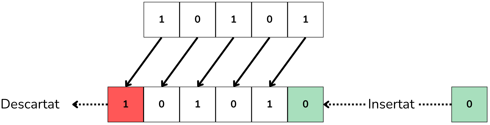

<!-- Colocar esta imagen al inicio de cada lección -->

 

# Introducción a los circuitos combinacionales

En un circuito combinacional, el valor de la salida depende exclusivamente de los valores actuales de las entradas. La salida cambia de forma prácticamente instantánea al modificarse las entradas.

Los circuitos combinacionales se construyen a partir de puertas lógicas básicas. No tienen retroalimentación interna (la salida no se reutiliza como entrada) y tampoco tienen memoria, a diferencia de los circuitos secuenciales. Su funcionamiento se puede describir completamente con el álgebra de Boole o con tablas de verdad.

Los circuitos combinacionales básicos son:
Codificadores, Decodificadores, Multiplexores (MUX), Desmultiplexores (DEMUX), Sumadores, Restadores y Comparadores.

En esta lección encontrarás los siguientes temas:

- [Ejercicios simples](./exsimples.md)
- [Multiplexores](./multiplexors.md)
- [Sistemas de votación](./svotacio.md)
- [Desplazamientos](./busos.md)
- [Números](./nombres.md)
- [Dígitos BCD](./bcddigits.md)

Cada tema trata un tipo de circuito diferente: encontrarás ejemplos y tendrás que resolver ejercicios empleando puertas lógicas básicas.

Los temas [Ejercicios simples](./exsimples.md) y [Sistemas de votación](./svotacio.md) te introducirán al uso de las tablas de verdad y el álgebra de Boole con ejemplos y ejercicios de lógica básica.

<i>Circuito simple</i>

En el tema [Desplazamientos](./busos.md) practicarás operaciones de desplazamiento de bits (*shift*) y operaciones con conjuntos de bits.

<i>Ejemplo de desplazamiento a la izquierda (Left Shift)</i>

Los ejercicios del tema [Números](./nombres.md) tratan sobre circuitos digitales encargados de realizar operaciones aritméticas y lógicas con números binarios.

En el tema [Dígitos BCD](./bcddigits.md) (*Binary Coded Decimal*) haremos una introducción a la codificación de números para visualizadores de 7 segmentos.

Finalmente, en el tema [Miscelánea](./miscellania.md) encontrarás una recopilación de ejercicios que combinan diferentes conceptos.

<!-- Esta imagen debe ir al final de cada lección, ya sea con esta línea o dentro de la firma. Dejar comentado si ya está a la firma-->
  
<Autors autors="xcasas fmadrid"/>
