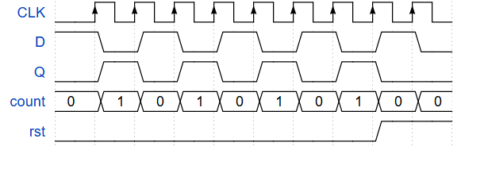
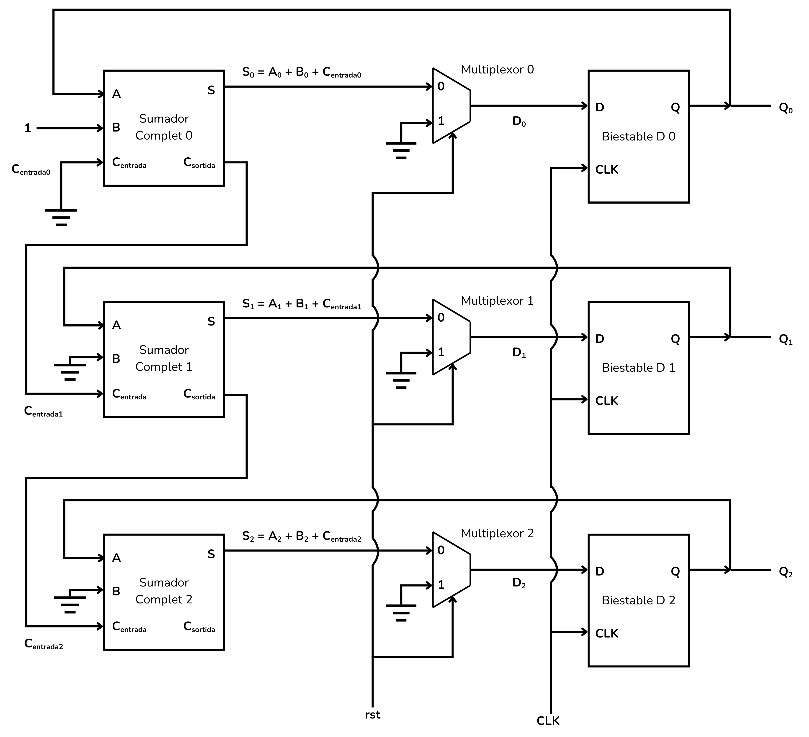
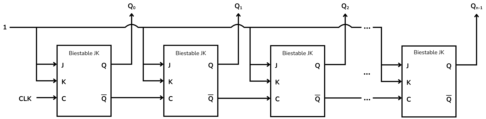
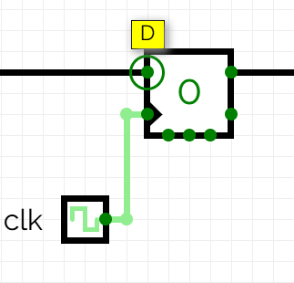
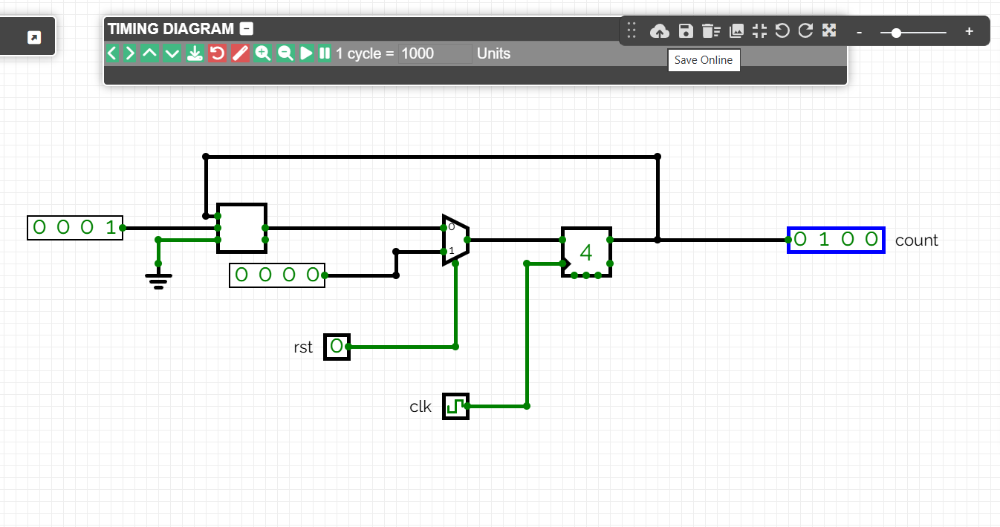
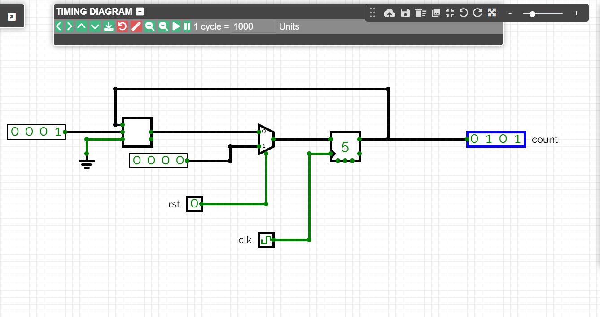

<!-- Colocar esta imagen al inicio de cada lección -->

 

# Contadores

Los circuitos secuenciales de contadores son circuitos digitales capaces de atravesar una secuencia ordenada de estados en respuesta a impulsos de reloj. Cada estado representa un valor binario, y el circuito puede contar hacia adelante o hacia atrás según el diseño.

A diferencia de los circuitos combinacionales, el estado actual de un contador depende tanto de las entradas como del estado anterior. Esta memoria s de implementa con bistables, habitualmente del tipo T, D o JK.

Los contadores se utilizan en medición de tiempo, generación de secuencias, división de frecuencias y en bloques internos de relojes digitales y procesadores.

Los contadores más comunes siguen una secuencia binaria: 0000, 0001, 0010, 0011, ..., y al llegar al valor máximo pueden volver a cero (contador cíclico) o bien contar hacia atrás ( bidireccional).

## Contador binario MOD $2^n$

Un contador MOD $2^n$ es un contador secuencial con $n$ bistables que cuenta de $0$ a $2^n - 1$ y después vuelve a cero. Tiene exactamente **$2^n$ estados diferentes**.

Se utiliza para contar, generar secuencias y dividir frecuencias.

## Contador de un solo bit MOD $2^1$
El siguiente contador tiene un solo bit, utiliza un solo bistable. Es, por tanto, un contador MOD $2^1$, y puede contar de 0 a 1.

Este contador utiliza un bistable **D**, un sumador completo (*full adder*) y un multiplexor. El sumador suma siempre $1$ al valor de $Q$, de manera que la señal $Q+1$ llega a la entrada **D** del bistable.

El multiplexor sirve para añadir la posibilidad de reiniciar el contador. La señal selector actúa pues como una señal de reinicio (*reset rst*). Cuando esta señal se activa, el multiplexor conecta un valor constante $0$ al bistable, reiniciando el contador. 

### Funcionamiento

Para entender cómo funciona este contador, comencemos con el bistable en un estado $Q=0$. La tabla, más adelante, recoge el resultado de este análisis.

**Estado inicial:**

El bistable se encuentra en un estado $Q=0$ que pasará al sumador, que le sumará el valor $1$.

Esta señal, con valor $A+B=1$, retorna a la entrada del bistable, la entrada $D$ recibe la señal 1.

$D=1$ pero aún no se ha actualizado el estado del bistable con una señal de reloj, en consecuencia, $Q$ no cambia aún de valor.

El contador está en cero ($Count=0$)

**Primer pulso:**

Cuando se aplica un pulso de reloj el valor de $D$ se copia a la salida $Q$, que pasa a tener el valor $Q=1$.

El sumador suma el valor constante 1 y retornamos al bistable la señal $A+B=0$.

El bit de acarreo (carry) de salida se activa, $C_{salida}=1$, pero no se conectará a ningún lugar.

Ahora la entrada del bistable es $D=0$, pero $Q$ no cambia aún de valor hasta que entre el siguiente pulso de reloj.

El contador ha contado hasta 1 ($Count=1$)

**Segundo pulso:**
El siguiente pulso de reloj actualiza la copia del valor $D=0$ a $Q$, y así hemos vuelto a la situación inicial, donde $Count=0$.

|**Pulso**|**$D$**|**$Q$**|**$Count$**
| :--: | :-: | :-: | :---: |
|   0  |  1  |  0  |   0   |
|   1  |  0  |  1  |   1   |
|   2  |  1  |  0  |   0   |
|   3  |  0  |  1  |   1   |

Podemos visualizar el funcionamiento de este contador con el cronograma siguiente:

Sea cual sea el estado del contador, en el momento en que activamos la señal de reinicio ($rst$), el multiplexor forzará al contador a volver a su estado inicial.

## Contador de 3 bits MOD $2^3$

El siguiente contador es de 3 bits, utiliza 3 bistables. Es por tanto un contador MOD $2^3$, capaz de contar de $0$ a $7$.

Este contador se compone de 3 bistables D, 3 sumadores completos y, para añadir la posibilidad de reiniciar el contador, 3 multiplexores.

De los bistables obtendremos una salida de 3 bits $Q=[Q_2​ Q_1​ Q_0​]$.
Las salidas $Q_i$ de los bistables se conectan a los sumadores completos, que se estructuran de manera equivalente al [sumador de n bits](../CircAritm/Aritmnbits#exemple-sumador-de--bits). Por ello el bit de acarreo (*carry*) de cada sumador $C_{salida}$ se conecta al bit de acarreo de entrada $C_{entrada}$ del siguiente.

Este conjunto de 3 sumadores completos, es a saber, este sumador de 3 bits, añadirá continuamente la constante $B=001$ a $Q$. Por ello conectamos $B_0=1$, $B_1=0$ y $B_2=0$.

La señal de reinicio (*reset*, o $rst$) creará un reinicio síncrono del contador, devolviéndolo a cero.

<i>Contador binario MOD 2^3</i>

### Funcionamiento

Analicemos el funcionamiento de este contador, empezando con todos los bistables a cero. La tabla, más adelante, recoge el resultado de este análisis.

**Estado inicial:**

Los bistables están en el estado $Q_0=0$, $Q_1=0$ y $Q_2=0$.

El sumador 0 realiza la operación $0+1+0=1$, por tanto, $D_0=1$.

El sumador 1 realiza la operación $0+0+0=0$, por tanto, $D_1=0$.

El sumador 2 realiza la operación $0+0+0=0$, por tanto, $D_2=0$.

No hay ningún bit de acarreo ($C_{salida}$) activado.

**Primer pulso:**

El pulso de reloj hace que los bits de $Q$ se actualicen con las entradas $D$, de modo que $Q_0=1$, $Q_1=0$ y $Q_2=0$.

Por tanto, $D_0=1$, $D_1=1$ y $D_2=0$, y $C_{salida 0}=1$

**Segundo pulso:**

El pulso de reloj hace que los bits de $Q$ se actualicen con las entradas $D$, de modo que $Q_0=0$, $Q_1=1$ y $Q_2=0$

Por tanto, $D_0=1$, $D_1=1$ y $D_2=0$, y no hay ningún bit de acarreo activado.

**Tercer pulso:**

El pulso de reloj hace que los bits de $Q$ se actualicen con las entradas $D$, de modo que $Q_0=1$, $Q_1=1$ y $Q_2=0$.

Por tanto, $D_0=0$, $D_1=0$ y $D_2=1$.

Dos bits de acarreo de salida están activados, $C_{salida 0}=1$ y $C_{salida1}=1$

Con los siguientes pulsos de reloj, los bistables pasan por todas las combinaciones posibles, representando un número binario creciente hasta llegar al punto en que todos los bistables están en el estado 1. Es decir, $Q=111$.

**Séptimo pulso:**

Hemos llegado al valor máximo del contador, $Q_0=1$, $Q_1=1$ y $Q_2=1$.
El séptimo pulso de reloj llevará al contador de nuevo a su estado inicial.

|**Pulso**|**$D_2$**|**$D_1$**|**$D_0$**|**$C_{salida2}$**|**$C_{salida1}$**|**$C_{salida0}$**|**$Q_2$**|**$Q_1$**|**$Q_0$**|**Count$**
| :--: | :---: | :---: | :---: | :---: | :---: | :---: | :---: | :---: | :---: | :---: |
|0 |0|0|1|0|0|0|0|0|0|000|
|1 |0|1|0|0|0|1|0|0|1|001|
|2 |0|1|1|0|0|0|0|1|0|010|
|3 |1|0|0|0|1|1|0|1|1|011|
|4 |1|0|1|0|0|0|1|0|0|100|
|5 |1|1|0|0|0|1|1|0|1|101|
|6 |1|1|1|0|0|0|1|1|0|110|
|7 |0|0|0|1|1|1|1|1|1|111|
|8 |0|0|1|0|0|0|0|0|0|000|

Podemos visualizar el funcionamiento de este contador con el cronograma siguiente:

Sea cual sea el estado del contador, en el momento en que activamos la señal de reinicio (*rst*), el multiplexor forzará al contador a volver a su estado inicial.

### Contador de n bits MOD $2^n$

Para implementar un contador de n bits hay que encadenar n bistables, n sumadores y n multiplexores de la misma manera. Con este contador se puede contar de 0 hasta $2^n$ .

<i>Contador binario MOD 2^n</i>

## Contador Binario Asíncrono (*Asynchronous Binary Counter* o *Ripple Counter*):
Un contador binario asíncrono (*Asynchronous Binary Counter*), o contador en cascada (*Ripple Counter*), se implementa con una serie de bistables, habitualmente del tipo JK.
El primer bistable representa el bit menos significativo LSB, que es controlado por el reloj, y cada uno de los siguientes por la señal de salida del anterior, de modo que estos bistables cambian de estado **en cascada**.

<i>Contador asíncrono</i>

+ Los bistables JK están conectados de modo que $J=K=1$ y, por tanto, el estado de $Q$ conmutará entre 0 y 1 cada vez que entre una señal de reloj.
+ Los bistables captan una señal de reloj **solo** en el momento en que este bit pasa de 0 a 1. No se considerará que entra señal de reloj cuando esté en 1, en 0 o cambie de 1 a 0.
+ La salida $Q_0$ corresponde al bit menos significativo LSB; la salida $Q_n$ corresponde al bit más significativo MSB.
+ La señal de reloj externa se aplica solo a la entrada del primer bistable.
+ La salida $\bar{Q}$ de cada bistable se conecta a la entrada de reloj del siguiente bistable.

  + Esto significa que cuando un bistable conmute Q de 1 a 0, Q’ pasará de 0 a 1, estimulando la entrada de reloj del bistable siguiente. Y esto producirá una conmutación de estado en el bistable siguiente.

  + Dicho brevemente: un bistable conmutará de estado solo en el momento en que el bistable anterior pase de 1 a 0.

Para entender cómo funciona este contador, comencemos con todos los bistables a ‘0’. 

**Primer pulso**:

El primer bistable $Q_0$ conmute de 0 a 1, $\bar{Q_0}$ pasa de 1 a 0.

El segundo bistable no detecta impulso en la entrada de reloj, no cambia de estado y por tanto $Q_1$ continúa a 0.

El tercer bistable y todos los siguientes continúan a 0.

**Segunda pulso**:

El primer bistable $Q_0$ pasa de 1 a 0, $\bar{Q_0}$ pasa de 0 a 1.

El segundo bistable detecta impulso en la entrada de reloj,  $Q_1$ pasa de 0 a 1 y $\bar{Q_1}$ pasa de 1 a 0.

El tercer bistable y todos los siguientes continúan a 0.

Con los siguientes pulsos de reloj. Las conmutaciones se van propagando de manera que los bistables pasan por todas las combinaciones posibles, representando un número binario creciente hasta llegar al punto en que todos los bistables están en el estado 1.
En este punto, el siguiente pulso de reloj conmutará el primer bistable de 1 a 0, el segundo también, y así todos los bistables pasan de 1 a 0 en cadena, volviendo al punto de partida.

Esta tabla muestra la secuencia de los distintos bits del contador.

|**Pulso**|**$Q_3$**|**$Q_2$**|**$Q_1$**|**$Q_0$**|**$Count$**
|------              |------   |------   |------   |------   |------
|0  |0|0|0|0|0000
|1  |0|0|0|1|1000
|2  |0|0|1|0|0100
|3  |0|0|1|1|1100
|4  |0|1|0|0|0010
|···|···|···|···|···|···
|14 |1|1|1|0|0111
|15 |1|1|1|1|1111
|16 |0|0|0|0|0000

## Ejemplo: Contador de 4 bits
En este ejemplo veremos cómo realizar un contador de 4 bits.

    
    

Las conexiones del bistable que nos interesan son la **D** y **Q**, que marcan la entrada y salida del elemento de memoria, y también **CLK**, que es la entrada de la señal de reloj.
La entrada de reloj se representa a menudo con un triángulo en el interior del elemento. 

    
    
    

El bistable D también cuenta con otras entradas como enable y resets que permiten reiniciar o eliminar estados de información. También tiene una salida negada $\bar{Q}$ para usar salidas invertidas cuando sea necesario.

Queremos un contador que siga una secuencia binaria de 4 bits, valores sucesivos entre 0000 y 1111. También queremos incluir una señal de reinicio que devuelva la salida a 0000. Este comportamiento se puede lograr con un sumador, un multiplexor y un bistable de 4 bits como en la figura.

La pulsación de reloj hará que el sumador sume una constante 0001 al valor de salida del bistable. En este ejemplo pasando de un valor 0100 a 0101.

El multiplexor forzará el reinicio. Al entrar una señal **rst** el estado del bistable pasará a ser 0000.

[CircuitVerse](https://circuitverse.org/simulator) incluye una entrada *Asyncronous reset* a los bistables. Para hacer un reinicio asíncrono hay que eliminar el multiplexor y conectar la señal $rst$ a la entrada *Asyncronous reset* del bistable.

## Ejercicios en Jutge.org:[Introduction to Digital Circuit Design](https://jutge.org/courses/JordiCortadella:IntroCircuits)

- [Toggle](https://jutge.org/problems/X15508_en)
- [Contador de 2 bits](https://jutge.org/problems/X81362_en)
- [Contador MOD-3](https://jutge.org/problems/X05944_en)
- [Contador de 4 bits](https://jutge.org/problems/X35277_en)
- [Contador cíclico poco convencional](https://jutge.org/problems/X97508_en)
- [Contador ascendente y descendente](https://jutge.org/problems/X53256_en)
- [Contador ascendente y descendente MOD-7](https://jutge.org/problems/X47159_en)

<small>*Recorda que per accedir als exercicis i perquè el Jutge valori les teves solucions has d'estar inscrit al [curs](https://jutge.org/courses/JordiCortadella:IntroCircuits). Trobaràs totes les instruccions [aquí](../Inici/instruccions.md).* </small>

<!-- Esta imagen debe ir al final de cada lección, ya sea con esta línea o dentro de la firma. Dejar comentado si ya está a la firma-->
  
<Autors autors="xcasas fmadrid"/>
