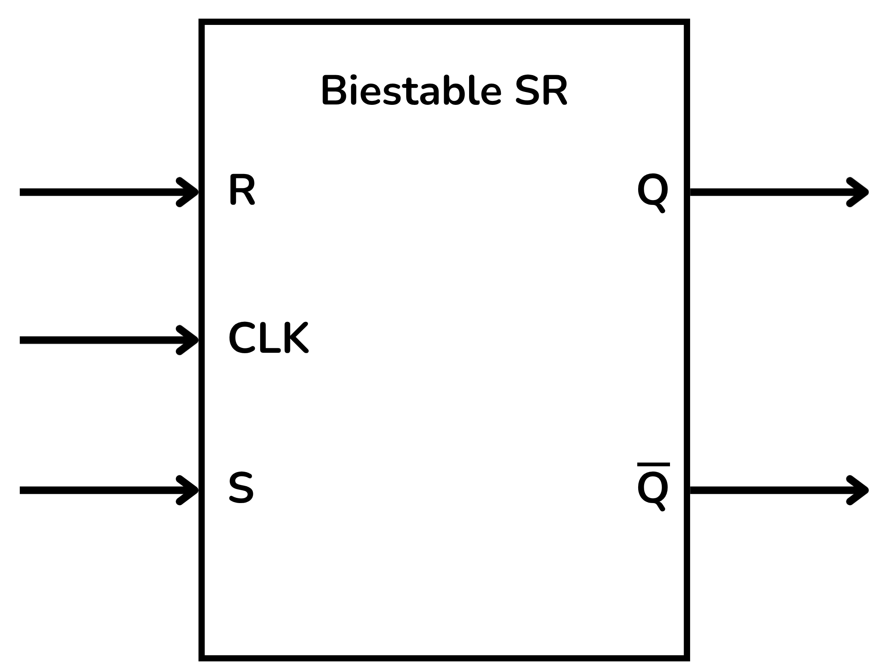
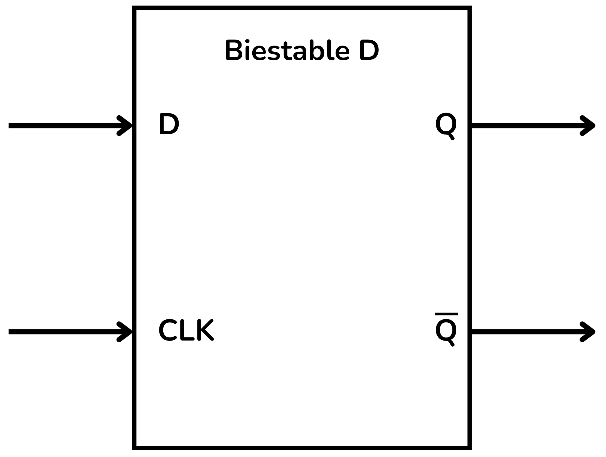
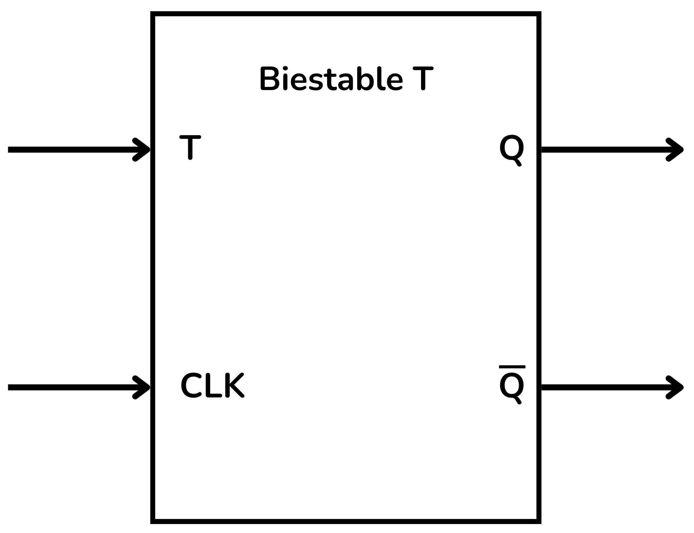
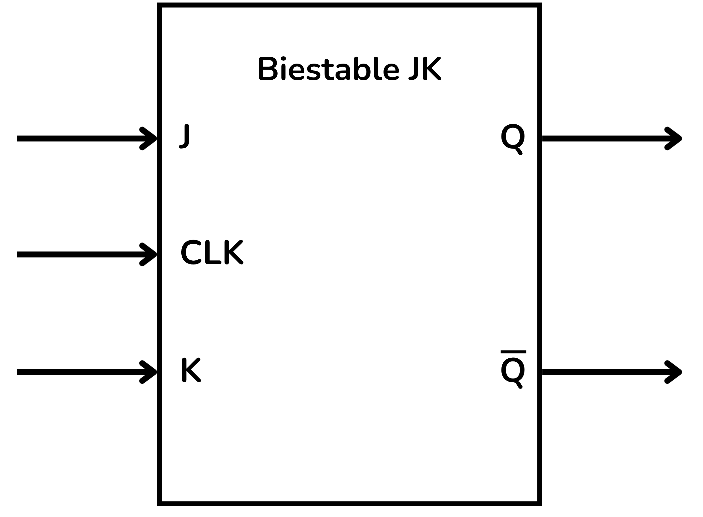

<!-- Colocar esta imagen al inicio de cada lección -->

 

# Introducción a los circuitos secuenciales

Los circuitos secuenciales son circuitos digitales en los que el valor de la salida no depende únicamente de las entradas actuales, sino también del estado anterior del circuito; es decir, disponen de **memoria**.

A diferencia de los circuitos combinacionales, que solo calculan resultados instantáneos a partir de las entradas, los circuitos secuenciales guardan información sobre el pasado mediante elementos de memoria.
Son fundamentales en la construcción de memorias, contadores, registros, unidades de control y procesadores.

## Sincronización y reloj

Muchos circuitos secuenciales funcionan sincronizados con una señal de reloj (*clock*) que marca el ritmo con el que se producen los cambios de estado.

**Sistemas Secuenciales Sincronos**: Los cambios de estado y de salida solo se producen en instantes bien definidos, marcados por una señal periódica de reloj.
El reloj sincroniza el funcionamiento del circuito, haciendo que las variables internas solo cambien con un pulso o flanco (ascendente o descendente).

**Sistemas Secuenciales Asíncronos**: Actúan de manera continua: los cambios en las entradas provocan cambios inmediatos en las variables internas, sin esperar ningún reloj.
Son más difíciles de diseñar, ya que pueden aparecer problemas de sincronización.

## Función

Según su función, los circuitos secuenciales se pueden clasificar en:

* **Contadores**: avanzan por una secuencia de estados según los pulsos del reloj; se utilizan para contar eventos o generar patrones binarios.
* **Registros**: almacenan y desplazan datos binarios; sirven para guardar valores temporales o transmitir información.
* **Máquinas de estado**: modelos que describen el comportamiento secuencial de un sistema, definiendo transiciones de estado según entradas y reloj.
* ** Memorias**: dispositivos diseñados para almacenar grandes cantidades de información binaria.

## Memoria y estado

La capacidad de retener un valor anterior se logra con un **elemento de memoria**.

* **Estado**: conjunto de información que el circuito necesita para determinar el comportamiento futuro.
* **Realimentación** (*feedback*): las salidas se reintroducen como entradas internas, hecho que permite conservar información.

# El biestable (*Flip-Flop*)

El componente fundamental para crear memoria en circuitos secuenciales es el **biestable** (*flip-flop* en inglés), capaz de almacenar un solo bit.
Su salida depende de su estado anterior y de las entradas actuales.

A diferencia de una puerta lógica, la salida de un biestable no depende solo de las entradas actuales, sino también del estado anterior. Esta capacidad de recordar es la base de todos los dispositivos de memoria y control de los sistemas digitales.

Hay varios tipos de biestables. A continuación, repasamos los más importantes.

## El biestable RS (*Reset–Set*)

También llamado **SR** (*Set–Reset*). Tiene dos entradas:

* $S$ (*Set*): fuerza la salida $Q$ a 1.
* $R$ (*Reset*): fuerza la salida $Q$ a 0.

También dispone de una entrada de reloj $CLK$, habitual en biestables síncronos.
La salida principal es $Q$ y la complementaria es $\bar{Q}$.

> No deben activarse $S$ y $R$ simultáneamente (condición prohibida).

<i>Esquema funcional del biestable RS</i>

Este biestable es la base de memorias, contadores, registros y máquinas de estado.

## El biestable D (*Datos*)

Tiene una sola entrada $D$ (*Datos*) y una entrada de reloj $CLK$.
A cada pulso del reloj, el valor de $D$ se copia a la salida.

Salidas:

* $Q$ (estado actual)
* $\bar{Q}$ (estado inverso)

<i>Esquema funcional del biestable D</i>

Es el más utilizado para crear registros y memorias síncronas.

## El biestable T (*Conmutación*)

El biestable **T** conmuta el estado de la salida cada vez que recibe un pulso de reloj, siempre que la entrada $T$ esté activada.

<i>Esquema funcional del biestable T</i>

## El biestable JK

Considerado una versión mejorada del biestable SR, resuelve el problema del estado prohibido y puede funcionar en diversos modos según las entradas.

Entradas:

* $J$
* $K$
* $CLK$

Salidas:

* $Q$
* $\bar{Q}$

Cuando el reloj activa el biestable:

+ Si $J=1$ y $K=0$, a la salida $Q$ se le asigna 1.
+ Si $J=0$ y $K=1$, $Q$ se reinicia a 0.
+ Si $J=K=0$, no cambia, mantiene el estado anterior.
+ Si $J=K=1$, conmuta ($toggle$) el estado de $Q$.

<i>Esquema funcional del biestable JK</i>

<!-- Esta imagen debe ir al final de cada lección, ya sea con esta línea o dentro de la firma. Dejar comentado si ya está a la firma-->
  
<Autors autors="xcasas fmadrid"/>