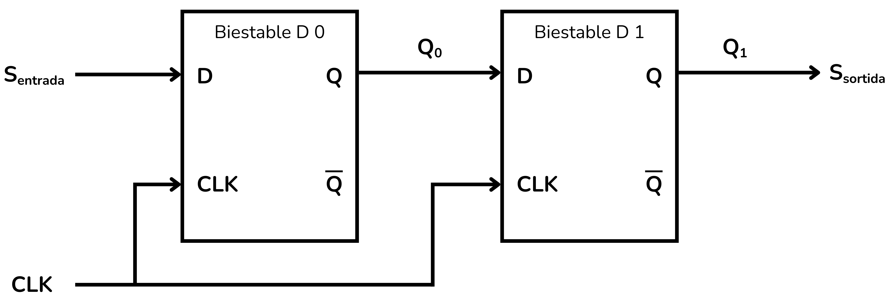
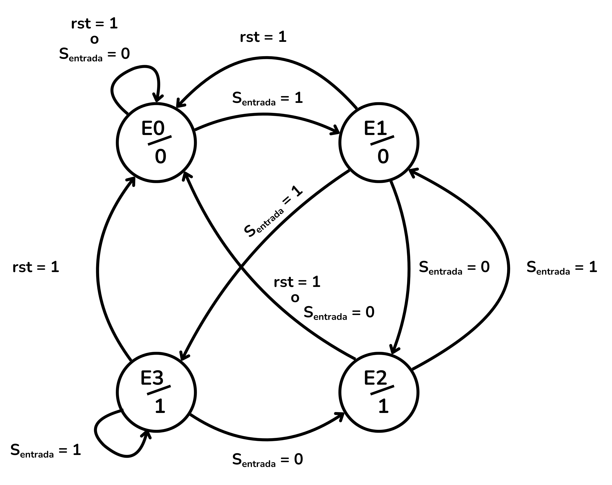
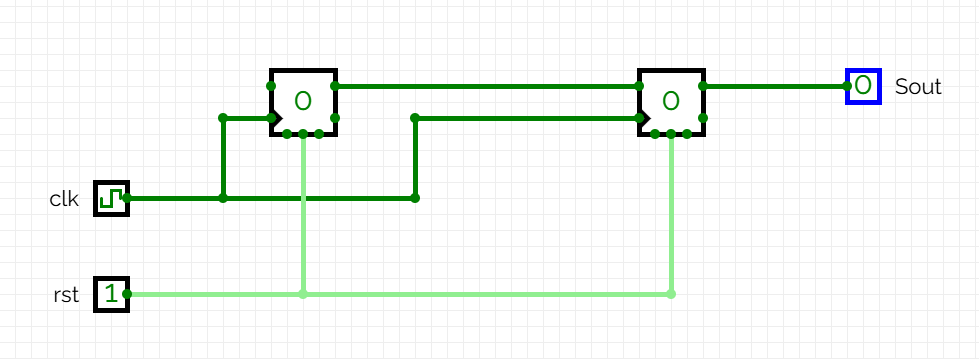
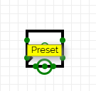
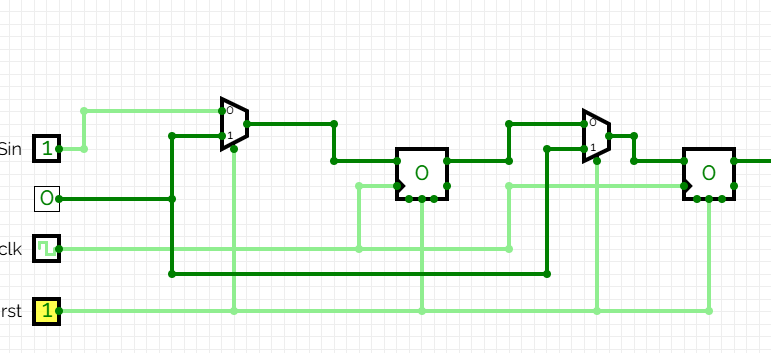
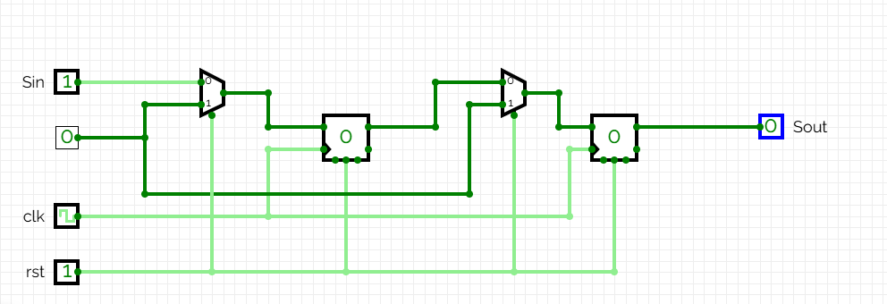
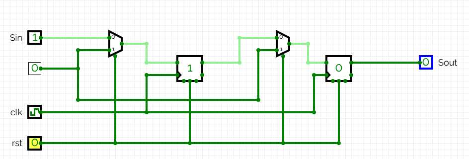
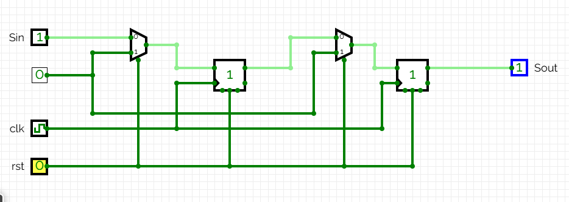

<!-- Colocar esta imagen al inicio de cada lección -->

 

# Máquinas de estados

Una máquina de estados (Finite State Machine, FSM) es un modelo matemático que describe un sistema con un número finito de estados que cambia de un estado a otro en función del estado actual, las entradas y unas reglas determinadas. Un circuito digital que implementa una FSM tiene memoria y su salida no depende solo de las entradas actuales.

Un circuito digital que implementa una máquina de estados presenta estas características:

* Tiene un conjunto finito de estados posibles, almacenados en bistables.
* Tiene un conjunto de señales de entrada.
* Las transiciones entre estados se implementan con lógica combinacional y dependen del estado actual y de las entradas.
* La señal de reloj coordina la actualización del estado.

Existen dos modelos principales: **máquina de Moore** y **máquina de Mealy**.

## Máquina de Moore

En una máquina de Moore, **la salida depende únicamente del estado actual**.

El comportamiento de las máquinas de estados se puede visualizar con un diagrama de estados, que representa los estados de la máquina, sus entradas y sus salidas.

En el diagrama de estados de una máquina de Moore:

* Los estados se indican con círculos: E0, E1, E2…
* Las flechas indican las transiciones.
* Las entradas aparecen en las flechas.
* La salida se indica dentro del círculo (Estado/Salida).

<i>Diagrama de estados de una máquina de Moore</i>

La tabla siguiente nos ayudará a navegar por este ejemplo de diagrama de estados. La primera columna representa el estado actual de la máquina y su salida correspondiente. Cuando la señal de reloj provoca un cambio de estado, el estado siguiente dependerá de la entrada. Si $Entrada=0$ la máquina cambiará al estado de la segunda columna, si $Entrada=1$ cambiaremos al estado de la tercera columna.

<table>
  <thead>
    <tr>
      <th rowspan="2">Estado actual/Salida</th>
      <th colspan="2">Estado siguiente</th>
    </tr>
    <tr>
      <th>Entrada=0</th>
      <th>Entrada=1</th>
    </tr>
  </thead>
  <tbody>
    <tr>
      <td>E0 / 0</td>
      <td>E1</td>
      <td>E0</td>
    </tr>
    <tr>
      <td>E1 / 0</td>
      <td>E1</td>
      <td>E2</td>
    </tr>
    <tr>
      <td>E2 / 0</td>
      <td>E1</td>
      <td>E3</td>
    </tr>
    <tr>
      <td>E3 / 1</td>
      <td>E1</td>
      <td>E0</td>
    </tr>
  </tbody>
</table>

## Máquina de Mealy

En una máquina de Mealy, **la salida depende del estado actual y de las entradas actuales**. Cuando la máquina está en cierto estado, la salida puede cambiar si la entrada cambia, sin esperar al siguiente cambio de estado. Eso puede generar impulsos transitorios entre cambios de estado.

Ventajas:

* A menudo requiere menos estados que una máquina de Moore.
* Menos bistables y menos lógica combinacional.

En el diagrama de estados:

* Los estados son círculos.
* Las flechas indican transiciones.
* Las etiquetas de flecha muestran *entrada/salida*.

<i>Diagrama de estados de una máquina de Mealy</i>

La tabla a continuación nos ayudará a entender el diagrama de estados.
La primera columna representa el estado actual de la máquina, su salida también dependerá de la entrada en ese momento y se representa en las columnas segunda y tercera. Solo cuando la señal de reloj lo indique, habrá un cambio, que nos llevará al estado indicado en las columnas cuarta y quinta.

<table>
  <thead>
    <tr>
      <th rowspan="2">Estado actual</th>
      <th colspan="2">Salida</th>
      <th colspan="2">Estado siguiente</th>
    </tr>
    <tr>
      <th>Entrada=0</th>
      <th>Entrada=1</th>
      <th>Entrada=0</th>
      <th>Entrada=1</th>
    </tr>
  </thead>
  <tbody>
    <tr>
      <td>E0</td>
      <td>0</td>
      <td>0</td>
      <td>E1</td>
      <td>E0</td>
    </tr>
    <tr>
      <td>E1</td>
      <td>0</td>
      <td>0</td>
      <td>E1</td>
      <td>E2</td>
    </tr>
    <tr>
      <td>E2</td>
      <td>0</td>
      <td>1</td>
      <td>E1</td>
      <td>E0</td>
    </tr>

  </tbody>
</table>

Las máquinas de estados son fundamentales para diseñar componentes lógicos que necesitan seguir una secuencia o un protocolo. Se utilizan en:

* controladores de protocolos digitales (SPI, I2C, UART),
* secuenciadores de operaciones complejas (unidades de control),
* detectores de patrones o secuencias,
* semáforos digitales o sistemas de control.

# Ejemplo: Retardo de 2 ciclos

Este circuito lee una secuencia binaria y la replica con un retardo de dos ciclos. Durante los dos primeros ciclos, la salida vale 0.

Tomemos como ejemplo la siguiente secuencia inicial de números:

$S_{entrada}: 1,1,0,0,1,1,1,1,0,0,0,1,0,1,…$

Secuencia de salida (retardo en 2 ciclos):

$S_{sortida}: 0,0,1,1,0,0,1,1,1,1,0,0,0,1,0,1,…$

Para provocar el retardo utilizamos dos bistables D en serie:

A cada pulso de reloj ocurrirá lo siguiente:
+ El valor que tenía el bistable 1 se lee como salida $S_{sortida}$.
+ El valor que tenía el bistable 0 ($Q_0$) pasa al bistable 1 ($Q_1$).
+ La entrada $S_{entrada}$ se copia al Bistable 0.

Esta estructura retrasa cualquier entrada dos ciclos.

Al usar dos bistables D la máquina tiene $2^2$ combinaciones distintas, es decir, 4 estados posibles que llamaremos E0, E1, E2 y E3:

|**Estado**|**[$Q_1$, $Q_0$]**| |
|------   |------            |------   |
|E0       |00    | Estado inicial (Vacío)
|E1       |01    | El último bit que ha entrado en $Q_0$ es 1; el bit más antiguo $Q_1$ es 0
|E2       |10    | El último bit que ha entrado en $Q_0$ es 0; el bit más antiguo $Q_1$ es 1
|E3       |11    | Los dos últimos bits que han entrado son 1

La tabla a continuación especifica los cambios de estado posibles según la entrada $S_{entrada}$.

<table>
  <thead>
    <tr>
      <th rowspan="2">Estado actual</th>
      <th colspan="2">Estado siguiente</th>
    </tr>
    <tr>
      <th>SEntrada=0</th>
      <th>SEntrada=1</th>
    </tr>
  </thead>
  <tbody>
    <tr>
      <td>00 (E0)</td>
      <td>00 (E0)</td>
      <td>01 (E1)</td>
    </tr>
    <tr>
      <td>01 (E1)</td>
      <td>10 (E2)</td>
      <td>11 (E3)</td>
    </tr>
    <tr>
      <td>10 (E2)</td>
      <td>00 (E0)</td>
      <td>01 (E1)</td>
    </tr>
    <tr>
      <td>11 (E3)</td>
      <td>10 (E2)</td>
      <td>11 (E3)</td>
    </tr>
  </tbody>
</table>

A este circuito le añadiremos una señal de reinicio rst (reset) que devuelva a 0 todos los bistables. Si rst=1, los dos bistables se reinician y volvemos al estado inicial E0. Si rst=0, el circuito continúa funcionando con normalidad.

El diagrama de estados completo es:

<i>Diagrama de estados del retardo de 2 ciclos, con la señal de reinicio rst</i>

Como la salida $S_{sortida}$ depende únicamente del estado actual, este circuito es una **máquina de Moore**.

Una vez hecho el diagrama de estados, pasamos a montar el circuito en CircuitVerse (https://circuitverse.org/simulator). Montamos los dos bistables D en serie compartiendo la misma señal de reloj y la misma señal de reinicio (*rst*).

En los ejercicios de Jutge.org las señales de reinicio son siempre síncronas, por lo tanto, así lo haremos en este ejemplo, conectando los dos bistables al mismo reinicio síncrono. 

Por lo tanto hay que conectar la señal *rst* a la entrada *Preset* del bistable D y no a la entrada *Asynchronous reset* (reinicio asíncrono). 

    
    

Para inicializar los valores, añadimos dos multiplexores. La señal *rst* es el selector:

* El primer multiplexor tendrá como entradas la señal de entrada $S_{entrada}$ y una constante 0. Su salida estará conectada a la entrada $D$ del primer bistable.
* El segundo multiplexor tendrá como entradas la salida $Q$ del primer bistable y la misma constante 0. Su salida estará conectada a la entrada $D$ del segundo bistable.

Comprobaremos su funcionamiento con una secuencia inicial de ejemplo:

$S_{entrada} : 1, 1, 1, …$

Con *rst = 1*, los bistables están a 0 (estado E0) y $S_{sortida}=0$.

Con *rst=0*, dejamos evolucionar el circuito.

En el primer borde de reloj el valor de $S_{entrada}=1$ se carga al primer bistable. El estado 0 del primer bistable pasa al segundo bistable y $S_{sortida}$ continúa teniendo un valor de 0. Hemos pasado pues al estado $E1$.

En el segundo borde de reloj, el valor de $S_{entrada}=1$ se carga al primer bistable, el valor del primer bistable 1 se carga al segundo bistable y por tanto $S_{sortida}=1$. Nos encontramos en el estado $E2$.

En este punto del proceso, el primer valor de $S_{entrada}$ se ha trasladado desde la entrada hasta la salida pasando por los dos bistables. Los dos valores siguientes están cargados en los bistables y las señales de reloj siguientes los irán trasladando hacia la salida.
Este circuito implementa, pues, una cola entre $S_{entrada}$ y $S_{sortida}$ que la señal de entrada tarda dos ciclos en atravesar.

En estos dos primeros pulsos de reloj, las secuencias de entrada y de salida han implementado efectivamente un retardo de dos ciclos:

$S_{entrada}$ : 1, 1, 1, …

$S_{sortida}$ : 0, 0, 1, …

## Ejercicios en Jutge.org:[Introduction to Digital Circuit Design](https://jutge.org/courses/JordiCortadella:IntroCircuits)

- [Last two equal](https://jutge.org/problems/X71700_en)
- [Delayed sequence](https://jutge.org/problems/X32741_en)
- [Even number of 0's and 1's](https://jutge.org/problems/X02999_en)
- [Circuit from state diagram](https://jutge.org/problems/X76378_en)
- [Sequence 110](https://jutge.org/problems/X02122_en)
- [Recognizing sequences](https://jutge.org/problems/X49909_en)
- [Is it divisible by 3?](https://jutge.org/problems/X80381_en)
- [Simple state machine](https://jutge.org/problems/X78930_en)
- [Traffic-light controller](https://jutge.org/problems/X88681_en)
- [Vending machine](https://jutge.org/problems/X77254_en)

<small>Recuerda que para acceder a los ejercicios y para que el Jutge valore tus soluciones debes estar inscrito en el curso. Encontrarás todas las instrucciones aquí: ../Inicio/instrucciones.md.</small>

<!-- Esta imagen debe ir al final de cada lección, ya sea con esta línea o dentro de la firma. Dejar comentado si ya está a la firma-->
  
<Autors autors="xcasas fmadrid"/>
