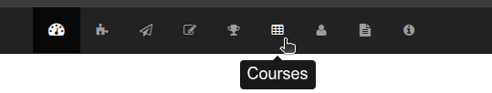
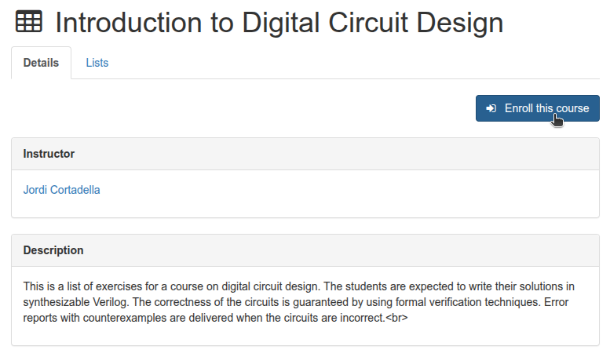
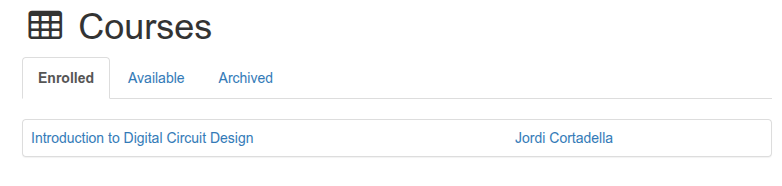
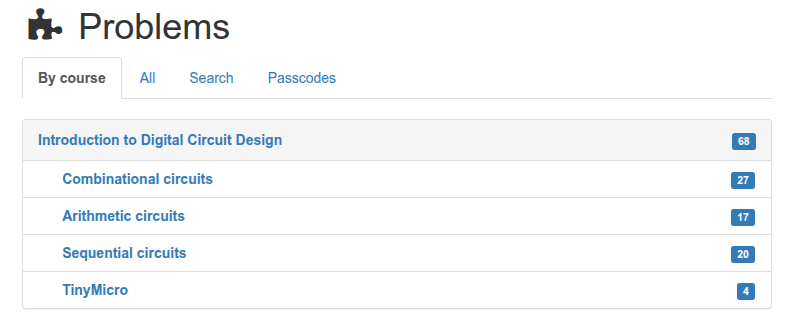
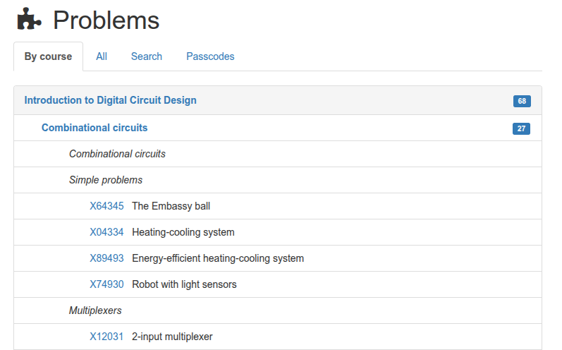
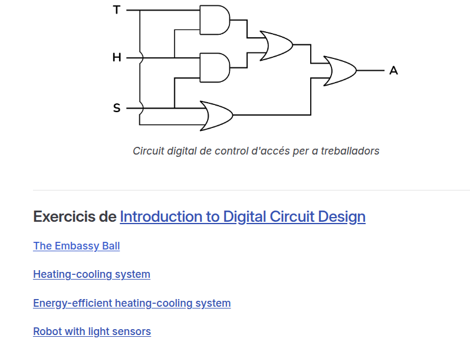
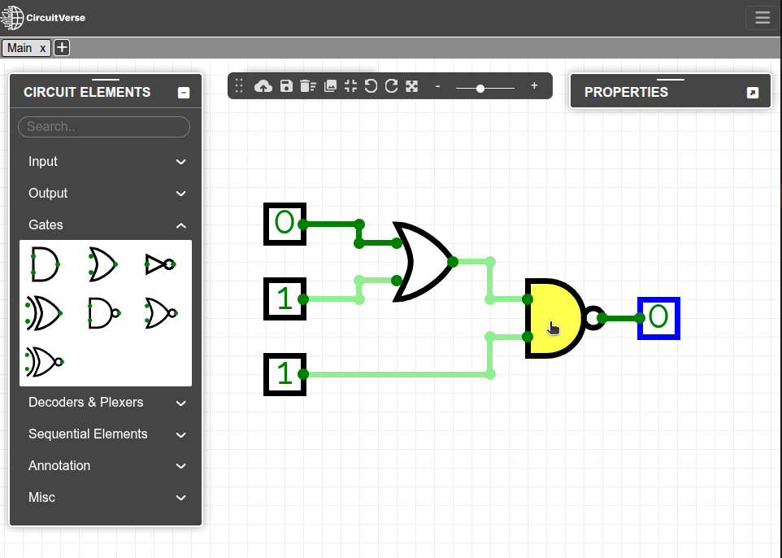
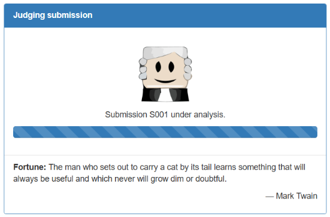
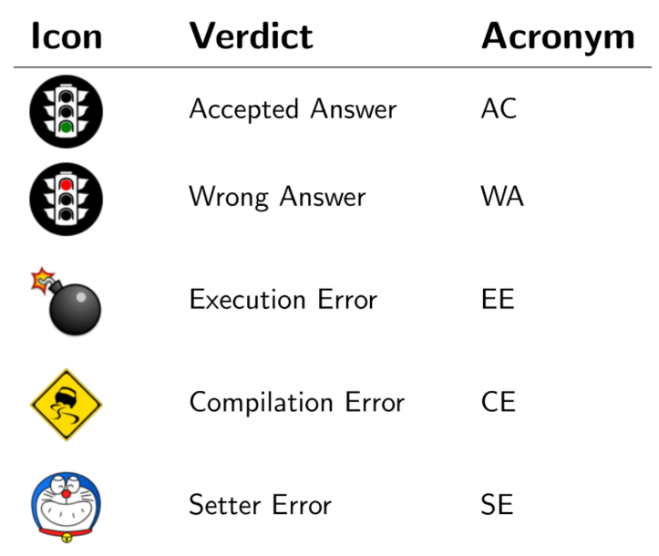

<!-- Colocar esta imagen al inicio de cada lección -->

 

# Instrucciones

## Cómo seguir las lecciones
En el menú lateral de aquí a la izquierda encontrarás las lecciones que componen este recurso educativo.
**Ya puedes empezar por la primera lección**: la introducción a los circuitos digitales, al álgebra de Boole y a los mapas de Karnaugh.

El resto de lecciones están dedicadas a los diferentes tipos de circuitos digitales y contienen la teoría y uno o dos ejemplos. Además, al final de cada lección te proponemos hacer algunos ejercicios del curso [Introduction to Digital Circuit Design](https://jutge.org/courses/JordiCortadella:IntroCircuits), dentro de [jutge.org](https://jutge.org).
En esta sección puedes encontrar las instrucciones para resolver los problemas y someterlos al veredicto de nuestro Jutge. Revísalas cuando las necesites.

<video controls controlsList="nodownload noplaybackrate"   disablepictureinpicture
style="width: 90%; display: block; margin: 0 auto;">
  <source src="../../Inici/vid_tuto.mp4" type="video/mp4">
</video>

## Registro en Jutge.org y en el curso

Para poder acceder a los ejercicios propuestos deberás registrarte en la plataforma [jutge.org](https://jutge.org). Este registro es **gratuito**.

Recuerda que jutge.org es una plataforma educativa de la UPC. El registro de usuario sirve para hacer un seguimiento de tu progreso en los ejercicios. La UPC no tiene ningún interés comercial ni recopila datos personales.

Una vez tengas acceso a los recursos de jutge.org, puedes inscribirte en el curso [Introduction to Digital Circuit Design](https://jutge.org/courses/JordiCortadella:IntroCircuits) desde la sección [Cursos](https://jutge.org/courses), haciendo clic en el botón "Inscribirse en este curso".

 

Dentro de este curso encontrarás los enunciados de los ejercicios. También podrás enviar tus soluciones al Jutge, que valorará su validez y emitirá un veredicto.

## Menú de ejercicios y cómo presentar tu solución a un ejercicio

Puedes acceder a cada uno de los ejercicios desde el menú superior del portal, ya sea directamente al [curso] o desde la sección [Problemas].

 

Los ejercicios están ordenados por temas y cada uno tiene un código identificativo único.

También puedes acceder a los ejercicios directamente desde las lecciones a partir de los enlaces que encontrarás. Esta es una alternativa más rápida, pero recuerda que **primero debes haber iniciado sesión en jutge.org.**

La página del ejercicio es como la siguiente:

Aquí encontrarás el **enunciado** (*Statement*) que describe el ejercicio, el cual se puede descargar en PDF o ZIP.
También se incluye una **especificación** (*Specification*) que describe las entradas y salidas que debe tener el circuito.
El menú *New Submission* se utiliza para presentar tu solución al ejercicio.

Una vez seleccionado el ejercicio, deberás solucionarlo utilizando los conocimientos que has aprendido.

Para **diseñar una solución de circuito** usaremos [CircuitVerse](https://circuitverse.org/simulator), una plataforma gratuita y de código abierto diseñada para crear y simular circuitos lógicos digitales en línea.
Con esta herramienta **dibujaremos nuestro circuito y lo exportaremos** para presentarlo a Jutge.

En CircuitVerse puedes arrastrar puertas lógicas a tu circuito, conectarlas y probar la tabla de verdad.

CircuitVerse te ofrece la opción de guardar y descargar tu circuito. En el menú *Project/Save Offline* puedes guardar y descargar tu circuito en formato "*.cv*". En la sección *Export as file* puedes cargar un circuito previamente guardado.

Para presentar la solución a Jutge, exporta el circuito desde CircuitVerse en formato Verilog. Ve al menú de herramientas y elige la opción *Export Verilog* para descargar un archivo de código Verilog "*.v*".

*Verilog* es un lenguaje de descripción de hardware (*HDL - Hardware Description Language*, por las siglas en inglés) que se puede utilizar para describir circuitos electrónicos digitales como microprocesadores o componentes lógicos.

**Presenta tu ejercicio al Jutge**. Sube el archivo que acabas de generar dentro del área ***Nueva entrega*** del ejercicio.

Pulsando el botón *Enviar*, Jutge analizará tu archivo.

Al terminar el proceso, podrás ver el **veredicto y la corrección de Jutge**, tanto si ha ido **bien** como **mal**.

Al finalizar, podrás ver el **veredicto y la corrección de Jutge**.

Si el veredicto es desfavorable, la sección *hint* muestra pistas de lo que podría haber fallado.

Si el veredicto es favorable, se mostrará el circuito solución en la sección *Módulos del circuito*. La sección *Programa* muestra el código Verilog del circuito que has presentado.

**Puedes volver a intentarlo** tantas veces como sea necesario. En la ventana de envíos se indicará el número total de archivos y correcciones. Podrás visualizarlos haciendo clic en el número de envío (S001, S002...).

Jutge tiene diferentes veredictos según el circuito presentado. Los más habituales son los siguientes:

Puedes encontrar la [lista completa de veredictos](http://jutge.org/documentation/verdicts/all) con una descripción de su significado.

<!-- Esta imagen debe ir al final de cada lección, ya sea con esta línea o dentro de la firma. Dejar comentado si ya está a la firma-->
  
<Autors autors="xcasas fmadrid"/>
