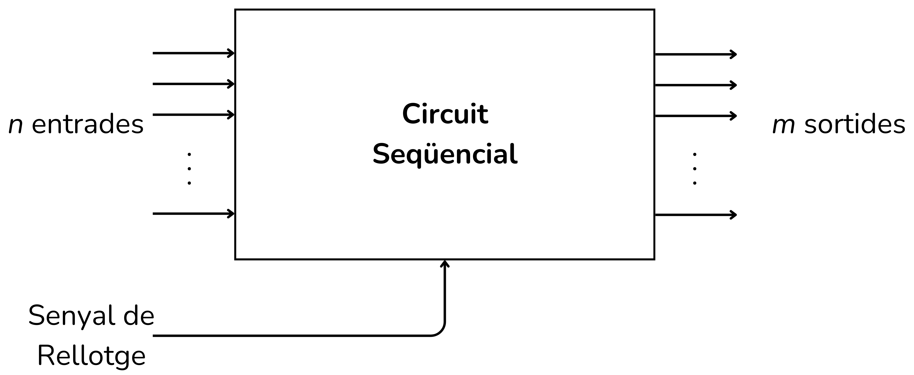

<!-- Colocar esta imagen al inicio de cada lección -->

 

# Introducción a los circuitos digitales

En estas lecciones aprenderás qué son los circuitos digitales y sus diferentes tipos. Encontrarás ejemplos y ejercicios para entender los circuitos combinacionales, los circuitos secuenciales y los circuitos aritméticos.

Los ** circuitos digitales** procesan información representada en formato binario, que utiliza solo dos estados eléctricos: voltaje bajo y voltaje alto, los cuales representan los valores binarios 0 y 1. Los componentes fundamentales de los circuitos digitales son las puertas lógicas. Estas son la base de los microprocesadores, memorias, controladores y de cualquier otro circuito digital complejo.

Las **puertas lógicas** son pequeños circuitos que realizan operaciones lógicas básicas sobre una o más señales binarias de entrada y producen una única señal binaria de salida. Para utilizar las puertas lógicas y crear circuitos digitales, es necesario conocer los conceptos de álgebra de Boole y las tablas de verificación. En muchos ejemplos y ejercicios de circuitos digitales utilizaremos las tablas de verdad o una expresión booleana para describir el comportamiento lógico de un circuito.

|**Puerta lógica**|**Símbolo** |**Expresión Lógica** |**Descripción**|
|------           |------      |:---:                |------         |
|Búfer |   |$A$                        |Devuelve el mismo bit|
|NOT   |      |$\bar{A}$                  |Invierte el bit|
|AND   |      |$A·B$                      |1 si las dos entradas son 1|
|OR    |       |$A+B$                      |1 si al menos una entrada es 1|
|NAND  |     |$\overline{A·B}$           |AND invertido (combinación de AND y NOT)|
|NOR   |      |$\overline{A+B}$           |OR invertido (combinación de OR y NOT)|
|XOR   |      |$A·\bar{B}+\bar{A}·B$      |1 si las entradas son diferentes|
|XNOR  |     |$(A·B)+(\bar{A}·\bar{B})$  |1 si las entradas son iguales|

 

Las puertas lógicas básicas son AND, OR y NOT. Una **tabla de verdad** muestra todas las posibles combinaciones de entradas de un circuito lógico o de una función booleana, y el resultado correspondiente a la salida para cada una de estas combinaciones.

Un [**circuito combinacional**](../CircCombin/intro.md) es un tipo de circuito digital en el que el valor de su salida en un instante depende únicamente de los valores actuales de sus entradas. Construidos únicamente con puertas lógicas simples, no tienen retroalimentación ni memoria. Su comportamiento se puede describir con tablas de verdad y funciones booleanas.

<i>Circuito combinacional</i>

Los [**circuitos aritméticos**](../CircAritm/intro.md) son una subclase importante de los circuitos digitales combinacionales. Su función es efectuar operaciones matemáticas básicas con números binarios.

<i>Este ejemplo es un circuito aritmético sumador</i>

Los [**circuitos secuenciales**](../CircSeq/intro.md) son un tipo de circuito digital que, a diferencia de los circuitos combinacionales o aritméticos, incorporan retroalimentación y tienen memoria. En consecuencia, su salida no solo depende de las entradas actuales, sino también de su estado previo o historial de entradas. Muchos de ellos utilizan un reloj para coordinar los cambios de estado.

<i>Circuito secuencial</i>

La lección [**Tiny Micro**](../TinyMicro/intro.md) es un recopilatorio de ejercicios avanzados sobre el funcionamiento de un pequeño ordenador.

<!-- Esta imagen debe ir al final de cada lección, ya sea con esta línea o dentro de la firma. Dejar comentado si ya está a la firma-->
  
<Autors autors="xcasas fmadrid"/>

