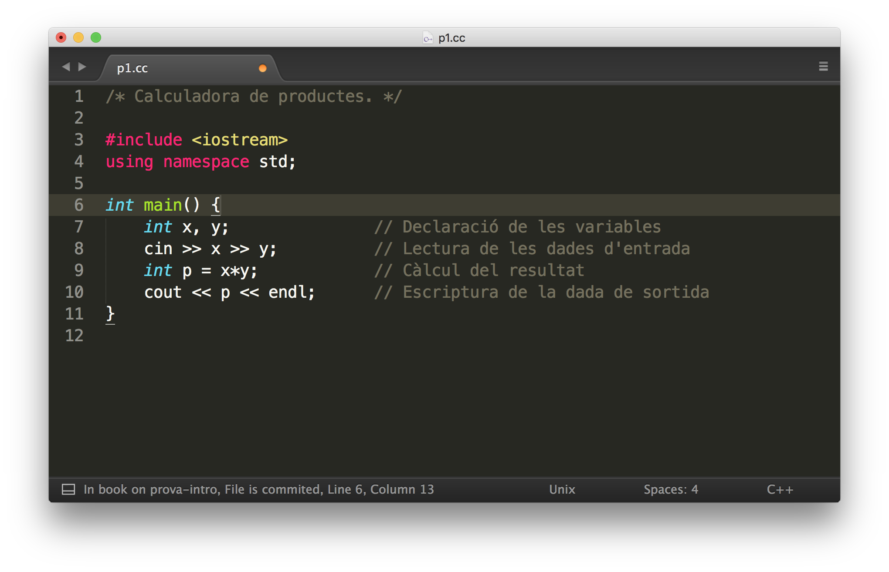
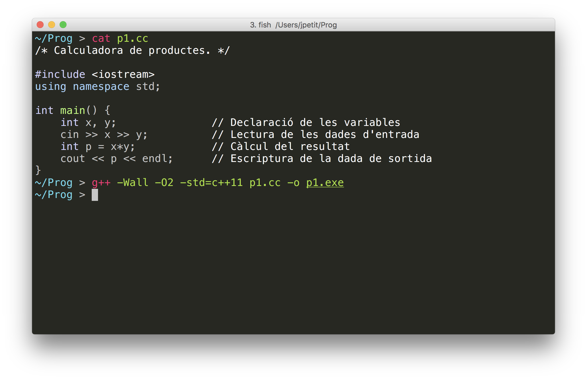
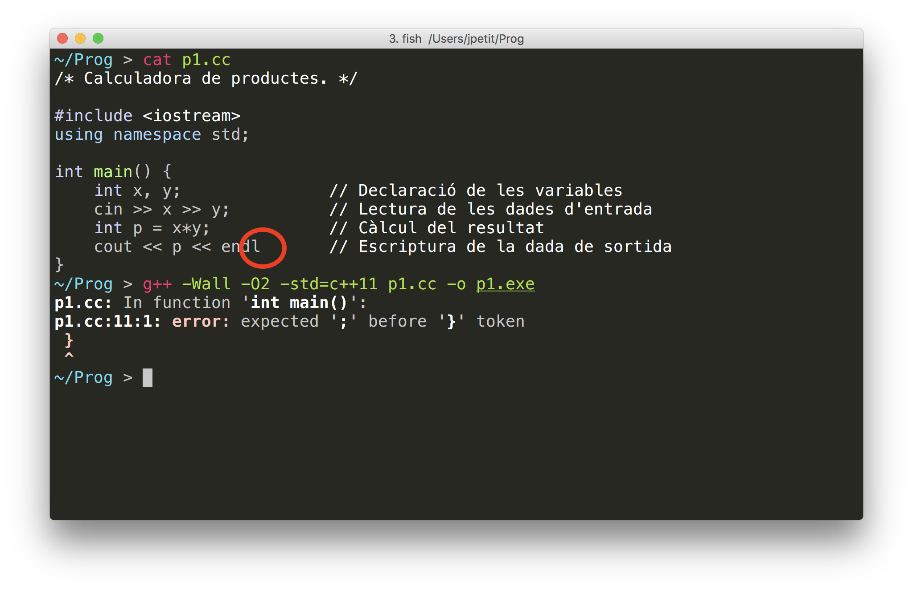
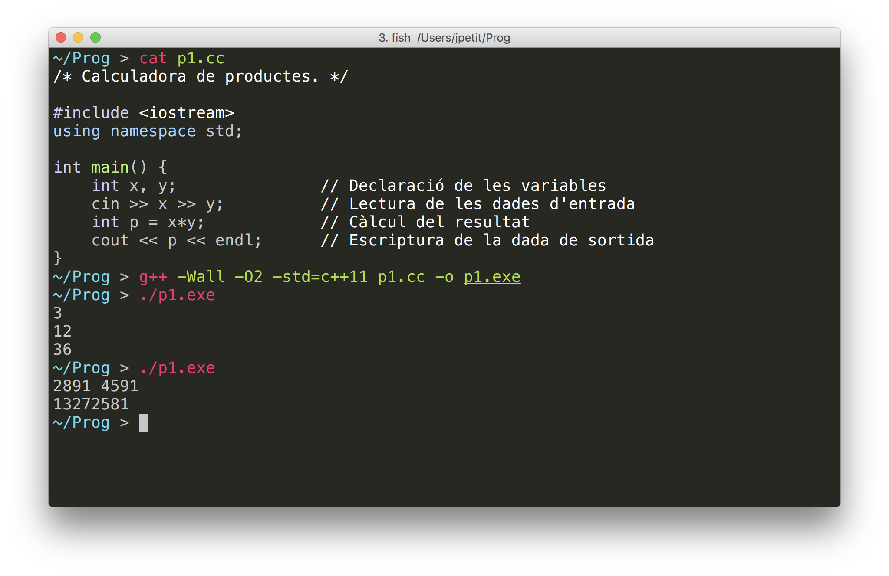

# Comencem!


Aquesta lliçó presenta un primer programa en C++. Aquest
programa escriu el producte de dos nombres, i inclou diferents instruccions
simples que s'executen una darrera l'altra. La lliçó també mostra quins passos cal
dur a terme per poder executar-lo.

## El nostre primer programa

Aquest és un petit programa complet en C++:

```c++
/* Calculadora de productes. */

#include <iostream>
using namespace std;

int main() {
    int x, y;               // Declaració de les variables
    cin >> x >> y;          // Lectura de les dades d'entrada
    int p = x*y;            // Càlcul del resultat
    cout << p << endl;      // Escriptura de la dada de sortida
}
```

És una mena de calculadora molt senzilla, que només llegeix dos nombres i
n'escriu el producte.
Espanta una mica, oi? Calma... ara ho expliquem.

Tot programa en C++ conté unes **paraules màgiques** (🧙) necessàries que cal invocar
com una mena de conjur. Deixem per més endavant el seu significat;
de moment, només cal que les repetiu (exactament igual,
si no us voleu convertir un gripaus 🐸!). En general, tot programa en C++ ha d'incloure
aquest _alohomora_:

```c++
#include <iostream>
using namespace std;

int main() {
}
```

Els programes en C++ també contenen **comentaris**: fragments de text que
documenten alguna part del programa i que són ignorats per l'ordinador.
Concretament, els texts entre els símbols `/\*` i `\*/` i els texts a la
dreta dels símbols `//` són comentaris.

Els diferents colors que podeu veure als programes només són per facilitar-ne
la comprensió quan es llegeixen. Com els comentaris, aquestes
coloraines no afecten el significat del programa. Però al contrari dels
comentaris, que són escrits pels programadors, els colors són generats
automàticament per l'ordinador que useu, i no són sempre els mateixos.

Així doncs, el fragment realment important del programa anterior és aquest:

```c++
    int x, y;
    cin >> x >> y;
    int p = x*y;
    cout << p << endl;
```

Ja no fa _tanta_ por, oi? 😌

El fragment anterior està format per quatre instruccions. Cada instrucció en C++
acaba amb un punt i coma, i se sol escriure en una línia. Per
defecte, l'ordinador executa **seqüencialment** les instruccions, és a dir,
una darrera de l'altra.

Per tal de poder entendre què fa aquest programa, donem una descripció
informal de cada instrucció, en l'ordre en què es duen a
terme:

1.  La primera instrucció, `int x, y;` crea
    dues variables `x` i `y`. Una variable
    és un calaix de la memòria etiquetat amb un nom i on es desa una dada.
    En aquest cas, hi haurà dos calaixos, un anomenat `x` i l'altre anomenat
    `y`, i cadascun contindrà un nombre enter (`int`
    és l'abreviatura de l'anglès _integer_). Aquest tipus d'instrucció s'anomena
    una **declaració de variable(s)**.

2.  La segona línia, `cin >> x >> y;` és una **instrucció de lectura**
    que indica que cal llegir dues dades i desar-les a
    la memòria, la primera dins d'`x` i la segona dins d'`y`.
    Amb aquesta intrucció es permet que l'usuari del programa
    introdueixi els dos valors dels quals vol obtenir el seu producte
    a través del dispositiu d'entrada (`cin`), que
    per defecte, sol ser el teclat de l'ordinador.

3.  La tercera instrucció, `int p = x*y;` crea
    una nova variable de nom `p`, amb valor inicial igual
    al resultat de multiplicar els valors que es troben desats
    a `x` i `y`. Aquesta instrucció combina
    una **declaració de variable** (`int p`),
    una **expressió** (`x*y`),
    i una **assignació** (`p = x*y`).

4.  La quarta i darrera línia, `cout << p << endl;` és una **instrucció
    d'escriptura** que indica que cal escriure el valor desat a `p` pel
    dispositiu de sortida (`cout`) seguint d'un salt de línia (`endl`).
    Amb aquesta intrucció es permet que l'ordinador transmeti a l'usuari,
    per defecte per la pantalla,
    el producte dels valors que ha introduit anteriorment. El salt
    de línia és purament estètic.

En aquest programa podem veure doncs que `x` i `y` es corresponen
a les dades d'entrada del nostre problema, i que `p`
és la dada de sortida. No ha calgut descriure cap algorisme per calcular `p` a
partir de `x` i `y`, ja que en C++ el producte (`*`)
és una operació bàsica que l'ordinador realitza directament.

Les operacions bàsiques que es poden aplicar entre dos enters són:

-   la **suma** (amb l'operador `+`),
-   la **resta** (amb l'operador `-`),
-   el **producte** (amb l'operador `*`),
-   la **divisió entera** (amb l'operador `/`),
-   i el **residu de la divisió entera** (amb l'operador `%`).

La referència sobre [els enters](/ip/referencies/ints.html)
dóna més detalls sobre totes aquestes operacions.

## Execució del primer programa

A continuació describim com escriure i preparar aquest primer programa per tal
d'executar-lo. En general, cal seguir aquests tres passos:

1. Primer, cal **editar** (escriure) el programa i desar-lo en un arxiu. Es diu que aquest
   arxiu conté el **codi font** del nostre programa.

2. Després, cal **compilar** el codi font per obtenir un arxiu amb el **codi
   màquina** corresponent, és a dir, les instruccions que sap executar
   directament l'ordinador.

3. Finalment, cal **executar** (és a dir, posar en marxa) l'arxiu amb el codi màquina
   per poder interactuar amb ell.

Tot seguit en fem una demostració. Per a seguir aquests passos,
ja heu d'haver instal·lat les **[eines de programació](/eines/index.html)**.

## Edició

Editar un programa vol dir escriure (i modificar, si cal) el seu codi font.
Això es pot fer utilitzant qualsevol editor de text sense format. Existeixen
molts editors diferents, cadascun amb avantatges i inconvenients;
trieu-ne un de les [eines de programació](/eines/index.html).

Els editors permeten desar el codi C++ dins d'un fitxer en alguna carpeta de
l'ordinador. Típicament, l'extensió `.cc` (o `.cpp`) identifica els fitxers
font escrits en C++.

La figura següent mostra un editor amb el nostre primer programa
(anomenat `p1.cc`) obert:



## Compilació

**Compilar** un programa vol dir traduir el seu codi font (escrit en
un llenguatge de programació com ara C++) a codi màquina.
Afortunadament, aquesta etapa la realitza per a nosaltres un programa anomenat **compilador**.
A més de generar el codi màquina corresponent,
el compilador també comprova que el programa sigui correcte,
en el sentit que compleixi les regles del C++,
independentment d'allò que intenti calcular.
En cas de no ser correcte, dona una sèrie de diagnòstics
per ajudar a trobar els errors que caldrà arreglar.

Hi ha molts compiladors de C++ diferents, cadascun amb avantatges i inconvenients;
trieu-ne un de les [eines de programació](/eines/index.html).
Nosaltres usarem el compilador GCC, àmpliament utilitzat, i lliure.
El compilador LLVM (present als Mac) és compatible amb aquest.

Per compilar un arxiu font de C++ cal utilitzar la comanda

```bash
g++ -Wall -O2 -std=c++23 p1.cc -o p1.exe
```

on `p1.cc` és el nom de l'arxiu font ja existent
i `p1.exe` és el nom de l'arxiu executable que crearà el compilador.
El programa `g++` és el compilador de C++.
Les opcions opcions usades són `-Wall` (volem tots els avisos),
`-O2` (volem codi optimitzat),
i `-std=c++23` (volem usar l'estàndard de C++ del 2023, el més recent).

> **Nota:** En algunes imatges encara apareix `c++11` enlloc de `c++23`.
> Utilitzeu `c++23` enlloc de `c++11`, encara que segurament no és gens greu.

La captura següent mostra un terminal on s'ha compilat el
codi font `p1.cc` en codi màquina `p1.exe`:



(La comanda `cat` serveix per mostrar un arxiu.)

La captura següent mostra com el compilador indica errors quan un programa
no segueix les regles (en aquests cas, falta un punt i coma a la penúltima línia).
Quan hi ha un error com aquest, cal arreglar-lo a l'editor, desar de nou
el codi font i tornar-lo a compilar.



## Execució

Per executar un programa cal escriure el nom del seu arxiu executable precedit
de `./`. Per exemple, per executar `p1.exe` cal escriure

```bash
./p1.exe
```

Llavors, es pot interactuar amb el programa.
En aquest cas, primer l'usuari introdueix dos nombres,
i a continuació el programa n'escriu el seu producte.
La figura següent mostra dues execucions del programa,
per calcular el producte de 3 per 12 i el producte de 2891 per 4591:



Funciona! 👏👏👏

## Demostració

En alguns punts del curs, utilitzarem enregistraments de sessions
de treball davant d'un terminal per tal de demostrar millor certs conceptes.
Tingueu en compte les observacions següents:

-   Les línies que comencen amb un sostingut (#) són comentaris i són ignorades
    pel terminal, però serveixen per explicar-vos què està passant.
-   Les coloraines del terminal fan més agradable la lectura, però no són
    essencials i difereixen entre sistemes.
-   Durant la reproducció del terminal podeu fer servir aquestes tecles:

| Tecla                                                       | Acció                                |
| ----------------------------------------------------------- | ------------------------------------ |
| <kbd>Espai</kbd>                                            | aturar / reproduir                   |
| <kbd>←</kbd>                                                | retrocedir 5 segons                  |
| <kbd>→</kbd>                                                | avançar 5 segons                     |
| <kbd><</kbd>                                                | decrementar velocitat de reproducció |
| <kbd>></kbd>                                                | incrementar velocitat de reproducció |
| <kbd>0</kbd>, <kbd>1</kbd>, <kbd>2</kbd>, ..., <kbd>9</kbd> | saltar al 0%, 10%, 20%, ..., 90%     |

Comenceu la reproducció picant el triangle.

<ClientOnly><Asciinema src="./p1.json" title="Execució del primer programa"/></ClientOnly>

## Pràctica

Escriviu un nou programa que llegeixi tres enters i n'escrigui la suma.
Editeu, compileu i executeu el vostre programa per comprovar que funciona
correctament. Si no us en sortiu, piqueu el botó "Mostra solució" per veure una solució.

<Autors autors="jpetit roura"/>
