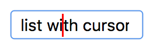

# Lists

This lesson describes lists with a cursor and provides two implementations for them.
Lists enable storing, quering and traversing a sequence of elements
in a sequential way. Lists with a cursor can only be accessed in one position
at any time, so they are less powerfull than lists with iterators (but are also simpler
to implement).

A list with a cursor is a sequence of elements that has a (unique) cursor between the
elements, as well as before the frist and after the last element. We denote such
a list with a cursor using the [40,12,35;23,39] notation, which means that the list
corresponds to the sequence [40, 12, 35, 23, 39] and that its cursor is placed between
its third and fourth elements (35 and 23). Observe the use of the commas and the semicolon.

The list can be traversed by moving the cursor sequentially to the left or to
the right, as well as moving it directly before the start or past the end of
the sequence. The following table illustrates the possible movements on the
list [40,12,35;23,39]:

| movement        | result            |
| --------------- | ----------------- |
| `move_to_start` | [;40,12,35,23,39] |
| `move_to_end`   | [40,12,35,23,39;] |
| `move_to_left`  | [40,12;35,23,39]  |
| `move_to_right` | [40,12,35,23;39]  |

The `get` operation returns the elements after the cursor. Elements are
inserted before the cursor and are removed after the cursor. In order to
remember it, think about a text box where keys insert elements before the
cursor and where the <kbd>delete</kbd> key erases the character after the cursor:

<center>

</center>

## Implementation with two stacks

In this implementation, a list is represented by two stacks, the left stack
and the right stack, which face each other. The elements before the cursor are
in the left stack and the elements after the cursor are in the right stack.

For instace, the list [40,12,35;23,39] is represented by the [40,12,35[ left
stack and the ]23,39] stack. Moving the cursor involves moving the top
elements between the stacks. Accessing elements around the cursors involves
accessing the top elements of the stacks.

```c++

<!--@include: ./stacks.cc-->

```

The cost of all operations is constant, except for `move_to_start` and
`move_to_end`, which are linear in the worst case.

## Implementation with doubly linked nodes

In this implementation a list is represented with a circular doubly linked list
of nodes with a ghost element (noted 👻). The ghost element
is not necessary but provides an easier implementation.

Each list has two pointers to the nodes of its circular doubly linked list of nodes:

-   `ghost` points to the ghost node.
-   `cursor` points to the element after the cursor.

FALTA ACTAULITZAR DIBUIXOS PER FERLOS CIRCULARS

For instace, list [40,12,35;23,39] would be represented like this:

```text
    beg                cur          end
    ↓                  ↓            ↓
 ├─ 40 ⟷ 12 ⟷ 35 ⟷ 23 ⟷ 39 ⟷ 👻 ─┤
```

Likewise, list [40,12,35,23,39;] would be represented like this:

```text
                                    cur
    beg                             end
    ↓                               ↓
 ├─ 40 ⟷ 12 ⟷ 35 ⟷ 23 ⟷ 39 ⟷ 👻 ─┤
```

To be clear, the empty list [;] is as shown:

```text
    beg
    end
    cur
    ↓
 ├─ 👻 ─┤
```

The implementation follows:

```c++
<!--@include: ./nodes.cc-->
```

The cost of all operations is constant, except for the copy operations, which are linear,
of course.

<Autors autors="jpetit roura jordic"/>
