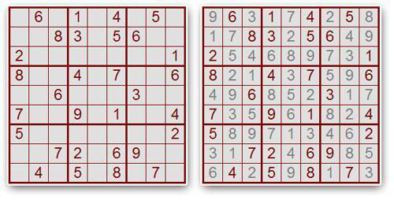
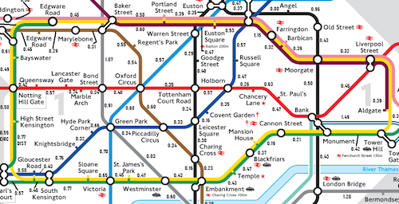
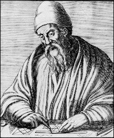

# Context

Falta dir què hi ha aquí.

## Introducció

Un computador és una màquina que processa dades tot aplicant una sèrie
d'instruccions. A partir d'unes dades d'entrada subministrades per un usuari, el
computador realitza una sèrie de càlculs i genera unes dades de sortida que són
lliurades a l'usuari. Els càlculs que executa el computador segueixen un
programa que codifica, utilizant un llenguatge de programació, un algorisme. Els
algorismes descriuen en detall i sense ambiguitats com resoldre problemes, és
a dir, com partir d'unes dades i arribar a unes altres.

## Problemes computacionals

Un **problema computacional** és una pregunta genèrica que es pretén contestar
de forma automàtica amb un computador. Les dades que cal subministrar a una
pregunta genèrica per tal de poder-la respondre s'anomenen **dades d'entrada**
(o **entrades**). Les dades corresponents a la resposta s'anomenen **dades de
sortida** (o **sortides**). Un problema computacional estableix de forma
general quines són les dades d'entrada admissibles i quina és la relació entre
les dades d'entrada i les dades de sortida.

### Exemple: Producte de nombres

Per exemple, "_Donats dos naturals $x$ i $y$, quin és el producte de $x$ per
$y$?_" és un problema computacional. Aquesta és una pregunta genèrica, en el
sentit que no es pot contestar fins que no s'aportin unes dades específiques, i
que la resposta, també específica, depèn d'aquestes dades. Així, per exemple,
un cop s'indiqui al computador que $x$ val 12 i $y$ val 3, aquest podrà resoldre
el problema computacional sobre aquestes dades específiques i respondre que el
seu producte és 36. Si s'indica que $x$ val 2891 i $y$ val 4591, llavors la
resposta del problema genèric per aquestes dades específiques serà 13272581.

Per aquest problema computacional, les dades d'entrada són, doncs, dos
naturals $x$ i $y$, i la única dada de sortida és un altre natural, diguem-ne
$p$. La relació entre les dades d'entrada i les dades de sortida és que $p$ ha
de ser el producte de $x$ i $y$, és a dir, $p=x·y$.

### Exemple: Resolució de Sudokus

Resoldre Sudokus és un altre exemple de problema computacional. Recordeu que
el Sudoku és un joc que consisteix a completar una graella 9 × 9 amb números
entre 1 i 9 de manera que el resultat final no tingui números repetits a la
mateixa fila, columna o submatriu 3 × 3. Aquest és un Sudoku i la seva
solució:

->  <-

El problema computacional del Sudoku té com a entrada una graella incompleta i
té com a sortida una graella completa. La relació entre les dades d'entrades i
les de sortida és que la graella de sortida ha de ser comforme amb la graella
d'entrada i les regles del joc. Les dades d'entrada admissibles són aquelles
que tenen exactament una solució.

### Altres exemples

Altres exemples de problemes computacionals inclouen:

-   _Donat un natural, és un nombre primer?_

    Per a aquest problema, les dades d'entrada són un únic natural,
    diguem-ne $n$. La dada de sortida és `sí` quan $n$ és un nombre
    primer, o `no` quan $n$ no ho és.

    En el cas que l'entrada sigui 17, la sortida associada és `sí`. En
    canvi, en el cas que l'entrada sigui 33, la sortida associada és `no`.

-   _Donada una data vàlida a partir del dia, més i any, quin dia
    de la setmana li correspon?_

    Per aquest problema, l'entrada és una data, que es pot representar a través
    de tres nombres (el dia, el més i l'any). La sortida és un dia de la setmana
    (dilluns, ..., diumenge). Es recalca que la data ha de ser vàlida, perquè
    altrament la pregunta no té sentit.

    Així, en el cas que l'entrada fós 17 11 2006 (el 17 de novembre de 2006), la sortida
    corresponent seria _divendres_. En canvi, l'entrada 30 2 2008 (el 30 de febrer de 2008) no és admissible per aquest problema, perquè el febrer no té 30 dies.
    Determinar si una data és vàlida o no seria un altre problema computacional.

-   _Donat un conjunt no buit de naturals, quin d'ells és el màxim?_

    Per aquest problema, l'entrada és un conjunt de naturals i la
    sortida és un dels naturals d'aquest conjunt, concretament el més gran.
    En aquest cas, cal recalcar que el conjunt d'entrada no pot ser
    buit, perquè el màxim d'un conjunt buit no està ben definit.

    En el cas que l'entrada sigui el conjunt {5,74,-2,11,71}, la sortida
    associada és l'enter 74. El conjunt buit (∅) no és una entrada
    admissible d'aquest problema i, per tant, no té cap sortida associada.

-   _Donat un text i un patró, determinar si el patró apareix
    o no dins del text (i on si hi apareix)._

    Aquest problema apareix en moltes aplicacions: Per exemple, un usuari d'un
    processador de textos pot voler buscar una paraula dins del seu document,
    potser per remplaçar-la per una altra. També, un biòleg pot voler saber si
    una seqüència de nucleotids apareix o no en una cadena d'ADN. I
    també, un cercador d'internet tipus Google té interès en trobar una
    determinada paraula introduïda per un usuari en bilions de pàgines web.

    Malgrat totes aquestes diferents aplicacions, les entrades d'aquest
    problema sempre són dues informacions textuals i la sortida és `sí` o
    `no` (i en el cas afirmatiu, on).

    Així, si tenim una entrada on el text és `esperança` i el patró és
    `pera`, la sortida associada és `sí`, començant a la posició 3.

-   _Donada la descripció de les línies i parades del metro d'una ciutat,
    una estació de
    partida i una estació de destí, trobar el camí més ràpid per anar del estació
    d'orígen al estació de destí._

    Aquest problema, té com a dades d'entrada un graf (on els vèrtexs
    corresponen a parades i les arestes a trams entre parades amb l'anotació
    del seu temps) i dos vèrtexs d'aquest graf. Les dades de sortida són una
    sèrie de trams a recórrer, començant al vèrtex de partida i acabant al vèrtex
    de destí, que segueixen els trams de vies, i que formen el camí més ràpid
    d'entre tots els possibles.

    ->  <-

**Exercici.** Per als problemes següents, identifiqueu quines són les
entrades, quines són les sortides, quines condicions han de complir les
entrades per ser admissibles, i quina relació hi ha entre les entrades i les
sortides.

-   Calcular la suma de dos nombres reals.
-   Calcular el quocient de dos nombres reals.
-   Calcular el quocient i el residu de dos nombres enters.
-   Calcular el valor absolut d'un nombre real.
-   Calcular l'arrel quadrada d'un nombre real.
-   Resoldre una equació lineal.
-   Resoldre una equació de segon grau.
-   Trobar la mitjana de les notes dels alumnes d'una classe.
-   Calcular la distància entre dos punts del pla.
-   Calcular la distància entre dos punts de l'espai.
-   Esbrinar si dues línies són iguals, paral·leles o s'intersecten.
-   Simplificar una fracció.
-   Decidir si dues fraccions representen el mateix nombre racional.

## Algorismes

Un **algorisme** és un conjunt explícit d'instruccions per a dur a terme
algun càlcul que, a partir d'unes dades d'entrada, produeix unes dades de
sortida.


El mot _algorisme_ (o _algoritme_) prové del nom Abu Abdullah Muhammad ibn
Musa al-Khwarizmi, matemàtic i astrònom persa del segle IX que va adoptar el
sistema decimal i va desenvolupar els mètodes bàsics de suma, multiplicació i
divisió.

Les instruccions que es poden utilizar en un algorisme depenen de les operacions
bàsiques que el processador que l'ha d'executar pugui dur a terme. En el cas
dels processadors digitals dels computadors moderns, un processador pot
realitzar operacions lògiques i aritmètiques, així com encadenar les
instruccions una rera l'altra, i executar-ne d'altres condicionalment o
repetidament.

Els algorismes es poden expressar usant moltes notacions, incloent llenguatge
natural, llenguatges de programació, pseudocodi, diagrames de processos,
circuits... En aquest curs, primer esbossarem els algorismes en llenguatge
natural. Després, els concretarem tot utilitzant un llenguatge de programació,
C++ concretament.

Un algorisme és **correcte** per a solucionar un determinat problema
computacional si, per a totes les possibles dades d'entrada admissibles, les
dades de sortida produïdes per l'execució de l'algorisme compleixen
l'especificació del problema.

És essencial que els algorismes siguin correctes. Els algorismes incorrectes
poden causar que un computador mai doni la resposta (es penji), que executi
alguna instrucció il·legal (per exemple, dividir per zero), o que produeixi
resultats incorrectes. Depenent del context, els algorismes incorrectes poden
provocar efectes catastròfics. Per exemple, la Therac-25 era una màquina de
radiacions terapèutiques controlada per computador. La seva mala programació
va causar sis accidents entre 1985 i 1987, en els quals els pacients van rebre
sobredosis massives de radiació. Tres dels sis pacients en van morir. Un altre
error més recent sense conseqüències tant terribles però que afecta molta més
gent és la de la primera versió de l'Excel 2007 de Microsoft, que mostra
incorrectament el resultat de multiplicar 77.1 per 850: enlloc de donar la
resposta 65535, escriu 100000.

A continuació presentem alguns exemples d'algorismes.

### Algorisme de multiplicació escolar

Considerem el problema computacional següent: donats dos nombres $x$ i $y$, es
vol obtenir el seu producte. Per centrar la discussió, restringim-nos al cas on
els dos nombres són naturals (en informàtica, es considera que els nombres
naturals inclouen el zero: $\mathbb{N}=\\{0, 1, 2, 3, ...\\}$).

Per resoldre aquest problema, a l'escola ja ens van ensenyar un algorisme quan
erem ben petits... Segur que el recordeu! L'aplicació d'aquest algorisme als
nombres $x$=2891 i $y$=4591, dóna lloc al desenvolupament següent:

```c++text
2 8 9 1
× 4 5 9 1

---

2 8 9 1
2 6 0 1 9
1 4 4 5 5
1 1 5 6 4

---

1 3 2 7 2 5 8 1

```

Fixeu-vos que per poder aplicar aquest algorisme, cal que el processador que el
du a terme conegui les taules de multiplicació i sàpiga sumar.

**Exercici.**
Descriviu, en les vostres pròpies paraules però en tot
detall, l'algorisme de multiplicació escolar.

**Exercici.**
Complementeu l'explicació anterior per tenir en compte possibles
enters negatius.

### Algorisme de multiplicació del pagès rús

L'algorisme anterior per multiplicar dos nombres és segurament el més popular
(tot i que hi ha països on s'ensenya fent correr les files cap a la dreta enlloc
de cap a l'esquerra). Però hi ha altres algorismes ben diferents per
multiplicar dos nombres. A continuació considerem l'algorisme de
**multiplicació del pagès rús** (també anomenat **multiplicació egípcia**,
perquè es remonta a la forma per multiplicar que tenien els antics egipcis cap
al 2000 aC):

-   Utilitzeu una taula amb dues columnes.
-   Escriviu els dos nombres a multiplicar ($x$ i $y$) a la primera fila.
-   Escriviu els resultats de dividir successivament $x$ entre 2 (oblidant
    fraccions) a la primera columna, fins que arriveu a 1.
-   Escriviu els resultats de multiplicar successivament $y$ per 2 a la segona columna tantes
    vegades com heu dividit $x$ per 2.
-   Marqueu tots els nombres de la segona columna que estan al costat d'un
    nombre senar a la primera.
-   Sumeu tots els nombres de la segona columna
    que hagueu marcat. Aquest és el resultat de $x$ per $y$.

Apliquem aquest algorisme sobre les dades d'entrada $x$=2891 i $y$=4591:

```c++text
        2891        4591
       --------------------
        1445        9182 ←
         722       18364
         361       36728 ←
         180       36728
          90      146912
          45      293824 ←
          22      587648
          11     1175296 ←
           5     2350592 ←
           2     2350592
           1     9402368 ←
       --------------------
                13272581
```

Afortunadament, aquest algorisme dóna la mateixa resposta que el que vam
aprendre a l'escola!

Fixeu-vos que per poder aplicar aquest algorisme, el processador que el du a
terme ha de saber calcular la meitat d'un nombre, sumar dos nombres i
determinar si un nombre és senar. Segur que hauríeu preferit que us
ensenyéssin aquest algorisme a l'escola: estudiar les taules de multiplicació
costava molt...

**Exercici.**
Utilitzeu l'algorisme de multiplicació del pagès rus per multiplicar 47532 per 1735.

**Exercici.**
Argumenteu perquè l'algorisme de multiplicació del pagès rus és correcte.

### Algorisme d'Euclides pel MCD

El **màxim comú divisor** (MCD) de dos naturals no nuls és el natural més gran
que divideix ambdós nombres sense deixar residu. Denotem per $\mcd(a,b)$
el màxim comú dividor de $a$ i de $b$. Per exemple, $\mcd(78,24)=6$ i
$\mcd(4,14)=2$.

Una aplicació del màxim comú divisor és la reducció de fraccions: Per exemple,
com que $\mcd(78, 24)=6$, tenim

$$
    \frac{78}{24}=\frac{13·6}{4·6}=\frac{13}{4}.
$$

Una manera possible per trobar el màxim comú divisor de dos nombres és calcular
els divisors de tots ells i quedar-se amb el més gran dels comuns. Una altra
manera de trobar el màxim comú divisor de dos nombres és descompondre cadascun
d'ells en el seu producte de factors primers, i triar aquells factors que
apareguin a les dues descomposicions. Per exemple, per calcular $\mcd(78,24)$,
trobem que $78 = 13·3·2$ i que $24 = 3·2·2·2$. Els factors comuns són el 3 i el
2 (tots dos un sol cop), per tant, $\mcd(78,24)=3·2=6$. Tot i que aquests
algorismes són correctes, a la pràctica, resulten massa lents i complicats.



Una alternativa millor és utilitzar l'**algorisme d'Euclides**.
Aquest algorisme descobert pels grecs clàssics va ser descrit per Euclides en
els seu llibre _Elements_ cap a l'any 300 aC. Molts historiadors consideren que
l'algorisme d'Euclides és el primer algorisme de ple dret. Tot i que Euclides
va formular el seu algorisme geomètricament, aquí l'interpretarem de forma
numèrica. Essencialment, l'algorisme d'Euclides diu:

> Resteu al més gran dels dos nombres el més petit, fins que siguin iguals; aquesta és la solució.

Provem de seguir el funcionament d'aquest algorisme per calcular
el màxim comú divisor de 78 i 24:

-   Al principi, els dos nombres són 78 i 24. Com que el més gran és 78 i
    el més petit és 24, al 78 li restem 24, quedant ara aquest com 54. L'altre
    nombre no s'ha tocat, i queda encara com 24.
-   Ara, com que 54 i 24 no són iguals, i com que el més
    gran és 54 i el més petit és 24, al 54 li restem 24, quedant
    aquest com 30. Els nombres que tenim ara són, doncs, 30 i 24.
-   Continuem, perquè 30 i 24 no són encara iguals. Ara toca
    restar 24 a 30, quedant 6 i 24.
-   Com que 6 i 24 no són encara iguals, i el més gran
    és ara el segon, restem 6 a 24, quedant-nos
    6 i 18.
-   De nou, com que 6 i 18 no són iguals, restem 6 a 18,
    i ens queda 6 i 12.
-   Com que 6 i 12 no són iguals, restem 6 a 12,
    i ens queda 6 i 6.
-   Ara els dos nombres són iguals (6). L'algorisme ens diu que el nombre
    obtingut és el màxim comú divisor dels nombres inicials. Per tant,
    $\mcd(78,24)=6$.

Podem resumir l'execució dels passos anteriors
utilitzant una taula de dues columnes. A la primera fila col·locarem
els dos nombres dels quals volem calcular el seu màxim comú divisor.
A continuació, mirarem quin dels dos és més gran i, a la fila
inferior, li restarem el més petit. El més petit el deixarem tal qual.
Quan arribem a una fila amb els dos valors iguals, l'algorisme d'Euclides
ens diu que aquell nombre és la solució:

```c++text
     78  24
    --------
     54  24
     30  24
      6  24
      6  18
      6  12
      6  6
    --------
        6
```

Aplicar l'algorisme d'Euclides és ben senzill: només cal considerar sempre dos
nombres (que van canviat), cal poder saber si són iguals o no, cal saber també
comparar-los per esbrinar quin és el gran i quin és el petit, i cal saber
restar-ne un a l'altre.

La correctesa de l'algorisme d'Euclides es basa en la
propietat següent:

**Propietat.**
Si $x$ i $y$ són enters estrictament positius tals que $x>y$,
llavors $\mcd(x,y)=\mcd(x-y, y)$.

**Demostració.**
Qualsevol enter que divideixi $x$ i $y$ també ha de dividir $x-y$.
Per tant, $\mcd(x,y)\le\mcd(x-y, y)$. D'altra banda,
qualsevol enter que divideixi $x-y$ i $y$ també ha de dividir $x$ i $y$.
Per tant, $\mcd(x-y,y)\le\mcd(x, y)$.

**Exercici.**
Utilitzeu l'algorisme d'Euclides per calcular el màxim comú divisor de 4290
i 910.

**Exercici.**
Què li passa a l'algorisme d'Euclides descrit quan es vol calcular el màxim
comú divisor de zero i un altre nombre? Arregleu-ho.

**Exercici.**
Quin és el MCD de 123456789 i 1? Calculeu-lo amb l'algorisme d'Euclides.
O... millor que no. Més endavant veurem com arreglar-ho.

**Exercici.**
El **mínim comú múltiple** de dos naturals és el menor natural (diferent de
zero) que és múltiple d'ambdós. Doneu un algorisme per calcular el mínim comú
múltiple de dos naturals utilitzant la seva descomposició en producte de factors
primers. Doneu una manera de calcular el mínim comú múltiple de dos naturals
coneixent el seu màxim comú divisor. Expliqueu com utilitzar el mínim comú
múltiple de diferents nombres per sumar fraccions amb denominadors diferents.

## Model abstracte de computador

Per tal de poder programar computadors, ens cal saber què és un computador.
Ara bé, els computadors moderns són màquines molt complicades i donar-ne una
descripció acurada és massa difícil. Per això, nosaltres ens acontentem amb
descriure un model abstracte i ideal de computador. Tot i ser un model molt
simplificat, aquest conté els elements que més ens interessen a l'hora de
començar a programar.

<svg id='svg-model' style='width: 100%; height: 400px; margin-bottom: 2em;'>
</svg>
<script type="text/coffeescript" src="model.coffee"></script>

Un **computador** és una màquina que manipula dades tot aplicant una sèrie
d'instruccions d'acord amb un programa. El model de computador abstracte que
considerem es compon dels elements següents:

-   **Memòria:** La memòria és el lloc on s'emmagatzemen (desen) les dades que
    manipula l'ordinador. Aquestes dades solen ser nombres, lletres, paraules o
    combinacions d'aquestes.

-   **Unitat de càlcul:** La unitat de càlcul és el lloc on es realitzen les operacions elementals
    que el computador sap dur a terme. Aquestes operacions poden ser sumar,
    multiplicar o comparar nombres, per exemple. Les dades que s'operen provenen
    de la memòria, i els resultats es desen també a la memòria.

-   **Unitat de control:** La unitat de control és l'encarregada d'encadenar
    les instruccions l'una rera l'altra, tot seguint la lògica del programa. Gràcies
    a la unitat de control certes instruccions es poden repetir, executar o no, etc.

-   **Dispositius d'entrada/sortida:** Els dispositius d'entrada/sortida (E/S)
    asseguren la comunicació del computador amb l'exterior; serveixen per introduir
    les dades d'entrada i extreure les dades de sortida. Per simplicitat, considerem
    que només hi ha un sol dispositiu d'entrada i un sol dispositiu de sortida. El
    dispositiu d'entrada llegeix dades que desa a la memòria; el dispositiu de
    sortida escriu dades emmagatzemades a la memòria.

Si pensem en un ordinador corrent d'avui en dia, la memòria es correspon a la
seva RAM (el meu ordinador té 16 gigabytes de memòria), les unitats de càlcul
i de control es corresponen al seu processador (el meu ordinador té un Intel
Core de 3.1 a gigahertzs, i els dispositius d'entrada/sortida es corresponen
als dispositius que hi connectem (per exemple, el teclat, el ratolí i el
micròfon són dispositius d'entrada; el monitor i l'impressora són dispositius
de sortida; i els discos durs i la connexió de xarxa són d'entrada i sortida).

Com és evident, tots aquests elements són molt complexes, però els sistemes
operatius ens permeten considerar-los d'una forma molt més senzilla. El
**sistema operatiu** d'un computador és el programari que gestiona els
recursos del computador i ofereix serveis als programadors per utilitzar-los
tot amagant la seva complexitat. En particular, el sistema operatiu sol oferir
serveis per a la gestió de la memòria, dels processos (programes actius) i
dels perifèrics (a través de sistemes de fitxers).

**Exercici.**
Esbrineu quin sistema operatiu té el vostre computador personal. Esbrineu també
quin processador té, quanta memòria té, i quins són els seus dispositius
d'entrada, de sortida i d'entrada sortida.

## Llenguatges de programació

Un **llenguatge de programació** és un llenguatge artificial per controlar un
computador tot expressant de forma precisa un algorisme.

Existeixen milers de llenguatges de programació. A grans trets, aquests es poden
classificar segons el seu ús (propòsit general, programació de sistemes,
programació de guions), el seu nivell d'abstracció (d'alt, mig o baix nivell) i
segons el seu paradígma de programació (imperatiu,
funcional o lògic).

Els llenguatges de programació es defineixen a través d'unes
**regles sintàctiques** (com s'escriuen les coses) i d'unes
**regles semàntiques** (què descriuen les coses).

Com que els computadors no enténen directament els llenguatges de programació,
cal primer convertir un programa escrit en un llenguatge de programació concret
en les instruccions bàsiques que realment entén el computador. Aquest procés
s'anomena **compilació**. Per fortuna aquesta conversió la pot fer
automàticament el propi computador a través d'un programa anomenat
**compilador**, el qual també aprofita la ocasió per verificar que el
programa no contingui errors sintàctics ni semàntics.

Nosaltres ens centrem en els llenguatges de programació imperatius. En un
**llenguatge imperatiu**, un programa consisteix en una sèrie d'instruccions
que descriuen canvis en les dades de la memòria. En aquest curs programem els
algorismes utilitzant el llenguatge C++. Aquest llenguatge de programació és
enorme; només en veurem una petita part, tot destacant les construccions que la
majoria dels llenguatges imperatius comparteixen amb ell.
Al proper capítol veurem els elements bàsics de C++.

## Desenvolupament de programes

El procés de desenvolupament d'un programa involucra realitzar les etapes
següents:

-   **Especificació del problema:**
    El primer pas que cal fer és especificar quin és el problema a resoldre.
    Especificar un problema consisteix en descriure adecuadament el problema
    considerat. Per això cal descriure quines són les seves possibles dades
    d'entrada, quines són les possibles dades de sortida i quina relació hi ha entre
    les dades de sortida i les dades d'entrada. Això involucra comprendre tot el
    context del problema. En l'etapa d'especificació es tracta només de _què_
    cal arribar a fer, no de _com_ fer-ho.

-   **Disseny d'un algorisme:**
    A continuació, cal dissenyar un algorisme per
    solucionar el problema. Dissenyar un algorisme és una tasca molt creativa,
    lligada a l'experiència i al coneixement de diversos esquemes algorísmics.

-   **Codificació d'un programa:**
    Després, cal escriure un programa tot
    codificant l'algorisme utilitzant un llenguatge de programació. Aquest programa
    es prepara per tal de poder ésser executat pel computador.

-   **Proves del programa:**
    Finalment, un cop el programa preparat, cal
    provar-lo. Això consisteix en executar-lo sobre algunes entrades, per tal
    d'assegurar-se que, almenys sobre aquelles entrades, el programa funciona tal
    com s'espera.

Malauradament, durant la realització d'aquest etapes, es cometen o diagnostiquen
errors que impliquen recular a etapes anteriors. Per això, sempre és
convenient deixar ben documentat l'assoliment de cadascuna de les etapes.

La **programació** és la disciplina que s'encarrega d'escriure, ampliar,
provar, corregir i mantenir programes. L'**enginyeria de software** és la
branca de l'informàtica que es preocupa de tots els aspectes de la
producció de programes de forma sistemàtica i organitzada.
```c++`

```

```
