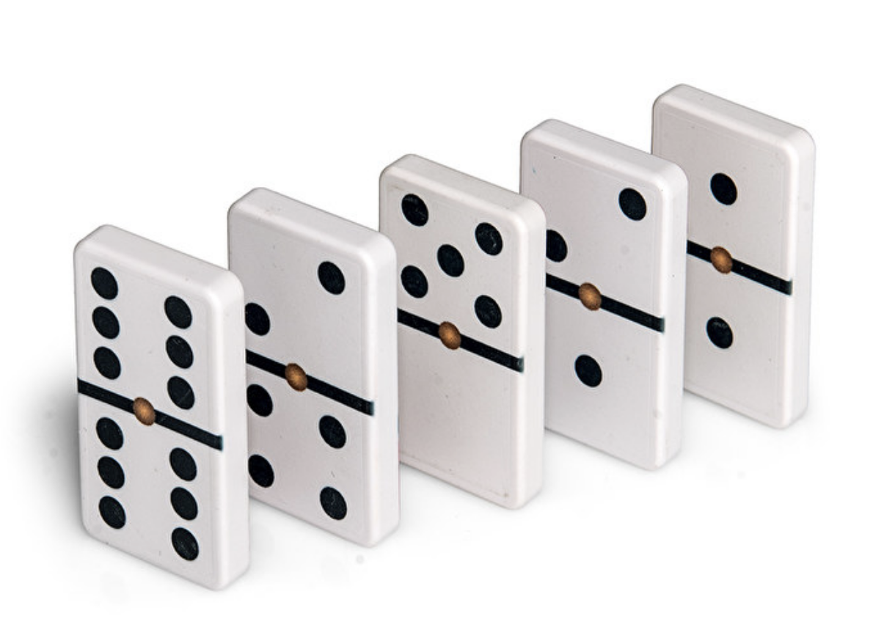

# Aplicació: Trens de dòminos



Aquesta lliçó mostra com processar una seqüència de dades
que representa una successió de fitxes de dòmino
per tal de comptar quants errors té.

## Descripció del problema

La Marta està jugant soleta amb les fitxes de dòmino del seu germà gran, l'Arnau.
De fitxes en té moltes, i en pot tenir de repetides.
A ella li agrada fer "trens" llargs,
de forma que els números de les fitxes adjacents encaixin.
Per exemple, ara ha fet el tren correcte <big>🁀🀼🁑🁒🁘🁍🀷</big>.
Però, a vegades, la Marta comet errors.
Per exemple, el tren <big>🁃🁂🁈🁃🁅🁠</big> en té dos:
la primera i la segona fitxa no encaixen,
i la quarta i la cinquena tampoc.

L'Arnau vol fer un programa que compti el nombre d'errors d'un tren donat.
L'entrada consistirà en una seqüència de parells de nombres (entre el 0 i el 6)
que representen les fitxes del tren.
Per exemple, el tren <big>🁀🀼🁑🁒🁘🁍🀷</big>
es representa amb ~~2 1 1 4 4 4 4 5 5 4 4 0 0 6~~.
Aquí, suposarem que tots els trens tenen almenys una fitxa.
Per exemple, la seqüència ~~3 2~~
representa el tren amb una sola fitxa (i, per tant, correcte) <big>🁈</big>.

## Interludi

Abans de presentar la solució, fixeu-vos com amb la descripció del problema
hem convertit una informació mundana sobre fitxes de dòmino
en una simple seqüència d'enters.
En Informàtica, és molt freqüent haver de codificar la informació del món real
com a dades d'un cert tipus (aquí, nombres enters).
De fet, és la digitalització de tot tipus d'informacions
(com are mapes, cançons, imatges i pel·licules de cinema...)
la que ha conduït a la revolució digital.

## Solució

Sabem que la seqüència d'entrada
representa un tren compost de fitxes.
Per exemple, ~~2 3 3 4 5 4~~ representa <big>🁂🁊🁘</big>.
Com resolem aquest problema?
Quan tenim el primer nombre de cada fitxa (excepte la primera),
el que ens cal tenir també és el segon nombre de la fitxa anterior,
per poder comprovar si són iguals o no.
Per tant, separarem els elements de l'entrada d'aquesta manera:
~~2 | 3 3 | 4 5 | 4~~.
El primer i el darrer element de la seqüència quedaran desaparellats,
però poc ens importa, perquè mai no poden implicar errors.
Cada parell (és a dir, ~~3 3~~ i ~~4 5~~)
representa els extrems en contacte de dues fitxes adjacents.
Si les dos nombres són iguals, és que els extrems encaixen;
altrament, és que la Marta ha comès un error.

Per tant, el problema es redueix a oblidar el primer nombre (i, al final, també el darrer)
i recórrer la resta dels elements de la seqüència d'entrada de dos en dos, comptant
com a errors aquells que tenen els dos nombres diferents:

```c++
#include <iostream>
using namespace std;

int main() {
int errors = 0;
int primer;
cin >> primer;
int dret, esquerre;
while (cin >> dret >> esquerre) {
if (dret != esquerre) ++errors;
}
cout << errors << endl;
}

```

Explicació:

-   La variable `errors` conté el nombre d'errors trobats fins al moment.
    Aquesta variable s'inicialitza a zero,
    perquè en començar encara no s'ha trobat cap error.

-   La variable `primer` representa el nombre esquerre de la primera fitxa del tren.
    No ens importa, però cal que el llegim per poder passar al següent nombre.
    D'alguna forma, ens el "saltem".

-   A continuació, mentre puguem llegir dos nombres més, obtindrem el nombre
    `dret` d'una fitxa i el nombre `esquerre` de la següent. Si `dret` i `esquerre`
    no són iguals, és que les fitxes no encaixen i cal incrementar el comptador `errors`.

-   En sortir del bucle, quan només quedi mitja fitxa,
    tan sols cal escriure el nombre total d'errors trobats.

Fixeu-vos que el bucle acaba quan es llegeix el nombre de la dreta de la darrera fitxa
i no es pot llegir cap altre nombre. En altres paraules, el bucle acaba perquè
dels dos nombres que calia llegir, només se n'ha pogut llegir un.

## Un problema similar

Suposem que ara volem resoldre un problema molt semblant,
en el qual l'entrada és idèntica,
però només volem saber si el tren conté algun error o no.
És a dir, ara el programa no haurà d'escriure el nombre total d'errors,
sinó o bé `correcte` o bé `incorrecte`.

Aquest programa, còpia quasi idèntica de l'anterior, òbviament funcionaria:

```c++
#include <iostream>
using namespace std;

int main() {
    int errors = 0;
    int primer;
    cin >> primer;
    int dret, esquerre;
    while (cin >> dret >> esquerre) {
        if (dret != esquerre) ++errors;
    }
    if (errors == 0) cout << "correcte" << endl;
    else cout << "incorrecte" << endl;
}
```

Però, és una bona solució?
Depèn.
Si sabem que les seqüències d'entrada que rebrà el programa seran sempre curtes,
aquest codi ja està prou bé.
Tanmateix, si l'entrada pot ser molt llarga,
aquest codi no és prou eficient.
Per exemple, considereu un tren amb un milió de fitxes com ara
~~0 1 1 2 3 4 4 4 4 4 4 4 4 4 4 4 4 4 ...~~
Com que la segona i la tercera fitxes no encaixen,
després de només dues iteracions del `while`
ja sabem que el tren és incorrecte.
Amb tot, el programa fa quasi mig milió d'iteracions més
per llegir fins al final dades que són irrellevants,
en lloc d'aturar-se i escriure el resultat: `incorrecte`.

Aquest codi implementa la millora mencionada:

```c++
#include <iostream>
using namespace std;

int main() {
    int errors = 0;
    int primer;
    cin >> primer;
    int dret, esquerre;
    while (errors ==  0 and cin >> dret >> esquerre) {
        if (dret != esquerre) ++errors;
    }
    if (errors == 0) cout << "correcte" << endl;
    else cout << "incorrecte" << endl;
}
```

L'única diferència rau a la condició del bucle.
Ara, seguim iterant mentre no haguem trobat cap error
i hi hagi més fitxes per llegir.
Mirat a la inversa,
quan la variable `errors` esdevé diferent de zero
aturem el bucle immediatament,
perquè ja no cal que seguim llegint.

Per finalitzar aquesta lliçó, cal dir que el codi anterior
es podria fer lleugerament millor,
usant una variable de tipus `bool`,
el qual encara no hem vist en aquest curs.

<Autors autors="jpetit roura"/>
