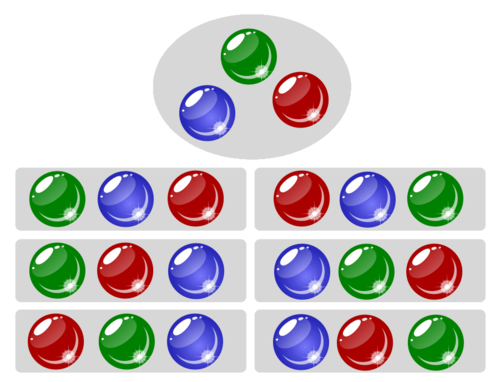

# Aplicació: Factorial


En aquesta lliçó es calculen els nombres factorials. A més, es presenten
el concepte de sobreiximent en operacions amb nombres enters.

## Concepte matemàtic del factorial

Donats $n$ objectes, de quantes maneres es poden posar un rera l'altre?

Per exemple, si tenim tres bales, una verda, una blava i una vermella,
hi ha sis maneres de posar-les en fila:

<center>

</center>
<br/>

En general, hi ha $n!$ maneres de posar $n$ objectes
l'un rera l'altre. Aquí, $n!$ denota el factorial de $n$, definit com

$$n!=n(n-1)(n-2)\cdots 1.$$

La raó és aquesta: D'entre els $n$ objectes, hi ha $n$ possibilitats de
triar-ne un com a primer. Un cop triat aquest primer objecte, en queden
$n-1$, i tenim $n-1$ possibilitats de triar-ne un segon, ... I així
fins a l'últim, on només tenim una possibilitat.

Per definició, $0!=1$. Aquest valor és adequat, ja que hi ha exactament
una seqüència amb zero objectes: la seqüència buida.

La taula següent mostra els primers valors dels factorials:

| $n$ | $n!$ |
| --- | ---: |
| 0   |    1 |
| 1   |    1 |
| 2   |    2 |
| 3   |    6 |
| 4   |   24 |
| 5   |  120 |

## Funció per al factorial

Definim ara una funció en C++ per calcular el factorial d'un natural donat.
La capçalera podria ser la següent:

```c++c++
// Retorna el factorial d'un natural n.
int factorial(int n);
```

És a dir, el nom de la funció és `factorial`, té un sol paràmetre enter
anomenat `n`, i retorna un enter. A més, hem pres cura d'indicar que
`n` ha de ser un natural, ja que el factorial dels enters negatius no
està ben definit.

El cos de la funció és fàcil d'escriure:

```c++c++
// Retorna el factorial d'un natural n.
int factorial(int n) {
    int f = 1;
    for (int i = 1; i <= n; ++i) f = f*i;
    return f;
}
```

Aquesta funció calcula el factorial de `n` tot multiplicant
una variable `f` per `i`, per a tots els `i` entre 1 i `n`.
Fixeu-vos que `factorial(0)` retorna `1`, tal com cal.

## Exercici

Considereu aquesta nova versió de `factorial` on la `i`
s'inicialitza a 2 en lloc d'1:

```c++c++
// Retorna el factorial d'un natural n.
int factorial1(int n) {
    int f = 1;
    for (int i = 2; i <= n; ++i) f = f*i;
    return f;
}
```

Funciona?

## Problemes de sobreixement

Aquest és un programa complet que escriu una taula amb `factorial(n)`
per a tots els valors d'`n` entre 0 i 20:

```c++c++
#include <iostream>
using namespace std;

// Retorna el factorial d'un natural n.
int factorial(int n) {
    int f = 1;
    for (int i = 1; i <= n; ++i) f = f*i;
    return f;
}

int main() {
    for (int n = 0; n <= 20; ++n) cout << n << " " << factorial(n) << endl;
}
```

Si proveu d'executar aquest programa (ho feu sempre, oi?), veureu que la sortida possiblement és

```c++text
0 1
1 1
2 2
3 6
4 24
5 120
6 720
7 5040
8 40320
9 362880
10 3628800
11 39916800
12 479001600
13 1932053504
14 1278945280
15 2004310016
16 2004189184
17 -288522240
18 -898433024
19 109641728
20 -2102132736
```

Per als valors d'`n` més grans que 14, els resultats són incorrectes! 😱! Què passa?

El nostre algorisme és correcte. El problema és que els valors que es
poden emmagatzemar en el tipus `int` estan limitats. Per exemple, en
els nostres ordinadors actuals, els valors que es poden representar
dins dels enters sovint es troben entre -2147483648 i 2147483647. Com
que la funció factorial creix molt ràpid, de seguida es sobrepassen
aquests límits i els resultats esdeven incorrectes. Es diu que tenim un
**sobreiximent**. Vegeu la referència sobre [els
enters](ip/referencies/ints.html) per a més informació.

En la majoria dels exemples que veurem en aquest curs, ignorarem el problema
dels sobreiximents.

<Autors autors="jpetit roura"/>
