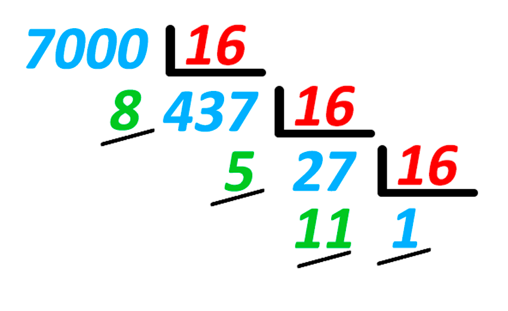

# Aplicació: Nombres en hexadecimal



Aquesta lliçó mostra una possible solució per al poblema
[P60816](https://jutge.org/problems/P60816) (Número del revés en hexadecimal).

## Exercici P60816

L'exercici [P60816](https://jutge.org/problems/P60816) demana un programa que
llegeixi un nombre i que escrigui la seva representació hexadecimal del revés.
Cal seguir la convenció de representar els valors entre el 10 i el 15
amb les lletres de la A fins a la F.

Per exemple,
per a l'entrada ~~14~~ cal escriure la sortida ~~E~~,
per a l'entrada ~~16~~ cal escriure la sortida ~~01~~,
i per a l'entrada ~~7000~~ cal escriure la sortida ~~85B1~~.

Aquesta n'és una possible solució:

```c++
#include <iostream>
using namespace std;

int main() {
int n;
cin >> n;
if (n == 0) cout << 0; // cas especial
else { // cas general
while (n > 0) {
int d = n%16;
if (d < 10) cout << d;
else cout << char(d - 10 + 'A');
n = n/16;
}
}
cout << endl;
}

```

El programa comença llegint el número, que es desa en `n`.
Després, hi ha un tractament especial per al cas que `n` sigui zero
(altrament el programa no escriuria cap dígit),
i un tractament per al cas general.

En el cas general, anem divint el nombre `n` entre 16 fins que sigui zero.
D'aquesta forma se'n visiten tots els dígits en hexadecimal,
de dreta a esquerra.
A cada iteració, se n'extreu i escriu
el darrer dígit hexadecimal `d`.
Si és un valor entre 0 i 9, `d` aquest es pot escriure directament.
Altrament, cal escriure'n la lletra corresponent,
que es pot calcular amb l'expressió `char(d - 10 + 'A')`.
Així agafem la lletra que hi ha `d - 10`
posicions més enllà de la `'A'`:
`'A'` per a 10, `'B'` per a 11, ..., i `'F'` per a 15.

**Nota:** El problema demana d'escriure el resultat al revés
perquè del dret no ho sabríeu fer (encara).

<Autors autors="jpetit"/>
