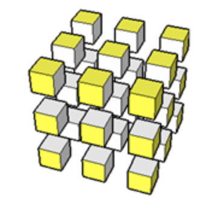

# Matrius


Aquesta lliçó presenta les matrius, una estructura de dades semblant als vectors
però amb més d'una dimensió. De fet, les matrius en C++ no són altra cosa que
vectors de vectors.

Com els vectors, les matrius tenen moltes aplicacions en matemàtiques, però
també poden representar molts altres conceptes en informàtica, com ara taulers,
mapes, patrons...

## Introducció

Una matriu és una estructura de dades que permet guardar diverses dades d'un
mateix tipus, distribuïdes en diverses files i diverses columnes. La informació
desada a cascuna de les posicions d'una matriu és del mateix tipus.
L'ús de matrius és de gran utilitat per resoldre problemes de molts
tipus: Les matrius permeten representar fàcilments taulers de jocs,
mapes, taules, patrons...

<center>

</center>

En C++, una matriu es representa com un vector de vectors. Per convenció, el
vector "exterior" representa les files de la matriu i els vectors "interiors"
representen els valors a cada fila.
Per exemple, aquest tros de codi declara una matriu
`m` de mida 4✕5 i l'inicialitza amb certs
valors.

```c++c++
vector< vector<int> > m = {
    { 3,  5, -1,  7,  2},
    { 7,  1, -1, 17,  6},
    { 6,  1,  3,  1, 12},
    {21,  0, -7,  4,  2}
};
```

La figura següent ho il·lustra: A l'esquerra apareix la matriu com un tot;
a la dreta, descomposta en vectors de vectors.

<center>

</center>

Per accedir a un element a la `i`-èsima fila i a la `j`-èsima columna, cal
indexar la matriu dos cops: `m[i][j]`. Això no és nou: `m[i]` accedeix a
l'índex `i` del vector `m`. Com que `m[i]` és també un vector, `m[i][j]` en
selecciona l'índex `j`.

Per exemple, `m[2][3]` val `1` a la matriu anterior. De fet, `m[2]` és un vector
fila que val `{ 6,  1,  3,  1, 12}`. Obtenir un vector columna d'una matriu no
és una operació directa en C++.

## Creació de matrius

Recordeu en primer lloc que, com que les matrius són vectors de vectors, per
fer-les servir haurem d'incloure la línia `#include <vector>` a l'inici de cada
programa que les utilitzi.

Per crear una matriu, ho farem de la mateixa manera que creem un vector,
però en aquest cas el tipus d'element d'aquest vector serà un altre
cop un vector, aquest ja del tipus de dades desitjat. Així,

```c++c++
vector<vector<int>> matriu;
```

crea una matriu buida anomenada `matriu`.

Les maneres d'inicialitzar una matriu són exactament les mateixes que les d'un
vector, tenint en compte que una matriu no és més que un vector de vectors. Aquí
en teniu un recordatori:

```c++c++
vector<vector<double>> buida;   // matriu buida
vector<vector<int>> files(5);   // matriu amb 5 vectors buits (files)
vector<vector<bool>> falsos(3, vector<bool>(2));
    // matriu 3x2 plena amb elements false
vector<vector<char>> esses(2, vector<char>(4, 's'));
    // matriu 2x4 plena amb elements 's'
vector<vector<int>> nombres = {{1, 2, 3}, {4, 5, 6}, {7, 8, 9}};
                                // matriu 3x3 amb les files especificades
```

Si no recordeu alguna d'aquestes inicialitzacions podeu trobar-les
explicades a la lliçó de [vectors](vectors.html).

També podeu, com als vectors, inicialitzar una matriu copiant-la d'una
altra, o inclús copiant algunes files, de la manera següent:

```c++c++
vector<vector<int>> M = {{1, -3, 2}, {-1, 4, 3}};
vector<int> v = {2, 1, -5};

vector<vector<int>> M_copia = M;
vector<vector<int>> M_girat = {M[1], M[0]};
vector<vector<int>> M_ampliat = {M[0], M[1], v};
```

Aquí podeu veure com quedarien cadascuna d'aquestes matrius:

<center>

</center>

## Matrius de més dimensions



Igual que per fer matrius bidimensionals hem fet que un vector contingui altres
vectors, podem fer que aquests vectors continguin alhora més vectors, i així
indefinidament. Per exemple, podem crear una matriu tridimensional de `n ✕ m ✕ r`
enters amb el codi següent:

```c++c++
vector<vector<vector<int>>> matriu3d(n, vector<vector<int>>(m, vector<int>(r)));
```

Aquesta construcció ens pot servir per exemple per guardar dades sobre punts en
l'espai. No obstant, no és molt habitual el seu ús als primers programes, així
que no entrarem en més detalls.

## Declaracions de tipus amb `using`

Com haureu vist, crear matrius pot arribar a ser una mica feixuc i
complicat de llegir a causa de la notació. És per això que sovint es donen
noms alternatius en aquests tipus utilitzant la paraula clau `using`.

La sintàxi de `using` és `using nom = tipus;` on `tipus` és un tipus
de dades existent (per exemple, `int`, `char` o `vector<int>`) i `nom`
és un identificador nou. El propòsit d'aquesta instrucció és crear un nou
tipus anomenat `nom` equivalent a `tipus`.

Per exemple,

```c++c++
using Temperatures = vector<double>;
```

introdueix un nou tipus anomenat `Temperatures` que és equivalent
a `vector<double>`. A partir d'aquesta declaració, es poden declarar noves
variables i paràmetres utilitzant aquest nou nom de tipus:

```c++c++
double temperatura_mitjana(Temperatures& temperatures) { ... }
```

Podeu perfectament pensar que el compilador substitueix totes les ocurrències
de `Temperatures` per `vector<double>` i tindreu raó. Però pels lectors humans,
proporcionar bons noms als tipus facilita la comprensió del codi. I, a llarg
termini, també els fa més fàcils de millorar.

Fixeu-vos, però, que les declaracions `using` no parlen del nombre d'elements.
Si el que volíem era crear un vector de les temperatures a cada hora del dia,
caldria declarar una variable especificant el nombre de posicions:

```c++c++
Temperatures temperatures(24);
```

Si, a més, volem tenir registre de totes les temperatures al llarg d'un any,
necessitarem un vector de 365 vectors de 24 reals, és a dir, una matriu de
365✕24 reals:

```c++c++
using Temperatures = vector<double>;
using Registre = vector<Temperatures>;

Registre registre(365, Temperatures(24));
```

Gràcies a l'ús de bons identificadors de tipus amb `using`, el programa esdevé
més llegible i, també, més fàcil de modificar en el futur.

## Escriptura de matrius

L'acció següent escriu una matriu d'enters. Per simplicitat, aquesta acció
escriu un espai innecessari al final de cada línia.

```c++c++
using Fila = vector<int>;
using Matriu = vector<Fila>;

void escriure(const Matriu& matriu)
{
    int n = matriu.size();               	// nombre de files (talla de la matriu)
    int m = matriu[0].size();            	// nombre de columnes (talla d'una fila)
    for (int i = 0; i < n; ++i) {     		// per cada índex de fila
        for (int j = 0; j < m; ++j) {		// per cada índex def columna
            cout << matriu[i][j] << " ";  	// escriure l'element corresponent
        }
        cout << endl;               		// saltar línia
    }
}
```

Fixeu-vos com s'han obtingut el nombre de files (`n`) i el nombre de columnes
(`m`) dins de l'acció. Fixeu-vos també que aquest programa fallaria si `M` no
tingués cap fila (perquè `M[0]` no existiria). Penseu com arreglar-ho!

Aquesta seria una manera alternativa de fer-ho, utilitzant bucles `for :`
enlloc d'índexos:

```c++c++
void escriure(const Matriu& matriu)
{
    for (const Fila& fila : matriu) {    	// per cada fila de la matriu
        for (const int elem : fila) {		// per cada element d'aquella fila
            cout << elem << " ";  			// escriure l'element
        }
        cout << endl;               		// saltar de línia
    }
}
```

Fixeu-vos que `escriure` rep la matriu per referència constant. Igual que en el
cas dels vectors, pràcticament sempre passarem les matrius per referència, ja
que en general contenen una gran quantitat d'elements. Altrament, estaríem fent
una còpia de tota la matriu i els nostres programes serien inutilment lents i
pesats.

## Lectura de matrius

En general, ens interessarà llegir certs valors donats i guardar-los
en una matriu. La manera més comuna de fer-ho és passar-li al
programa les dimensions de la matriu que voldrem llegir, seguits
dels elements de la matriu. Així, pel cas d'una matriu d'enters,
el nostre codi tindrà un aspecte semblant al següent:

```c++c++
using Fila = vector<int>;
using Matriu = vector<Fila>;

Matriu llegir_matriu() {
    int n, m;
    cin >> n >> m;          				// llegim les mides de la matriu

    Matriu matriu(n, Fila(m));				// creem la matriu amb les mides adeqüades
        for (int i = 0; i < n; ++i) {       // per cada índex de fila
            for (int j = 0; j < m; ++j) {   // per cada índex columna
                cin >> matriu[i][j];        // llegim l'element corresponent
            }
        }
    }
    return matriu;
}
```

Aquesta seria una manera alternativa de fer-ho, utilitzant bucles `for :`
enlloc d'índexos:

```c++c++
Matriu llegir_matriu() {
    int n, m;
    cin >> n >> m;          				// llegim les mides de la matriu

    Matriu matriu(n, Fila(m));				// creem la matriu amb les mides adeqüades
    for (Fila& fila : matriu) {     		// per cada fila de la matriu
        for (int& elem : fila) {			// per cada element d'aquella fila
            cin >> elem;  					// llegim l'element
        }
    }
    return matriu;
}
```

<Autors autors="rafah jpetit"/>
