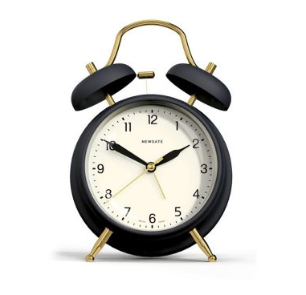

# Aplicació: Més rellotges



Aquesta lliçó tornar a explorar com descompondre un determinat nombre de
segons en hores, minuts i segons, i com incrementar d'un segon l'hora d'un
rellotge. En ambdós casos, s'utilitzen accions amb paràmetres per referència.

A partir d'aquests exemples, aquesta lliçó també desenvolupa una exposició
sobre les diferents direccions dels paràmetres (d'entrada, de sortida o
d'entrada-i-sortida) i els relaciona amb els passos per valor i per
referència.

## Descomposició horària

Considereu el problema següent: Donada una quantitat (positiva) de segons `n`,
es vol saber quantes hores, minuts i segons representa. Per exemple, si `n` val 3661,
cal dir que en 3661 segons hi ha una hora, un minut i un segon. També, si `n`
val 76234, cal dir que en 76234 segons hi ha 21 hores, 10 minuts i 34 segons.

Aquest problema [ja l'havíem tractat](descomposicio-horaria.html) però ara
l'enfoquem des del punt de vista dels subprogrames.

Per tal d'abstreure la tasca de trobar quantes hores, minuts i segons
representa un determinat nombre de segons, utilitzarem un subprograma. En
aquest subprograma li haurem de proporcionar el nombre total de segons. Com a
resultat, aquest subprograma ens calcularà el nombre d'hores, minuts i segons
corresponents.

Aquesta feina sembla ideal per a ser codificada en una funció però,
malauradament, les funcions de C++ només poden retornar un únic valor, i no
tres com ens cal aquí. Per tant, recorrerem a una acció. Aquesta acció tindrà
la capçalera següent:

```c++
void descomposicio_horaria(int n, int& h, int &m, int& s)

```

La seva especificació és que, donat un nombre de segons positius `n`, aquesta
acció desa en `h`, `m` i `s` el nombre d'hores, minuts i segons que representa
`n` (amb `m` i `s` entre 0 i 59).

El seu cos no és altra cosa que la reiteració del que ja havíem escrit quan vam
començar a programar, aquest cop, encapsulat dins d'una acció:

```c++
void descomposicio_horaria(int n, int& h, int &m, int& s) {
    h = n/3600;          // Càlcul del nombre d'hores
    m = (n%3600)/60;     // Càlcul del nombre de minuts
    s = n%60;            // Càlcul del nombre de segons
}
```

Fixeu-vos que l'acció no realitza operacions d'entrada ni de sortida. La seva
entrada conceptual `n` es transmet a través d'un paràmetre per valor. Les
seves sortides conceptuals `h`, `m` i `s` es transmeten a través de tres
paràmetres per referència.

El programa principal per provar aquesta acció sí que es podria encarregar de
l'entrada-sortida:

```c++
int main() {
    // llegir entrada
    int n;
    cin >> n;

    // descompondre n en h, m i s
    int h, m, s;
    descomposicio_horaria(n, h, m, s);

    // escriure la sortida
    cout << h << ' ' << m << ' ' << s << endl;
}
```

## Suma d'un segon

Considereu ara el problema següent: Donada un hora (amb el seu nombre d'hores,
de minuts i de segons), es vol sumar un segon a aquesta hora. Així, donada
l'hora ~~14 9 59~~, es voldria obtenir l'hora ~~14 10 0~~.

Aquest problema [també l'havíem tractat](sumar-un-segon.html) però ara
l'enfoquem de nou des del punt de vista dels subprogrames.

Per tal d'abstreure la tasca de sumar un segon, utilitzarem una acció. Aquesta
acció rebrà tres paràmetres per referència que representen l'hora actual i
els modificarà per tal que representin aquella hora un segon més tard.
Aquesta acció tindrà doncs la capçalera següent:

```c++
void sumar_un_segon(int& h, int &m, int& s)
```

Com a precondició, aquesta acció pressuposa que els valors de `h`, `m`
i `s` són legals (és a dir, amb `m` i `s` entre 0 i 59 i `h` entre 0 i 23).

El cos d'aquesta acció no és altra cosa que la reiteració del que ja havíem
escrit quan vam començar a programar, aquest cop, encapsulat dins d'una acció:

```c++
void sumar_un_segon(int& h, int &m, int& s) {
    ++s;
    if (s == 60) {
        s = 0;
        ++m;
        if (m == 60) {
            m = 0;
            ++h;
            if (h == 24) {
                h = 0;
            }
        }
    }
}
```

De nou, fixeu-vos que l'acció no realitza operacions d'entrada ni de sortida.
El pas de paràmetres permet intercanviar la informació necessària al fer la
crida.

El programa principal per provar aquesta acció sí que es podria encarregar de
l'entrada-sortida:

```c++
int main() {
    // lectura de l'hora
    int h, m, s;
    cin >> h >> m >> s;

    // increment d'un segon
    sumar_un_segon(h, m, s);

    // escriptura del resultat
    cout << h << ' ' << m << ' ' << s << endl;
}
```

## Exercici

Als dos problemes anteriors hem escrit el resultat (una hora) sense
cap tipus de format bonic. Definiu una acció per escriure una hora fent
que els seus elements es separin amb ':' i que els minuts i segons
sempre s'escriguin amb dos dígits exactament.

Una manera de fer-ho seria així:

```c++
void escriure_amb_dos_digits(int x) {
    if (x < 10) cout << 0;
    cout << x;
}

void escriure_hora(int h, int m, int s) {
    cout << h << ':';
    escriure_amb_dos_digits(m);
    cout << ':';
    escriure_amb_dos_digits(s);
}
```

## Modes de pas de paràmetres: entrada, sortida i entrada-i-sortida

Tal com hem vist a la lliçó anterior, C++ ofereix dos modes per passar
paràmetres:

-   pas per valor
-   pas per referència.

(Més endavant en veurem alguna variació menor.)

Per saber quan cal utilitzar l'un i l'altre és convenient pensar sobre
el significat dels paràmetres i la direcció que tenen entre l'acció invocadora
i l'acció invocada:

-   Quan l'acció invocadora ha de passar certa informació a l'acció
    invocada, aquella informació té una **direcció d'entrada**.

-   Quan l'acció invocada ha de passar certa informació a l'acció
    invocadora, aquella informació té una **direcció de sortida**.

-   Un informació té una **direcció d'entrada-i-sortida**
    si té direcció d'entrada i direcció de sortida.

El diagrama següent resumeix aquestes direccions:

TODO:

```c++
<script type="text/coffeescript" src="direccions.coffee"></script>
<div id="div-direccions" style="height: 200px; ">
</div>
```

Analitzem la direcció dels paràmetres per les accions dels dos exemples
anteriors:

1. A l'acció `void descomposicio_horaria(int n, int& h, int &m, int& s)`, la
   informació `n` és una dada que cal transmetre a `descomposicio_horaria`
   perquè aquesta pugui funcionar. Per tant, `n` és un paràmetre d'entrada. En
   canvi, la informació `h` és una dada que `descomposicio_horaria` transmet
   com a resultat a la seva acció invocadora. Per tant, `h` és un paràmetre de
   sortida. Els paràmetres `m` i per `s` són anàlegs a `h`.

2. A l'acció `void sumar_un_segon(int& h, int &m, int& s)`, les informacions
   en `h`, `m` i `s` s'han de transmetre tant cap a `sumar_un_segon` al entrar
   com de `sumar_un_segon` cap a la seva invocadora quan s'en surt. Per tant,
   `h`, `m` i `s` són paràmetres d'entrada-i-sortida.

Per saber com passar un paràmetre, és adient pensar primer de tot en la seva
direcció: És aquest paràmetre d'entrada, de sortida o d'entrada-i-sortida? Si
no ho sabem, no cal continuar: no tenim prou clar què ha de fer aquella
acció... Un cop aclarit, cal decidir si passar-lo per valor o per referència:

-   Si la direcció és d'entrada, té sentit passar-lo per valor. En canvi, no té
    sentit passar-lo per referència, ja que si l'acció el canvíes
    (intencionadament o no), el paràmetre real es veuria modificat i, per tant,
    també seria de sortida.

-   Si la direcció és de sortida, no té sentit passar-lo per valor: La còpia
    del valor no es transmetria cap a l'acció invicadora. En canvi, el pas per
    referència permet obtenir el valor final al sortir de l'acció.

-   Si la direcció és d'entrada-i-sortida, no té sentit passar-lo per valor
    perquè ja no tenia sentit si era de sortida. En canvi, el pas per referència
    permet enviar el valor de l'entrada cap a l'acció invocada i obtenir-ne el
    valor final al sortir de l'acció cap a l'acció invocadora.

Fixeu-vos que una funció pot tenir diferents paràmetres i cada paràmetre pot
tenir direccions diferents dels demés. En tot cas, la taula següent resumeix
com establir el mode de pas segons la direcció del paràmetre:

| direcció          | mode           |
| ----------------- | -------------- |
| entrada           | per valor      |
| sortida           | per referència |
| entrada-i-sortida | per referència |

Observeu que, només mirant la capçalera, no es pot reconèixer si un paràmetre
passat per referència és de sortida o d'entrada-i-sortida. Convé doncs explicitar-ho
en la documentació i/o la especificació de la funció.

Finalment, noteu que els paràmetres reals que es corresponen a paràmetres
d'entrada han d'estar correctament inicialitzats. En canvi, per a paràmetres
de sortida, no cal que els paràmetres reals estiguin inicialitzats. Aquests
dos fets queden clar al primer `main` més amunt. Evidentment, si els
paràmetres són d'entrada-i-sortida, sí que cal que estiguin inicialitzats
perquè, en particular, són d'entrada.

<Autors autors="jpetit roura"/>
